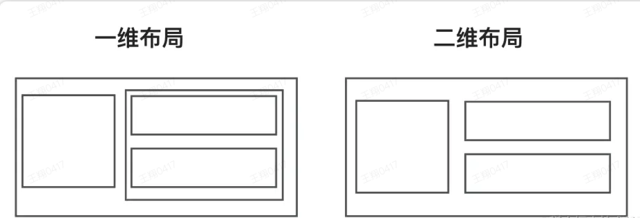
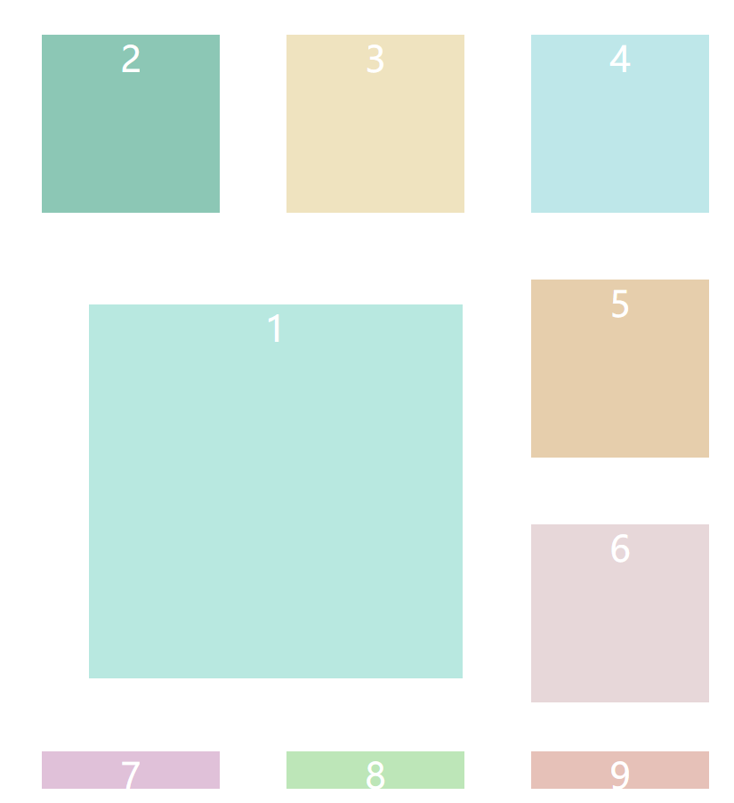

## 概述

Grid 布局是目前最强大的布局工具，将网页划分为一个个网格，可以任意组合，达到各种布局效果

与 Flex 布局区别：Flex 是一维布局，只能在设置的轴线上进行布局；而 Grid 是二维布局，将容器划给为行和列，产生单元格

使用网格布局，兄弟节点可以被指定布局到网格的某个位置。
所以，网格布局相对流布局 Flex 布局更加的灵活，当然学习和使用也更加复杂。这篇文章会把网格布局中的概念和属性整理出来。
下图就是展示了一维布局和二维布局的不同。可以看出，如果布局复杂，一维布局需要增加节点来解决；而二维布局，则不需要，这也是网格布局强大而复杂的原因。



### 名词解释

1. 容器 container：设置`display: grid`的元素称为容器
2. 项目 item：内部的子元素称为项目
3. 行 row：容器中的水平区域
4. 列 column：容器中的垂直区域
5. 单元格 cell：行和列的交叉点，n 行 m 列将产生 n \* m 个单元格
6. 网格线 grid line：划分网格的线，n 行有 n + 1 根水平网格线，m 列有 m + 1 根垂直网格线

#### 属性

属性分为容器属性和项目属性

##### 容器属性

1. display

   通过设置`display: grid`或`display: inline-grid`生成一个网格容器

2. grid-template-rows/grid-template-columns

   划分行和列，既可以用绝对宽度也可以用百分比，下面代码将 div 划分为 200px3 行 33%高度的容器

   ```css
   .container {
     display: grid;
     grid-template-rows: 200px 200px 200px;
     grid-template-columns: 33% 33% 33%;
   }
   ```

   - 可以使用 repeat 简化代码

     ```css
     .container {
       display: grid;
       grid-template-columns: repeat(3, 200px);
       grid-template-rows: repeat(3, 33.33%);
     }
     ```

   - auto-fill 属性，当单元格大小固定，容器大小不固定时，希望每行/每列容纳尽可能多的单元格，使用 auto-fill 属性自动填充

     ```css
     .container {
       display: grid;
       grid-template-columns: repeat(auto-fill, 200px);
     }
     ```

   - fr 比例：方便表示比例关系，如列宽 1fr 2fr 就代表后者是前者的两倍

     ```css
     .container {
       display: grid;
       grid-template-columns: 1fr 2fr;
       /* 可以与绝对长度结合 */
       grid-template-columns: 150px 1fr 2fr;
       /* 传统的栅格布局可以使用fr轻松实现  */
       grid-template-columns: repeat(12, 1fr);
     }
     ```

   - minmax()产生长度范围，表示长度在此范围内

     ```css
     .container {
       display: grid;
       /* 列宽不小于100px，不大于1fr */
       grid-template-columns: 1fr 1fr minmax(100px, 1fr);
     }
     ```

   - auto 由浏览器自动决定长度

     ```css
     .container {
       display: grid;
       grid-template-columns: 100px auto 100px;
     }
     ```

3. grid-row-gap/grid-column-gap、grid-gap

   行/列间隔

   ```css
   .container {
     display: grid;
     grid-row-gap: 20px;
     grid-row-gap: 20px;
     /* 相当于  */
     grid-column: 20px 20px;
   }
   ```

4. grid-template-areas

   用于定义区域

   ```css
   .container {
     display: grid;
     grid-template-areas:
       'header header header'
       'main main sidebar'
       'footer footer footer';
   }
   ```

5. grid-auto-flow

   容器内元素的摆放顺序，默认先行后列，可以使用`grid-auto-flow: column;`调整为先列后行

   ```javascript
   // 先行后列渲染结果如下所示
   1 2 3
   4 5 6
   7 8 9
   // 先列后行渲染结果如下所示
   1 4 7
   2 5 8
   3 6 9
   ```

6. justify-items/align-items、place-items

   justify-items/align-items 用于设置单元格内容的水平位置

   ```css
   .container {
     display: grid;
     justify-items: start;
     align-items: start;
     /*相当于  */
     place-items: start start;
   }
   ```

7. justify-content/align-content、place-content

   定义整个内容区域在容器内的水平位置

   ```css
   .container {
     display: grid;
     justify-content: center;
     align-content: center;
     /* 相当于 */
     place-content: center center;
   }
   ```

##### 项目属性

1. grid-column-start/grid-column-end/grid-row-start/grid-row-end

   项目的位置可以指定

   ```
    grid-column-start属性：左边框所在的垂直网格线
    grid-column-end属性：右边框所在的垂直网格线
    grid-row-start属性：上边框所在的水平网格线
    grid-row-end属性：下边框所在的水平网格线
   ```

   ```css
   .item-1 {
     grid-column-start: 1;
     grid-column-end: 3;
     grid-row-start: 2;
     grid-row-end: 4;
   }
   ```

2. justify-self/align-self

   设置单元格内容的水平/垂直位置，跟 justify-items/align-items 属性的用法完全一致，但只作用于单个项目

```html
<!DOCTYPE html>
<html lang="en">
  <head>
    <meta charset="UTF-8" />
    <meta http-equiv="X-UA-Compatible" content="IE=edge" />
    <meta name="viewport" content="width=device-width, initial-scale=1.0" />
    <title>Document</title>
    <style>
      .container {
        margin: 60px;
        display: grid;
        grid-template-rows: repeat(3, 200px);
        grid-template-columns: repeat(3, 200px);
        /* 列宽度确定 自动布局 */
        /* grid-template-columns: repeat(auto-fill, 200px); */
        /* 行高 1 150 2 300 3 450 */
        /* grid-template-rows: 180px 1fr 2fr; */
        grid-gap: 20px;
        justify-items: start;
        align-items: center;
        justify-content: center;
      }

      .item {
        text-align: center;
        font-size: 200%;
        color: #fff;
        width: 80%;
        height: 80%;
      }

      .one {
        background-color: #b8e8e0;
        justify-self: center;
        align-self: center;
        grid-column-start: 1;
        grid-column-end: 3;
        grid-row-start: 2;
        grid-row-end: 4;
      }

      .two {
        background-color: #8cc7b5;
      }

      .three {
        background-color: #efe3bf;
      }

      .four {
        background-color: #bee7e9;
      }

      .five {
        background-color: #e6ceac;
      }

      .six {
        background-color: #e7d7d9;
      }
      .seven {
        background-color: #aa53975c;
      }
      .eight {
        background-color: #bde6b8;
      }
      .nine {
        background-color: #e6c1b8;
      }
    </style>
  </head>

  <body>
    <div class="container">
      <div class="one item">1</div>
      <div class="two item">2</div>
      <div class="three item">3</div>
      <div class="four item">4</div>
      <div class="five item">5</div>
      <div class="six item">6</div>
      <div class="seven item">7</div>
      <div class="eight item">8</div>
      <div class="nine item">9</div>
    </div>
  </body>
</html>
```


