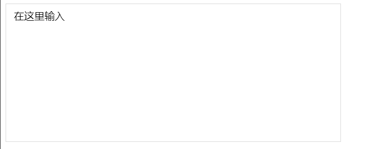

  
我们都知道placeholder属性只有在input标签（且类型为text、search、url、tel、email 和 password）中才会展示，那么如何在设置了`contentEditable=true`的div标签中如何展示placeholder呢？<br />

```html
<div className="App" placeholder="在这里输入"></div>;
```

#### 可以利用伪元素结合[css attr()函数](https://developer.mozilla.org/zh-CN/docs/Web/CSS/attr)来实现

需要在指定元素上设置placeholder属性

```css
.App:empty:before {
  content: attr(placeholder);
  color: rbga(0, 0, 0, 0.45);
}
```



[演示地址](https://codesandbox.io/s/late-fast-l20yqn?file=/src/App.js:65-113)
