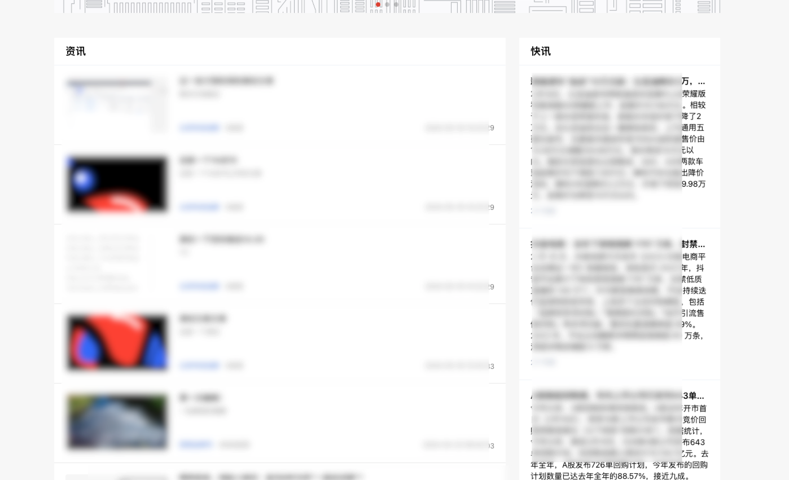
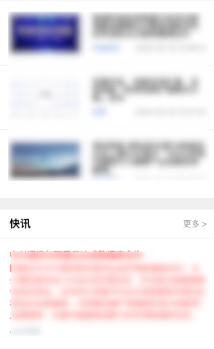

[官网](https://cn.windicss.org/)

因为项目是在 vue+vite 项目使用，所以选择 Windi CSS 是**按需供应的 TailWind 替代方案**，

## 优点

⚡️ 极速 - 在 Vite 中比 Tailwind 快 20~100 倍
🧩 按需使用 CSS 工具类（与 Tailwind CSS v2 完全兼容）
📦 按需使用原生元素样式重置（预检样式）
🔥 模块热替换 (HMR)
🍃 从 tailwind.config.js 加载配置
🤝 与框架无关 - Vue、 React、Svelte and vanilla！
📄 CSS @apply / @screen 指令转换（也适用于 Vue SFC 的`<style>` ）
🎳 支持变量组 - 如 bg-gray-200 hover:(bg-gray-100 text-red-300)
😎 "Devtools 设计" - 支持传统的 Tailwind 运行方式

## 使用

### 安装包

```bash
npm i -D vite-plugin-windicss windicss
```

### vite 配置修改

```js
import WindiCSS from 'vite-plugin-windicss'

export default {
  plugins: [WindiCSS()],
}
```

### main.ts 入口文件引入

```js
import 'virtual:windi.css'
```

### windi css 配置文件

同时兼容 `windi.config.js` 或 `tailwind.config.js`

```js
import { defineConfig } from 'windicss/helpers'
import formsPlugin from 'windicss/plugin/forms'

export default defineConfig({
  preflight: false,
  darkMode: 'class',
  safelist: 'p-3 p-4 p-5',
  theme: {
    extend: {
      colors: {
        teal: {
          100: '#096',
        },
      },
    },
  },
  attributify: {
    prefix: 'w:',
  },
  alias: {
    hstack: 'flex items-center',
    vstack: 'flex flex-col',
    icon: 'w-6 h-6 fill-current',
    app: 'text-red',
    'app-border': 'border-gray-200 dark:border-dark-300',
  },
  plugins: [formsPlugin],
})
```

### 属性配置解释

#### preflight 预检样式

Windi CSS 中的预检样式实际上是指一组默认的全局样式，用于在没有明确样式声明的情况下提供一些基本的全局样式设置，以确保一致性和一致的样式基础。这包括了重置默认的边距、填充、字体等，以及一些其他的全局样式设置。默认为 true

#### attributify：开启属性模式

先看下传统 tailwind 使用的语法，即所有实用程序和变体都写在类中

```html
<button
  class="bg-blue-400 hover:bg-blue-500 text-sm text-white font-mono font-light py-2 px-4 rounded border-2 border-blue-200 dark:bg-blue-500 dark:hover:bg-blue-600"
>
  Button
</button>
```

如果使用 Windi css 的属性模式，则可以将类拆分为多个属性，如下：

```html
<button
  bg="blue-400 hover:blue-500 dark:blue-500 dark:hover:blue-600"
  text="sm white"
  font="mono light"
  p="y-2 x-4"
  border="2 rounded blue-200"
>
  Button
</button>
```

如果担心命名冲突，可以通过以下方式给属性模式添加自定义前缀：

```js
export default {
  attributify: {
    prefix: 'w:',
  },
}
```

```html
<button
  w:bg="blue-400 hover:blue-500 dark:blue-500 dark:hover:blue-600"
  w:text="sm white"
  w:font="mono light"
  w:p="y-2 x-4"
  w:border="2 rounded blue-200"
>
  Button
</button>
```

#### alias 别名配置

请注意，在使用别名时需要加上前缀 \* ，例如：

```html
<div class="*hstack"></div>
```

#### theme 配置

theme 是 tailwind css 的配置，可以为项目自定义默认主题。[theme](https://www.tailwindcss.cn/docs/theme)

#### dark mode 深色模式

[dark-mode](https://www.tailwindcss.cn/docs/dark-mode#toggling-dark-mode-manually)

#### plugins

[plugins](https://www.tailwindcss.cn/docs/plugins)

## Tailwind css

根据[官方文档](https://www.tailwindcss.cn/docs/installation)

## 安装

```bash
npm install -D tailwindcss
```

## 配置

```bash
# 安装完成后
npx tailwindcss init
```

执行完成后，在项目根目录下会生成一个`tailwind.config.js`文件，里面有配置项，可以根据自己的需求进行修改。

## 基本使用

```js
w-full
w-xxpx
p-xxpx
pt-xxpx
bg-white
text-16px
text-[#000]
```

## 响应式

tailwind css 响应式提供了 5 个断点：

| 断点前缀 | 最小宽度 | 转为 css 媒体查询                    |
| -------- | -------- | ------------------------------------ |
| `sm`     | 640px    | `@media (min-width: 640px) { ... }`  |
| `md`     | 768px    | `@media (min-width: 768px) { ... }`  |
| `lg`     | 1024px   | `@media (min-width: 1024px) { ... }` |
| `xl`     | 1280px   | `@media (min-width: 1280px) { ... }` |
| `2xl`    | 1536px   | `@media (min-width: 1536px) { ... }` |

使用起来很方便。

比如以下布局，在 pc 上需要左右展示:



在移动端需要上下展示:



使用 tailwindcss 可以这样设置：

```html
<div class="flex justify-center flex-col sm:flex-row"></div>
```

意思是在屏幕宽度小于 640px 时，使用 flex-col，大于 640px 时将 flex-col 改为 flex-row，所以在设置响应式布局时，需要先设置默认布局，然后再根据不同屏幕宽度设置不同的布局。
