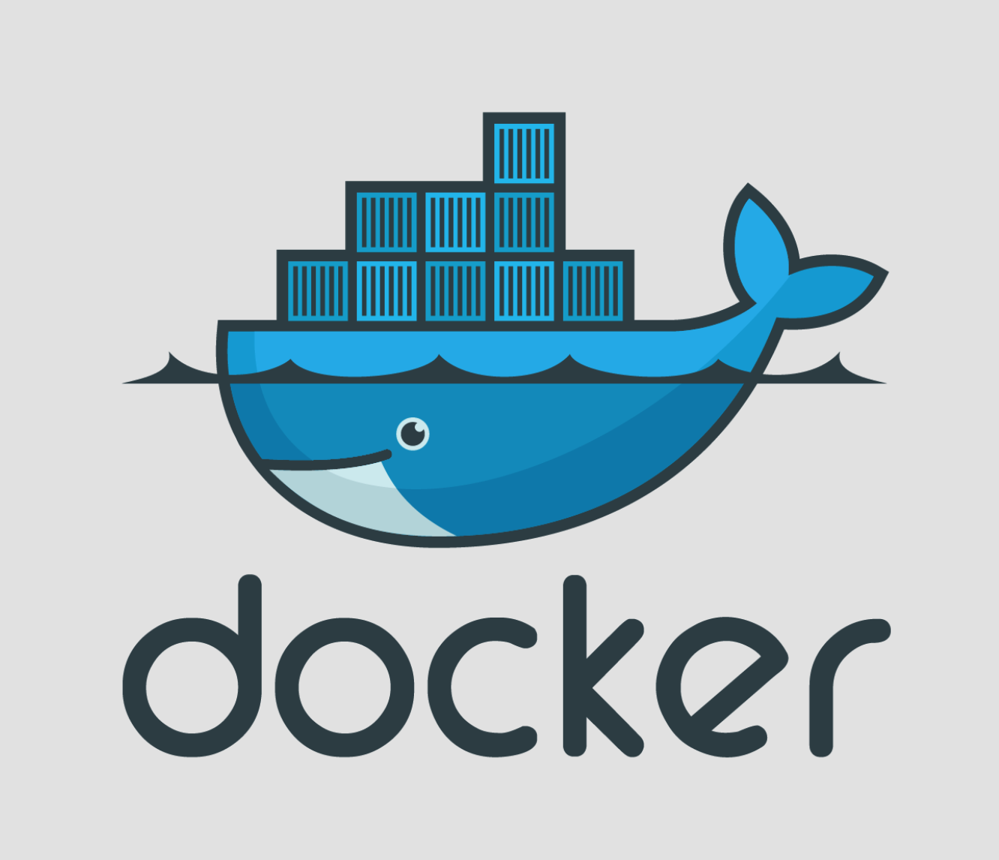

一直听别人再说 docker 怎么怎么样，刚好最近服务器快到期了，需要更换一波服务器，里面部署了不少应用，一个一个移动挺麻烦的，听比人说 docker 就是一个迷你虚拟机，把所有

## docker 是什么

Docker 是一个开源的应用容器引擎，让开发者可以打包他们的应用以及依赖包到一个可移植的容器中，该容器包含了应用程序的代码、运行环境、依赖库、配置文件等必需的资源，通过容器就可以实现方便快速并且与平台解耦的自动化部署方式，无论你部署时的环境如何，容器中的应用程序都会运行在同一种环境下。（更多详情请移步 docker 官网查看 docker）

### 名次解释

#### 镜像 Image

负责创建 docker 容器的，有很多官方现成的镜像：node、mysql、monogo、nginx 可以从远程仓库下载，类似于系统装机时的系统盘或者系统镜像文件

#### 容器 Container

可以比拟成一个迷你的系统，例如一个只安装 mysql5.7 的 linux 最小系统，当然你喜欢也可以把 mysql、node 安装在同一个容器中，记住**，容器与容器，容器和主机都是互相隔离的**

#### 仓库 Repository

类似于 github 仓库，我们可以把制作好的镜像 push 云端的仓库，也可以从仓库 pull 下载镜像
