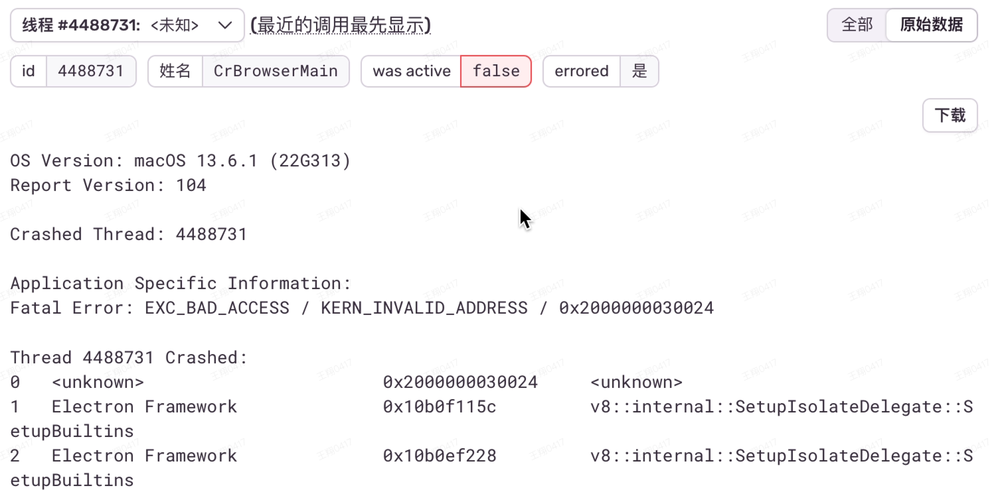
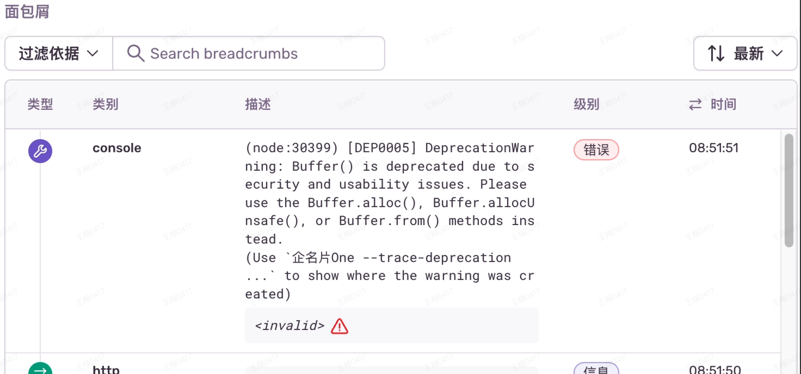

# 快速双击打开两个主窗口导致登录状态互踢

MAC Dock 上的 APP 单击即可打开应用，当双击时主进程会被启动 2 次，One 不允许运行多份实例，第 2 次启动会自动退出，并激活第一个实例。
双击太快，导致第 2 个实例关闭自己并激活第一个实例时，第一个实例的应用状态已经 Ready，但主窗口尚未绘制，导致主窗口被再次绘制
正常主窗口绘制时机：环境变量读取完成、应用聚焦且 AppReady 且一个窗口都没有（hack）

**修复：在应用聚焦并尝试绘制窗口前，检查环境变量是否读取完成**

```js
  app.on('activate', () => {
-    if (!app.isReady()) return
+    if (!isEnvReady()) return
    if (BrowserWindow.getAllWindows().length === 0) {
      createMainWindow()
    } else {
      mainWindow?.isDestroyed() === false &amp;amp;&amp;amp; mainWindow?.show()
    }
  })
```

# webview 内 beforeunload 事件无法被触发，导致文档类产品（非协作）丢字

## 原因

1. webview bug：关闭窗口时不触发 webview 内的 beforeunload
2. webview 内快捷键 cmd+w 触发了主进程的关闭窗口事件，它应该只触发关闭 TAB 事件
3. webview 是使用 vue v-for 循环渲染出来的，关闭时 vue 直接卸载了标签，导致 beforeunload 没有机会触发

## 修正

1. 拦截窗口关闭，如果页面上 webview 数量 > 0 关闭标签，否则关闭窗口
2. 主进程拦截 webview 内快捷键，转发到外层页面
3. webview 关闭前先跳转到空白页，跳转成功后再卸载标签，此时如果页面上没有了 webview 关闭窗口
   beforeunload 会组织 app.quit()，需要在 window-all-closed 之后关闭应用，应用常驻不再依赖此事件

# 多窗口内存泄漏/飙增问题

原因 1：webview partition 要么给值，要么不要有此属性，给''、null、undefined 都会造成内存飙增
原因 2：快速频繁创建窗口，会造成内存泄漏，应对 IPC 做节流

# sentry 错误: TypeError onReadyToShow$1(main)

原因： BrowserWindow 实例方法 setPosition、setSize 传值必须是整数，小数就会造成主进程错误，操作窗口失败

```js
win.setPosition(+parseInt(x), +parseInt(x), false)
```

现象：部分 mac 机型 窗口点击 失效 报错，这个 bug 底层还是性能的问题，如果选用不取整的线上代码，有报错的电脑 把分辨率调低一些，调成正常的就没问题了，性能高的电脑会出现这一问题。

# Electron 桌面端闪退

## 现象

One 桌面端多标签窗口偶现无法刷新，关闭标签应用闪退

## 原因

根据 sentry 查到 2 条相关异常

https://sentry.qmpoa.com/organizations/sentry/issues/32181/?project=57&query=is%3Aunresolved&referrer=issue-stream&statsPeriod=1h



https://sentry.qmpoa.com/organizations/sentry/issues/19294/events/e504f067bad64b328369743c2588cbd9/?project=57&query=is%3Aunresolved&referrer=previous-event&statsPeriod=1h



初步判断是内存问题，出现问题时内存没有增长，另一个常见因内存闪退的原因是空指针

出问题的页面有 beforeunload 拦截，初步怀疑是 electron 销毁了 webview 的实例或句柄，但因为 beforeunload 导致 webview 并没有被销毁，导致后续事件访问不到它的实例

github 查找到相关问题：https://github.com/electron/electron/issues/38941、https://github.com/ElectronNET/electron.net-api-demos/issues/34

electron 在处理 webview 的 will-prevent-unload 事件和 webviewContents.close 有问题，目前官方还未解决

## 修正

绕开与 webview 相关的两个事件

关闭 webview 不再使用 webviewContents.close ，改为使用

```js
ele.executeJavaScript(`(function(w) { w.close() })(window);`)
```

监听 will-prevent-unload 事件但并不使用官方回调，通过 IPC 通知渲染进程，由渲染进程移除 webview 标签来模仿 webview 自关闭

## 改进

重点功能请求产品协助验收
