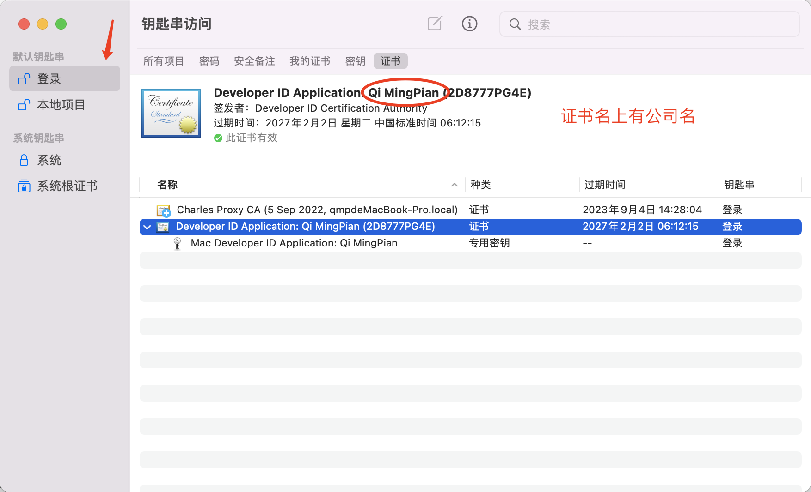
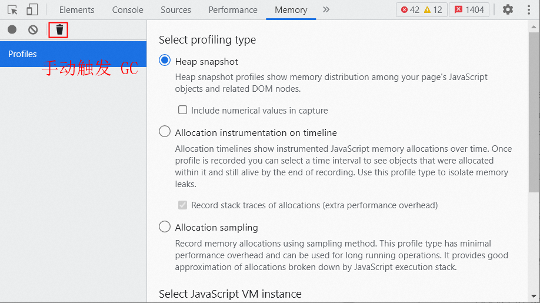

## 业界桌面端研发技术选型

1. NW.js

   Star 39.8k, issues 882 open 6351 closed

   语言：Node+H5

   优点：上手难度低、开发周期短、有代码保护、兼容 XP

   缺点：活跃度一般、生态一般、性能一般

   成功案例：微信开发者工具、早期钉钉

2. Tauri、Wails

   Star 67.9k, issues 512 open 2426 closed
   语言：Rust/Go+H5
   优点：上手难度高（或后端支持）、开发周期短、社区活跃、最终包极小
   缺点：需要熟悉 Rust、性能一般
   成功案例： 1Password、cloudflare、dimension、digitalocean、clickup

3. Flutter（22 年初开始支持 windows）

   Star 156k, issues 11480 Open open 74494 closed
   语言：Dart
   优点：性能优秀、社区活跃
   缺点：上手难度中等、开发周期中等、生态没起来
   成功案例：钉钉、RustDesk

4. Electron

   Star 109k, issues 803 open 17903 closed
   语言：Node+H5
   优点：**上手难度低、开发周期短、活跃度和生态最好、坑少**
   缺点：性能一般（可通过其它技术手段优化）
   成功案例：VS Code、Postman、企业微信、Slack、Teams、迅雷、MongoDB Compass 图形界面管理、阿里 OSS 客户端、Gmail 桌面、有道笔记、支付宝小程序 IDE、Notion。和不太出名的：

### Electron 项目介绍及脚手架

官网： [https://www.electronjs.org/zh/docs/latest/](https://www.electronjs.org/zh/docs/latest/)

**Electron 是一个使用 JavaScript、HTML 和 CSS 构建桌面应用程序的框架，**它嵌入 **Chromium** 和 **Node.js** 跨平台框架。它是进程结构和 Chrome 基本相同


- 主进程：统筹资源、进程管理、系统调用
- 辅助进程：
  - GPU
  - Plugin：插件
  - Utility：扩展
- 渲染进程：渲染和交互

## 项目结构


主进程创建窗口 -> 窗口加载渲染进程文件


开发时使用 vite 本地调试地址 0.0.0.0:xxxx，全局变量 **MAIN_WINDOW_VITE_DEV_SERVER_URL** 就是 vite 配置的 host 和 port。可在 vite.**renderer.config.mjs** 修改渲染进程的配置


## 脚手架

[https://git.qmpoa.com/fe_common_lib/create-electron-vite](https://git.qmpoa.com/fe_common_lib/create-electron-vite)


### MAC 打包

- **安装最新版本 XCODE**
- 指令 `codesign --help`、`xcrun notarytool --help` 可用，标识环境正常

### windows 打包

- 安装 Visual Studio 2022，配置按照 electron 官网指示
- 安装 Python
- 安装 WiX Toolset v3.11

## preload 概念

Electron 基于 Node.js 拥有着对操作系统的**完全访问权限**，但渲染进程上的代码（即网页）总是不安全的，所以 Electron 对渲染进程默认启用**沙盒化**，即只有主进程可以访问 Node.js 环境，渲染进程只能透过进程间通讯 (inter-process communication, IPC) 委派任务给主进程的方式，来执行需权限的任务

而 preload 做为进程间的桥接，拥有[一部分 Node.js 环境的访问权](https://www.electronjs.org/zh/docs/latest/tutorial/tutorial-preload#%E4%BD%BF%E7%94%A8%E9%A2%84%E5%8A%A0%E8%BD%BD%E8%84%9A%E6%9C%AC%E6%9D%A5%E5%A2%9E%E5%BC%BA%E6%B8%B2%E6%9F%93%E5%99%A8)。

**preload 在渲染器加载网页之前注入**。

**！！！可以使用代码为渲染进程关闭沙盒，但是不建议这么做**，如果网页挑转后 node 权限给到第三方，就完全没有安全性可言了。而网站有被攻击的可能性，所以最好**永远不给把 node 权限给到渲染进程**

[进程沙盒化](https://www.electronjs.org/zh/docs/latest/tutorial/sandbox)：限制对大多数系统资源的访问来减少恶意代码可能造成的伤害

## 进程间通讯 (inter-process communication, IPC)

主进程使用 ipcMain 模块进行消息监听和发送

渲染进程使用 ipcRenderer 模块进行消息监听和发送

消息通信可以是[单向](https://www.electronjs.org/zh/docs/latest/tutorial/ipc#%E6%A8%A1%E5%BC%8F-1%E6%B8%B2%E6%9F%93%E5%99%A8%E8%BF%9B%E7%A8%8B%E5%88%B0%E4%B8%BB%E8%BF%9B%E7%A8%8B%E5%8D%95%E5%90%91)的，也可以是[双向](https://www.electronjs.org/zh/docs/latest/tutorial/ipc#%E6%A8%A1%E5%BC%8F-2%E6%B8%B2%E6%9F%93%E5%99%A8%E8%BF%9B%E7%A8%8B%E5%88%B0%E4%B8%BB%E8%BF%9B%E7%A8%8B%E5%8F%8C%E5%90%91)的。基本是以一种类似于发布订阅模式实现的。

```js
// 主进程
ipcMain.on('set-title', handleSetTitle)
// preload
const { contextBridge, ipcRenderer } = require('electron')
contextBridge.exposeInMainWorld('electronAPI', {
  setTitle: (title) => ipcRenderer.send('set-title', title),
})
```

当消息量越来越多，不管是使用、扩展、重构都会成为负担，这时 TS 限制可能是个不错的选择，它可以记录消息作用、规范消息参数、提供智能提示

### or MessagePort

当需要**渲染进程与渲染进程通信**、渲染进程与某些特殊进程（比如 node 创建一个子进行专门处理 IM 中的图片、文件，以减轻频繁 IO 对主进程的影响）通信时，需要主进程担任中转站角色。

这时可以使用 MessageChannelMain 和 MessagePortMain 把主进程从这种工作中解救出来。它们用法与 JS 的 MessageChannel、MessagePort 基本相同

```js
// 主进程
const { port1, port2 } = new MessageChannelMain()
window1.webContents.postMessage('port', null, [port1])
window2.webContents.postMessage('port', null, [port2])
// 窗口1
ipcRenderer.on('port', (e) => {
  const channel = e.ports[0]
  channel.postMessage({ test: 21 })
})
// 窗口2
ipcRenderer.on('port', (e) => {
  const channel = e.ports[0]
  channel.onmessage = (messageEvent) => {
    // 处理消息
  }
})
```

MDN MessageChannel [https://developer.mozilla.org/zh-CN/docs/Web/API/Channel_Messaging_API](https://developer.mozilla.org/zh-CN/docs/Web/API/Channel_Messaging_API)

MDN MessagePort [https://developer.mozilla.org/zh-CN/docs/Web/API/Channel_Messaging_API](https://developer.mozilla.org/zh-CN/docs/Web/API/Channel_Messaging_API)

## 性能注意事项

- 启动：在 app.whenReady 之前，除了必须的代码和模块（比如 app.requestSingleInstanceLock），不要执行，以免影响应用启动速度
- 窗口渲染：在主窗口 ready-to-show 之前，主进程尽量少执行代码，以免影响窗口绘制速度，影响体验
- 健壮性：主进程全程都**不应该有阻塞代码**出现（比如同步读写文件、大数据加解密、压缩），以免造成应用假死；CPU 密集型任务或易崩溃的功能可以使用 UtilityProcess 创建子进程执行
- 网页：尽量干掉白屏。electron 在调试时是一个 localhost 的本地服务，打包后是本地文件访问，资源都在本地，所以干掉白屏并不难，基本做好分包和懒加载就可以
- 网页 - polyfills：electron 每个版本使用的 Chromium 版本是固定的，通常都比较新，不使用 polyfills 可以达到 js 性能最大化
- 包大小 - dependencies 依赖会被打到最终包里，从中删除非主进程使用的包可以有效减小包大小

## API 和 常用示例

常用示例：[https://www.electronjs.org/zh/docs/latest/tutorial/devices](https://www.electronjs.org/zh/docs/latest/tutorial/devices)


[主进程常用 API](https://www.electronjs.org/zh/docs/latest/api/app)

- app: 控制应用程序生命周期 - 退出、聚焦、获取或设置用户目录、自定义协
- BrowserWindow：控制浏览器窗口 - 创建、销毁、隐藏窗口；最大化、最小化等
- dialog：系统对话框 - 打开和保存文件、系统消息框
- ipcMain：进程间通信 - 主进程与渲染进程通信，eg: 渲染进程业务逻辑通知主进程显示系统通知
- protocol：注册自定义协议并拦截基于现有协议的请求
- safeStorage：本地存储加密（Mac 上需要访问钥匙串）
- screen：检索有关屏幕大小、显示器、光标位置等的信息
- session：管理会话、cookie、缓存、代理设置等。
- shell：默认应用程序管理文件和 url。eg: 使用默认浏览器打开 url
- Tray：系统托盘

[渲染进程常用 API](https://www.electronjs.org/zh/docs/latest/api/app)

在沙盒化的渲染进程中，仅 preload 可以访问

- contextBridge：以**安全**的方式向 window 对象上追加属性
- ipcRenderer：与 ipcMain 呼应

## MAC 签名及公证

确保已安装最新 xcode

1. 使用苹果开发者账号登录 https://developer.apple.com/account/resources/identifiers/list ，创建新 identifier

   

   

   

   将 Bundle ID 的值放入 package.json 中 build -> appId；App ID Prefix 即 **Team ID** 记录下来后面要用

2. https://appstoreconnect.apple.com/apps 创建新 app

   

3. https://appleid.apple.com/account/manage 创建 App 专用密码，此密码公证时使用

   

4. 创建自签名证书

   
   
   
   

   证书可以导出为.p12 文件（会要求为 p12 设置密码），新设备签名时可以把此文件导入钥匙链

5. 如果已有证书文件，跳过第 4 步。双击 p12 文件把证书导入钥匙链，输入证书密码

   

6. 在项目根目录创建.env 文件

   ```bash
   # 带公司名的证书名称，打测试包仅配置此项就够了
   CERT_NAME=Developer ID Application: Qi MingPian (2D8777PG4E)
   ```

7. 配置公证信息，向.env 文件追加

   ```bash
   NOTARY_APP_ID=苹果开发者账号
   NOTARY_TEAM_ID=上面的Team Id
   NOTARY_PASSWORD=上面的App 专用密码
   ```

**！！！证书及各种密钥密码注意保密，注意保密，注意保密！！！**

## 自动更新

**MAC 自动更新要求 MAC 签名及公证**

- MAC 自动更新依赖 electron 官网模块 autoUpdater，打包后会出现三个文件

  - 用于安装：/out/make/企名片 One-${version}-${arch}.dmg
  - 用于更新：/out/make/zip/darwin/${arch}/企名片One-darwin-${arch}-${version}.zip
  - 用于版本检查：/out/make/zip/darwin/${arch}/RELEASES.json

- WIN 自动更新依赖第三方包 electron-updater，打包后会出现三个文件
  - 用于安装：/out/make/nsis/${arch}/企名片 One Setup ${version}.exe
  - 用于更新：/out/make/nsis/${arch}/企名片 One Setup ${version}.exe.blockmap
  - 用于版本检查：/out/make/nsis/${arch}/latest.yml

脚手架支持自动上传 ALI OSS、灰度，详见 README.md

## 常见问题

1. 通知

   对于 Windows 上的通知，需要有一个带有 [AppUserModelID](https://learn.microsoft.com/en-us/windows/win32/shell/appids) 和对应的 [ToastActivatorCLSID](https://learn.microsoft.com/en-us/windows/win32/properties/props-system-appusermodel-toastactivatorclsid) 的开始菜单快捷方式。快捷方式被删除后通知的 icon 和应用名都不能正确显示，目前的方案是使用托盘的气球通知（Tray Balloon）代替 Notification 2.

2. preload 中的事件监听，preload 享有独立的内存

   ```js
   import { contextBridge, ipcRenderer } from 'electron'
   contextBridge.exposeInMainWorld('electronIPC', {
     someEvent: {
       on: (cb1) => ipcRenderer.on('channel', cb1),
       off: (cb2) => ipcRenderer.off('channel', cb2),
       // off无法取消监听，因为渲染进程与preload不是一份内存，cb1与cb2不是同一个
     },
   })
   ```

   ```js
   // index.html
   function handle() {
     // ...
   }
   onMounted(() => window.electronIPC.someEvent.on(handle))
   onBeforeUnmount(() => window.electronIPC.someEvent.off(handle))
   ```

3. 截屏

   目前不调起系统偏好设置后无法自动添加应用，需要借助第三方.node 文件完成授权

### 内存泄漏

1. 目前必现的内存泄漏有 sentry，配置如下可以避免

   ```js
   import * as Sentry from '@sentry/electron/renderer'
   Sentry.init({
     dsn: process.env.SENTRY_DSN,
     beforeBreadcrumb: (breadcrumb, hint) => null, // fix memory leak
   })
   ```

   原因是 renderer-sentry 会尝试把错误堆栈传递给主进程，两进程间内存不共享，即 sentry 收集到的数据需要深度拷贝一份给主进程，当这些数据过大或涉及循环引用时，会造成 CPU 和内存的额外占用，转换失败后 GC 无法回收现场的内存
   进程间通信的消息如果是个对象，对象内不可有循环引用

2. 内存泄漏 - 卸载监听

   ipcRenderer.on 在不使用后需要即使 off 以释放内存

3. 内存泄漏排查

   使用 devtools 的 Memory 面板，首先手动触发一次 GC：
   

   然后录制一次内存快照，过一段时间（如 1min）后再录制一次内存快照。通过这两次内存快照可以得知内存增长了 19.2M，存在内存泄漏的问题。

   

   继续对比 diff 这两次内存快照，发现最大的内存增长是 string 对象。但点 string tab 展开后并不能直接定位到是哪块代码逻辑导致，只能去排查到底哪里在频繁使用 string 对象导致的内存泄漏，定位问题不够直观。

   

   
