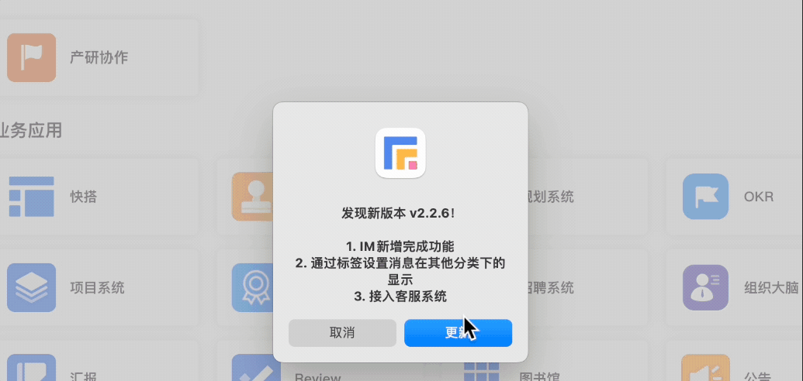
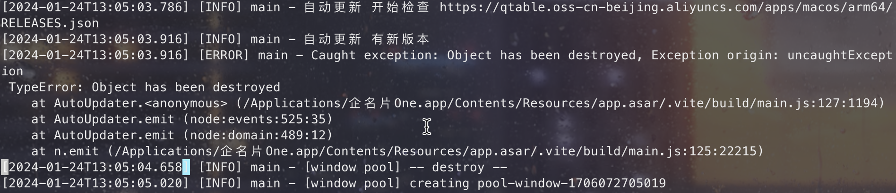
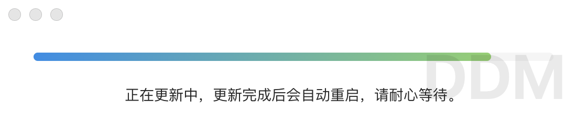

## Electron 自动更新失败

在 Electron 应用某次更新，出现了如下循环更新的问题：



此时，查询日志，发现报错如下 `Error: Object has been destroyed`：



## 问题原因

首先，通过查阅资料得知：在 Electron 中，当一个窗口被销毁后，与该窗口相关联的 JavaScript 对象也会被销毁，如果再次尝试访问已被销毁的窗口对象时，就会发出上图所示的错误。

通过日志可以很好的找到问题发生的地方（幸好我们主进程中关键点都添加了明显的日志信息，方便问题查找），很明显是在 `autoUpdater.on('update-available'` 检测到自动更新后的报错，那就着重排查下这里。

```js
autoUpdater.on('update-available', () => {
  mainLogger.info('自动更新 有新版本')
  disableStopMainWindowClose()
  win.show()
  mainWindow.destroy()
})
```

通过日志可以分析应该是在 `disableStopMainWindowClose` 方法中的产生的问题：

```js
export function disableStopMainWindowClose() {
  mainWindow.off('close', onMainClose)
  systemStatus.off()
}
function onMainClose(e: Electron.Event) {
  if (isQuit) return
  if (mainWindow.isFullScreen()) {
  ...
}
```

## 如何解决

为了避免这个错误，需要在窗口对象被销毁时取消订阅所有与该窗口相关的事件，并在需要访问窗口对象时先检查窗口对象是否已经被销毁。

所以需要在调用窗口方法前，先判断窗口是否已被销毁

```js
function onMainClose(e: Electron.Event) {
  if (isQuit) return
  if (!mainWindow?.isDestroyed()) return
  ...
```

重新打包，上传成功后，再次出发自动更新，即可正常了。顺便说一下我们 Electron 应用的更新流程。

## 打包

首先是打包，打包时需要更新 package.json 中的版本和说明

```json
{
  "version": "2.2.7",
  "versionNotes": "发现新版本 v2.2.7！\n\n1. 修复客服已知问题"
}
```

修改完后，Mac 和 Windows 各自打包，并上传到服务器。

## 自动更新流程

关于 Electron 应用的自动更新，官方提供了[更新应用程序](https://www.electronjs.org/zh/docs/latest/tutorial/updates)处理自动更新过程。

因为我们使用的 electron-builder 打包应用，所以使用的是它内置的更新程序[Auto Update](https://www.electron.build/auto-update)。

相比 Electron 中自带的更新，它有以下优势：

1. 不需要搭建专用的发布服务器，可上传到任意服务器；
2. 代码签名验证可以在 macOS 和 Windows 上进行；
3. 支持下载进度提示；
4. 代码简单，工作量少。

### 实现过程

1. 安装依赖

   ```bash
   yarn add electron-updater
   ```

2. 主窗口调用

   当主窗口被激活显示时，通过 `checkLatestVersion` 方法检查是否有版本更新

   ```js
   mainWindow.on('show', checkLatestVersion)
   ```

3. 检测是否有更新

   `checkLatestVersion` 方法定义在主进程的 update.ts 文件中

   ```js
   // update.ts
   ...
   export const checkLatestVersion = () => {
     getLatestVersionInfo().then((version: any) => {
       if (!version) return
       mainLogger.info('检查最新版本', version)

       dialog
         .showMessageBox(mainWindow, {
           defaultId: 0,
           cancelId: 3,
           message: version.notes,
           buttons: version.isCurrVersionAvailable
             ? ['更新', '取消']
             : ['更新'],
         })
         .then(({ response }) => response === 0)
         .then((isUpdate) => {
           if (isUpdate) IS_MAC ? checkMacUpdate() : checkWinUpdate()
         })
         .finally(() => (isDialogOpen = false))
     })
   }
   ```

   `getLatestVersionInfo`方法用于检测更新，主要通过比对服务器的安装包版本是否大于本地版本，在本地打完包后，会将本地的包上传到服务器上，同时会有一份 `RELEASE.json` 文件，就是通过比对 `RELEASE.json` 文件中的 `currentRelease` 字段。

   ```json
   {
     "currentRelease": "2.2.7",
     "notes": "发现新版本 v2.2.7！\n\n1. 修复客服已知问题。"
   }
   ```

   当大于本地版本即需要更新时，显示更新窗口（包含更新版本、更新说明等），当用户点击`更新`后，调用 Mac 或 Windows 的更新方法。

4. 检查更新前奏——创建更新窗口

   ```js
   const checkMacUpdate = () => {
     const win = createAutoUpdateWindow()
     ...
   }
   ```

   首先通过 `createAutoUpdateWindow` 创建更新窗口

   ```js
   const createAutoUpdateWindow = () => {
     const win = new BrowserWindow({
       width: 560,
       height: 120,
       titleBarStyle: 'hidden',
       webPreferences: {
         preload: path.join(__dirname, 'preload.js'),
       },
     })

     win.loadURL(getLocalUrl('/auto-update'))

     return win
   }
   ```

   上面代码中创建了一个浏览器窗口，并加载 `/auto-update` 路由：

   ```js
   <template>
      <section style="padding: 42px 32px">
        <a-progress
          :show-info="false"
          :stroke-color="{
            '0%': '#108ee9',
            '100%': '#87d068'
          }"
          :percent="percent"
          status="active"
        />
        <center style="padding-top: 16px">正在更新中，更新完成后会自动重启，请耐心等待。</center>
      </section>
    </template>

    <script setup>
    import { onMounted, ref } from 'vue'

    const percent = ref(0)
    const timer = setInterval(() => {
      percent.value += 2
      if (percent.value >= 95) clearInterval(timer)
    }, 300)
    </script>
   ```

   页面显示一个假的进度条即可，新版本下载完成后会自动关闭并安装。

5. autoUpdater 自动更新

   ```js
   const checkMacUpdate = () => {
     const win = createAutoUpdateWindow()
     // 监听升级失败事件
     autoUpdater.on('error', (message) => {
       mainLogger.error('自动更新', message)
     })
     // 监听发现可用更新事件
     autoUpdater.on('update-available', () => {
       mainLogger.info('自动更新 有新版本')
       isUpdating = true
       disableStopMainWindowClose()
       win.show()
       mainWindow.destroy()
     })
     // 监听没有可用更新事件
     autoUpdater.on('update-not-available', () => {
       mainLogger.info('自动更新 没有新版本')
       win.close()
     })
     // 监听下载完成事件
     autoUpdater.on('update-downloaded', () => {
       mainLogger.info('自动更新 新版本下载完成')
       // 重新启动并安装更新包 只有update-downloaded事件中可调用
       autoUpdater.quitAndInstall()
     })
     mainLogger.info('自动更新 开始检查', AUTO_UPDATE_JSON_URL)
     // 设置安装包所在服务器地址
     autoUpdater.setFeedURL({ url: AUTO_UPDATE_JSON_URL, serverType: 'json' })
     // 请求服务器是否有更新。 在使用此API之前，您必须调用setFeedURL
     autoUpdater.checkForUpdates()
   }
   ```

   通过 [autoUpdater Events](https://www.electron.build/auto-update#events) 绑定相应的事件，通过`setFeedURL`方法设置安装包的地址，最后通过`checkForUpdates`检查是否有更新，触发绑定的各种事件。

   当检测到有新版本时，显示更新窗口，假进度条冒充下载中 😄，自动下载安装包
   

## 总结

本文主要讲解如何解决 `Error: Object has been destroyed` 这个 Electron 中最常见的问题，以及 Electron 自动更新的流程。通过解决这个问题，意识到需要在 Electron 主进程中，要为代码的关键点添加一些重要的日志信息，这样在遇到问题时，能让我们更加方便的定位问题。

以上就是本文的全部内容，希望这篇文章对你有所帮助，欢迎点赞和收藏 🙏，如果发现有什么错误或者更好的解决方案及建议，欢迎随时联系。
