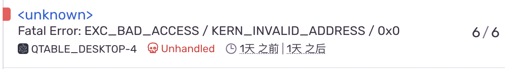
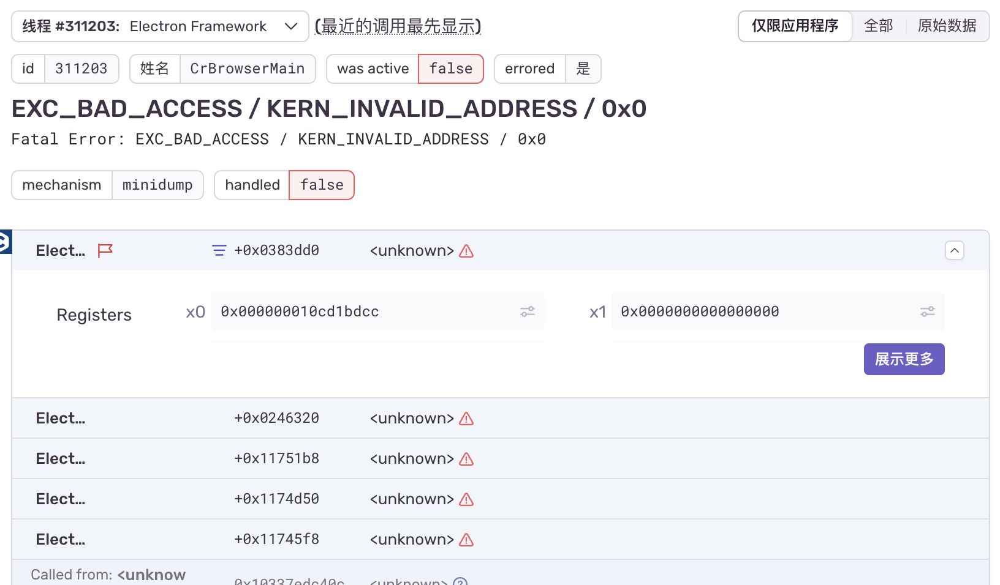
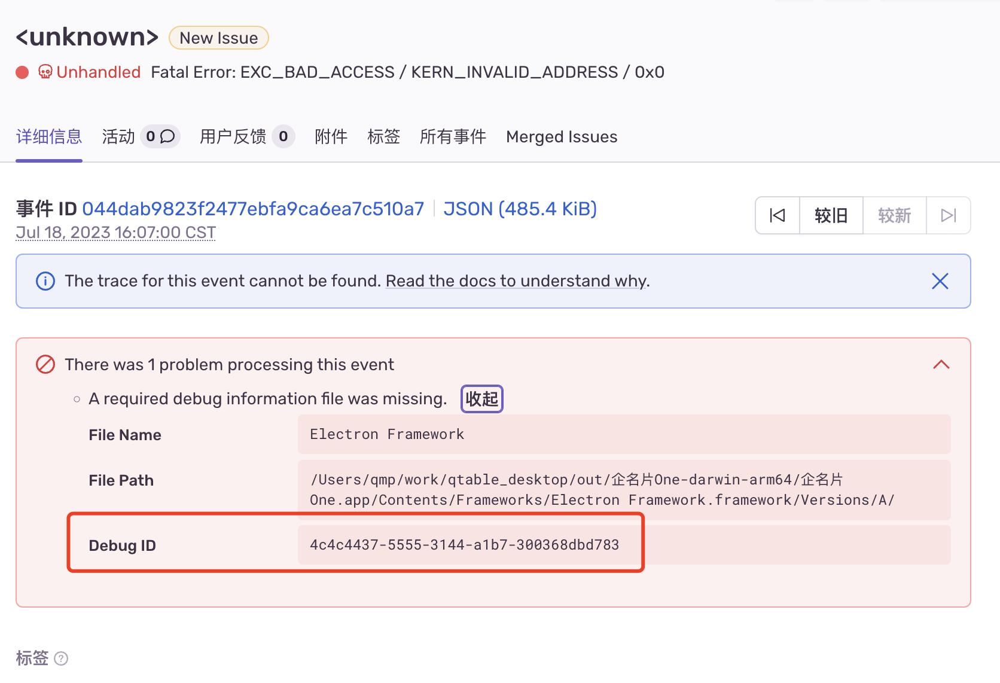
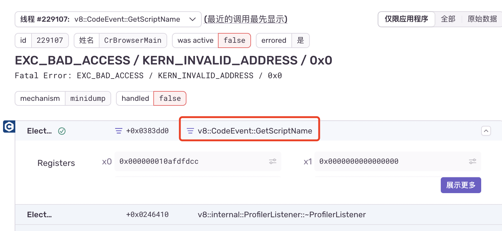

## 安装依赖包

```text
@sentry/electron
@sentry/wizard
@sentry/cli （devDependencies）
```

## 主流程

```js
import * as Sentry from '@sentry/electron/main'
Sentry.init({ dsn: 'https://xxx@sentry.qmpoa.com/57' })
crashReporter.start({
  ignoreSystemCrashHandler: true,
  submitURL: 'https://sentry.qmpoa.com/api/57/minidump/?sentry_key=xxx',
})
app.on('ready', () => {})
```

此处需注意在 app ready 之前 sentry 初始化，crashReporter 作用是将崩溃日志提交给远程服务器也就是我们的私有化 sentry。可以通过使用 process.crash()生成一个崩溃来测试崩溃报告器





一个类似这样的报错。

虽然能在平台上收到崩溃的监控，上传的 minidump 文件是汇编级别的代码，我们还需要对应的 symbol 文件来解析这些调用栈，使其还原至我们在项目中写的具体函数名。

### 上传 Debug Information Files

调试信息文件用于将地址和简化的函数名从本机崩溃报告转换为函数名和位置。

我们需要 sentry-cli 来帮助我们查找对应的 symbol 文件。



我们根据 uuid 在本地中查找所需的文件

```bash
npm install -g @sentry/cli
```

sentry-cli 有非常完善的文档，这里只介绍如何在本地上传 symbol 文件

首先利用 sentry-cli 登录，url 默认是 sentry.io，如果是自己的服务，那么你需要按照如下操作进行登录。

```bash
sentry-cli --url xxxxx login
```

按照指示登录后，我们需要获取相应的 auth-token。

校验完毕后，我们可以通过 uuid 查找本地的 symbol 文件

```bash
sentry-cli difutil find uuid
```

找到本地的 symbol 文件后，我们需要上传到服务器

```bash
sentry-cli --auth-token xxxx upload-dif -o org -p project xxxx(localpath)
```

上传之后，我们就能解析具体的异常信息了



## 渲染端

在渲染端文件添加（vue 的 main）

```js
import * as Sentry from '@sentry/electron/renderer'
Sentry.init({ dsn: 'https://xx@sentry.qmpoa.com/57' })
```

我这里遇到一个问题就是我在下面 初始化 sentry ，捕获到的错误不全，所以修改了一下加到了 vue 的全局捕获错误里主动发布一个捕获

```js
app.config.errorHandler = (err, instance, trace) => {
  if (process.env.NODE_ENV !== 'development') {
    Sentry?.captureException(err)
  }
  console.error(
    'error:',
    err,
    '\r\n',
    'instance:',
    instance,
    '\r\n',
    'trace:',
    trace
  )
}
```

就此也就捕获正常了。
