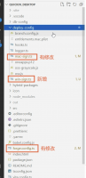
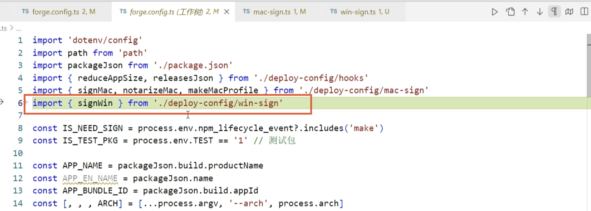
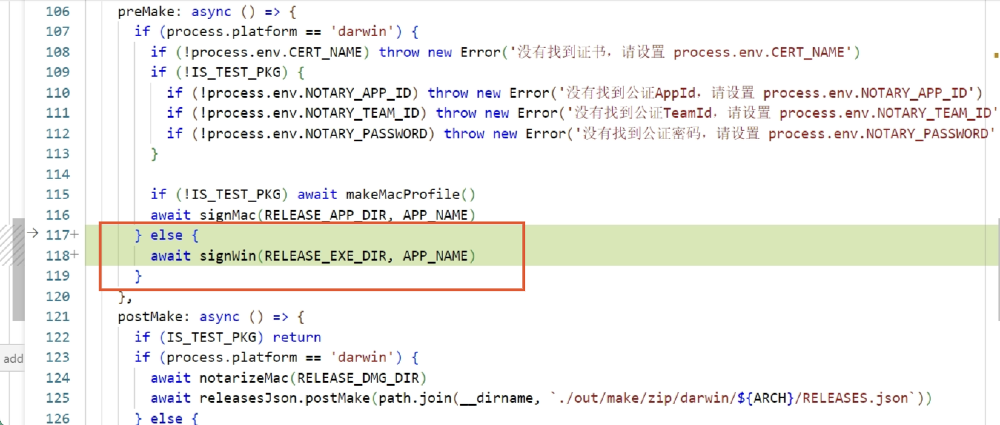
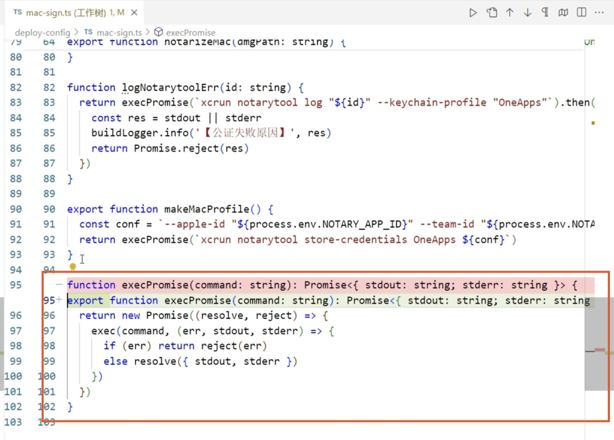

**⚠️ 注意事项：**

如果屏幕右下角图标栏的这个图标是红色 X，需要先登录，否则后面的步骤进行不了，如果是蓝色可忽略此条注意事项。


👆👆👆 做好上面注意事项，下面流程才可以顺利执行。

只需要进行 yarn make 这一步就可以

前提是已经配置好下方的文件

---------------------------------------------START--------------------------------------------

需要配置的文件位置



#### 新增文件：win-sign.ts\*\*

```js
import path from 'path'
import { buildLogger } from './logger'
import { execPromise } from './mac-sign'
const CERT_NAME = '北京企名片科技有限公司'
const SIGNTOOL_DIR = 'D:\\QMP\\sign-tool\\signtool'
/** 签名 windows */
export function signWin(appPath: string, APP_NAME: string) {
  buildLogger.info(`【开始签名】: ${appPath}`)
  appPath = path.resolve(appPath)
  return execPromise(
    `${SIGNTOOL_DIR} sign /n "${CERT_NAME}" /t http://time.certum.pl/ /fd sha1 /v "${appPath}"`
  )
    .then(({ stdout, stderr }) => {
      buildLogger.info('【签名结果】', stdout, stderr)
      return execPromise(`${SIGNTOOL_DIR} verify /pa "${appPath}"`)
    })
    .then(({ stdout, stderr }) => {
      buildLogger.info('【签名校验】', stdout, stderr)
      return stdout.includes('Successfully')
    })
    .then((isDone) => {
      if (!isDone) throw new Error('签名失败！原因在日志文件里')
    })
}
```

#### 修改文件：forge.config.ts\*\*

第一处：

```js
import { signWin } from './deploy-config/win-sign'
```



第二处：

```js
 else {
        await signWin(RELEASE_EXE_DIR, APP_NAME)
      }
```



#### 修改文件：mac-sign.ts

```js
export function execPromise(
  command: string
): Promise<{ stdout: string, stderr: string }> {
  return new Promise((resolve, reject) => {
    exec(command, (err, stdout, stderr) => {
      if (err) return reject(err)
      else resolve({ stdout, stderr })
    })
  })
}
```



-----------------------------------------------END--------------------------------------------

#### 相关链接

第三方流程 pdf 文件地址：[https://xxx.aliyuncs.com/im/2024/01/08/35a61c865ab3552ea0e5108e314a9c57/d172ca47\_云版代码签名手册.pdf](https://qtable.oss-cn-beijing.aliyuncs.com/im/2024/01/08/35a61c865ab3552ea0e5108e314a9c57/d172ca47_%E4%BA%91%E7%89%88%E4%BB%A3%E7%A0%81%E7%AD%BE%E5%90%8D%E6%89%8B%E5%86%8C.pdf)
