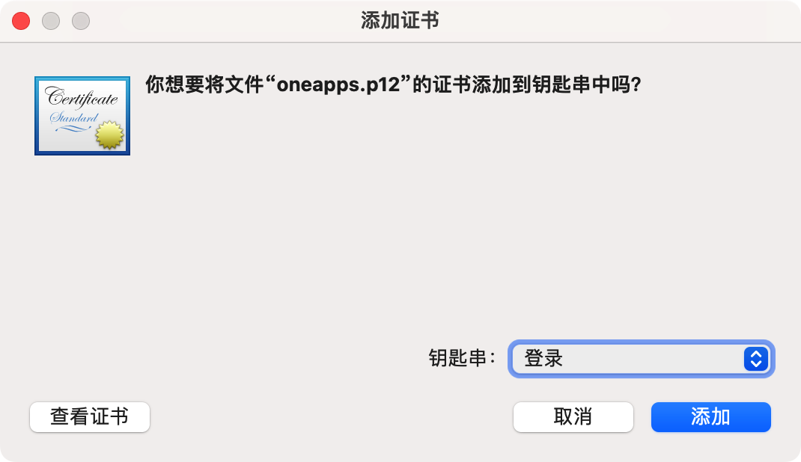
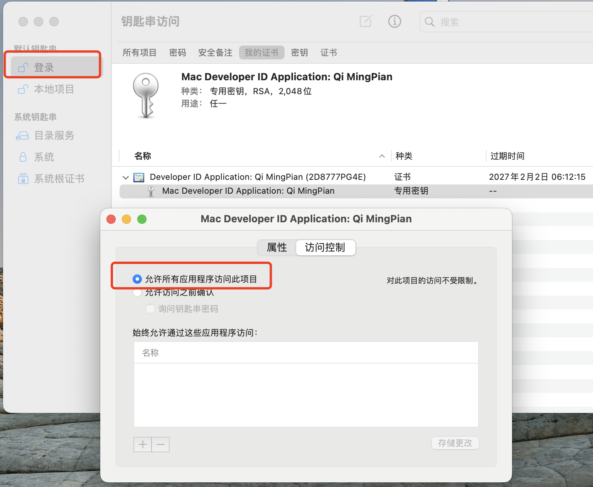

[Electron Forge](https://www.electronforge.io/) 由官方推荐和维护，结构优美，原本以为用起来会很顺利，没想到还是有坑。

## 打包方案

- MAC: @electron-forge/maker-dmg DMG 包供用户安装
- WINDOWS:
  - @electron-forge/maker-squirrel 框架默认，但它安装时不能选安装路径
  - @electron-forge/maker-wix 官方推荐之一，打出 MSI 镜像包。最大的坑就在这里，它的自动更新几乎不可用，issues 也没人回复，白白花费了很多时间
  - @felixrieseberg/electron-forge-maker-nsis 最后还是换回了 electron-builder 的 NSIS 方案

以下记录使用的详细配置

```js
// forge.config.ts
module.exports = {
  packagerConfig: {
    name: 'APP_NAME',
    // 不加扩展名，MAC 会自动查找 .icns、WIN 使用 .ico
    icon: './icon/icon',
    // 最终包不使用的代码，不要打入 asar
    ignore: [/\.yarn/, /src\/render/],
    appBundleId: `com.xxx.xxx`,
    appCopyright: `Copyright © 2023 ${packageJson.author}`
  },
  ...
```

packageJson 中的 dependencies 引用也会被打入 asar 中，非主进程使用的包不要放入 dependencies 可以有效减小包大小

@electron-forge/maker-dmg

```js
// forge.config.ts
const RELEASE_APP_DIR = path.join(__dirname, `./out/${APP_NAME}-${process.platform}-${ARCH}/${APP_NAME}.app`)
  makers: [
    {
      name: '@electron-forge/maker-dmg',
      config: {
        icon: './icon/icon.icns',
        background: './icon/background.png',
        format: 'ULFO',
        contents: [
          { x: 192, y: 244, type: 'file', path: RELEASE_APP_DIR },
          { x: 448, y: 244, type: 'link', path: '/Applications' },
          { x: 192, y: 700, type: 'position', path: '.background' },
          { x: 292, y: 700, type: 'position', path: '.VolumeIcon.icns' },
          { x: 392, y: 700, type: 'position', path: '.DS_Store' },
          { x: 492, y: 700, type: 'position', path: '.Trashes' }
        ]
      }
    },
```

@felixrieseberg/electron-forge-maker-nsis for exe

```js
// forge.config.ts
  makers: [
    {
      name: '@felixrieseberg/electron-forge-maker-nsis',
      config: {
        // codesigning: {
        //   certificateFile?: string;
        //   certificatePassword?: string;
        // },
        updater: {}
      }
```

```js
// package.json
  "build": {
    "appId": "com.xxx.xxx",
    "productName": "应用名称",
    "nsis": {
      "oneClick": false,
      "allowElevation": true,
      "createDesktopShortcut": true,
      "createStartMenuShortcut": true,
      "allowToChangeInstallationDirectory": true,
      "perMachine": true,
      "deleteAppDataOnUninstall": true,
      "installerIcon": "icon/icon.ico",
      "installerHeaderIcon": "icon/icon.ico",
      "guid": "xxxxxxxx-xxxx-xxxx-xxxx-xxxxxxxxxxxx"
    },
    "publish": {
      "provider": "generic",
      "url": "",
      "channel": "latest"
    }
  },
```

## MAC 签名与公证

坑 2：根据官网配置，始终无法成功公证，最后使用 codesign 与 xcrun notarytool 指令手动签名与公证

```js
// forge.config.ts
  hooks: {
    preMake: async () => {
      if (process.platform == 'darwin') {
        await makeMacProfile()
        await signMac('/path/to/xxx.app', 'APP_NAME')
      }
    },
    postMake: async () => {
      if (process.platform == 'darwin') {
        await notarizeMac('/path/to/xxx.dmg')
      }
    }
  }
```

### 签名

将证书存入钥匙串参考此文 [“代码签名”部分 1、2](https://www.jianshu.com/p/0d89a18308b2)

证书位于项目deploy-config/oneapps.p12，双击即可安装，证书密码是 OneAppsForMacFromQMP，钥匙串：一定要选 登录



将env文件放在项目根目录

```bash
# 打测试包需要
CERT_NAME=Developer ID Application: Qi MingPian (2D8777PG4E)
# 打分发包需要
NOTARY_APP_ID=***
NOTARY_TEAM_ID=***
NOTARY_PASSWORD=***

# process.env.NOTARY_APP_ID、process.env.NOTARY_TEAM_ID、process.env.NOTARY_PASSWORD（找王翔要）
```

```js
const NEED_SIGN_FW: string[] = [
  'Contents/Frameworks/Electron" "Framework.framework/Versions/A/Libraries/libEGL.dylib',
  'Contents/Frameworks/Electron" "Framework.framework/Versions/A/Libraries/libffmpeg.dylib',
  'Contents/Frameworks/Electron" "Framework.framework/Versions/A/Libraries/libGLESv2.dylib',
  'Contents/Frameworks/Electron" "Framework.framework/Versions/A/Libraries/libvk_swiftshader.dylib',
  'Contents/Frameworks/Squirrel.framework/Versions/A/Resources/ShipIt',
]
const ETM_DIR = path.join(__dirname, `./entitlements.mac.plist`)
function signMac(appPath: string, APP_NAME: string) {
  const caName = 'Developer ID Application: CompanyName (xxxxxxxx)'
  const needSignDirs: string[] = [appPath]
  NEED_SIGN_FW.forEach((subdir) => {
    needSignDirs.push(`${appPath}/${subdir}`)
  })
  return execPromise(`security find-identity -v -p codesigning`)
    .then(({ stdout, stderr }) => {
      return stdout.includes(caName)
    })
    .then((hasCertificate) => {
      if (!hasCertificate) throw new Error('钥匙串中没有需要的证书')
      return execPromise(`xattr -cr ${appPath}`)
    })
    .then(() => {
      const signList: Promise<{ stdout: string, stderr: string }>[] = []
      needSignDirs.forEach((dir) => {
        signList.push(
          execPromise(
            `codesign --force --deep --timestamp --options runtime --entitlements ${ETM_DIR} --sign "${caName}" --verbose=2 -v ${dir}`
          )
        )
      })
      return Promise.all(signList)
    })
    .then((resList) => {
      console.info('【签名完成】', resList)
      return resList
    })
  // 查看应用的签名： codesign -d -v -r - /path/to/xxx.app
}
function execPromise(
  command: string
): Promise<{ stdout: string, stderr: string }> {
  return new Promise((resolve, reject) => {
    exec(command, (err, stdout, stderr) => {
      if (err) return reject(err)
      else resolve({ stdout, stderr })
    })
  })
}
```

```js
<!-- entitlements.mac.plist -->
<?xml version="1.0" encoding="UTF-8"?>
<!DOCTYPE plist PUBLIC "-//Apple//DTD PLIST 1.0//EN" "http://www.apple.com/DTDs/PropertyList-1.0.dtd">
<plist version="1.0">
   <dict>
    <key>com.apple.security.cs.allow-unsigned-executable-memory</key>
    <true/>
    <key>com.apple.security.cs.allow-jit</key>
    <true/>
    <key>com.apple.security.cs.disable-library-validation</key>
    <true/>
  </dict>
</plist>
```

### 公证

测试包不需要公证

打包过程中，如果反复弹窗提示输入【登录钥匙串】密码，可以开启【允许所有应用程序访问此项目】



```js
export function makeMacProfile() {
  const conf = `--apple-id "${process.env.NOTARY_APP_ID}" --team-id "${process.env.NOTARY_TEAM_ID}" --password "${process.env.NOTARY_PASSWORD}"`
  return execPromise(`xcrun notarytool store-credentials HAHAHA ${conf}`)
}
function notarizeMac(dmgPath: string) {
  console.info(`【开始公证】: ${dmgPath}`)
  return execPromise(
    `xcrun notarytool submit ${dmgPath} --keychain-profile "HAHAHA" --wait`
  ).then(({ stdout, stderr }) => {
    const res = stdout || stderr
    if (res.includes('Invalid')) {
      console.info('【公证失败】', res)
      // @ts-ignore
      return logNotarytoolErr(res.match(/id: .{36}/)[0]?.substr(4))
    }
    console.info('【公证完成】', stdout, stderr)
    return res
  })
  // xcrun notarytool log "96e8072f-4a0c-443d-b2c3-076b39376817" --keychain-profile "OneApps"
}
function logNotarytoolErr(id: string) {
  return execPromise(
    `xcrun notarytool log "${id}" --keychain-profile "OneApps"`
  ).then(({ stdout, stderr }) => {
    const res = stdout || stderr
    console.info('【公证失败原因】', res)
    return Promise.reject(res)
  })
}
```

## 自动更新

MAC 自更新依赖@electron-forge/maker-zip

```js
// forge.config.ts
  makers: [
    {
      name: '@electron-forge/maker-zip',
      platforms: ['darwin'],
      config: {
        macUpdateManifestBaseUrl: 'https://XX.oss.aliyuncs.com/apps',
        macUpdateReleaseNotes: '添加了自动更新功能'
      }
    }
```

打包后出现 RELEASES.json、XXXX-${platform}-${arch}-${version}.zip，后续自动更新依赖此文件。DMG 包供第一次安装使用。

```js
import { app, autoUpdater, dialog } from 'electron'
autoUpdater.on('error', (message) => {
  console.error('自动更新', message)
})
autoUpdater.on('update-available', () => {
  console.info('自动更新 有新版本')
})
autoUpdater.on('update-not-available', () => {
  console.info('自动更新 没有新版本')
})
autoUpdater.on('update-downloaded', () => {
  console.info('自动更新 新版本下载完成')
  autoUpdater.quitAndInstall()
})
autoUpdater.setFeedURL({
  url: 'https://XX.oss.aliyuncs.com/apps/RELEASES.json',
  serverType: 'json',
})
autoUpdater.checkForUpdates()
```

WIN 自更新依赖 electron-updater 隶属于 electron-builder
打包后出现 latest.yml、XXX Setup ${version}.exe.blockmap、XXX Setup ${version}.exe

```js
import { autoUpdater as winAutoUpdater } from 'electron-updater'
winAutoUpdater.on('error', (message) => {
  console.error('自动更新', message)
})
winAutoUpdater.on('update-available', () => {
  console.info('自动更新 有新版本')
})
winAutoUpdater.on('update-not-available', () => {
  console.info('自动更新 没有新版本')
})
winAutoUpdater.on('update-downloaded', () => {
  console.info('自动更新 新版本下载完成')
  winAutoUpdater.quitAndInstall()
})
winAutoUpdater.setFeedURL('https://XX.oss.aliyuncs.com/apps')
winAutoUpdater.checkForUpdates()
```

