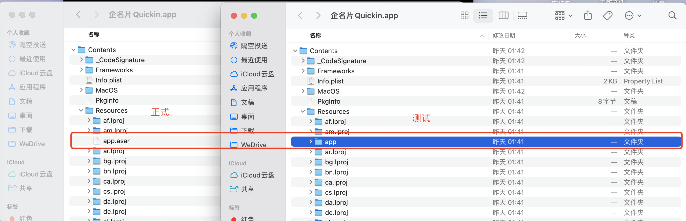

## 问题描述

本地以及测试包集成 sqlite 并使用正常。线上打包发布访问 sqlite 失败，访问不到数据库文件。



## 原因

electron 打包开启 asar 配置导致数据库文件路径访问不到。

asar 是一种用于构建跨平台桌面应用程序的开源框架，而 VSCode 就是基于 Electron 构建的。在 Electron 中，应用程序的资源文件通常以普通文件的形式存在，这包括 JavaScript、CSS、HTML 文件等。然而，当插件的文件数量庞大时，文件系统的读取和加载操作可能会导致性能下降。这时，我们可以使用 asar 来将插件的资源文件打包成一个单独的文件，以提高加载和访问速度。


## 解决

打包配置中将目标文件夹放入根目录，然后在代码中进行拼接。

```js
{
　　...
　　asar: true,
　　extraResource: [`./db-config`],
　　...
}
```

```js
let app_path: any = app.getAppPath()
app_path = app_path.replaceAll('/app.asar', '') //  asar开启
let db
const db_path = path.join(app_path, '/db-config/sqlite3.db')
```
