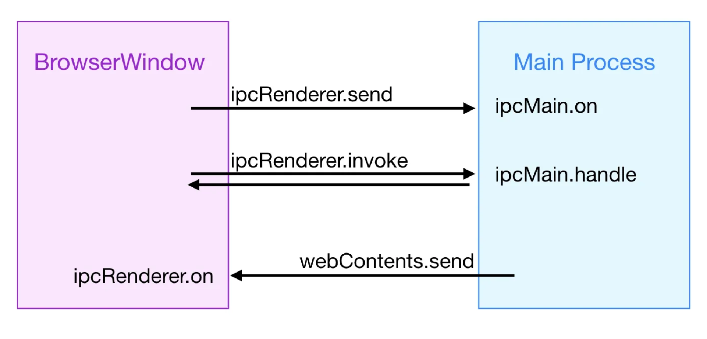
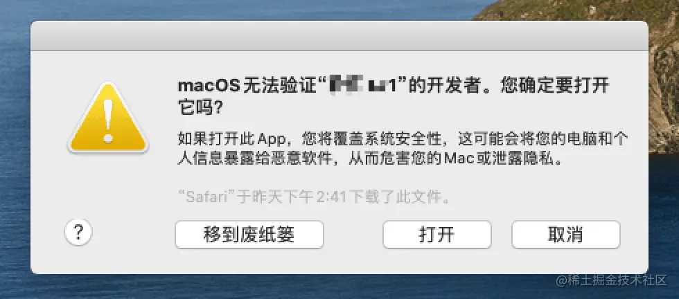
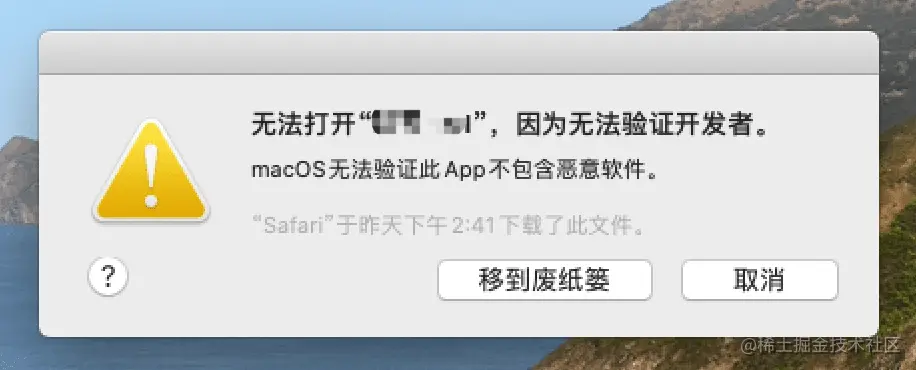

## 介绍

Electron 是构建桌面应用程序的框架，将 Chromium（支持最新特性的浏览器）和 Node.js 整合到一个运行环境之中，允许我们使用 JavaScript、HTML 和 CSS 来构建桌面运行程序，并且可以使用它所提供的 API 去访问 Windows、MacOS 或 Linux 上的操作系统功能，集成了跨平台的 Native 方案与操作系统进行通信，如操作系统的系统通知等，最终生成一个跨平台并且兼容性极好的桌面应用。

## Electron 的工作流程

Electron 继承 Chromium 的多进程架构，Chrome 页签、扩展等都有自己的渲染进程，避免单进程崩溃不影响整个浏览器，浏览器控制这些标签页的渲染进程，以及整个应用程序的生命周期。

Electron 类似于上述 Chrome 的架构，包含主进程 Main Process 和渲染进程 Renderer Process，类似于 Chrome 的浏览器和渲染进程。

### 主进程

- 每当启动一个 App 时，就会启动一个主进程。

- 每个 Electron 应用都有且只能有一个单一的主进程，作为应用程序的入口，对应 package.json 文件中的 `main` 属性。

- 主进程运行在 Node 环境，可以调用任何 node 模块、操作本地文件等。

- 只有主进程能够操作 Native API。

- 管理所有的窗口和 WebContents，以及管理应用程序的生命周期。
- 主进程创建窗口，通过窗口加载界面，生成渲染进程 Renderer Process

#### 窗口管理

主进程创建完毕后，会在其内部创建一个或多个 [BrowserWindow](https://www.electronjs.org/zh/docs/latest/api/browser-window) 模块，创建和管理应用程序窗口。

```js
const { BrowserWindow } = require('electron')

const win = new BrowserWindow({
  x: 100,
  y: 100, // x y 用于设置窗口显示的位置
  show: false, // 默认情况下创建一个窗口对象之后就会显示，设置为false 就不会显示了
  width: 800,
  height: 400, // 设置窗口的宽高
  maxHeight: 600,
  maxWidth: 1000,
  minHeight: 200,
  minWidth: 300, // 可以通过 min max 来设置当前应用窗口的最大和最小尺寸
  resizable: false, // 是否允许缩放应用的窗口大小
  frame: true, // 用于自定义 menu ，设置为 false 可以将默认的菜单栏隐藏
  autoHideMenuBar: true, // 自动隐藏菜单栏
  icon: 'logo.ico', // 设置一个图片路径，可以自定义当前应用的显示图标
  title: '测试', // 自定义当前应用的显示标题
  webPreferences: {
    webviewTag: true,
    preload: path.join(__dirname, 'preload.js'),
  },
})
win.loadURL('https://github.com')
```

- 优雅显示窗口

  通过设置 show 属性为 false，可以隐藏窗口，然后再通过 win.show() 方法显示窗口，参考[优雅地显示窗口](https://www.electronjs.org/zh/docs/latest/api/browser-window#%E4%BC%98%E9%9B%85%E5%9C%B0%E6%98%BE%E7%A4%BA%E7%AA%97%E5%8F%A3)。

- Node.js 集成

  通过设置 webPreferences 可以在渲染进程中使用 Node.js API

  ```js
  webPreferences: {  // 用于控制窗口加载的网页是否集成 node.js 环境
    nodeIntegration: true,
    enableRemoteModule: true
  }
  ```

  此时想要在渲染进程中创建窗口，可以使用 electron 的 remote 进行创建：

  ```js
  const { remote } = require('electron')

  window.addEventListener('DOMContentLoaded', () => {
    const oBtn = document.getElementById('btn')
    oBtn.addEventListener('click', () => {
      let indexMin = new remote.BrowserWindow({
        width: 200,
        height: 200,
      })
      indexMin.loadFile('xxx')

  })
  ```

  出于安全考虑，**[不要为远程内容启用 Node.js 集成](https://www.electronjs.org/zh/docs/latest/tutorial/security#2-%E4%B8%8D%E8%A6%81%E4%B8%BA%E8%BF%9C%E7%A8%8B%E5%86%85%E5%AE%B9%E5%90%AF%E7%94%A8-nodejs-%E9%9B%86%E6%88%90)**

##### webContents

webContents 是与 Electron 关系最紧密的概念，每增加一个窗口，就会创建一个独立的 webContents，它们可以加载不同的 url，彼此互相独立。

可以在主进程中通过窗口的 [webContent](https://www.electronjs.org/zh/docs/latest/api/web-contents) 对象与网页内容进行交互。

```js
const { BrowserWindow } = require('electron')

const win = new BrowserWindow({ width: 800, height: 1500 })
win.loadURL('https://github.com')

const contents = win.webContents
// Event Emitter
console.log(contents)
```

`win.webContents` 是一个 EventEmitter 对象，通过它来发送跨进程消息，监听其他进程发来的事件。

Electron 为每个 webContents 提供上下文隔离的预加载环境，通过指定`webPreferences`可以执行指定的 preload 脚本。会在渲染器加载页面之前执行，可以同时访问 DOM 接口和 Node.js 环境，并且可以通过 contextBridge 将接口暴露给渲染器。

Electron 封装的跨进程通信对象 ipcMain 和 ipcRenderer 只能用于 node.js 环境，所以 preload 脚本会将有限的接口暴露给渲染进程使用。

#### 应用程序生命周期

主进程可以通过 Electron 的 [app](https://www.electronjs.org/zh/docs/latest/api/app) 模块控制当前应用程序的生命周期，即在相应的时间点执行需要的动作。

```js
const { app } = require('electron')
// 在最后一个窗口被关闭时退出应用
app.on('window-all-closed', () => {
  if (process.platform !== 'darwin') app.quit()
})
```

Electron 的生命周期包括以下阶段：

- ready

  当 Electron 完成初始化时，发出一次，用于加载窗口的初始化操作 createWindow

- dom-ready

  当前窗体中的文本加载完成后触发，这个事件通常用于开始 DOM 操作

- did-finish-load

  导航完成时触发。这个事件会在页面内容完全加载后触发，适合用来做页面的后置处理。

- window-all-closed

  当所有窗口都被关闭时触发，未监听此事件时，所有窗口关闭后会自动退出应用，并且 `before-quit` 和 `will-quit` 两个事件不会生效；监听时需要自己控制是否需要退出应用

- before-quit

  在关闭窗口之前触发，即将关闭最后一个打开的窗口时被触发

- will-quit

  在窗口关闭并且应用退出时触发，可以执行清理工作的逻辑

- quit

  在应用程序退出时发出

- closed

  当窗口被关闭时触发，此时应删除窗口引用避免内存泄露，设置为 null 即可

我们可以使用以下代码进行测试：

```js
function createWindow() {
  let mainWin = new BrowserWindow({
    width: 800,
    height: 400,
  })

  mainWin.loadFile('index.html')

  mainWin.webContents.on('dom-ready', () => {
    console.log('2--->dom-ready')
  })

  mainWin.webContents.on('did-finish-load', () => {
    console.log('3--->did-finish-load')
  })

  mainWin.on('closed', () => {
    console.log('8--->window-closed')
    mainWin = null
  })
}

app.on('ready', () => {
  console.log('1--->ready')
  createWindow()
})

app.on('window-all-closed', () => {
  console.log('4--->window-all-closed')
  app.quit()
})

app.on('before-quit', () => {
  console.log('5--->before-quit')
})

app.on('will-quit', () => {
  console.log('6--->will-quit')
})

app.on('quit', () => {
  console.log('7--->quit')
})
```

输出结果如下所示：


#### 自定义菜单

process.platform

#### 自定义右键菜单

#### Dialog 对话框

showOpenDialogSync
showOpenDialog

#### Native API

为了使 Electron 的功能不仅仅限于对网页内容的封装，主进程也添加了自定义的 API 来与用户的作业系统进行交互。 Electron 有着多种控制原生桌面功能的模块，例如菜单、对话框以及托盘图标。

### 渲染进程

一个应用有多个渲染进程，通过 BrowserWindow 打开的页面都是一个渲染进程，不能使用 Node 相关的 API 和模块。

每个渲染进程都是独立的，各自运行在自己的沙箱环境当中，但不同的窗口之间可能存在交互，因此 Electron 通过 [IPC](https://www.electronjs.org/zh/docs/latest/tutorial/ipc) 来实现进程间的通信。

### Preload 脚本

使主进程和渲染进程桥接在一起。

在渲染进程加载之前执行的脚本，可以访问 Node.js API，并且可以访问 Window 对象，通过 Preload 脚本在全局 window 中暴露任意 API，在渲染进程中使用。

由于安全问题，在 Preload 脚本中直接设置`window.xxx = 'xxx'`时，获取到的`window.xxx`是 undefined，需要通过 [contextBridge](https://www.electronjs.org/zh/docs/latest/api/context-bridge) 来实现交互。

```js
// preload.js
const { contextBridge } = require('electron')

contextBridge.exposeInMainWorld('IS_MAC', process.platform === 'darwin')
```

在渲染进程中，就可以使用`window.IS_MAC`来判断环境。


### 进程间通信 IPC

主进程和渲染进程各司其职，意味着主进程没法访问 DOM 元素，渲染进程无法访问 Node.js API。

使用进程间通信 IPC 可以解决。Electron 提供 `ipcMain`（从主进程到渲染进程的异步通信） 模块和 `ipcRenderer`（从渲染器进程到主进程的异步通信） 模块实现 IPC 以在两种进程之间传输任意信息，例如从 UI 调用原生 API 或从原生菜单触发 Web 内容的更改。



#### 主进程到渲染进程

借助 webContents 的 send 方法来发送，只有单向通信

#### 渲染进程到主进程

两种模式：

1. send 单向模式，不需要返回值
2. invoke 双向模式，需要返回值，相当于一来一回，异步调用
   实现在渲染进程中调用主进程的 API，渲染进程中使用 ipcRenderer.send 发送消息，在主进程中使用 ipcMain.on 监听渲染进程的事件用来接收消息，类似于发布订阅

#### 渲染进程到渲染进程

也就是来个 BrowserWindow 之间的通信，由于 ipc 通信的基础是 webContents，而两个 browserWindow 的 wenContents 是独立的，无法直接交换上下文，所以需要借助主进程的帮助。

1. 使用 ipcRenderer.sendTo

   该方法支持传入一个 webContentsId 作为发送目标，发送到特定的渲染上下文，通过它我们可以实现窗口对窗口的直接通信，但首先需要通过主进程来获取另一个窗口的 webContentsId。

   ```js
   // A窗口
   const targetId = await ipcRenderer.invoke(“GetIWindowBId”) //主进程需要通过ipcMain监听该事件并返回窗口B的id
   ipcRenderer.sendTo(targetId,"CrossWindow”,”窗口A发给窗口B”)

   // B窗口
   ipcRenderer.on("CrossWindow",(event,...params)=>{
     console.log("CrossWindow Request from ",event.senderId,...params) // B窗口可以把senderId记录下来，并通过它给A窗口发送消息
     ipcRenderer.sendTo(event.senderId,"CrossWindow”,”窗口B发给窗口A”)
   })
   ```

2. 使用 MessagePort

   MessagePort 并不是 Electron 提供的能力，而是基于 MDN 的 web 标准 API，这意味着它可以在渲染进程直接创建。同时 Electron 提供了 nodejs 侧的实现，所以它也能在主进程创建。

   ```js
   // 在渲染进程
   const messageChannel = new MessageChannel()
   console.log(messageChannel.port1)
   console.log(messageChannel.port2)

   // 在主进程
   import { MessageChannelMain } from 'electron'
   const messageChannel = new MessageChannelMain()
   console.log(messageChannel.port1)
   console.log(messageChannel.port2)
   ```

## 两种进程都可以使用的模块

### Shell

## webview 嵌入

## Electron 环境搭建

按照[官方教程](https://www.electronjs.org/zh/docs/latest/tutorial/quick-start#%E5%88%9B%E5%BB%BA%E4%BD%A0%E7%9A%84%E5%BA%94%E7%94%A8%E7%A8%8B%E5%BA%8F)一步步搭建，这里不在赘述

或者可以参考我的项目

## 打包

Electron 本身没有任何打包和分发文件的工具，需要借助 electron-forge 来完成，是一个打包应用程序并分发的一体化工具。底层集成了 [@electron/packager](https://github.com/electron/packager)、[@electron/osx-sign](https://github.com/electron/osx-sign)以及[electron-winstaller](https://github.com/electron/windows-installer)等工具。

### 安装

```bash
yarn add --dev @electron-forge/cli
```

执行转换脚本：

```bash
npx electron-forge import
```

转换脚本完成后，Forge 会将一些脚本添加到您的 package.json 文件中。

```json
//...
"scripts": {
  "start": "electron-forge start",
  "package": "electron-forge package",
  "make": "electron-forge make"
},
//...
```

并且会在项目根目录生成 `forge.config.js` 文件

### 构建

electron-forge 构建步骤：package、make、publish

依赖前一个输出结果：publish 依赖 make、make 依赖 package


### package

将 electron 应用打包为特定平台的可执行包，例如（windows 上的.exe，mac 上的.app，M1M2 芯片的.dmg），会打包到/out/文件夹中，`--arch`代表要打包的目标架构

```bash
electron-forge package --arch=arm64
electron-forge package --arch=x64
```

需要处理：

1. macOS 上应用程序分发有两层安全技术：`代码签名`和`公证`

- 代码签名

  是一种安全技术，是指使用开发者的数字证书对应用进行加密，以确保应用没有被篡改过，Windows 和 macOS 拥有其特定的代码签名系统。在 macOS 上，代码签名是在应用程序打包时完成的。 而在 Windows 中，则是对可分发文件进行[签名操作](https://www.electronforge.io/guides/code-signing)。

  如果用户安装未签名的软件，会提示如下：
  

  并且它对于应用程序的自动更新功能 (将会在教程最后部分讲解) 来说是必需的。

- 公证

  公证是一个特定于 macOS 的过程，开发人员可以在其中将经过代码签名的应用发送到 Apple 服务器，以便通过自动化服务查验恶意组件。

  未公证的应用在 mac 上打开时，也会提示

  

### make

将通过 forge 配置和传入的参数，为 electron 应用制作可分发文件

可执行包（Executable Package）：通过 Electron 打包工具构建的最终应用程序。通常是一个可执行文件（如 .exe、.app 或 .dmg 文件），可直接运行。这个可执行包包含了应用的源代码、依赖库、资源文件等一切必要的内容，以便用户能够在其计算机上运行应用。

分发包（Distribution Package）：将可执行包分发给最终用户的打包版本。分发包可能包含了额外的文件，如安装向导、许可协议、应用图标等。它的目的是将应用程序交付给最终用户，以便他们能够方便地安装和使用你的应用。

总结起来，可执行包是你实际构建的应用程序，而分发包是包含了可执行包及其他用于分发和展示的资源的打包版本。分发包可以用于在不同平台上分发你的应用，并确保用户能够顺利安装和使用它。

### publish

执行 package 打包，执行 make 制作 Forge 应用程序并将其发布到 Forge 配置中定义的发布目标。

## 为什么主进程到渲染进程没有双向通信

Electron 选择了一种主进程到渲染进程单向通信的架构，主要基于以下原因：

安全性和隔离：渲染进程通常运行应用程序的界面部分，而主进程则处理底层系统交互。将主进程到渲染进程的通信限制为单向可以更好地隔离不同层次的操作，防止渲染进程直接访问可能会影响系统稳定性和安全性的功能。

控制和稳定性： 将主进程作为中心控制点可以更好地管理应用程序的整体状态。如果允许主进程直接访问渲染进程，可能会导致难以预测的交互，从而影响应用程序的稳定性。

开发者体验： 限制通信方向可以简化通信模型，使开发者更容易理解和处理通信。如果允许双向通信，可能会引入更多的复杂性，增加代码编写和调试的难度。

尽管主进程到渲染进程的通信是单向的，但 Electron 提供了一种名为 "ipcRenderer" 的机制，允许渲染进程向主进程发送异步消息，然后主进程可以通过 "ipcMain" 监听这些消息并做出响应。这种机制允许渲染进程请求主进程执行特定的操作，同时通过限制通信方向来保持架构的稳定性和安全性。

## 调试主进程代码

添加文件 `.vscode/launch.json`，设置如下代码：

```json
{
  // 使用 IntelliSense 了解相关属性。
  // 悬停以查看现有属性的描述。
  // 欲了解更多信息，请访问: https://go.microsoft.com/fwlink/?linkid=830387
  "version": "0.2.0",
  "configurations": [
    {
      "name": "Electron: MainOnly",
      "type": "node",
      "request": "launch",
      "runtimeExecutable": "${workspaceFolder}/node_modules/.bin/electron",
      "runtimeArgs": ["-r", "ts-node/register"],
      "args": ["${relativeFile}"],
      "program": "${workspaceFolder}/src/main/main.ts",
      "sourceMaps": true,
      "stopOnEntry": false, // if true it will break in a unknown file
      "outputCapture": "std", // for console.log to be displayed in debugger console
      "protocol": "inspector"
    },
    {
      "name": "Electron Main",
      "type": "node",
      "request": "launch",
      "runtimeExecutable": "${workspaceFolder}/node_modules/@electron-forge/cli/script/vscode.sh",
      "windows": {
        "runtimeExecutable": "${workspaceFolder}/node_modules/.bin/electron-forge-vscode-win.cmd"
      },
      "runtimeArgs": ["foo", "bar"],
      "cwd": "${workspaceFolder}"
    }
  ]
}
```

接着，在 VS Code 中，点击 Debug -> Start Debugging 即可。


## 如何添加 Vue.js devTools 等浏览器插件

[官方文档](https://www.electronjs.org/zh/docs/latest/tutorial/devtools-extension)提供了两种安装方式：

### 使用 [electron-devtools-installer](https://github.com/MarshallOfSound/electron-devtools-installer) 安装浏览器插件

### 手动加载浏览器插件

## electron-forge 搭建 Electron 应用

[Electron forge 官网](https://www.electronforge.io/)

electron-forge 是一个用于构建和发布 Electron 应用的工具。它提供了一个简化的工作流，让开发者能够轻松地创建、打包和发布 Electron 应用。

Forge 的 CLI 是运行 Electron Forge 命令的主要方式。它由其核心 API 的薄包装器组成。这些命令的配置是通过 Forge 配置对象完成的。

要使用 Forge CLI，需要安装 `@electron-forge/cli` 模块作为 devDependency 到项目中。建议使用 create-electron-app 脚本（使用此命令）来开始，会自动安装了该模块。

### 搭建 vite+typescript 项目

electron-forge 提供了[很多模板](https://www.electronforge.io/templates/vite)

`--template=vite-typescript`即指定模板为 `vite+typescript`

```bash
npm init electron-app@latest my-new-app -- --template=vite-typescript
```

### 配置 Electron-forge

项目创建完成后，会在根目录下生成 `forge.config.js` 文件，Electron Forge 配置在这个对象中。

```js
module.exports = {
  packagerConfig: {},
  makers: [
    {
      name: '@electron-forge/maker-zip',
    },
  ],
}
```

#### 选项

```js
module.exports = {
  packagerConfig: {
    /* ... */
  },
  rebuildConfig: {
    /* ... */
  },
  makers: [],
  publishers: [],
  plugins: [],
  hooks: {
    /* ... */
  },
  buildIdentifier: 'my-build',
}
```

以上所有配置属性都是可选的，下面单个介绍：

##### packagerConfig

用于配置 Electron 应用的打包行为。它定义了应用在打包过程中的各种选项和参数，以便生成所需的可分发应用格式。
packagerConfig 中的配置选项直接传递给 electron-packager，这是 electron-forge 用来打包 Electron 应用的底层工具。

```js
packagerConfig: {
  name: APP_NAME,
  icon: IS_TEST_PKG ? './icon/icon-test' : './icon/icon',
  asar: IS_NEED_SIGN && !IS_TEST_PKG,
  appBundleId: APP_BUNDLE_ID,
  appCopyright: `Copyright © 2023 ${packageJson.author}`,
  ignore: [/\.yarn/, /node_modules\/\.vite/, /node_modules\/\@ant-design/],
  ...
},
```

- asar：是否将应用打包为一个 asar 文件。asar 是一种简单的打包格式，可以将应用的所有文件打包到一个文件中。
- ignore：用于指定在打包时要忽略的文件或目录
- extraResource：指定要包含在最终打包应用中的额外资源文件或目录

所有选项参考 Electron Packager [API 文档](https://electron.github.io/packager/main/interfaces/Options.html)中。

**注意：不能覆盖 dir、arch、platform、out 或 electroVersion 选项，因为它们是由 Electron Forge 内部设置的。**

##### rebuildConfig

配置对象上的顶级属性 rebuildConfig 直接映射到在 Electron Forge 构建过程的打包和启动步骤期间发送到电子重建的选项。

不需要配置

##### marker

marker 是用来配置和定义我们希望生成的安装包格式的插件，每个 maker 都对应一种安装包格式，例如 .dmg、.exe、.deb 等。每个 maker 可以包含其特定的配置，以生成满足特定需求的安装包。

每个制造商都必须在 Forge 配置的制造商部分进行配置，其中包括要运行的平台以及制造商特定的配置。例如：

常见的 Makers

- @electron-forge/maker-squirrel：用于 Windows 上生成 .exe 安装程序。
- @electron-forge/maker-zip：用于生成 .zip 格式的压缩包，通常用于 macOS 或其他平台。
- @electron-forge/maker-deb：用于生成 Debian 系列 Linux 的 .deb 安装包。
- @electron-forge/maker-rpm：用于生成 Red Hat 系列 Linux 的 .rpm 安装包。
- @electron-forge/maker-dmg：用于 macOS 上生成 .dmg 安装包。
- @felixrieseberg/electron-forge-maker-nsis：是一个用于创建 Windows 安装程序的 maker，它使用 NSIS（Nullsoft Scriptable Install System）作为打包工具。NSIS 是一个流行的 Windows 安装程序制作工具，具有高度的可定制性和广泛的使用场景。

我们选择的是@felixrieseberg/electron-forge-maker-nsis

- @electron-forge/maker-squirrel 框架默认，但它安装时不能选安装路径
- @electron-forge/maker-wix 官方推荐之一，打出 MSI 镜像包。最大的坑就在这里，它的自动更新几乎不可用，issues 也没人回复，白白花费了很多时间
- @felixrieseberg/electron-forge-maker-nsis 最后还是换回了 electron-builder 的 NSIS 方案

需要在 package.json 中配置 nsis

```json
"build": {
  "appId": "xxx",
  "productName": "xxx",
  "nsis": {
    "oneClick": false,
    "allowElevation": true,
    "createDesktopShortcut": true,
    "createStartMenuShortcut": true,
    "allowToChangeInstallationDirectory": true,
    "perMachine": true,
    "deleteAppDataOnUninstall": true,
    "installerIcon": "icon/icon.ico",
    "installerHeaderIcon": "icon/icon.ico",
    "guid": "xx"
  },
  ...
}
```

```js
makers: [
  {
    name: '@felixrieseberg/electron-forge-maker-nsis',
    platforms: undefined,
  },
  {
    name: '@electron-forge/maker-zip',
    platforms: ['darwin', 'win32'],
    config: {
      macUpdateManifestBaseUrl: AUTO_UPDATE_URL,
      macUpdateReleaseNotes: packageJson.versionNotes,
    },
  },
  {
    name: '@electron-forge/maker-dmg',
    platforms: ['darwin'],
    config: {
      icon: './icon/icon.icns',
      background: './icon/background.png',
      format: 'ULFO',
      contents: [
        { x: 192, y: 244, type: 'file', path: RELEASE_APP_DIR },
        { x: 448, y: 244, type: 'link', path: '/Applications' },
        { x: 192, y: 700, type: 'position', path: '.background' },
        { x: 292, y: 700, type: 'position', path: '.VolumeIcon.icns' },
        { x: 392, y: 700, type: 'position', path: '.DS_Store' },
        { x: 492, y: 700, type: 'position', path: '.Trashes' },
      ],
    },
  },
]
```

##### publishers

publishers 配置用于定义如何发布 Electron 应用程序。publisher 将应用程序上传到指定的发布平台或服务，如 GitHub Releases、Amazon S3、Snapcraft 等

这里省略 publishers 配置项，因为我们会手动推送到 oss 上去。

##### plugins

plugins 配置用于集成额外的功能模块或插件，以增强构建和打包过程。插件可以提供各种不同的功能，比如 TypeScript 支持、Webpack 集成等。

- @electron-forge/plugin-webpack
- @electron-forge/plugin-vite

我们这里使用 vite，需要提供两个 Vite 配置文件：一个用于 vite.main.config.js 中的主进程，一个用于 vite.renderer.config.js 中的渲染器进程。

```js
plugins: [
    {
      name: '@electron-forge/plugin-vite',
      config: {
        // `build` can specify multiple entry builds, which can be Main process, Preload scripts, Worker process, etc.
        // If you are familiar with Vite configuration, it will look really familiar.
        build: [
          {
            // `entry` is just an alias for `build.lib.entry` in the corresponding file of `config`.
            entry: 'src/main/main.ts',
            config: 'vite.main.config.mjs'
          },
          {
            entry: 'src/main/preload.ts',
            config: 'vite.preload.config.mjs'
          },
          {
            entry: 'src/main/hybrid-manager/preload-hy.ts',
            config: 'vite.preload.config.mjs'
          }
        ],
        renderer: [
          {
            name: 'main_window',
            config: 'vite.renderer.config.mjs'
          }
        ]
      }
    }
  ],
```

同时需要在 `package.json` 中指定入口文件为

```js
"main": ".vite/build/main.js",
```

##### hooks

electron-forge 的 hooks 是一组回调函数，可以在 Electron 应用的构建和发布过程中插入自定义逻辑。通过这些 hooks，你可以在构建流程的特定阶段执行自定义操作，例如修改构建配置、添加额外的文件、运行脚本等。

[完整 hooks 列表](https://www.electronforge.io/config/hooks)

这里只说一下常用的 hooks：

###### prePackage

在 Electron 应用被打包之前执行，可以在这个钩子中执行一些预处理任务，例如清理目录、修改打包配置、生成动态内容等。

###### postPackage

在 Electron 应用被打包之后执行，可以在这个钩子中执行一些后处理任务，例如移动打包后的文件、生成额外的报告、通知团队等，比如我们会将 `extraResources` 下的一个 Flutter App 移动到打包后的 `Contents/Resources/` 文件夹中。

```js
postPackage: async () => {
  const sourceDir =
    process.platform == 'darwin'
      ? path.resolve(__dirname, 'extraResources/Mac/')
      : path.resolve(__dirname, 'extraResources/Windows/')
  const destDir =
    process.platform == 'darwin' ? `${RELEASE_APP_DIR}/Contents/Resources/` : `${RELEASE_EXE_PATH}/resources/`
  try {
    await fs.ensureDir(destDir)
    await fs.copy(sourceDir, destDir, { recursive: true })
  } catch (error) {
    console.log(error)
    throw error
  }
},
```

###### preMake

preMake 在 make 之前调用，可以在这里针对 package 之后的包进行签名

```js
preMake: async () => {
  if (process.platform == 'darwin') {
    if (!IS_TEST_PKG) await makeMacProfile()
    await signMac(RELEASE_APP_DIR, APP_NAME)
  } else {
    await signWin(RELEASE_EXE_DIR, APP_NAME)
  }
},
```

###### postMake

make 之后调用，对 mac 应用程序进行公证

```js
postMake: async () => {
  if (IS_TEST_PKG) return
  if (process.platform == 'darwin') {
    await notarizeMac(RELEASE_DMG_DIR)
    await releasesJson.postMake(
      path.join(__dirname, `./out/make/zip/darwin/${ARCH}/RELEASES.json`)
    )
  } else {
    await signWin(RELEASE_OUT_EXE_DIR, APP_NAME)
    await fixHash(RELEASE_OUT_EXE_DIR, RELEASE_OUT_YML_DIR)
    await releasesJson.postMake(
      path.join(__dirname, `./out/make/nsis/${ARCH}/RELEASES.json`)
    )
  }
}
```
