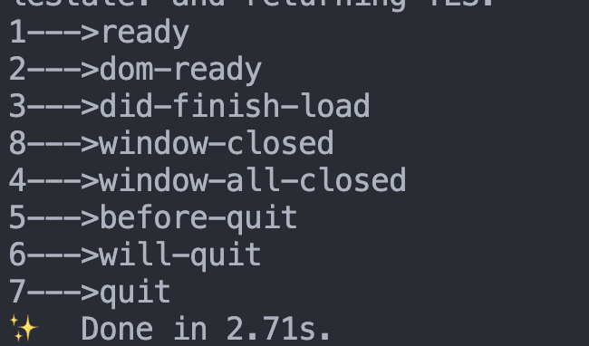
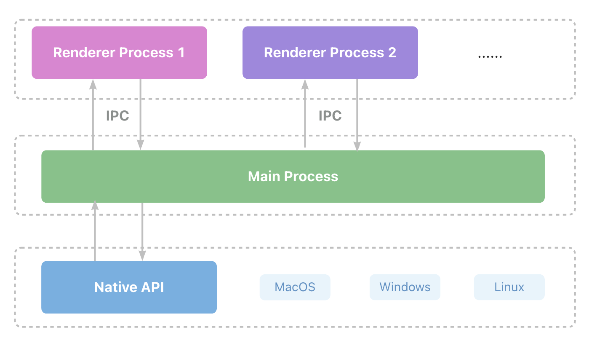
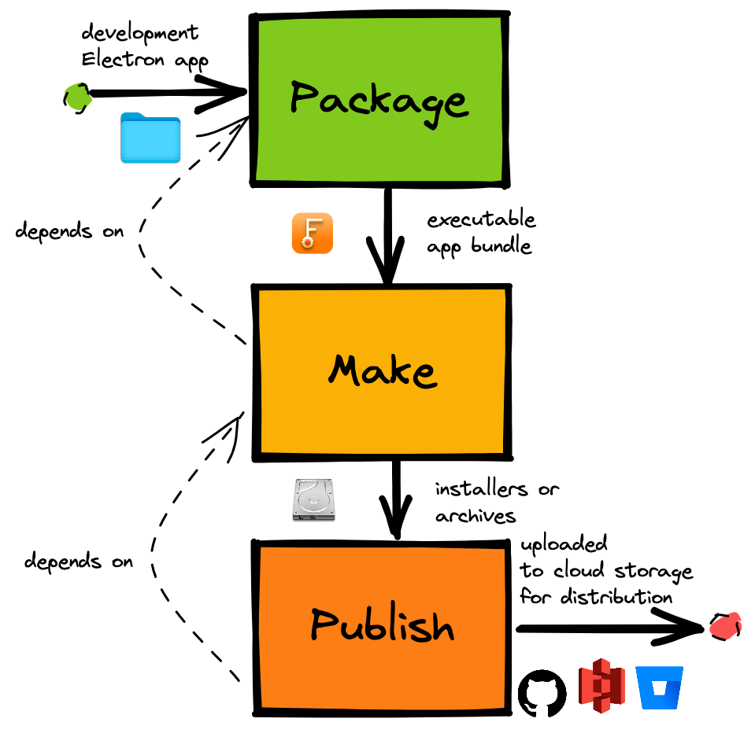
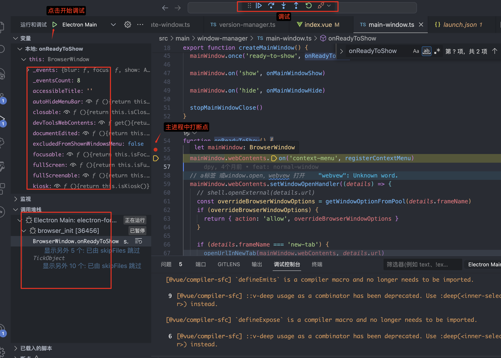

## 介绍

Electron 是构建桌面应用程序的框架，将 Chromium（支持最新特性的浏览器）和 Node.js 整合到一个运行环境之中，允许我们使用 JavaScript、HTML 和 CSS 来构建桌面运行程序，并且可以使用它所提供的 API 去访问 Windows、MacOS 或 Linux 上的操作系统功能，集成了跨平台的 Native 方案与操作系统进行通信，如操作系统的系统通知等，最终生成一个跨平台并且兼容性极好的桌面应用。

## Electron 的工作流程

Electron 继承 Chromium 的多进程架构，Chrome 页签、扩展等都有自己的渲染进程，避免单进程崩溃不影响整个浏览器，浏览器控制这些标签页的渲染进程，以及整个应用程序的生命周期。

Electron 类似于上述 Chrome 的架构，包含主进程 Main Process 和渲染进程 Renderer Process，类似于 Chrome 的浏览器和渲染进程。

### 主进程

- 每当启动一个 App 时，就会启动一个主进程。

- 每个 Electron 应用都有且只能有一个单一的主进程，作为应用程序的入口，对应 package.json 文件中的 `main` 属性。

- 主进程运行在 Node 环境，可以调用任何 node 模块、操作本地文件等。

- 只有主进程能够操作 Native API。

- 管理所有的窗口和 WebContents，以及管理应用程序的生命周期。
- 主进程创建窗口，通过窗口加载界面，生成渲染进程 Renderer Process

#### 窗口管理

主进程创建完毕后，会在其内部创建一个或多个 [BrowserWindow](https://www.electronjs.org/zh/docs/latest/api/browser-window) 模块，创建和管理应用程序窗口。

```js
const { BrowserWindow } = require('electron')

const win = new BrowserWindow({
  x: 100,
  y: 100, // x y 用于设置窗口显示的位置
  show: false, // 默认情况下创建一个窗口对象之后就会显示，设置为false 就不会显示了
  width: 800,
  height: 400, // 设置窗口的宽高
  maxHeight: 600,
  maxWidth: 1000,
  minHeight: 200,
  minWidth: 300, // 可以通过 min max 来设置当前应用窗口的最大和最小尺寸
  resizable: false, // 是否允许缩放应用的窗口大小
  frame: true, // 用于自定义 menu ，设置为 false 可以将默认的菜单栏隐藏
  autoHideMenuBar: true, // 自动隐藏菜单栏
  icon: 'logo.ico', // 设置一个图片路径，可以自定义当前应用的显示图标
  title: '测试', // 自定义当前应用的显示标题
  webPreferences: {
    webviewTag: true,
    preload: path.join(__dirname, 'preload.js'),
  },
})
win.loadURL('https://github.com')
```

- 优雅显示窗口

  通过设置 show 属性为 false，可以隐藏窗口，然后再通过 win.show() 方法显示窗口，参考[优雅地显示窗口](https://www.electronjs.org/zh/docs/latest/api/browser-window#%E4%BC%98%E9%9B%85%E5%9C%B0%E6%98%BE%E7%A4%BA%E7%AA%97%E5%8F%A3)。

- Node.js 集成

  通过设置 webPreferences 可以在渲染进程中使用 Node.js API

  ```js
  webPreferences: {  // 用于控制窗口加载的网页是否集成 node.js 环境
    nodeIntegration: true,
    enableRemoteModule: true
  }
  ```

  此时想要在渲染进程中创建窗口，可以使用 electron 的 remote 进行创建：

  ```js
  const { remote } = require('electron')

  window.addEventListener('DOMContentLoaded', () => {
    const oBtn = document.getElementById('btn')
    oBtn.addEventListener('click', () => {
      let indexMin = new remote.BrowserWindow({
        width: 200,
        height: 200,
      })
      indexMin.loadFile('xxx')

  })
  ```

  出于安全考虑，**[不要为远程内容启用 Node.js 集成](https://www.electronjs.org/zh/docs/latest/tutorial/security#2-%E4%B8%8D%E8%A6%81%E4%B8%BA%E8%BF%9C%E7%A8%8B%E5%86%85%E5%AE%B9%E5%90%AF%E7%94%A8-nodejs-%E9%9B%86%E6%88%90)**

可以在主进程中通过窗口的 [webContent](https://www.electronjs.org/zh/docs/latest/api/web-contents) 对象与网页内容进行交互。

```js
const { BrowserWindow } = require('electron')

const win = new BrowserWindow({ width: 800, height: 1500 })
win.loadURL('https://github.com')

const contents = win.webContents
console.log(contents)
```

#### 应用程序生命周期

主进程可以通过 Electron 的 [app](https://www.electronjs.org/zh/docs/latest/api/app) 模块控制当前应用程序的生命周期，即在相应的时间点执行需要的动作。

```js
const { app } = require('electron')
// 在最后一个窗口被关闭时退出应用
app.on('window-all-closed', () => {
  if (process.platform !== 'darwin') app.quit()
})
```

Electron 的生命周期包括以下阶段：

- ready

  当 Electron 完成初始化时，发出一次，用于加载窗口的初始化操作 createWindow

- dom-ready

  当前窗体中的文本加载完成后触发，这个事件通常用于开始 DOM 操作

- did-finish-load

  导航完成时触发。这个事件会在页面内容完全加载后触发，适合用来做页面的后置处理。

- window-all-closed

  当所有窗口都被关闭时触发，未监听此事件时，所有窗口关闭后会自动退出应用，并且 `before-quit` 和 `will-quit` 两个事件不会生效；监听时需要自己控制是否需要退出应用

- before-quit

  在关闭窗口之前触发，即将关闭最后一个打开的窗口时被触发

- will-quit

  在窗口关闭并且应用退出时触发，可以执行清理工作的逻辑

- quit

  在应用程序退出时发出

- closed

  当窗口被关闭时触发，此时应删除窗口引用避免内存泄露，设置为 null 即可

我们可以使用以下代码进行测试：

```js
function createWindow() {
  let mainWin = new BrowserWindow({
    width: 800,
    height: 400,
  })

  mainWin.loadFile('index.html')

  mainWin.webContents.on('dom-ready', () => {
    console.log('2--->dom-ready')
  })

  mainWin.webContents.on('did-finish-load', () => {
    console.log('3--->did-finish-load')
  })

  mainWin.on('closed', () => {
    console.log('8--->window-closed')
    mainWin = null
  })
}

app.on('ready', () => {
  console.log('1--->ready')
  createWindow()
})

app.on('window-all-closed', () => {
  console.log('4--->window-all-closed')
  app.quit()
})

app.on('before-quit', () => {
  console.log('5--->before-quit')
})

app.on('will-quit', () => {
  console.log('6--->will-quit')
})

app.on('quit', () => {
  console.log('7--->quit')
})
```

输出结果如下所示：


#### 自定义菜单

process.platform

#### 自定义右键菜单

#### Dialog 对话框

showOpenDialogSync
showOpenDialog

#### Native API

为了使 Electron 的功能不仅仅限于对网页内容的封装，主进程也添加了自定义的 API 来与用户的作业系统进行交互。 Electron 有着多种控制原生桌面功能的模块，例如菜单、对话框以及托盘图标。

### 渲染进程

一个应用有多个渲染进程，通过 BrowserWindow 打开的页面都是一个渲染进程，不能使用 Node 相关的 API 和模块。

每个渲染进程都是独立的，各自运行在自己的沙箱环境当中，但不同的窗口之间可能存在交互，因此 Electron 通过 [IPC](https://www.electronjs.org/zh/docs/latest/tutorial/ipc) 来实现进程间的通信。

### Preload 脚本

使主进程和渲染进程桥接在一起。

在渲染进程加载之前执行的脚本，可以访问 Node.js API，并且可以访问 Window 对象，通过 Preload 脚本在全局 window 中暴露任意 API，在渲染进程中使用。

由于安全问题，在 Preload 脚本中直接设置`window.xxx = 'xxx'`时，获取到的`window.xxx`是 undefined，需要通过 [contextBridge](https://www.electronjs.org/zh/docs/latest/api/context-bridge) 来实现交互。

```js
// preload.js
const { contextBridge } = require('electron')

contextBridge.exposeInMainWorld('IS_MAC', process.platform === 'darwin')
```

在渲染进程中，就可以使用`window.IS_MAC`来判断环境。



### 进程间通信 IPC

主进程和渲染进程各司其职，意味着主进程没法访问 DOM 元素，渲染进程无法访问 Node.js API。

使用进程间通信 IPC 可以解决。Electron 提供 `ipcMain`（从主进程到渲染进程的异步通信） 模块和 `ipcRenderer`（从渲染器进程到主进程的异步通信） 模块实现 IPC 以在两种进程之间传输任意信息，例如从 UI 调用原生 API 或从原生菜单触发 Web 内容的更改。

#### 主进程到渲染进程

#### 渲染进程到主进程

异步 send
同步 sendSync

实现在渲染进程中调用主进程的 API，渲染进程中使用 ipcRenderer.send 发送消息，在主进程中使用 ipcMain.on 监听渲染进程的事件用来接收消息，类似于发布订阅

#### 渲染进程到渲染进程

##### 主进程

##### localStorage

## 两种进程都可以使用的模块

### Shell

## Electron 环境搭建

按照[官方教程](https://www.electronjs.org/zh/docs/latest/tutorial/quick-start#%E5%88%9B%E5%BB%BA%E4%BD%A0%E7%9A%84%E5%BA%94%E7%94%A8%E7%A8%8B%E5%BA%8F)一步步搭建，这里不在赘述

或者可以参考我的项目

## 打包

electron-forge 构建步骤：package、make、publish

依赖前一个输出结果：publish 依赖 make、make 依赖 package



### package

将 electron 应用打包为特定平台的可执行包，例如（windows 上的.exe，mac 上的.app，M1M2 芯片的.dmg），会打包到/out/文件夹中，`--arch`代表要打包的目标架构

```bash
electron-forge package --arch=arm64
electron-forge package --arch=x64
```

需要处理：

1. macOS 上应用程序分发有两层安全技术：`代码签名`和`公证`

- 代码签名

  是一种安全技术，用于证明应用程序是本人创建

- 公证

### make

将通过 forge 配置和传入的参数，为 electron 应用制作可分发文件

可执行包（Executable Package）：通过 Electron 打包工具构建的最终应用程序。通常是一个可执行文件（如 .exe、.app 或 .dmg 文件），可直接运行。这个可执行包包含了应用的源代码、依赖库、资源文件等一切必要的内容，以便用户能够在其计算机上运行应用。

分发包（Distribution Package）：将可执行包分发给最终用户的打包版本。分发包可能包含了额外的文件，如安装向导、许可协议、应用图标等。它的目的是将应用程序交付给最终用户，以便他们能够方便地安装和使用你的应用。

总结起来，可执行包是你实际构建的应用程序，而分发包是包含了可执行包及其他用于分发和展示的资源的打包版本。分发包可以用于在不同平台上分发你的应用，并确保用户能够顺利安装和使用它。

### publish

执行 package 打包，执行 make 制作 Forge 应用程序并将其发布到 Forge 配置中定义的发布目标。

## 为什么主进程到渲染进程没有双向通信

Electron 选择了一种主进程到渲染进程单向通信的架构，主要基于以下原因：

安全性和隔离：渲染进程通常运行应用程序的界面部分，而主进程则处理底层系统交互。将主进程到渲染进程的通信限制为单向可以更好地隔离不同层次的操作，防止渲染进程直接访问可能会影响系统稳定性和安全性的功能。

控制和稳定性： 将主进程作为中心控制点可以更好地管理应用程序的整体状态。如果允许主进程直接访问渲染进程，可能会导致难以预测的交互，从而影响应用程序的稳定性。

开发者体验： 限制通信方向可以简化通信模型，使开发者更容易理解和处理通信。如果允许双向通信，可能会引入更多的复杂性，增加代码编写和调试的难度。

尽管主进程到渲染进程的通信是单向的，但 Electron 提供了一种名为 "ipcRenderer" 的机制，允许渲染进程向主进程发送异步消息，然后主进程可以通过 "ipcMain" 监听这些消息并做出响应。这种机制允许渲染进程请求主进程执行特定的操作，同时通过限制通信方向来保持架构的稳定性和安全性。

## 调试主进程代码

添加文件 `.vscode/launch.json`，设置如下代码：

```json
{
  // 使用 IntelliSense 了解相关属性。
  // 悬停以查看现有属性的描述。
  // 欲了解更多信息，请访问: https://go.microsoft.com/fwlink/?linkid=830387
  "version": "0.2.0",
  "configurations": [
    {
      "name": "Electron: MainOnly",
      "type": "node",
      "request": "launch",
      "runtimeExecutable": "${workspaceFolder}/node_modules/.bin/electron",
      "runtimeArgs": ["-r", "ts-node/register"],
      "args": ["${relativeFile}"],
      "program": "${workspaceFolder}/src/main/main.ts",
      "sourceMaps": true,
      "stopOnEntry": false, // if true it will break in a unknown file
      "outputCapture": "std", // for console.log to be displayed in debugger console
      "protocol": "inspector"
    },
    {
      "name": "Electron Main",
      "type": "node",
      "request": "launch",
      "runtimeExecutable": "${workspaceFolder}/node_modules/@electron-forge/cli/script/vscode.sh",
      "windows": {
        "runtimeExecutable": "${workspaceFolder}/node_modules/.bin/electron-forge-vscode-win.cmd"
      },
      "runtimeArgs": ["foo", "bar"],
      "cwd": "${workspaceFolder}"
    }
  ]
}
```

接着，在 VS Code 中，点击 Debug -> Start Debugging 即可。



## 如何添加 Vue.js devTools 等浏览器插件

[官方文档](https://www.electronjs.org/zh/docs/latest/tutorial/devtools-extension)提供了两种安装方式：

### 使用 [electron-devtools-installer](https://github.com/MarshallOfSound/electron-devtools-installer) 安装浏览器插件

### 手动加载浏览器插件
