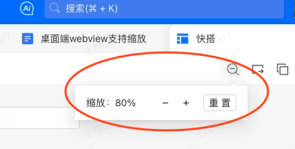
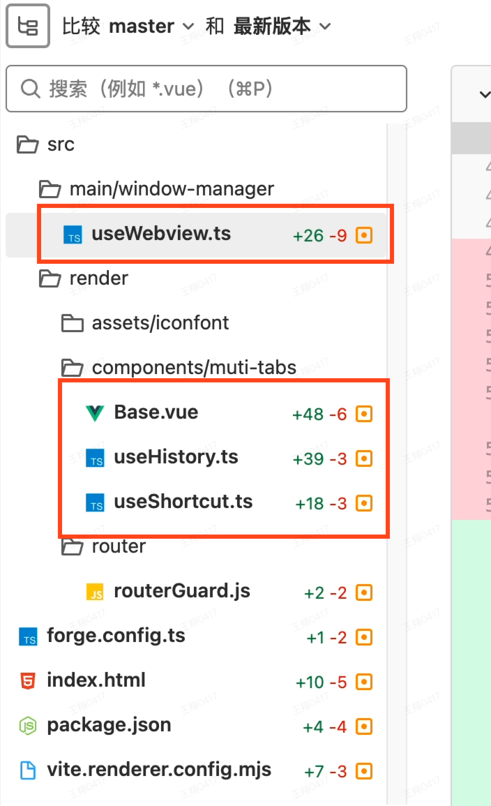

需求：webview 添加缩放能力，支持快捷键缩放（Cmd/Ctrl -、Cmd/Ctrl +、Cmd/Ctrl 0）

**注意：不支持缩放 Native webview，因为缩放策略是同源的，会影响 webview 外部**

如果需求是对 Native webview 缩放，则不能使用 `<webview>.setZoomFactor、<webview>.getZoomFactor`，需要自己实现缩放功能和管理缩放状态

实现参考

