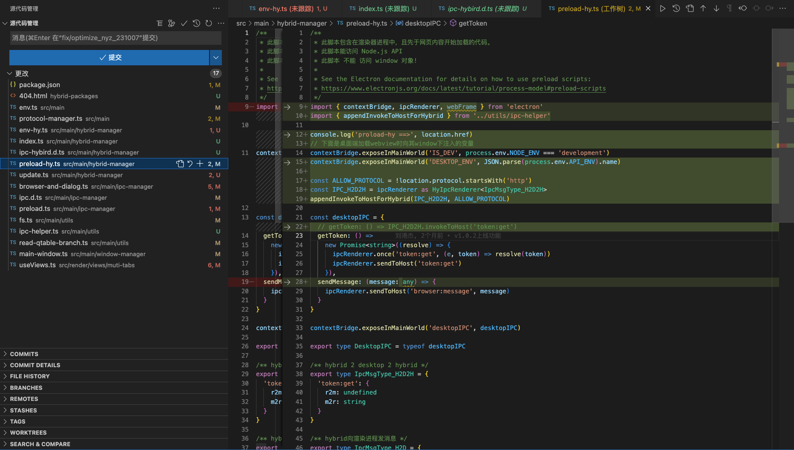

## 背景

在使用离线包策略之前，前端的项目方案是：vue + hybird 开发，之后把开发打包完成的 dist 文件传到服务器，桌面端使用 webview 引入页面，这样的方式造成每次浏览页面会去 webview 页面里请求前端资源文件，导致效果慢。

## 核心思想

将 css、图片等静态资源打包成压缩包，然后下载到客户端并解压，H5 加载时直接从本地读取静态资源文件，减少网络请求，提高速度。

## 解决方案

基于上面的问题，解决如下：**生成一个记录版本的管理 json 里面有版本号和文件地址**，第一次打开对前端的资源文件下载到本地（文件就是上面说的 dist 里面的所有文件），第二次打开会就走离线包资源，这个版本号前端每次发版会更新这个版本号，桌面端根据这个版本号的改变下载新的包文件，然后桌面端对页面的资源请求进行拦截，拦截后使用本地的文件进行页面渲染，这样省去了包下载的过程以达到渲染页面更快。

## 前端实现

离线包是用 gitlab CI 流程实现的，CI 的功能就是 install - build - delopy 就是打包部署然后上传到 OSS 指定路径，具体文件参考

运行流水线之前根据项目需要配置了变量


DEPLOYPATH 是环境变量用来判断打什么环境的包，默认是测试环境，如需打其他环境需要运行之前再次定义 DEPLOYPATH 的值


之后点击运行流水线就会运行了，完成之后（把包文件推到了 OSS 特定目录里面）

查看文件如下：


且维护一个 JSON 文件


这里记载了项目文件的版本号、路径（也就是上面说的 APP 对比的版本号），APP 在进入之后请求这个文件，对比决定要不要使用本地的文件还是下载新的版本，目前这个 JSON 文件是手动维护的。

```bash
releases_private.json // 私有云
releases_public.json // 体验版
releases_dev.json // 测试环境
```

```json
{
  "status": 0,
  "message": "ok",
  "data": {
    "global_enable": 1,
    "pages": [
      {
        "key": "test",
        "version": "1.0.0",
        "domainNames": ["http://www.baidu.com"],
        "url": "https://qtable.oss-cn-beijing.aliyuncs.com/apps/hy-desktop/test/test.zip"
      },
      {
        "key": "doc",
        "version": "1.0.3",
        "domainNames": [
          "https://docdev.qimingpian.cn",
          "https://dochy.qimingpian.cn"
        ],
        "url": "https://qtable.oss-cn-beijing.aliyuncs.com/apps/hy-desktop/doc-dev/0825.zip"
      }
    ]
  }
}
```

更新完成后，也就完成了离线包的发布，目前离线包的发布与不离线包发布是分开的，这一系列流程走下来确实有些繁琐，也就有了第二次迭代的优化版本

## 后续优化

1. 版本 JSON 文件创建、更新走接口，这也就是需要一个管理平台页面
2. 本地的版本更新走项目的 version 版本，走 git 版本来更新
3. 离线包与非离线包统一发布（jenkins 或者 gitlab CI/CD）

## 主要流程

1. 请求离线包管理配置服务，接口返回离线包下载地址和相应版本号、需要拦截的域名；
2. 比对远端和本地离线包版本号， 按需下载相应离线包资源;
3. 检查要更新的离线包服务是否正在使用;
   1. 正在使用，稍后更新;
   2. 未使用，立即更新;
4. 加载 WebView，拦截请求，并查找本地离线包缓存，如果命中则返回缓存，未命中以域名加载;

### 离线包检查时机

1. 打开应用时
2. 窗口隐藏时（2 分钟内仅检查一次）

**需关注**

1、离线包下载失败；
2、离线包解压失败；
3、本地缓存未命中；

## Quickin 接入离线包方案

1. 注册文件协议 registerFileProtocol需要在app.ready中触发
2. 将离线包映射文件和地址进行替换
3. 

### 桌面端工程

#### 1、404 兜底文件：目录 hybrid-packages , 放入 404.html


#### 离线包地址：src/main/env.ts 　


#### 注册文件协议：src/main/protocol-manager.ts


#### 离线包映射文件和地址替换方法等：/src/main/hybrid-manager/env-hy.ts


#### 注册混合包协议：/src/main/hybrid-manager/index.ts


#### 类型文件：/src/main/hybrid-manager/ipc-hybird.d.ts


#### 预加载混合文件：/src/main/hybrid-manager/preload-hy.ts



#### 检查&下载&解压&更新：/src/main/hybrid-manager/update.ts


#### 新开窗口加载标签页的地址判断：/src/main/ipc-manager/browser-and-dialog.ts


#### 加一个通信方法的类型：/src/main/ipc-manager/ipc.d.ts


#### 桥接处增加方法定义：/src/main/ipc-manager/preload.ts


#### 文件读写和压缩：/src/main/utils/fs.ts


#### 通信 helper 文件：/src/main/utils/ipc-helper.ts


#### 去掉 web 环境弹窗 & 本地开发使用 3000 端口服务：/src/main/utils/read-qtable-branch.ts


#### 主窗口非本地环境下两个时机检测离线包：/src/main/window-manager/main-window.ts


#### 使用新增的 R2M2R 通信方法进行标签域名替换判断：/src/render/views/muti-tabs/useViews.ts


#### 桌面端环境：按照原本的 6 个环境使用


打包流程：与原本一致
上线流程：与原本一致（注意版本控制即可）

### 网页端工程

#### 打包指令修改，输出包不使用 viteEnv：package.json


#### 用到 import.meta.env 的地方，替换为从桌面端获取环境


#### 新增配置文件，用于合理映射和线上环境兜底


#### 单独调用了 vite 的 mode 或者 NODE_ENV 的地方，换成来自桌面端的环境名称判断，也是 ViteEnv 允许兜底使用


#### 重定向自动登录流程 改为 非阻塞自动登录流程，token 和 im_id 直接传过去，然后异步自动登录，目标页面优先执行


#### 路由前置守卫需要取下来关键参数(token、im_id)，并存起来，然后再去 next()，这样可以保证页面接口正常请求，配合第五步实现非阻塞流程


页面端环境：主要跟随桌面端环境走，名称和内容也要对应上，这样才可以保证登录状态已经服务端鉴权有效


### 打包流程

- OSS 离线包方案：

  - 命令：npm run build
  - 压缩：dist 压缩为+0.0.1 版本包（例：v1.8.2.zip）
  - 上传：手动拖入 OSS 对应环境的目录（别拖错位置了）
  - 配置文件：修改 OSS 上对应环境的 version 版本和 url 的版本

- 网页端兜底方案：
  - 打包：Jenkins 运行任务（注意 jenkins 命令修改）
  - 描述：只有一个 build，不区分环境，环境跟随调用方
