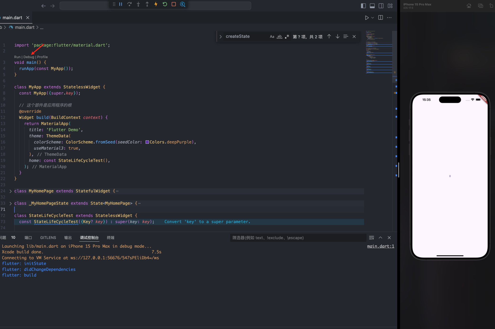
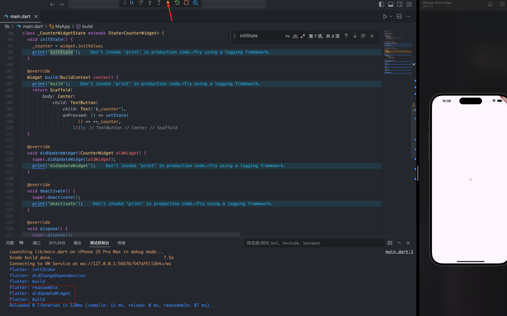
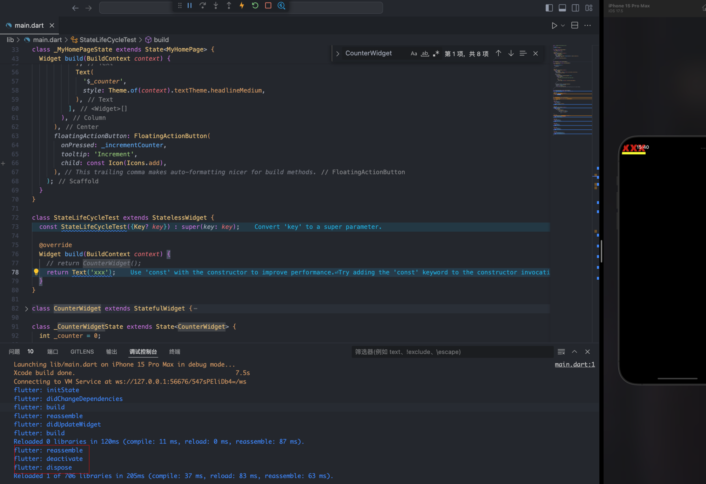
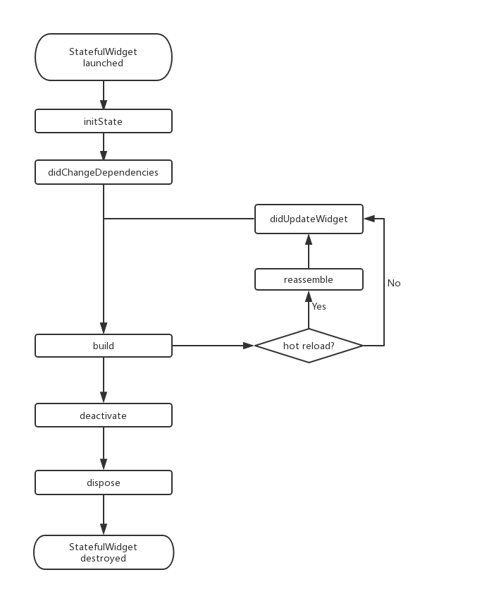
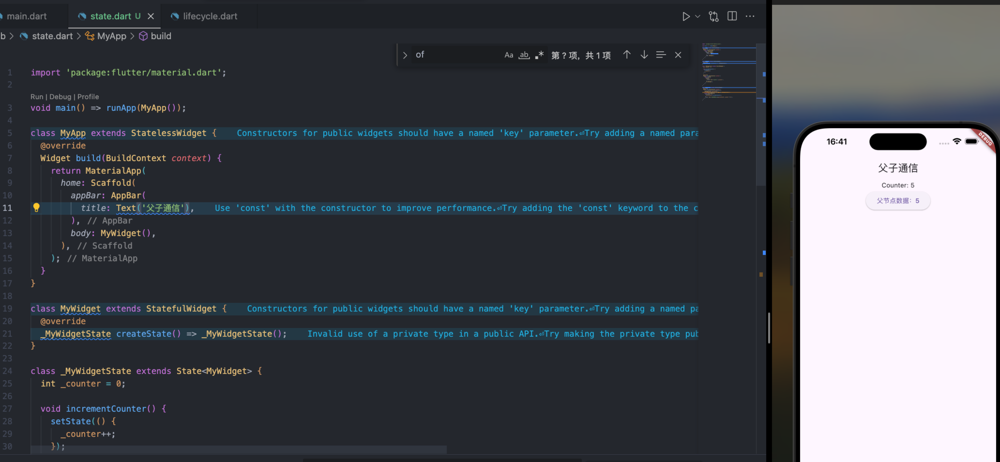

Flutter 开发使用的 Dart 语言，所以学习 Dart 是 Flutter 开发的必要前提。

## Dart 语言

Dart 语言在设计上同时借鉴 Java 和 JavaScript 语言，同时引入一些现代编程语言的特性，例如空安全，除此之外还有一些独创的语法，比如级联操作符。

特点：**强类型语言**，**静态语法方面类似 Java**，如类新定义、函数定义和泛型等，**动态特性方面类似 JavaScript**，如函数式特性、异步支持等。

### 变量声明

1. `var` 关键字

   类似于 js 中的 `var`，但是一旦定义，就不能改变类型

2. `dynamic` 和 `Object`

   Dart 中所有类型都是 `Object` 的子类型，声明的变量可以任意赋值、改变类型，没有 `var` 的束缚

   ```dart
   dynamic t;
   Object x;
   t = "hi world";
   x = 'Hello Object';
   //下面代码没有问题
   t = 1000;
   x = 1000;
   ```

3. `final` 和 `const`

   定义常量，区别是：const 必须初始化，final 变量是在第一次使用时才初始化的。这意味着在声明时可以不赋值，只要在使用前赋值即可

   ```dart
   void main() {
      const now = DateTime.now();
      print(now);

      // 在函数中定义final变量
      final int x;
      x = 10; // 第一次赋值，可以成功
      // x = 20; // 再次赋值会报错
    }
   ```

4. 空安全（null-safety）

   主要是避免由于 null 值导致的运行时错误，在定义变量时通过 `?` 可定义**可变类型**（表示类型是可空的（nullable），即可以为 null。

   ```dart
   int? nullableInt;
   nullableInt = null; // 这是允许的
   ```

   可变类型使用前需要判断是否为空，如果一个变量我们定义为可空类型，在某些情况下即使我们给它赋值过了，但是预处理器仍然有可能识别不出，这时我们就要显式（通过在变量后面加一个”!“符号）告诉预处理器它已经不是 null 了，比如：

   ```dart
   class Test{
      int? i;
      Function? fun;
      say(){
        if(i!=null) {
          print(i! * 8); //因为已经判过空，所以能走到这 i 必不为null，如果没有显式申明，则 IDE 会报错
        }
        if(fun!=null){
          fun!(); // 同上
        }
      }
    }
   ```

### 函数

Dart 是真正的面向对象编程语言，函数也是对象

1. 函数声明

   Dart 函数声明如果没有显式声明返回值类型时会默认当做 dynamic 处理

   ```dart
   // 显示声明返回值类型
   bool isNoble(int atomicNumber) {
     return _nobleGases[atomicNumber] != null;
   }
   // 未声明返回值类型 当作dynamic处理
   isNoble(int atomicNumber) {
     return _nobleGases[atomicNumber] != null;
   }
   ```

2. 可选参数

   包装一组函数参数，用[]标记为可选的位置参数，并放在参数列表的最后面

   ```dart
    String say(String from, String msg, [String? device]) {
      var result = '$from says $msg';
      if (device != null) {
        result = '$result with a $device';
      }
      return result;
    }
   ```

3. 函数作为变量

   类似 js 中的声明式函数

   ```dart
   var say = (str){
     print(str);
   };
   say("hi world");
   ```

4. 函数作为参数传递

   可以将函数作为参数传递给另一个函数

   ```dart
   void main() {
   }   void printMessage(String message) {
     print(message);
   }

   void executeFunction(void Function(String) func, String value) {
     func(value);
   }

   executeFunction(printMessage, 'Hello, Dart!'); // 输出: Hello, Dart!
   ```

### mixin

Dart 不支持多继承，但支持 mixin，是一种复用类代码的方式

```dart
class Person {
  say() {
    print('say');
  }
}

mixin Eat {
  eat() {
    print('eat');
  }
}

mixin Walk {
  walk() {
    print('walk');
  }
}

mixin Code {
  code() {
    print('key');
  }
}

class Dog with Eat, Walk{}
class Man extends Person with Eat, Walk, Code{}
```

特点：

1. 不能有构造函数：Mixin 不能包含构造函数。
2. 适用场景：Mixin 适用于在多个不相关的类中复用代码。
3. 冲突解决：如果多个 Mixin 中有同名的方法，最后一个 Mixin 的方法会覆盖前面的。

### 异步支持

Dart 类库有很多返回 `Future` 和 `Stream` 对象的函数，这些函数称为异步函数，在 dart 中同样使用 `async` 和 `await` 来实现

#### Future

类似于 js 中的 Promise，用于处理异步操作

- `Future.delayed`创建异步任务
- `.then`接受成功结果
- `.catchError`捕获错误
- `.whenComplete`成功/失败都会调用，类似于 Promise 的 finally
- `Future.wait`相当于 Promise.all，支持多个异步任务同时执行

```dart
// 延迟2秒后返回结果
Future.delayed(Duration(seconds: 2),(){
   return "hi world!";
}).then((data){
   print(data);
});
// 抛出异常
Future.delayed(Duration(seconds: 2),(){
   //return "hi world!";
   throw AssertionError("Error");
}).then((data){
   //执行成功会走到这里
   print("success");
}).catchError((e){
   //执行失败会走到这里
   print(e);
}).whenComplete((){
   //无论成功或失败都会走到这里
});

// 执行多个异步
Future.wait([
  // 2秒后返回结果
  Future.delayed(Duration(seconds: 2), () {
    return "hello";
  }),
  // 4秒后返回结果
  Future.delayed(Duration(seconds: 4), () {
    return " world";
  })
]).then((results){
  print(results[0]+results[1]);
}).catchError((e){
  print(e);
});
```

#### async/await

Dart 中的 async/await 和 JavaScript 中的 async/await 功能是一样的，用来处理 Future 的回调地狱问题

#### Stream

Stream 也是用于接受异步事件数据，与 Future 不同的是，它可以同时接受多个异步结果。Stream 常用于会多次读取数据的异步任务场景，如网络内容下载、文件读写等

```js
Stream.fromFutures([
  // 1秒后返回结果
  Future.delayed(Duration(seconds: 1), () {
    return "hello 1";
  }),
  // 抛出一个异常
  Future.delayed(Duration(seconds: 2),(){
    throw AssertionError("Error");
  }),
  // 3秒后返回结果
  Future.delayed(Duration(seconds: 3), () {
    return "hello 3";
  })
]).listen((data){
   print(data);
}, onError: (e){
   print(e.message);
},onDone: (){

});
```

## 第一个 flutter 应用

通过 flutter 目录结构知道 lib/main.dart 是 flutter 应用的入口文件，我们来看下之前计数器应用的代码：

```dart
import 'package:flutter/material.dart';

void main() {
  runApp(const MyApp());
}

class MyApp extends StatelessWidget {
  const MyApp({super.key});

  // 这个部件是应用程序的根
  @override
  Widget build(BuildContext context) {
    return MaterialApp(
      title: 'Flutter Demo',
      theme: ThemeData(
        colorScheme: ColorScheme.fromSeed(seedColor: Colors.deepPurple),
        useMaterial3: true,
      ),
      home: const MyHomePage(title: 'Flutter Demo Home Page'),
    );
  }
}

class MyHomePage extends StatefulWidget {
  const MyHomePage({super.key, required this.title});

  final String title;

  @override
  State<MyHomePage> createState() => _MyHomePageState();
}

class _MyHomePageState extends State<MyHomePage> {
  int _counter = 0;

  void _incrementCounter() {
    setState(() {
      _counter++;
    });
  }

  @override
  Widget build(BuildContext context) {
    return Scaffold(
      appBar: AppBar(
        backgroundColor: Theme.of(context).colorScheme.inversePrimary,
        title: Text(widget.title),
      ),
      body: Center(
        child: Column(
          mainAxisAlignment: MainAxisAlignment.center,
          children: <Widget>[
            const Text(
              'You have pushed the button this many times:',
            ),
            Text(
              '$_counter',
              style: Theme.of(context).textTheme.headlineMedium,
            ),
          ],
        ),
      ),
      floatingActionButton: FloatingActionButton(
        onPressed: _incrementCounter,
        tooltip: 'Increment',
        child: const Icon(Icons.add),
      ), // This trailing comma makes auto-formatting nicer for build methods.
    );
  }
}
```

### 代码分析

1. 导入包

   ```js
   import 'package:flutter/material.dart'
   ```

   通过此行代码导入 [material](https://m2.material.io/design) 组件库

2. 应用入口

   ```dart
   void main() {
    runApp(const MyApp());
   }
   ```

   与 Java 类似，Flutter 中同样使用 `main` 函数作为应用程序的入口，调用 `runApp` 方法启动 Flutter 应用。

   `runApp` 接受一个 `Widget` 参数，如 `MyApp()`，它是 Flutter 应用的根组件

3. 应用结构

   ```dart
   class MyApp extends StatelessWidget {
    const MyApp({super.key});
      // 这个部件是应用程序的根
      @override
      Widget build(BuildContext context) {
          return MaterialApp(
            title: 'Flutter Demo',
            theme: ThemeData(
              colorScheme: ColorScheme.fromSeed(seedColor: Colors.deepPurple),
              useMaterial3: true,
            ),
            home: const MyHomePage(title: 'Flutter Demo Home Page'),
          );
        }
      }
   ```

- MyApp 是 Flutter 应用根组件，继承自 StatelessWidget，所有本身也是 widget（“组件”或“部件”）
- Flutter 中，大多数都是 widget，包括对齐（Align）、填充（Padding）、手势处理（GestureDetector）等，它们都是以 widget 的形式提供
- Flutter 构建页面时，调用 `build` 方法，描述如何构建 UI 界面
- `MaterialApp` 是 Material 库中提供的 Flutter App 框架，通过它设置应用的名称、主题色、语言和首页等，继承自 StatefulWidget，也是 widget

```dart
class MyHomePage extends StatefulWidget {
  const MyHomePage({super.key, required this.title});

  final String title;

  @override
  State<MyHomePage> createState() => _MyHomePageState();
}
```

home 及应用首页，MyHomePage 继承自 StatefulWidget，表示一个有状态的组件。

之前的 MyApp 入口继承 StatelessWidget，表示无状态的组件，两者对比如下：

1. StatefulWidget 拥有状态，并且状态在 widget 生命周期中可变，StatelessWidget 没有状态
2. StatefulWidget 至少由两个类构成
   1. 一个 StatefulWidget 类
   2. 一个 State 类，该类继承自 State，该类中包含 widget 的状态

#### State 类

`_MyHomePageState`类是 MyHomePage 类对应的状态类，MyHomePage 类中并没有 build 方法，取而代之的是，build 方法被挪到了`_MyHomePageState`方法中

```dart
class _MyHomePageState extends State<MyHomePage> {
  int _counter = 0;

  void _incrementCounter() {
    setState(() {
      _counter++;
    });
  }

  @override
  Widget build(BuildContext context) {
    return Scaffold(
      appBar: AppBar(
        backgroundColor: Theme.of(context).colorScheme.inversePrimary,
        title: Text(widget.title),
      ),
      body: Center(
        child: Column(
          mainAxisAlignment: MainAxisAlignment.center,
          children: <Widget>[
            const Text(
              'You have pushed the button this many times:',
            ),
            Text(
              '$_counter',
              style: Theme.of(context).textTheme.headlineMedium,
            ),
          ],
        ),
      ),
      floatingActionButton: FloatingActionButton(
        onPressed: _incrementCounter,
        tooltip: 'Increment',
        child: const Icon(Icons.add),
      ), // This trailing comma makes auto-formatting nicer for build methods.
    );
  }
}
```

`_MyHomePageState` 类包括：

- 组件状态

  ```dart
  int _counter = 0;
  ```

- 状态变化函数

  ```dart
  void _incrementCounter() {
    setState(() {
      _counter++;
    });
  }
  ```

  调用 setState 方法告知 Flutter 框架有状态改变，Flutter 接收后调用 build 方法重新构建页面

- 构建 UI 界面的 build 方法

  当 MyHomePage 第一次被创建时，`_MyHomePageState` 类同时被创建，会调用 build 方法构建 widget 树，最终将 widget 树渲染到界面上

  - Scaffold：Material 提供的页面脚手架，提供默认的导航栏、标题和含主屏幕 widget 树（后同“组件树”或“部件树”）的 body 属性
  - body：`Center` 可以将子组件树对齐到屏幕中心，通过 `child` 定义子组件，通过 `children` 定义多个平行的子组件
  - floatingActionButton：是右下角悬浮 button，通过 onPressed 接收回调函数

### Widget

#### 基本概念

Widget 是 Flutter 用于构建用户界面的基本单元。每个 Widget 都描述了用户界面的一部分。无论是一个按钮、文本、图像，还是整个布局结构，都是通过 Widget 来实现的。在 Flutter 中，几乎所有的东西都是 Widget，包括对齐方式、填充、布局模型等。

#### 特点

- 不可变性：Widget 本身是不可变的（immutable）。这意味着一旦创建了 Widget，它的属性不能改变（final）。如果属性发生变化则会重新构建 Widget 树

- 描述 UI：Widget 只是对 UI 的一种描述，真正的绘制和布局工作是由底层的渲染引擎（rendering engine）来完成的。

#### Widget 的类型

Flutter 中的 Widget 主要分为两类：StatefulWidget 和 StatelessWidget

##### StatelessWidget

StatelessWidget 用于不需要维护状态的场景，通常在 build 方法中通过嵌套其他 widget 来构建 UI，在构建过程中会递归的构建其嵌套的 widget 。如上面的 MyApp

build 方法有一个 context 参数，它是 BuildContext 类的一个实例，表示当前 widget 在 widget 树中的上下文，每一个 widget 都会对应一个 context 对象

##### StatefulWidget

createState() 用于创建和 StatefulWidget 相关的状态，它在 StatefulWidget 的生命周期中可能会被多次调用。例如，当一个 StatefulWidget 同时插入到 widget 树的多个位置时，Flutter 框架就会调用该方法为每一个位置生成一个独立的 State 实例

### State

一个 StatefulWidget 对应一个 State 类，表示与其对应的 StatefulWidget 要维护的状态。

特点：

1. State 中的状态在 widget 构建时会同步读取
2. 在 widget 的生命周期中可以被改变，当 State 被改变时，需要调用 setState 方法通知 Flutter 调用 build 重新构建 widget 树

#### State 生命周期

State 的生命周期在 Flutter 开发中尤为重要，修改代码如下：

```dart
import 'package:flutter/material.dart';

void main() {
  runApp(const MyApp());
}

class MyApp extends StatelessWidget {
  const MyApp({super.key});

  // 这个部件是应用程序的根
  @override
  Widget build(BuildContext context) {
    return MaterialApp(
      title: 'Flutter Demo',
      theme: ThemeData(
        colorScheme: ColorScheme.fromSeed(seedColor: Colors.deepPurple),
        useMaterial3: true,
      ),
      home: const StateLifeCycleTest(),
    );
  }
}

class StateLifeCycleTest extends StatelessWidget {
  const StateLifeCycleTest({Key? key}) : super(key: key);

  @override
  Widget build(BuildContext context) {
    return CounterWidget();
  }
}

class CounterWidget extends StatefulWidget {
  const CounterWidget({super.key, this.initValue = 0});

  final int initValue;

  @override
  _CounterWidgetState createState() => _CounterWidgetState();
}

class _CounterWidgetState extends State<CounterWidget> {
  int _counter = 0;

  @override
  void initState() {
    super.initState();
    // 初始化状态
    _counter = widget.initValue;
    print('initState');
  }

  @override
  Widget build(BuildContext context) {
    print('build');
    return Scaffold(
        body: Center(
            child: TextButton(
                child: Text('$_counter'),
                onPressed: () => setState(
                      () => ++_counter,
                    ))));
  }

  @override
  void didUpdateWidget(CounterWidget oldWidget) {
    super.didUpdateWidget(oldWidget);
    print('didUpdateWidget');
  }

  @override
  void deactivate() {
    super.deactivate();
    print('deactivate');
  }

  @override
  void dispose() {
    super.dispose();
    print("dispose");
  }

  @override
  void reassemble() {
    super.reassemble();
    print("reassemble");
  }

  @override
  void didChangeDependencies() {
    super.didChangeDependencies();
    print("didChangeDependencies");
  }
}
```

通过 debug 启动项目，看到控制台输出如下，也就是在 StatefulWidget 插入到 Widget 树中时，首先 initState 方法会被调用



接着通过点击 ⚡️ 按扭触发热重载：



接下来我们在 widget 树中删除 CounterWidget



结合以上案例，来看下 State 的生命周期

1. createState：当 StatefulWidget 首次插入到 widget 树中时调用，创建并返回与 StatefulWidget 关联的 State 对象
2. initState: State 对象被创建时，即 widget 第一次插入到 widget 树中时调用，**只调用一次**，必须调用`super.initState();`，可以做一些一次性操作，如状态初始化、订阅子树的事件通知等
3. didChangeDependencies：当 State 对象的依赖发生变化时会被调用
4. build：在 initState 和 didChangeDependencies 之后调用，之后每次调用 setState 时也会调用
5. reassemble：在热重载（hot reload）时调用
6. didUpdateWidget：在 widget 的配置发生变化时调用，在 widget 重新构建时，Flutter 框架会调用 widget.canUpdate 来检测 widget 树中同一位置的新旧节点，然后决定是否需要更新，如果 widget.canUpdate 返回 true 则会调用此回调。
7. deactivate：当 State 对象从树中被移除时，会调用此回调
8. dispose：当 State 对象从树中被永久移除时调用；通常在此回调中释放资源。



### 在 Widget 树中获取 State 对象

如果需要从 Widget 树中获取某个 State 对象，以便与其进行交互，也就是 vue 中的父子组件通信。Flutter 提供了几种方法来实现这一点，具体方法取决于你要获取 State 对象的上下文和具体需求。

#### 通过 Context 获取

context 对象提供方法 `findAncestorStateOfType()`，该方法可以从当前节点沿着 widget 树向上查找指定类型的 statefulWidget 的 state 对象，同时还有 `findRootAncestorStateOfType()` 获取根节点的 state 对象

```dart
import 'package:flutter/material.dart';

void main() => runApp(MyApp());

class MyApp extends StatelessWidget {
  @override
  Widget build(BuildContext context) {
    return MaterialApp(
      home: Scaffold(
        appBar: AppBar(
          title: Text('父子通信'),
        ),
        body: MyWidget(),
      ),
    );
  }
}

class MyWidget extends StatefulWidget {
  @override
  _MyWidgetState createState() => _MyWidgetState();
}

class _MyWidgetState extends State<MyWidget> {
  int _counter = 0;

  void incrementCounter() {
    setState(() {
      _counter++;
    });
  }

  @override
  Widget build(BuildContext context) {
    return Column(
      children: [
        Center(
          child: Text('Counter: $_counter'),
        ),
        ChildWidget(),
      ],
    );
  }
}

class ChildWidget extends StatelessWidget {
  @override
  Widget build(BuildContext context) {
    // 通过BuildContext查找父级State对象
    _MyWidgetState? parentState =
        context.findAncestorStateOfType<_MyWidgetState>();
    return ElevatedButton(
      onPressed: () {
        parentState?.incrementCounter();
      },
      child: Text('父节点数据：${parentState?._counter ?? 0}'),
    );
  }
}
```

在这个例子中，ChildWidget 通过 BuildContext 查找父级 MyWidget 的 State 对象，可以访问变量或者调用其方法。



#### 通过 GlobalKey

GlobalKey 是获取 State 对象的最常用方法之一。你可以将 GlobalKey 传递给 StatefulWidget，然后使用它来访问 State 对象。

**注意：使用 GlobalKey 开销较大，如果有其他可选方案，应尽量避免使用它。另外，同一个 GlobalKey 在整个 widget 树中必须是唯一的，不能重复。**

### 通过 RenderObject 自定义 Widget

在 Flutter 中，直接使用 RenderObject 来构建自定义 Widget 并不常见，尤其是在日常应用开发中。大多数开发者可以通过 Flutter 提供的现成 Widget、布局和绘制系统实现所需的功能。然而，RenderObject 非常强大且灵活，在某些情况下，它非常有用，比如需要精细控制布局和绘制逻辑，或者需要实现高性能的自定义组件时。

### Flutter SDK 内置组件库介绍

Flutter SDK 内置了丰富的基础组件，在基础组件之上还提供了一套 Material 风格（Android 默认的视觉风格）和一套 Cupertino 风格（iOS 默认的视觉风格）的组件。

#### 基础组件

使用基础组件前，需要导入

```dart
import 'package:flutter/widgets.dart';
```

- [Text](https://api.flutter.dev/flutter/widgets/Text-class.html)：创建带格式的文本
- [Row](https://api.flutter.dev/flutter/widgets/Row-class.html)、[Column](https://api.flutter.dev/flutter/widgets/Column-class.html)：可以在水平、垂直方向上创建灵活的布局，类似于 web 中的 flexbox
- [Stack](https://api.flutter.dev/flutter/widgets/Stack-class.html)：允许子 widget 堆叠，类似于 Web 中的 absolute
- [Container](https://api.flutter.dev/flutter/widgets/Container-class.html)：创建矩形元素，通过 [BoxDecoration](https://api.flutter.dev/flutter/painting/BoxDecoration-class.html)定义背景、边框和阴影等

#### Material 风格组件

Material 风格组件需要导入

```dart
import 'package:flutter/material.dart';
```

Material 应用程序以 MaterialApp 组件开始，该组件在应用程序的根部创建了一些必要的组件，比如 Theme 组件，它用于配置应用的主题。
