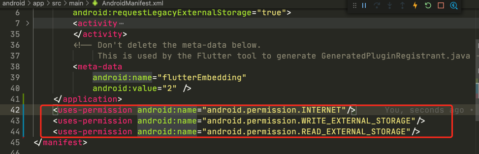

## 包管理

Pub（https://pub.dev/ ）是 Google 官方的 Dart Packages 仓库，类似于 node 中的 npm 仓库

通过以下命令安装依赖

```bash
flutter packages get
```

### 其他依赖方式

依赖 Git：你也可以依赖存储在 Git 仓库中的包。如果软件包位于仓库的根目录中，请使用以下语法

```yaml
dependencies:
  pkg1:
    git:
      url: git://github.com/xxx/pkg1.git
```

## 资源管理

静态资源图片管理

- /assets/my_icon.png
- /assets/2.0x/my_icon.png
- /assets/3.0x/my_icon.png

```dart
Widget build(BuildContext context) {
  // 根据DPI自动配置图片
  return AssetImage('assets/my_icon.png');
  // 依赖包中的图片
  return AssetImage('icons/heart.png', package: 'some_pkg')
}
```

## 运行项目报错

### 报错：一直显示 Running Gradle task 'assembleDebug'

在上文的基础上，如果还是不能解决问题，检查 android 目录下是否有 settings.gradle 文件，文件内容如下：

```groovy
include ':app'

def localPropertiesFile = new File(rootProject.projectDir, "local.properties")
def properties = new Properties()

assert localPropertiesFile.exists()
localPropertiesFile.withReader("UTF-8") { reader -> properties.load(reader) }

def flutterSdkPath = properties.getProperty("flutter.sdk")
assert flutterSdkPath != null, "flutter.sdk not set in local.properties"
apply from: "$flutterSdkPath/packages/flutter_tools/gradle/app_plugin_loader.gradle"
```

如果没有请添加此文件。

再运行，可能出现文件 `flutter\packages\flutter_tools\gradle\flutter.gradle` 第 108 行报错，修改 hostedRepository 的值如下：

```dart
String hostedRepository = "https://storage.flutter-io.cn";
```

运行，如果还有如下报错信息：

**Task 'assembleAarRelease' not found in root project 'flutter_plugin_android_lifecycle'.**

请安装此包，

还有，需要检查 `AndroidManifest.xml`，`users-permission` 是否放错了位置，应该放在 application 外面



### 报错：Could not locate aapt. Please ensure you have the Android buildtools installed.

### 报错：task ':permission_handler:compileReleaseJavaWithJavac'

修改 compileSdkVersion 版本为 31 ：`android/app/build.gradle`

### 解决：Flutter canvaskit Failed to download[https://chrome-infra-packages.appspot](https://chrome-infra-packages.appspot/)

flutter web 工程第一次运行时会下载 `web sdk`, `canvaskit`，但是在国内常常卡在 `Downloading canvaskit` 就下载失败了

解决办法：使用国内的镜像

```bash
export FLUTTER_STORAGE_BASE_URL=https://storage.flutter-io.cn
```

再次运行时如果出现了 `Flutter assets will be downloaded from https://storage.flutter-io.cn. Make sure you trust this source!` 那基本就成功了，没有就重启下电脑

### flutter build ipa 报错：Cannot find "xcodebuild"

```text
Cannot find "xcodebuild". Xcode 13 or greater is required to develop for iOS.
Encountered error while archiving for device.
```

解决方法：

```bash
sudo xcode-select --switch /Applications/Xcode.app/Contents/Developer 
```

如果路径不对，可以找到 Xcode，拉去路径
