## 原生开发

安卓：Java、Kotlin 直接调用 Android SDK
IOS：OC、Swift 直接调用 IOS SDK

优点：性能好、速度快、访问所有权限
缺点：开发周期长、开发成本高

## 跨平台技术

### H5 + 原生：微信小程序

通过原生网页加载 webview 控件来加载，通过 JsBridge 调用原生方法

### Javascript 开发 + 原生渲染：React Native、Weex

React Native 的虚拟 DOM 会通过 JavaScriptCore 映射为原生组件

优点：原生控件渲染，想比于混合开发，性能好

### 自绘 UI + 原生：Qt、Flutter

调用系统 API 渲染

## Flutter 基础了解

Google 开源，跨平台、高性能，通过 Dart 语言开发的移动端开发框架。

使用高性能渲染引擎来绘制 Widget（组件）

### JIT、AOT

JIT 即时编译：运行时实时将源码翻译为机器码
AOT 提前编译：执行前提前编译为机器码

### 为什么选择 Dart

Dart 开发效率高

1.  基于 JIT 的快速开发周期：开发阶段使用 JIT，避免每次改动都需要重新编译
2.  基于 AOT 的发布包：发布时通过 AOT 生成高效的机器码保证性能

### Flutter 框架图

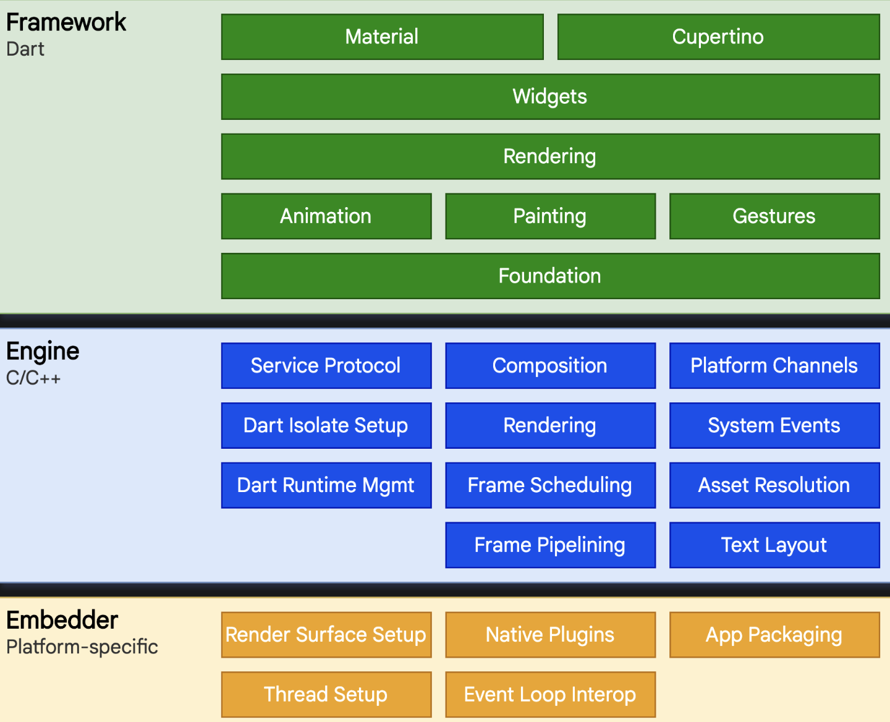

#### 框架层

Flutter Framework，纯 Dart 实现的 SDK，开发时基本都是和 Flutter Framework 打交道

- Foundation 和 Animation、Painting、Gestures

  这两层合并为 Dart UI 层，对应的 Flutter 中的 `dart:ui` 包，是 Flutter Engine 暴露的底层 UI 库，提供动画、手势和绘制能力

- Rendering

  渲染层，依赖于 Dart UI 层，构建一颗由渲染对象组成的**渲染树**，动态更新时，会找出变化更新渲染。是 Flutter 框架最核心的部分，确定渲染对象的位置、大小以及绘制（调用 Dart UI 层）

- Widgets

  Flutter 提供的基础组件库，在此之上，Flutter 还提供了 Material 和 Cupertino 两种视觉风格的组件库，它们分别实现了 Material 和 iOS 设计规范

#### 引擎层

Engine，核心，使用 C++实现，其中包括 Skia 引擎，Dart 运行时（Dart runtime）、文字排版引擎等。

代码调用 `dart:ui` 库时，最终会走到引擎层，实现真正的绘制和显示

#### 嵌入层

Embedder，潜入层，Flutter 最终渲染、交互需要依赖所在平台的操作系统 API，潜入层主要是将 Flutter 引擎安装到特定平台上。

嵌入层采用了当前平台的语言编写，例如 Android 使用的是 Java 和 C++， iOS 和 macOS 使用的是 Objective-C 和 Objective-C++

## Mac 环境搭建

### 1. 设置中国镜像

由于国内访问 Flutter 可能有问题，中国开发者需要切到临时镜像

```bash
export PUB_HOSTED_URL=https://pub.flutter-io.cn
export FLUTTER_STORAGE_BASE_URL=https://storage.flutter-io.cn
```

复制上面两行，添加到系统环境变量

```bash
vim ~./bash_profile
# 复制上述两行到文件末尾
source ~/.bash_profile
```

### 2.下载 Flutter SDK

[Flutter SDK](https://flutter.dev/docs/development/tools/sdk/releases)

选择稳定版最新版本下载，看清 inter 芯片还是 m1 芯片：

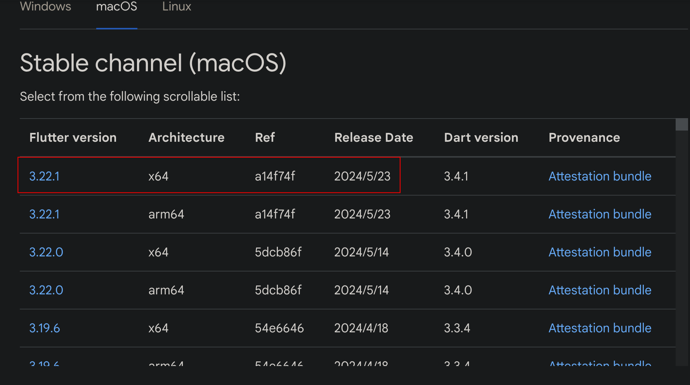

下载完成后，记下当前的目录位置，添加到系统环境变量

```bash
vim ~./bash_profile
# 添加 export PATH=文件目录/flutter/bin:$PATH
source ~/.bash_profile
```

执行 `flutter -version` 报错，如下

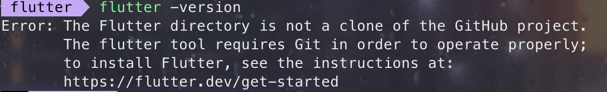

只需要在 flutter 目录下执行 `git init` 即可

再次执行 `flutter doctor` 来检查环境是否正确

```bash
flutter doctor
```

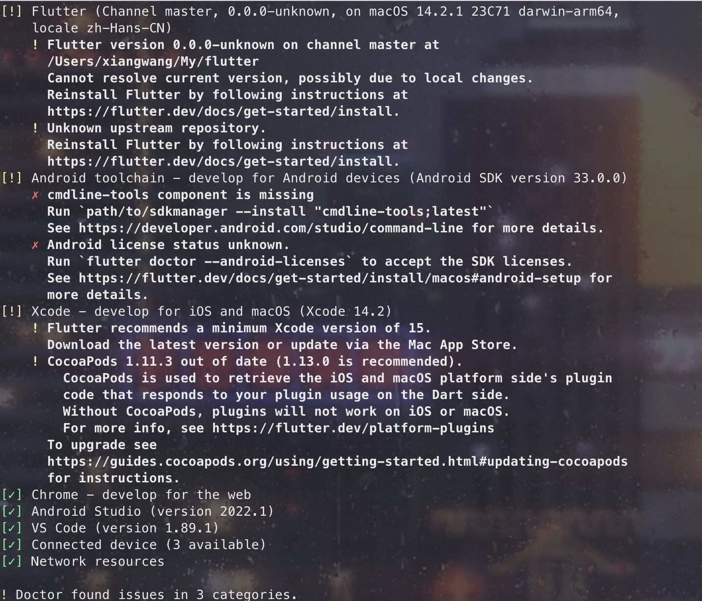

可以看到此时还有环境未正确配置

**上面如果有问题，可以使用 git clone https://github.com/flutter/flutter.git**

接着执行 `flutter doctor`

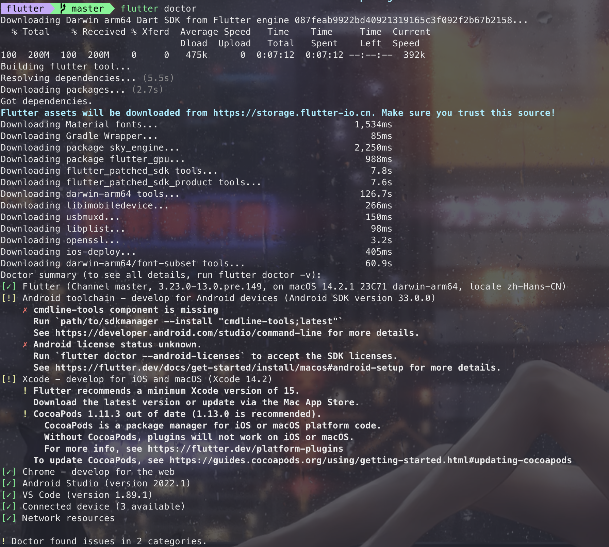

### 3. 安装 Xcode

在 iOS 设备或模拟器上运行 Flutter 应用程序
从 App Store 安装 Xcode 最新版本，Xcode 用于调试和编译本机 Swift 或 ObjectiveC 代码，安装包括 Git 2.27 或更高版本来管理源代码。

安装好 Xcode 还需要设置 Xcode 的开发目录和签署许可协议， 执行下面命令，

```bash
sudo sh -c 'xcode-select -s /Applications/Xcode.app/Contents/Developer && xcodebuild -runFirstLaunch'
```

签署许可协议

```bash
sudo xcodebuild -license
```

### 4. 安装 CocoaPods

当开发 iOS 应用时，会经常使用到很多第三方开源类库，比如 JSONKit，AFNetWorking 等等。可能某个类库又用到其他类库，所以要使用它，必须得另外下载其他类库，而其他类库又用到其他类库，手动一个个去下载所需类库十分麻烦。

CocoaPods 是 iOS 开发、macOS 开发中的包依赖管理工具，效果如 Java 中的 Maven，nodejs 的 npm。

CocoaPods 是一个开源的项目，源码是用 ruby 写的，源码地址在 GitHub 上。

```bash
# 移除原有镜像源：
gem sources --remove https://rubygems.org/
# 添加国内镜像源
gem sources --add https://gems.ruby-china.com
# 安装
sudo gem install -n /usr/local/bin cocoapods
```

需要最新版 ruby 环境支持

```bash
# 安装 rbenv 和 ruby-build：
brew install rbenv
brew install ruby-build
# 配置 rbenv
echo 'export PATH="$HOME/.rbenv/bin:$PATH"' >> ~/.zshrc
echo 'eval "$(rbenv init -)"' >> ~/.zshrc
source ~/.zshrc
# 安装最新的Ruby版本
rbenv install -l
rbenv install 3.3.2
rbenv global 3.3.2

# 查看所有ruby版本
rbenv versions
# 卸载某个版本
rbenv uninstall 3.3.2
# 验证安装是否成功
ruby -b
```

安装成功后，使用 pod -version 检查

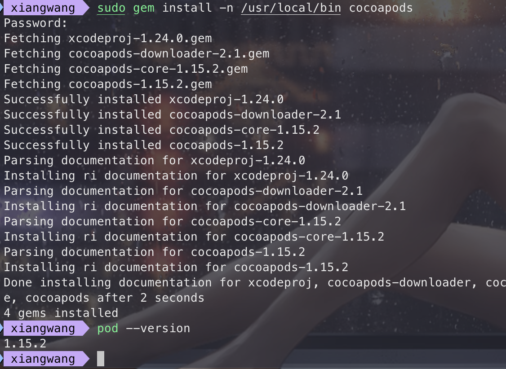

### 5. 安装 iOS 模拟器

```bash
xcodebuild -downloadPlatform iOS
```

这个命令会触发 Xcode 从 App Store 或其他源下载 iOS 模拟器所需的组件，如果它们尚未安装。

使用以下命令启动 iOS 模拟器：

```bash
open -a Simulator
```

### 6. 安装 Android Studio

和 Windows 一样，要在 Android 设备上构建并运行 Flutter 程序都需要先安装 Android Studio

### 报错集锦

上面全部安装完成后，执行 flutter doctor

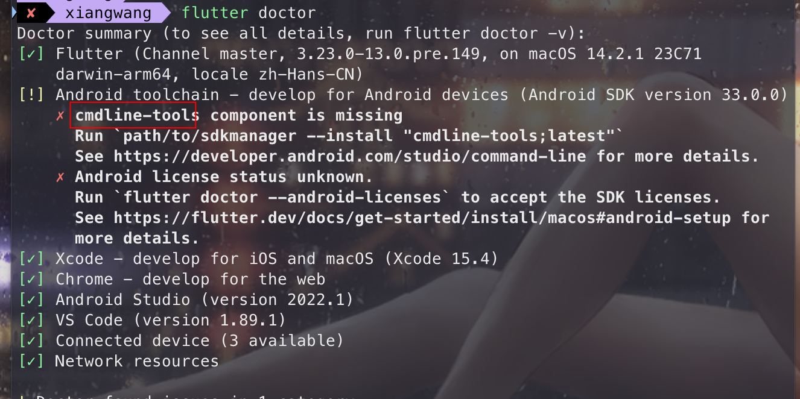

#### cmdline-tools component is missing

需要安装 Android SDK command-line Tools

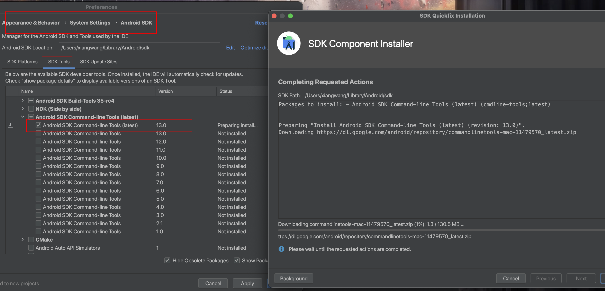

#### Android license status unknown

[解决方案](https://juejin.cn/post/7327487551938134035)

### 结果

## vsCode flutter 环境配置

在插件栏中搜索 Flutter，安装最多人安装的那几个

## 第一个 flutter 应用

阅读[给 Web 开发者的 Flutter 指南](https://docs.flutter.cn/get-started/flutter-for/web-devs)

使用 Flutter 应用模板创建第一个 flutter 应用

1. `cmd + shift + p` 输入 `flutter` 选择 `Flutter: New Project` 创建一个项目`，首次需要设置 flutter SDK 位置
2. 选择 Flutter 项目类型，选择 `Application`

   - Application：Flutter Application 表示一个 Flutter 项目，主体是 Flutter，当然它也可以接入 Android Module 或者 iOS Framework，其内部包含 Android 和 iOS 项目
   - Module：Flutter Module 用于原生项目中插入 Flutter 模块，原生为主体，与 Flutter 进行混合开发
   - Package：Flutter Plugin 基本一样，唯一的区别是 Flutter Package 表示纯 Flutter 模块，不需要原生开发，没有 Android 和 iOS 项目，比如开发一个纯 UI 的插件
   - Plugin：表示 Flutter 插件，包含 Android 和 iOS 项目，如果你要开发一个 Plugin 且此 Plugin 涉及到原生支持，比如蓝牙功能、网络功能等，这些功能纯 Flutter 是无法实现的

   其目录比 Flutter Application 多了一个 example，example 用于当前 Plugin 的 demo， Flutter Plugin 开发完成后可以发布到 pub 上

3. 完成后，需要选择目录以及项目名称
4. 开始创建，回车后 VSCode 自动创建 flutter 项目，需要稍等片刻

   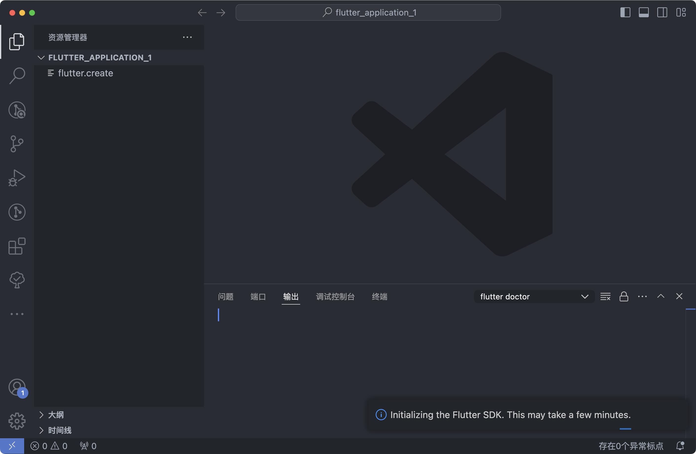

5. 创建完成

   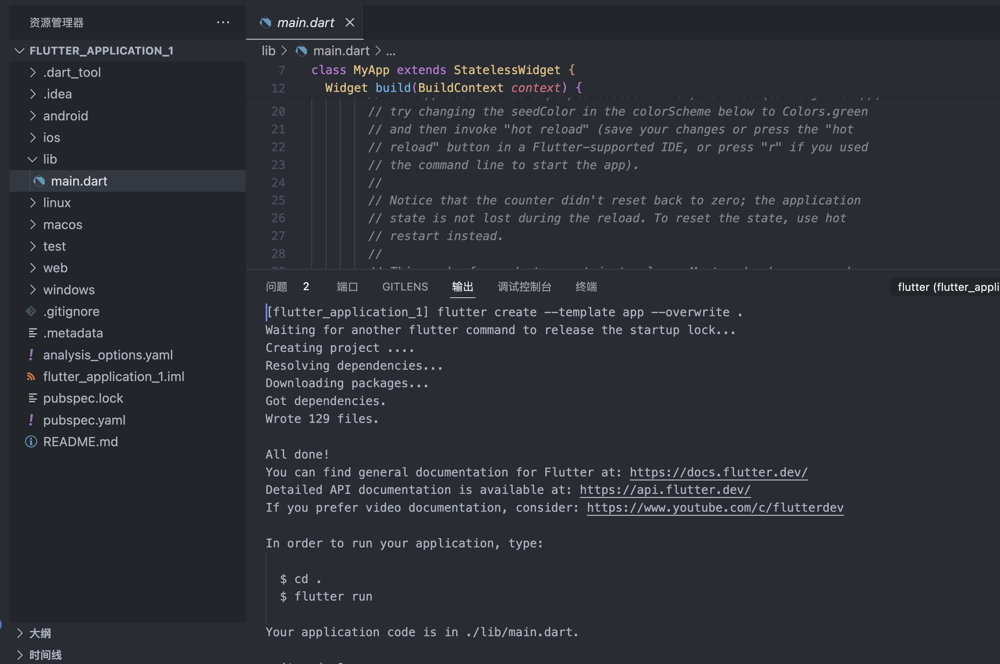

### 项目目录

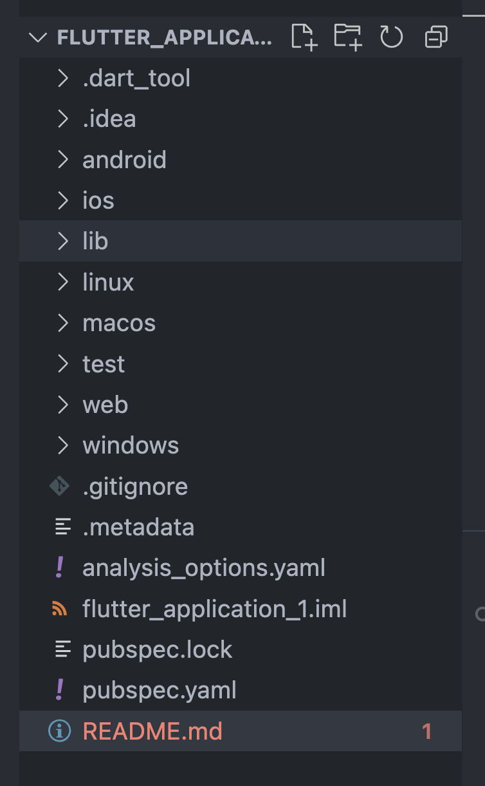

其中各个目录说明如下：

- .dart_tool：Flutter 和 Dart 工具生成的缓存文件和工具配置文件，通常不需要手动修改
- .idea：IntelliJ IDEA 的项目配置文件夹，包含了一些 IDE 相关的设置
- android：包含了用于生成 Android 应用的所有文件和配置，主要使用 Java 或 Kotlin 编写
- ios：包含了用于生成 iOS 应用的所有文件和配置，主要使用 Objective-C 或 Swift 编写
- lib：存放 Dart 代码的主要目录，包括 Flutter 应用的所有业务逻辑和界面代码。通常会有一个 main.dart 文件作为应用的入口，是 Flutter 项目的核心目录，我们写的代码放在这个目录，我们也可以在这个目录创建子目录。
  - main.dart: Flutter 应用的入口文件。通常包含 void main() => runApp(MyApp()); 方法来启动应用。
  - 其他文件和目录：你可以在这里组织你的应用代码，如页面（screens）、组件（widgets）、状态管理（state management）等。
- linux：包含了用于生成 Linux 应用的所有文件和配置。
- macos：包含了用于生成 macOS 应用的所有文件和配置。
- test：存放测试代码的目录，用于写单元测试、集成测试等。
- web：包含了用于生成 Web 应用的所有文件和配置。
- windows：包含了用于生成 Windows 应用的所有文件和配置。
- .metadata：Flutter 项目的元数据文件，记录了一些项目的配置和状态信息
- analysis_options.yaml：Dart 静态代码分析的配置文件，用于设置代码规范和规则
- flutter_application_1.iml：IntelliJ IDEA 生成的项目配置文件。
- pubspec.lock：记录项目当前使用的具体版本的依赖，确保团队中每个人使用的依赖版本一致
- pubspec.yaml：Flutter 项目的配置文件，包含项目的名称、描述、依赖项、开发依赖项等，类似于 package.json
  - name: 项目的名称。
  - description: 项目的简短描述。
  - publist_to：防止我们使用 flutter pub publish 命令将其发布到 pub.dev 上，https://pub.dev/ 相当于 https://www.npmjs.com/
  - dependencies: 项目的依赖项。
  - dev_dependencies: 开发过程中使用的依赖项。
  - flutter: Flutter 特定的配置，包括资源文件（assets）、字体（fonts）等。

### 运行项目

1. 运行项目前，需要先选择设备，输入 `cmd + shift + p` 输入 `flutter` 选择 `Flutter: Select Device`

2. flutter run 启动应用
3. 启动完成，如下

   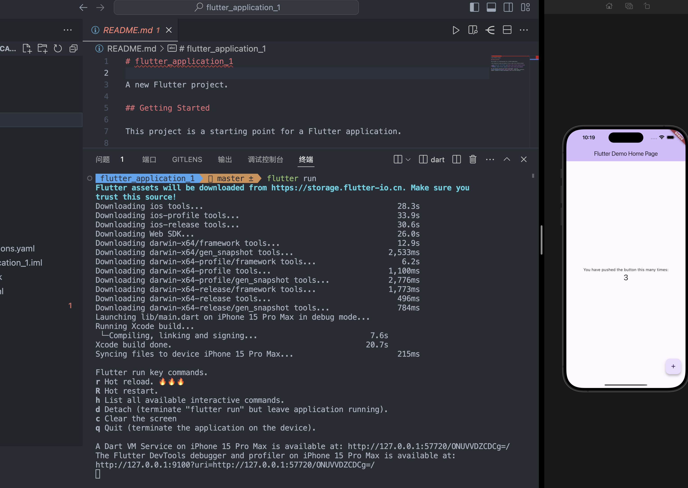

4. 使用以下命令来检查和修复依赖项

   ```bash
   # 相当于npm i
   flutter pub get
   ```

5. 使用以下命令来创建新的 Dart 文件或 Flutter 组件

   ```bash
   flutter create my_new_component
   ```
