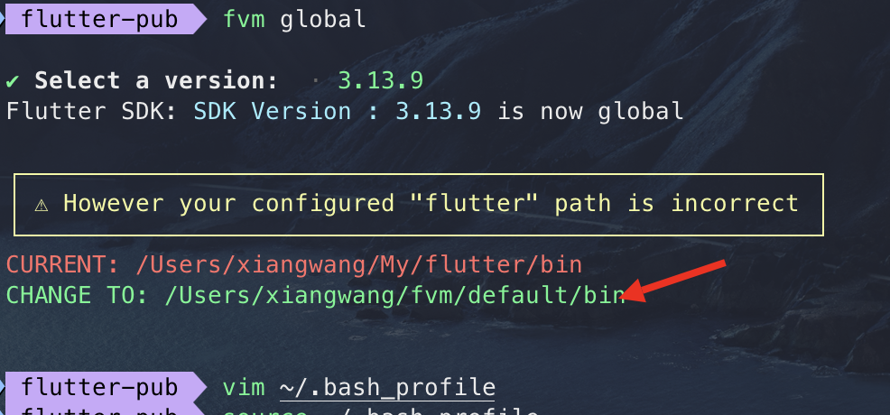
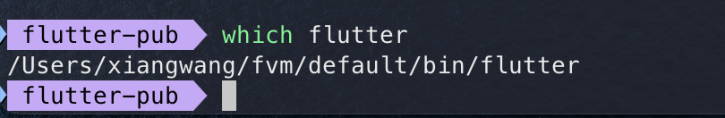

## 切换源

使用国内镜像源

```bash
# 1. ~/.zshrc 文件下添加以下环境变量
# flutter国内镜像站点
export FLUTTER_STORAGE_BASE_URL=https://storage.flutter-io.cn
export PUB_HOSTED_URL=https://pub.flutter-io.cn

# 2. 使环境变量生效
source ~/.zshrc
```

## fvm 版本管理工具

[fvm](https://fvm.app/) 用于切换不同版本的 flutter。

### 安装

```bash
# install
brew tap leoafarias/fvm
brew install fvm

# uninstall
brew uninstall fvm
brew untap leoafarias/fvm
```

### 常用命令

```bash
# releases 查看远端最新15个已发布的flutter版本
fvm releases | tail -15


# install 安装指定版本的flutter
fvm install 3.16.5

# list 查看本机安装的flutter版本
fvm list

# use 在某个工程中使用指定的flutter版本
fvm use 3.16.5

# remove 删除指定版本的flutter sdk
fvm remove 3.16.5

# global 全局切换flutter版本
fvm global 3.16.5
```

全局使用时，需要替换 PATH 变量为 fvm 的路径



通过 which flutter 打印出的路径是否正确



## 工具包

### wechat_kit

wechat_kit 是一个 Flutter 插件，用于集成微信相关的功能，如微信登录、微信支付、分享、获取用户信息等。这个插件通常用于开发需要与微信进行交互的移动应用。

#### 功能介绍

wechat_kit 插件提供的主要功能包括：

- 微信登录：通过微信授权登录，并获取用户的基本信息。
- 微信支付：集成微信支付功能，支持在应用内发起支付请求。
- 微信分享：支持将文字、图片、链接等内容分享到微信的朋友圈或聊天中。
- 获取用户信息：在授权成功后获取微信用户的详细信息。

#### 使用步骤

1. [依赖安装](https://pub.dev/packages/wechat_kit/install)

   ```bash
   flutter pub add wechat_kit
   ```

2. 配置

   在 pubspec.yaml 文件中添加以下内容：

   ```yaml
   wechat_kit:
     #  ios: no_pay # 默认 pay
     app_id: ${your wechat app id}
     universal_link: https://${your applinks domain}/universal_link/${example_app}/wechat/
   ```

3. 使用

   ```dart
   import 'package:wechat_kit/wechat_kit.dart';

    // 示例：初始化微信 SDK
    Wechat.instance.registerApp(appId: 'your_wechat_app_id');

    // 示例：发起微信登录
    void loginWithWeChat() async {
      final result = await Wechat.instance.auth(scope: WechatScope.SNSAPI_USERINFO);
      if (result.isSuccessful) {
        // 登录成功，处理用户信息
      } else {
        // 登录失败，处理错误
      }
    }
   ```

**注意事项**

- 微信开发者账号：要使用微信的这些功能，必须注册微信开发者账号，并在微信开放平台上创建应用，获取 AppID 和 AppSecret。
- 平台配置：使用该插件时，还需要进行一些平台相关的配置，如在 iOS 和 Android 项目中配置微信 SDK。
- Flutter 插件版本：请注意选择合适的插件版本，版本号应与项目的 Flutter SDK 兼容。

通过 wechat_kit，开发者可以方便地将微信的功能集成到 Flutter 应用中，提升应用的用户体验和功能性。

## dependency_overrides

pubspec.yaml 的配置项，可以用于覆盖依赖项的版本约束，可以解决一下问题：

1. 版本冲突：当依赖项的版本与当前项目版本不兼容时，可以使用 dependency_overrides 强制使用特定的版本来解决问题
2. 使用未发布的版本
3. 临时解决问题：在等待依赖项更新或者官方解决某些问题之前，开发者可能会暂时使用 dependency_overrides 来继续开发。

### 案例

假设有一个项目，依赖了两个库 package_a 和 package_b，而这两个库都依赖于 shared_package，但它们依赖的 shared_package 版本不同，从而导致冲突。我们可以使用 dependency_overrides 来解决这个问题。

```yaml
dependencies:
  flutter:
    sdk: flutter
  package_a: ^1.0.0
  package_b: ^2.0.0

dependency_overrides:
  shared_package: ^3.0.0
```

### 注意事项

- 慎重使用：dependency_overrides 会强制所有依赖项使用指定的版本，这可能会引发不兼容的问题。因此，建议仅在确实必要时使用。
- 尽量简化：如果可能的话，尝试通过调整依赖项的版本来解决冲突，而不是直接使用 dependency_overrides。
- 测试覆盖：在使用 dependency_overrides 后，务必对项目进行全面的测试，确保所有功能正常运行。

## 代码部分

### lib 目录

```text
.
├── app
│   ├── dialog
│   ├── im
│   ├── im_cache
│   ├── net
│   ├── service
│   └── ui
│       ├── automatic_reply
│       ├── big_company
│       ├── business
│       ├── certification_management
│       ├── city_site
│       ├── club
│       ├── common_im
│       ├── common_logic
│       ├── common_ui
│       ├── company
│       ├── corpus
│       ├── credit_score
│       ├── guide
│       ├── identification
│       ├── im_file_preview
│       ├── industry_dinner
│       ├── knowledge_gallery
│       ├── leave_message
│       ├── login
│       ├── mail_list
│       ├── main
│       ├── market_value_lib
│       ├── mobile_email_manager
│       ├── my_data
│       ├── news
│       ├── ogp
│       ├── order_pay
│       ├── org
│       ├── perfect_information
│       ├── person
│       ├── project
│       ├── recruit
│       ├── report
│       ├── roadshow
│       ├── role_desc
│       ├── school
│       ├── search
│       ├── share
│       ├── splash
│       ├── subscription_no
│       ├── subscription_number
│       ├── user_behavior
│       ├── web
│       ├── word
│       └── route.dart
├── link_constants.dart
├── common_lib
│   ├── ui
│   ├── utils
│   └── config.dart
├── dependencies
│   ├── assets_picker
│   ├── cache_img
│   ├── common_lib
│   ├── connect
│   ├── device_info
│   ├── image_compress
│   ├── image_cropper
│   ├── jpush
│   ├── lbs
│   ├── package_info
│   ├── path_provider
│   ├── permission_handler
│   ├── photo_view
│   ├── pull_to_refresh
│   ├── sentry
│   ├── sp
│   ├── umeng
│   ├── url_launcher
│   ├── vibrate
│   ├── video_player
│   ├── webview
│   └── wechat_kit
├── generated
├── link_method_channel.dart
└── main.dart
```

### WidgetsFlutterBinding.ensureInitialized()

WidgetsFlutterBinding.ensureInitialized() 方法用于确保 Flutter 框架在执行任何需要依赖 Flutter 框架的操作之前已经初始化好。它在需要进行异步初始化操作或在应用启动早期需要保证 Flutter 框架正确初始化时非常有用。

### await SystemChrome.setPreferredOrientations([DeviceOrientation.portraitUp, DeviceOrientation.portraitDown])

指定应用程序的屏幕方向

- DeviceOrientation.portraitUp：表示竖屏方向，屏幕上方朝上。
- DeviceOrientation.portraitDown：表示竖屏方向，屏幕上方朝下（即设备倒置）。

### await Sp().init();

```dart
await Sp().init();

  bool firstIn = Sp.getValue(SpConst.spKeyFirstIn, true);
  if (!firstIn) {
    SentryUtils.init(appRunner: () => _startApp());
  } else {
    _startApp();
  }
```

- 初始化存储：在应用启动时，通常需要初始化本地存储库（如 Shared Preferences），以便后续可以安全地存取数据。

- 读取配置或状态：获取存储中的值可以用来决定应用的行为。例如，根据 firstIn 的值决定是否显示欢迎页面。

Shared Preferences 是 Flutter 插件，用于简单的持久化和存取应用的本地数据
，键值对保存，需要在 pubspec.yaml 文件中添加 shared_preferences 插件的依赖：

```dart
SentryUtils.init(appRunner: () => _startApp());
```

用于在 Flutter 应用程序中初始化 Sentry 的代码，将应用启动的逻辑传递给 appRunner，可以确保 Sentry 在应用启动之前完成初始化。这可以确保在应用程序启动过程中发生的任何错误都能被捕获并报告到 Sentry。

### init

#### bool debug = !kReleaseMode;

```dart

Future<void> initXLog() async {
  String imId = Sp.getValue(SpConst.spImId, '');
  await XLog.init(remoteDir: 'seeapp', fileName: imId, isAutoUpload: true);
  XLog.setFetchSignUrl('https://oneapi.qmpoa.com/api/upload/getUploadSign');
}
Future init() async {
  bool debug = !kReleaseMode;
  if (!kDebugMode) await initXLog();
  ...
}
```

- kReleaseMode: 编译时常量，为 true 表示是 Release 版本
- initXLog() 初始化日志记录功能

Debug 模式下不需要完全的日志记录，Release 模式下需要日志记录

#### PaintingBinding.instance.imageCache.maximumSizeBytes = 1000 << 20;

- PaintingBinding 是 Flutter 框架中处理绘制和渲染相关的类。通过 instance 属性访问 PaintingBinding 的单例实例
- imageCache 是 PaintingBinding 中的一个属性，用于管理图像缓存。它是 ImageCache 类的实例，负责缓存已经加载的图像以提高性能。
- maximumSizeBytes 是 ImageCache 类中的一个属性，用于设置缓存的最大大小（以字节为单位）。当缓存的大小超过这个值时，缓存中的图像将被逐出以释放内存。

作用：增加图像缓存的大小可以提高性能，减少图像重新加载的次数。但这需要平衡内存使用，避免过度使用内存。

#### WebOffline webOffline = WebOffline();

```dart
WebOffline webOffline = WebOffline();
webOffline.init();
```

处理 Web 离线缓存或离线功能

### runApp

#### RefreshConfiguration

```dart
runApp(RefreshConfiguration(
    shouldFooterFollowWhenNotFull: (state) => false,
```

- RefreshConfiguration 用于配置下拉刷新和上拉加载更多的行为
- shouldFooterFollowWhenNotFull: (state) => false：列表没有填满屏幕时，底部加载更多控件不会跟随列表移动。

#### OverlaySupport.global(...)

- OverlaySupport 提供全局覆盖功能的组件，通常用于显示全局通知或弹出层
- OverlaySupport.global 包装器，允许在应用的根级别显示覆盖层内容

#### GetMaterialApp(...)

```dart
GetMaterialApp(
  builder: FlutterSmartDialog.init(builder: (context, widget) {
    return MediaQuery(
      // 设置文字大小不随系统设置改变
      data: MediaQuery.of(context).copyWith(textScaleFactor: 1.0),
      child: widget!,
    );
  }),
  debugShowCheckedModeBanner: false,
  defaultTransition: Transition.cupertino,
  navigatorObservers: [
    CommonNavigatorObserver(),
    NavigatorObserversOfCommonState.instance,
  ],
  ...
  onReady: () {
    //测试按钮
    // if (CommonLibConfig().commonUtilsParams.isDebug && Get.overlayContext != null)
    //   CommonDebug().showDebugBtn(Get.overlayContext!);
    if (kDebugMode && Get.overlayContext != null) CommonDebug().showDebugBtn(Get.overlayContext!);
  },
);
```

- GetMaterialApp GetX 提供的用于管理路由、状态和其他全局配置的 Material 设计应用程序的根 Widget
- FlutterSmartDialog 用于显示对话框的库
- defaultTransition: Transition.cupertino：设置全局默认的页面过渡效果为 cupertino，这是 iOS 风格的页面过渡动画
- CommonNavigatorObserver 继承自 NavigatorObserver， 用于监听导航事件。通过扩展 NavigatorObserver 来实现自定义的导航行为和记录。
- NavigatorObserversOfCommonState 是一个单例模式的 NavigatorObserver 实例，用于管理公共状态或全局功能。
- onReady 是 GetX 的 GetMaterialApp 中的一个回调函数，用于在应用启动完成后执行初始化操作，如显示调试按钮。
- kDebugMode 用于确定是否在调试模式下执行特定操作，这对于在生产环境中禁用调试功能是很有用的。
- Overlay 是一个在应用上层显示的层，允许在应用中插入浮动的元素。Get.overlayContext 提供了当前的 Overlay 上下文。

### home

#### initState

```dart
void initState() {
    super.initState();

    CommonOperate.nextFrameRefresh(() async {
      try {
        /// 判断开屏广告显示
        bool isShow = SplashAdLogic.showSplash();
        if (isShow) await Future.delayed(Duration(milliseconds: 300));
      } catch (e) {}

      ///判断登录
      String uuid = Sp.getValue(SpConst.spKeyLoginUserToken, "");
      child = LinkRoute.getRoot(uuid);
      setState(() {});
    });

    /// 获取开屏广告图片
    SplashAdLogic.getData();
  }
```

- CommonOperate.nextFrameRefresh 用于在下一帧更新中执行特定的操作
- await Future.delayed(Duration(milliseconds: 300))：
  如果需要显示广告，则等待 300 毫秒。这个延迟可能用于展示广告的时间。
- LinkRoute.getRoot(uuid)：
  根据获取的 uuid 决定跳转到应用的哪个根页面。LinkRoute.getRoot 是一个静态方法，返回根页面的 Widget。

#### `_buildLaunch`

```dart
Widget _buildLaunch() {
  return Column(
    children: [
      const Spacer(),
      Padding(
        padding: EdgeInsets.only(bottom: 32).safeBottom(),
        child: Image.asset('assets/images/3.0x/launch_bottom_image.png', width: 252),
      ).center(),
    ],
  );
}
```

`_buildLaunch` 可以用于创建启动页或引导页。通常，这个页面会在应用启动时显示，并可能包含应用名称、logo 或其他欢迎信息。
