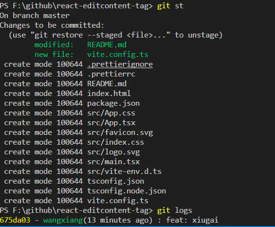
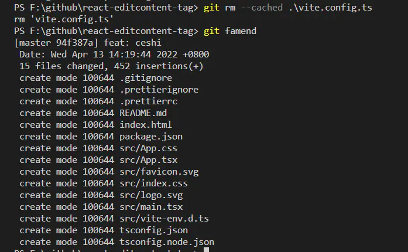
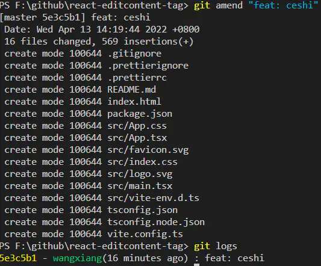
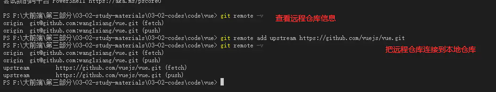
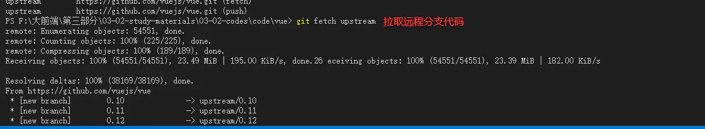

1. 工作区 add 暂存区 commit 本地仓库 push -> <- clone 远程仓库

   拉去指定分支代码 `git clone -b dev https://xxx.git`

2. `git log` 可以显示所有提交过的版本信息 `git reflog`查看所有分支的操作记录(包括已删除的 commit 记录和 reset 的操作)

   ```js
   git reset --hard HEAD~1 // 回退到上一个版本

   git log --pretty=oneline // 使用git log看不到reset的操作

   git reflog // git reflog可以看到reset的操作

   git reset  --hard 9039b57 // 然后就可以重新恢复
   ```

3. git commit --amend

   amend 原意就是"修正"的意思，工作中常用到以下几种

   - 只修正文件，不修正提交信息，如提交的时候发现有文件忘记提交，先添加到暂存区，在使用下面的命令进行修正，之后就可以看到提交中已经有了忘记提交的文件
     `git commit --amend --no-edit`
     
     如果多提交了文件，也可以先通过`git rm --cached <文件名>`，再通过以上命令修正
     

   - 只修正提交信息，如提交时发现写的提交信息不太正确时，可通过以下命令修改
     `git commit --amend -m "feat: ceshi"`
     

   - 修改提交信息和文件
     `git commit --amend`

4. git stash 和 git stash pop

   git stash 暂存当前正在进行的工作， 比如想 pull 最新代码， 又不想加新 commit，或者为了 fix 一个紧急的 bug, 先 stash，使返回到自己上一个 commit， 改完 bug 之后再 stash pop, 继续原来的工作

   git stash save "message" 暂存时加备注 方便查找

   git stash show 默认显示第一个改动 如果显示其他 git stash show "stash@{1}"

   git stash show -p 改动的具体

   git stash apply 恢复第一个存储 恢复其他使用 git stash apply "stash@{1}"

   git stash drop "stash@{1}" 删除第一个存储

   git pop git apply 和 drop 结合体

   git stash clect 清空

5. git merge 合并

   - Fast-forward (-ff)

     当前分支相比于要合并的分支没有额外的提交时，执行 fast-forward 合并，这类合并不会创建新的提交，而是会将我们正在合并的分支上的提交直接合并到当前分支

   - No-fast-forward (--no-ff)

     如果当前分支具有要合并的分支不具备的改变时，会执行 no-fast-forward 合并，会在当前活动分支上创建 merging commit，这个提交的父提交(parent commit) 既指向这个活动分支，也指向我们想要合并的分支

6. 合并冲突

   当合并出现冲突时，git 会展示冲突出现的位置，可以手动修改，再次添加已修改的文件，并提交

7. 变基（Rebasing）

   通过 git merge 可以将一个分支的修改应用到另一个分支，git rebase 可以将一个分支的修改融入到另一个分支

   git rebase 将当前分支的提交复制到指定分支

   如当前在 dev 分支，使用`git rebase master`，可以在 dev 分支上获取 master 上的所有修改

   变基与合并最大的区别：Git 不会尝试确定要保留或不保留哪些文件。使用 rebase 不会遇到合并冲突，而且可以保留漂亮的、线性的 git 历史记录

   使用：如果在开发一个 feature 分支并且 master 分支已经更新过，就可以使用 rebase 在此分支获取所有更新，防止未来出现合并冲突

   [git mere 和 git rebase 小结](https://blog.csdn.net/wh_19910525/article/details/7554489)

   git rebase 与 git merge 对比

   假如有两个分支

   ```bash
          D---E test
         /
    A---B---C---F--- master
   ```

   git merge 后生成

   ```bash
          D--------E
         /          \
    A---B---C---F----G---   test, master
   ```

   git rebase 后生成

   ```bash
   A---B---D---E---C'---F'---   test, master
   ```

   merge 操作会生成一个新的节点，之前的提交分开显示。
   而 rebase 操作不会生成新的节点，是将两个分支融合成一个线性的提交，不会增加新的提交。

8. 交互式变基（interactive Rebase）

   在为提交执行变基之前，我们可以使用交互式变基修改它们，交互式变基在当前开发的分支上以及想要修改某些提交时有用

   在我们正在 rebase 的提交上，可以执行以下 6 个动作：

   - reword：修改提交信息
   - edit：修改此提交
   - squash：将提交融合到前一个提交中
   - fixup：将提交融合到前一个提交中，不保留该提交的日志信息
   - exec：在每个提交上运行我们想要的 rebase 命令
   - drop：移除该提交

9. 重置（Resetting）

   git reset 能让我们不在使用台面上的文件，控制 HEAD 应该指向的位置

   - 软重置

     假如已经 commit 的文件有问题，想撤销提交，但又想保留文件，这时候就可以使用`git reset --soft HEAD~1`将 HEAD 指向前一次提交，通过 git status 可以看到这些文件，然后可以重新修复并提交

   - 硬重置

     有时候并不想保留特定提交引入的修改，Git 应该直接将整体状态重置到特定提交之前的状态，使用`git reset --hard HEAD~1`

10. 还原（Reverting）

    另一种撤销修改的方式是执行 git revert，对特定的提交执行还原操作

    假如某个提交添加了一个引用文件 index.js，但之后发现不再需要这个文件，那么就可以使用`git revert 2175894`还原那个提交，而且也不会修改分支的历史

11. 精选（Cherry-picking）

    当一个特定分支包含当前活动分支所需的某个提交时，可以对那个提交进行 cherry-pick，此时会在当前分支上创建一个新的提交，包含由精选出来的提交所引入的修改

    假如 dev 上 index.js 文件添加一项修改，希望整合到 master，但又不想合并整个 dev 分支，使用`git cherry-pick 2175894`引入特定修改

12. 取回（Fetching）

    fetch 只是单纯下载新的变动

13. 拉取（Pulling）

    `git pull`实际上是两个命令：`git fetch`和`git merge`，拉取最新变动并自动合并到本地分支

    `git pull --rebase`变基式合并

14. Reflog

    每个人都会犯错，但犯错其实没啥！有时候可能感觉你把 git repo 完全搞坏，让你想完全删了了事。

    `git reflog`可以展示已经执行过的所有动作的日志，包括合并、重置、还原，包含你对分支所作的所有修改，如果犯了错，可以通过重置 HEAD 来轻松重做

    假如我们合并 dev 到 master，但是并不需要这次合并，当执行`git reflog`后，可以看到 repo 状态合并前位于 HEAD@{1}，执行`git reset HEAD@{1}`，将 HEAD 重新指向 HEAD@{1}的位置。

15. Tag

    git tag # 在控制台打印出当前仓库的所有标签

    push 单个 tag，命令格式为：git push origin [tagname]
    例如： git push origin v1.0

    git push origin --tags // 所有 tag

    git tag 1.4.10 50435cd 指定 commit 打 tag

    git tag -d xxx // 删除本地 tag

##### 配置别名

```bash
git config --global alias.st status
git config --global alias.br branch
git config --global alias.ci commit
git config --global alias.co checkout
git config --global alias.lg "log --color --graph --pretty=format:'%Cred%h%Creset -%C(yellow)%d%Creset %s %Cgreen(%cr) %C(bold blue)<%an>%Creset' --abbrev-commit"
```

加入 global 表示对修改全局，如果不加，只对当前仓库起作用

配置文件.git/config 中

别名就在`[alias]`后面，要删除别名，直接把对应的行删掉即可

全局 Git 配置文件放在用户主目录下的一个隐藏文件`.gitconfig`中

##### fork 项目--更新

Fork 别人的项目后，如何再同步更新别人的提交

1. 添加远程仓库

   

2. 拉取远程分支代码

   

3. 合并本地代码

   ```bash
   git merge upstream/master
   ```

4. 推送到 fork 的远程分支

   ```bash
   git push origin master
   ```
