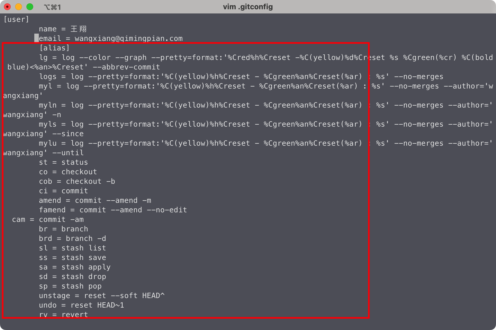

先来一张 git 常用命令速查表。

相信大家在使用 git 的使用过程中，都会遇到一些小问题阻碍你继续下一步，我先说几个，看看你有没有遇到过：

1. 正在写功能但要切分支改 bug;
2. 提交信息手快写错了单词或少提交了代码;
3. 不该提交的东西提交了并推送到远程；
4. 多个提交重复了...😖。

如果有，那你可以跟着我一起看一下，看看我是怎么解决这些问题的。

或者你会说，我只是简简单单、规规矩矩的`git add`、`git commit`、`git push`，一切都很顺利，那么恭喜你，你很棒！虽然没有遇到啥问题，只是简单的`add`、`commit`、`push`，但你不想提高效率增加摸鱼时间吗？🐟如果想，那就请你随我一起看看，我平时一些使用 git 的技巧。如果能从中得到一两点对你有所帮助的，那么花这 10 分钟时间也就算是赚到了；如果没有，那对不起浪费你10分钟时间了，你可以给我来点你的技巧，让我也学习学习。

## 从何说起

我也不太好定位我这篇算是 git 使用指南还是说 git 常见问题记录，所以有点难开头，既然这样，那我就以一个正常的 git 使用（拉代码、提交、推代码）为引导线说起。开始之前先说一下 git 别名配置，因为我有很多简写的操作，怕各位小伙伴看不懂。

### 配置别名

相信大家都有这种感觉，git 命令这么多怎么会记得住，没错第一次记不住很正常，但如果每天敲一遍，一个月下来就是肌肉记忆了，忘都忘不掉。同时我们也可以为常用的命令设置别名，这样不仅好记，而且便于理解（比如我会设置 cherry-pick 为 cp，这样感觉就很形象，copy 一条 git 提交记录）。

别名配置就是一条命令`git config --global alias.a b`，这里 `--global` 表示修改对全局生效，如果不加，只对当前仓库起作用，`a`和`b`指对应的别名和 git 命令，以下是我的一些别名配置：

```bash
# 配置别名 将commit简写为ci 提交git commit可简写为git ci
git config --global alias.ci commit
git config --global alias.br branch
# 很强大的历史记录 建议试试
git config --global alias.lg "log --color --graph --pretty=format:'%Cred%h%Creset -%C(yellow)%d%Creset %s %Cgreen(%cr) %C(bold blue)<%an>%Creset' --abbrev-commit"
```

这篇文章比较用的多的，像：`ci`代替`commit`、`br`代替`branch`、`co`代替`checkout`等。

这些配置都会写入全局 Git 配置文件（存储在用户主目录下的一个隐藏文件.gitconfig）中，我们也可以直接修改这个文件，更加直接。改完这些别名配置之后，你会发现 git 使用变得极度丝滑，妈妈最也不用担心我敲不出 git 命令了 😄。

**可能有的小伙伴会问：那我换电脑了怎么办？**

这还不简单，找到 git 的全局配置文件，找到后查看如下所示，也可以控制台直接一条命令`git config --global --edit`显示全局配置：



然后把 alias 对应的部分（图中框起来的部分）复制过去就行，新电脑照常使用。因为我之前一直是 Windows，最近才换了 Mac，所以我是手敲命令的重度爱好者，不喜欢用工具。但如果用 Mac 的话，也可以使用 on-my-zsh，不过我已经用惯了我自己的这一套，用起来感觉很舒服。

> 安装 oh-my-zsh 后默认会打开 git 插件，它会在命令行下光标前显示当前分支名称，还可以实现自动补全，输入 git re 按 tab 会自提示可以选择命令，再按 tab 就可以选择命令，方便命令输入。

接下来，我们开始今天的正文吧。

## 流程一：拉取代码

最为一个新人，你到公司的第一天，领导让你拉项目先跑起来，于是你就

```bash
git clone https://xxx.com/fe/xxx.git
```

一顿操作，代码运行起来了，这时候领导又说，先跟着谁谁改几天 bug🐛，他用的`feat-table`这个分支，于是你就

```bash
# 新建分支
git co -b feat-table
# 拉取代码
git pull origin feat-table
```

这时候，第一个优化操作就来了，上面两个命令可以用下面这一个命令代替：

```bash
# 创建分支并从远程分支拉取代码
git co -b feat-table origin/table
```

接着我们开始写代码，进入流程二。

## 流程二：提交代码前后会出现的问题

这一部分内容较多，请耐心观看

此时，我们开心的写着代码，突然线上出现紧急 bug，其他人都很忙，就你个新来的最闲，领导说让你来改。你一想：”领导给我机会，那我得表现表现，可是我本地的 bug 还没改完，写一半也不好提交啊，肿么办？“。这时候第二个操作 `stash` 就来了

```bash
# 先把代码储存在本地缓存 ss是stash save的简写
git ss "未改完的bug，等下再改"
# 切换master 重新拉一个新分支 co是checkout的简写
git co master
git co -b fix-xxx
```

### stash 更多操作

```bash
git stash # 暂存当前正在进行的工作，比如想 pull 最新代码，又不想加新 commit，或者为了 fix 一个紧急的 bug，先 stash，使返回到自己上一个 commit，改完 bug 之后再 stash pop, 继续原来的工作
git stash save "message" # 暂存时加备注 方便查找
git stash show # 默认显示第一个改动 如果显示其他 git stash show "stash@{1}"
git stash show -p # 改动的具体内容
git stash apply # 恢复第一个存储 恢复其他使用 git stash apply "stash@{1}"
git stash drop "stash@{2}" # 删除stash@{2}存储
git pop # stash apply 和 stash drop 结合体
git stash clear # 清空stash
```

接着，当你改完这个 bug 之后，提交代码

```bash
# git add .
# 提交当前所有修改文件
git ci -am "fix: 修复线上紧急buh"
```

因为你手滑 👋，把`bug`打成了`buh`，这不能推到远程吧，不然让其他人看到显得你不专业一样，这时候你会想：“我要是能把提交信息修改一下就好了”。这时候**第三个操作 amend**就浮现在你眼前

```bash
# git commit --amend -m "" 将上次提交的提交信息改为 -m 后的信息
git amend "fix: 修复线上紧急bug"
# 推代码
git push
```

当然，如果你提交后发现少改了一个文件，这时候也可以使用`amend`来补救一下，我将这里简写为`amend -f`（修正文件），-f 指 file 文件，这样一看到就挺好理解的：

```bash
# 将未提交的代码 添加到暂存区
git add .
# git ci --amend --no-edit
git amend -f
git push
```

### amend 更多操作

amend 直译过来就是"修正"的意思：

- 只修正文件，不修正提交信息，如提交的时候发现有文件忘记提交，先添加到暂存区，在使用下面的命令进行修正，之后就可以看到提交中已经有了忘记提交的文件

  ```bash
  git ci --amend --no-edit
  ```

  如果多提交了文件，也可以先通过`git rm --cached <文件名>`，再通过以上命令修正

- 只修正提交信息，如提交时发现写的提交信息不太正确时，可通过以下命令修改

  ```bash
  git ci --amend -m "feat: xxx"
  ```

- 修改提交信息和文件

  ```bash
  git ci --amend
  ```

这时候，你的 bug 已经修复完，并且代码已经推到远程分支上。但是部署完，找测试看了一下，发现这个 bug 是修复好了，但是又导致出现了另一个 bug，还好你给测试买了一杯奶茶，让她不要在大群里说。然后你立马修复，又得重新提交，可是这要是提交上去，领导 review 时看到你的提交记录，"怎么修改了这里 💢"，这可怎么办？

这时候教你**第四个操作 reset**：

```bash
# 将 HEAD 指向前一次提交 即回退上一次提交到工作区
git reset HEAD~1
# 然后修改代码 重新添加到工作区提交
git ci -am "fix: 修复线上紧急bug"
```

此时，再往远程推送代码时，因为你本地的提交记录和远程提交记录已经不同了，需要使用`git push -f`操作将远程的提交覆盖掉，直接 push 的话因为与远程提交不一致，没法推到远程，所以使用`git push -f`强制将本地提交同步到远程分支。


**慎用 push -f**

### reset 更多操作

git reset 通过控制 HEAD 应该指向的位置，来达到重置的目的。

- 软重置 soft

  假如已经提交的文件有问题，想撤销提交，但又想保留文件，这时候就可以使用软重置将 HEAD 指向前一次提交，然后可以重新修复并提交；
  也可以使用 commitId 退回到某次指定的提交。

  ```bash
  # 撤销上一次提交 HEAD～2/3 撤销前两次/三次提交
  git reset --soft HEAD~1`
  # 退回到某次提交
  git reset commitId
  ```

- 硬重置 hard

  有时候并不想保留特定提交引入的修改，Git 应该直接将整体状态重置到特定提交之前的状态，使用`git reset --hard HEAD~1`。

这时候代码已经推到远程分支，需要你提一个 mr 给项目负责人，然后他去合并代码，如果他直接 merge 的话，master 分支会产生一条额外的合并记录`Merge branch 'xxx' into 'master'`。
如果换我来合并的话，我会选择教你**第五个操作 cherry-pick**：

```bash
# 将制定提交拣选到master分支
git cp commitId
```

> cherry-pick 可以帮助我们实现代码迁移，但是需要提交功能明确，不要参杂太多的东西。cp 是 cherry-pick 的简写，copy 复制提交，是不是很好记 😄。

到这里，一次 bug 的修复过程就算完成了。接着用`checkout`切回自己的分支继续进行 bug 修复:

```bash
# co是checkout的简写
git co feat-table
```

假设你的分支名称很长：`feat-table-wx-230507`，你要切回来的话还得复制分支名称，然后再切，不妨试试这**第六个操作 co -**

> git checkout - 快速切回上一个分支

```bash
git co -
```

然后我们将刚刚改 bug 的分支删除：

```bash
# -d 只有分支合并并推送后才可以删除
# -D 是 --delete --force 的别名，无论任何情况下都可以删除
git br -D fix-xxx
```

如果想要删除远程分支，则可以直接从 gitlab 的分支中删除，或者我们可以通过**第八个操作 push origin --delete**

> git push origin --delete xxx 删除远程 xxx 分支

```bash
# 删除刚刚的修改bug分支
git push origin --delete fix-xxx
```

### 更多分支删除操作

```bash
# 删除分支名包含fix的分支
git br | grep 'fix' | xargs git br -d
# 删除除feat-table外所有的分支
git br | xargs git br -d feat-table
```

接着，你先用`git stash pop`把`feat-table`分支上储藏的代码先弹出来，接着一顿操作，完了推送代码到远程，当你执行 git push 的时候，发现远程仓库有修改，git 会提示你先执行 git pull 拉代码时，只要有冲突提示你修改，然后改完之后，git 会帮你自动合并生成一次提交，类似这样`Merge branch "fix-table' of https://git.qmpoa.com/fe/qtable_docs into fix-table`，提交很丑，那你怎么规避它呢？

这时候就轮到**第九个操作 rebase**登场：

```bash
git pull --rebase
```

这样拉取远程代码时，如果有冲突时，你可以这样做：

- 解决完冲突后，git add .将代码添加到暂存区；
- 通过 git rebase --continue 继续执行 rebase 操作；
- 如果没有冲突后，就可以 push 到远程了。


### rebase 更多操作

```bash
git rebase --continue # 继续rebase操作
git rebase --skip # 跳过此补丁操作
git rebase --abort # 直接退出rebase
```

#### 变基（Rebasing）

通过 git merge 可以将一个分支的修改应用到另一个分支，git rebase 可以将一个分支的修改融入到另一个分支。

git rebase 将当前分支的提交复制到指定分支：如当前在 dev 分支，使用`git rebase master`，可以在 dev 分支上获取 master 上的所有修改。

rebase 与 merge 最大的区别：Git 不会尝试确定要保留或不保留哪些文件。使用 rebase 不会遇到合并冲突，而且可以保留漂亮的、线性的 git 历史记录
[git mere 和 git rebase 小结](https://blog.csdn.net/wh_19910525/article/details/7554489)

使用：如果在开发一个 feature 分支并且 master 分支已经更新过，就可以使用 rebase 在此分支获取所有更新，防止未来出现合并冲突。

git rebase 与 git merge 对比：

假如有两个分支

```bash
       D---E test
      /
 A---B---C---F--- master
```

git merge 后生成：

```bash
       D--------E
      /          \
 A---B---C---F----G---   test, master
```

执行 merge 后，提交点的顺序都和提交的时间顺序相同，即 master 的提交在 dev 之后。
不同于 rebase 的是，merge 如果不选择 fast-forward（快速合并）的情况下，会产生一条额外的合并记录 Merge branch 'xxx' into 'xxx'。

如果遇到冲突时 merge 只需要解决一次冲突即可，简单粗暴。

git rebase 后生成：

```bash
A---B---D---E---C'---F'---   test, master
```

执行 rebase 后，提交顺序变成被 rebase 的分支（master）所有提交都在前面，进行 rebase 的分支（test）提交都在被 rebase 的分支之后，在同一分支上的提交点仍按时间顺序排列。

如果遇到冲突时 rebase 需要依次解决每次的冲突，才可以提交，比较麻烦，所以如果修改太多的情况下还是乖乖用 merge 吧。

假如你有功能分支 feat-xxx，如果 feat-xxx 需要同步 master 代码时，使用 git rebase master；而 feat-xxx 要往 master 合并时，使用 git merge feat-xxx。所以如果不想合并时冲突太多，养成好习惯，每天下班前用你的功能分支 rebase 一下 master，到时候合并的时候就不会有那么多冲突。

#### 交互式变基（interactive Rebase）

在为提交执行变基之前，我们可以使用交互式变基修改它们，交互式变基在当前开发的分支上以及想要修改某些提交时有用

在我们正在 rebase 的提交上，可以执行以下 6 个动作：

- reword：修改提交信息
- edit：修改此提交
- squash：将提交融合到前一个提交中
- fixup：将提交融合到前一个提交中，不保留该提交的日志信息
- exec：在每个提交上运行我们想要的 rebase 命令
- drop：移除该提交

利用交互式变基，我们可以实现很多操作，比如**合并多个提交到同一个提交**


- 通过 log 我们可以看到，有三次相同的提交，这时候我们可以使用`git rebase -i HEAD~3`来合并这三个提交；
- 操作和 vim 的操作一致，按键盘`i`键开始编辑，将需要合并的提交前的`pick`改为`s`（合并提交），然后通过`wq`来保存；

  

- 接着会让你选择使用哪个提交信息，默认第一个，如果不想的话，直接编辑修改就行；
- 然后再通过 log 看，就会只有一个提交了。

到了需要上线的时候，领导说你改的这几个 bug 中有一个就是“设计如此”，不需要发到线上了，让你把提交的代码给撤销了，愁啊？这怎么撤销了？相信绝大多数人都会把对应提交的代码注释掉，然后重新提交一次，那么**为何不试试 revert 呢！**

> 名如其意，对特定的提交执行还原操作。
> 假如某个提交添加了一个引用文件 index.js，但之后发现不再需要这个文件，那么就可以使用`git revert commitId`还原那个提交，然后 push 到远程即可。

## 到此结束

上面就是我要讲的全部内容，这里我再加几个我认为有必要的命令

```bash
lg = log --color --graph --pretty=format:'%Cred%h%Creset -%C(yellow)%d%Creset %s %Cgreen(%cr) %C(bold blue)<%an>%Creset' --abbrev-commit
logs = log --pretty=format:'%C(yellow)%h%Creset - %Cgreen%an%Creset(%ar) : %s' --no-merges
# 仅看自己的提交
myl = log --pretty=format:'%C(yellow)%h%Creset - %Cgreen%an%Creset(%ar) : %s' --no-merges --author='wangxiang'
# -n 10 代表仅看自己的10个提交
myln = log --pretty=format:'%C(yellow)%h%Creset - %Cgreen%an%Creset(%ar) : %s' --no-merges --author='wangxiang' -n
# --since 从哪天开始 代表仅看自己从哪天开始的提交
myls = log --pretty=format:'%C(yellow)%h%Creset - %Cgreen%an%Creset(%ar) : %s' --no-merges --author='wangxiang' --since
# --until 以哪天结束 代表仅看自己以哪天结束的提交
mylu = log --pretty=format:'%C(yellow)%h%Creset - %Cgreen%an%Creset(%ar) : %s' --no-merges --author='wangxiang' --until
```


你要是问，这有什么用呢？哈哈，我是在每次月底搞绩效的时候，需要填本月工作内容，然后我就

```bash
git myls 2023-04-01 > a.text
```

把本月提交导出到文件里，然后直接复制就行，是不是很棒 😄！前提是你的每个提交应该清晰且具体。

## 总结

本文从一个正常的 git 使用（拉代码、提交、推代码）说起，将其中可以优化或者省略的操作一一提出来，相信这也是大部分人工作中经常用到的一个流程，那么你可以回忆下你的流程，然后读文本文，看看你平时的流程有没有哪些地方可以改进，如果有，我很开心我的这篇文章有帮助到你；如果没有或者说你做的比我更好的地方，欢迎在评论区留下你的足迹，我很喜欢学习更好的知识。
