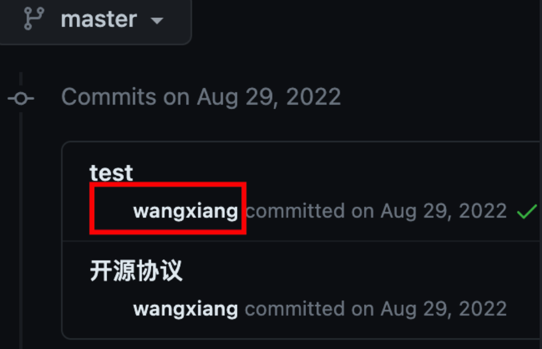
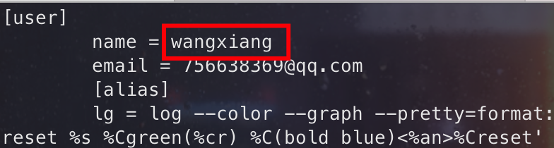
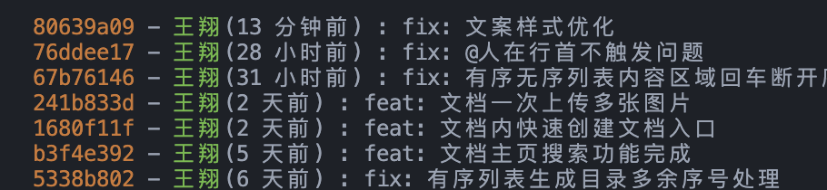
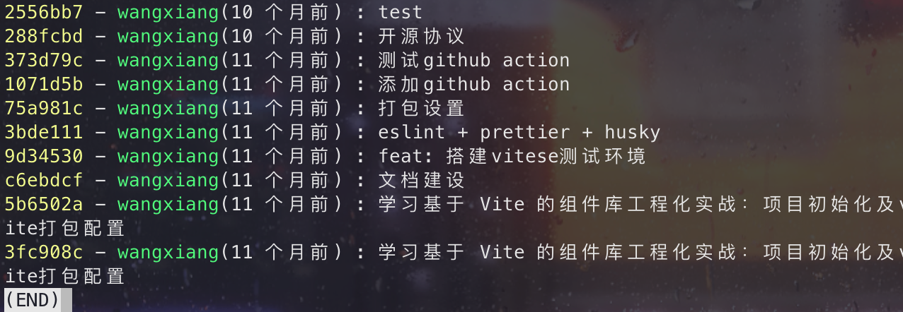
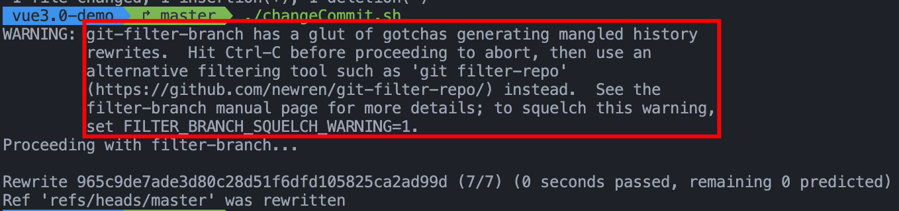
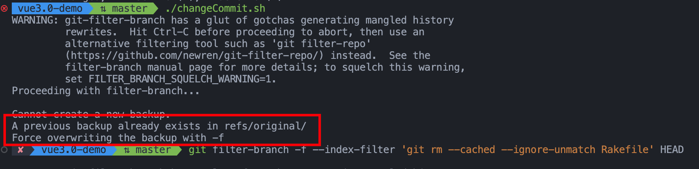
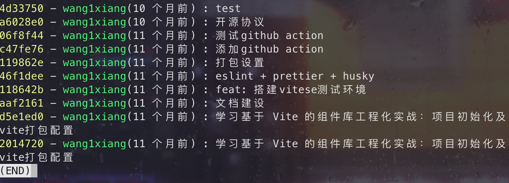

## github 的头像不显示了？



如题，我的 github commit 记录里面头像不显示了。好奇怪，难道是我网络有问题吗？可是我已经开了最高速的翻墙了。定睛一看 👀，原来是 github 的用户名不对中间少了个`1`。

可恶，因为注册 github 比较晚，想注册的名字都被注册了，所以只能委屈在中间加个`1`。

不知道还有人遇过这个问题没，github 的 commit 记录用户名不对，导致头像也不能正确显示出来，提交了很多，却一直没有 contributions。

## 产生原因

通过`git config --global -l`查看全局配置，不知道什么时候被我改成了`wangxiang`，和 github 的用户名没对应上，所以导致提交到 github 上的 commit 记录都出现了问题。



大家都知道，git 的配置文件可以是全局和当前项目，如果当前项目没有配置个人信息，那提交代码时就会拿全局配置的信息。

```bash
# 配置全局级别的config
git config --global user.name '注册名'
git config --global user.email '注册邮箱'
```

```bash
# 配置项目级别的config
git config --local user.name '注册名'
git config --local user.email '注册邮箱'
```

## 如何解决

如果读过我这篇文章[add、commit...👀git 就会这几个操作吗？进来学点新姿势～](https://juejin.cn/post/7228869305549537336#heading-5)的小伙伴，应该都知道可以使用`amend`来修改提交信息（PS：如果没看过建议学一波，干货满满 👍）。

之前使用`amend`仅仅只是对提交信息和文件进行修改，而这里，我们就可以用它来对提交**作者信息进行修改**，命令格式如下：

```bash
git commit --amend --author="{username} <{email}>" --no-edit
```

比如我这里提交到公司 gitlab 上的代码，提交信息显示的名字与之前的不统一：


这时候就可以用上述命令来修改，比如修改为名称：`王翔`、邮箱：`wangxiang@qimingpian.com`：

```bash
git commit --amend --author="王翔 <wangxiang@qimingpian.com>" --no-edit
```



这样就成功修改了提交记录的提交人信息。

如果已经修改了 git config 中的用户名和邮箱，也可以使用：

```bash
git commit --amend --reset-author --no-edit
```

**注意：如果已经提交到远程，修改完成后，需要使用`git push -f`。**

但`amend`只支持**修改最近一次的提交**，要是像我一样之前的提交名字都错了，那要怎么改呢？🤔

### 使用 filter-branch 批量修改

`filter-branch`是什么呢？这里我们可以通过[官方文档](https://git-scm.com/book/zh/v2/Git-%E5%B7%A5%E5%85%B7-%E9%87%8D%E5%86%99%E5%8E%86%E5%8F%B2#_%E6%A0%B8%E6%AD%A6%E5%99%A8%E7%BA%A7%E9%80%89%E9%A1%B9filter_branch)知道，它主要用来**批量修改 git 历史记录**，这不正合我意嘛！

我们看下`filter-branch`可以用来做什么：

1. 从每一个提交中移除一个文件；
2. 全局修改邮箱地址；
3. 使一个子目录做为新的根目录。

我这里用官方提供的代码来做个例子，比如我这个项目的提交名字和邮箱和 github 对不上，通过[git logs](https://juejin.cn/post/7228869305549537336#heading-11)查看提交记录:



接着使用`--commit-filter`批量修改，步骤如下：

1. 在项目根目录下创建`changeCommit.sh`：

   ```bash
     # changeCommit.sh
     git filter-branch --commit-filter '
       if [ "$GIT_AUTHOR_EMAIL" = "wangxiang@qimingpian.com" ];
       then
               GIT_AUTHOR_NAME="wang1xiang";
               GIT_AUTHOR_EMAIL="756638369@qq.com";
               git commit-tree "$@";
       else
               git commit-tree "$@";
       fi' HEAD
   ```

   这个脚本很简单，只要符合`"$GIT_AUTHOR_EMAIL" = "wangxiang@qimingpian.com"`的提交，就把`GIT_AUTHOR_NAME`改为`wang1xiang`，`GIT_AUTHOR_EMAIL`改为`756638369@qq.com`。

2. 执行此脚本，过程略微有点慢

   .

   执行完成后，展示成上图这样说明执行成功，

   如果执行时提示`A previous backup already exists in refs/original/`，说明已经执行过一次，使用以下命令解决：

   ```bash
   git filter-branch -f --index-filter 'git rm --cached --ignore-unmatch Rakefile' HEAD

   ```

   

3. 执行完成后，通过[git logs](https://juejin.cn/post/7228869305549537336#heading-11)再次查看：

   

最后，在`git push -f`就大功告成了 🎉！，再看下 github 的 commit 历史，不错，头像都出来了。


## 最后

本文主要讲了修改 git 提交记录中用户名和邮箱的两种方式，这可能是很多人都不会接触到的东西，所以我才会称它为“奇淫技巧”，但在有些情况下（比如我遇到的问题）还是挺有效的。如果觉得现在对你没用的话，先收藏，没准什么时候就用上了。

以上就是本文的全部内容，希望这篇文章对你有所帮助，欢迎点赞和收藏 🙏，如果发现有什么错误或者更好的解决方案及建议，欢迎随时联系。
