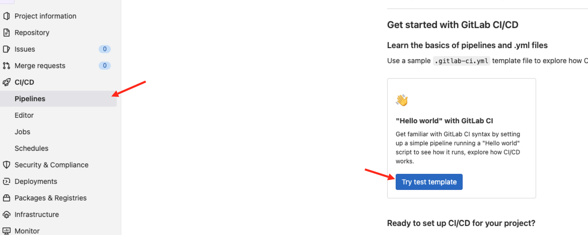
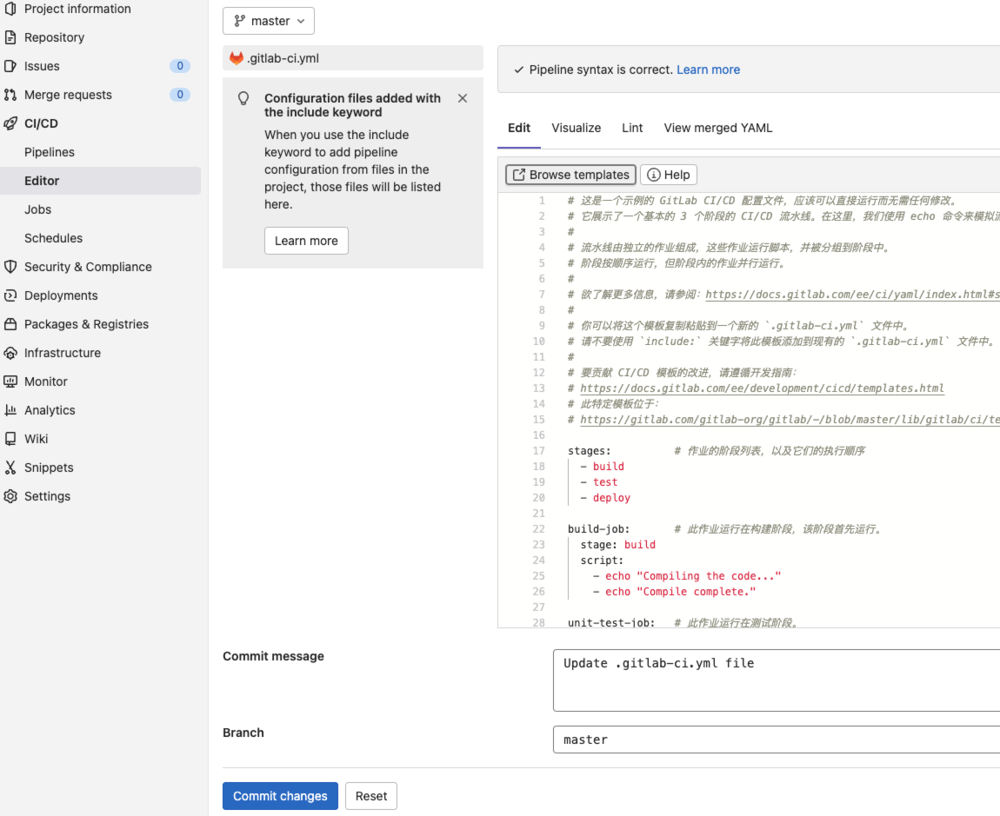
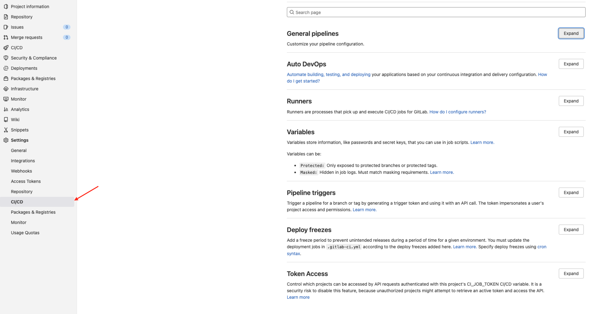
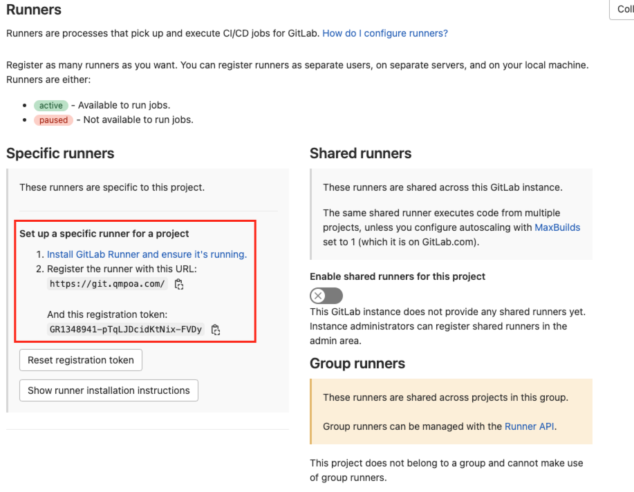

GitLab CI/CD 由一个名为 .gitlab-ci.yml 的文件进行配置，该文件位于仓库的根目录下。文件中指定的脚本由 GitLab Runner 执行。

## 项目 CI/CD 配置







### 执行器 Runners 配置

Runners 是 gitlab 用于执行 CI/CD 的进程，有多种：本项目、项目组和全局的。

#### 如何配置 Runners




[语法](https://git.qmpoa.com/help/ci/yaml/index)

## .gitlab-ci.yml 文件编写

```yml
variables: # 定义全局变量 
    PROJECT_IMAGES: "irweb:$CI_COMMIT_TAG" # gitlab系统变量，获取提交tag的信息
stages:  # 声明阶段
  - build
  - docker
  - test
  - deploy

yarn-build-job:
  stage: build  # 阶段标签
  image: node:18.0.0 # 基于docker镜像
  tags: # 此处为选择gitlab-runner服务的标签
    - 203web
  script: # 执行脚本命令
    - echo "开始构建打包"
    - yarn install
    - yarn build
    - echo "构建完成"
  artifacts: # 使用artifacts关键词可以将当前作业的一些文件存储起来，以便后边job使用
    paths:
      - build/ # 此处我们缓存了yarn build打包生成的文件，以便后续docker build的时候使用
  only: # 此处定义只有git push tag的时候才会触发此job
    - tags

docker-build-job:
  stage: docker
  tags:
    - 203web
  script:
    - echo "开始docker build"
    - echo $PROJECT_IMAGES
    - docker build -t $PROJECT_IMAGES .
    - echo "构建完成"
  needs: # 此处声明依赖于yarn-build-job，确保不会找不到build文件夹
    - job: yarn-build-job
      artifacts: true
  only:
    - tags

lint-test-job:
  stage: test
  tags:
    - 203web
  script:
    - echo "查看镜像"
    - docker images
  only:
    - tags

deploy-job:
  stage: deploy
  tags:
    - 203web
  script:
    - echo "开始部署"
    - echo "Application successfully deployed." # 此处替换为docker run的执行命令即可，在此处可以优化，例如 docker stop容器，然后docker rm删除容器，然后启动本次跟新的容器    - echo "部署成功"
  rules: # 跟only一个意思
    - if: $CI_COMMIT_TAG
```
