之前有一篇[队友升职，被迫解锁 Jenkins（所以，前端需要学习 Jenkins 吗？🤔）](https://juejin.cn/post/7349561234931515433)如何使用 Jenkins 来部署项目，看评论有好几个人都说怎么不用 GitLab CI，刚好有一个新的 Node 项目完成需要部署，尝试用 GitLab CI + docker 的方式去部署，写了这篇文章，希望对大家有帮助。

## 项目 CI/CD 配置

首先点击 CI/CD，创建一个新的 GitLab CI


GitLab CI 是通过名为 `.gitlab-ci.yml` 的文件进行配置，该文件位于仓库的根目录下。


新建的 GitLab CI 配置文件如下：

```yml
# 这是一个示例的 GitLab CI/CD 配置文件，应该可以直接运行而无需任何修改。
# 它展示了一个基本的 3 个阶段的 CI/CD 流水线。在这里，我们使用 echo 命令来模拟流水线的执行，而不是真正的测试或脚本。
#
# 流水线由独立的作业组成，这些作业运行脚本，并被分组到阶段中。
# 阶段按顺序运行，但阶段内的作业并行运行。
#
# 欲了解更多信息，请参阅：https://docs.gitlab.com/ee/ci/yaml/index.html#stages
#
# 你可以将这个模板复制粘贴到一个新的 `.gitlab-ci.yml` 文件中。
# 请不要使用 `include:` 关键字将此模板添加到现有的 `.gitlab-ci.yml` 文件中。
#
# 要贡献 CI/CD 模板的改进，请遵循开发指南：
# https://docs.gitlab.com/ee/development/cicd/templates.html
# 此特定模板位于：
# https://gitlab.com/gitlab-org/gitlab/-/blob/master/lib/gitlab/ci/templates/Getting-Started.gitlab-ci.yml

stages: # 作业的阶段列表，以及它们的执行顺序
  - build
  - test
  - deploy

build-job: # 此作业运行在构建阶段，该阶段首先运行。
  stage: build
  script:
    - echo "Compiling the code..."
    - echo "Compile complete."

unit-test-job: # 此作业运行在测试阶段。
  stage: test # 仅当构建阶段的作业成功完成时，它才会开始运行。
  script:
    - echo "Running unit tests... This will take about 60 seconds."
    - sleep 60
    - echo "Code coverage is 90%"

lint-test-job: # 此作业也在测试阶段运行。
  stage: test # 它可以与 unit-test-job 同时运行（并行）。
  script:
    - echo "Linting code... This will take about 10 seconds."
    - sleep 10
    - echo "No lint issues found."

deploy-job: # 此作业在部署阶段运行。
  stage: deploy # 仅当测试阶段中的 *所有* 作业成功完成时，它才会运行。
  script:
    - echo "Deploying application..."
    - echo "Application successfully deployed."
```

### 阶段

脚本中使用 `stages` 字段定义了三个阶段：build、test 和 deploy，按照由上到下的顺序执行，和 Jenkins 中的 stages 一样。

### 作业

脚本包含四个作业：build-job、unit-test-job、lint-test-job 和 deploy-job，作业中通过 `stage` 字段来定义当前作业属于哪个阶段，类似于 Jenkins 中的 steps。

其中 unit-test-job、lint-test-job 属于同一个阶段 test。

作业中通过 `script` 定义执行脚本。

### 流水线执行

提交 `.gitlab-ci.yml` 的修改即可触发 CI 流程，此时还未启动任何 Runner，所有的作业都会被标记为等待状态。


那么 Gitlab Runner 又是什么呢？

### Gitlab Runner

我们可以简单的把 Gitlab Runner 理解为 Gitlab 的一个插件，它负责执行 CI 流程，所以需要线安装它。

Gitlab Runner 可以部署在任何的服务器上，类似于 Jenkins master 是以容器方式运行，而 agent 是可以直接跑在宿主机上的。


#### 安装 Gitlab Runner

这里我们直接使用 docker 安装。

```bash
# 创建一个文件夹用于后续挂载 runner 的配置文件
mkdir -p /home/gitlab-runner/config
# 拉取 gitlab-runner 镜像，尽量与 gitlab 版本保持一致
docker pull gitlab/gitlab-runner:v16.8.0
# 查看 docker 镜像列表
docker images
# 运行 gitlab-runner 镜像
docker run -itd --restart always --name gitlab-runner \
-v /home/gitlab-runner/config:/etc/gitlab-runner \
-v /var/run/docker.sock:/var/run/docker.sock \
gitlab/gitlab-runner:v16.8.0
# 查看运行的镜像
docker ps | grep gitlab
```

查看 docker 镜像，出现以下则说明 gitlab-runner 镜像运行成功。

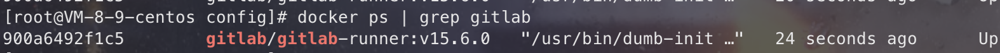

#### 注册 Gitlab Runner

gitlab-runner 容器启动完成后，还需要注册 gitlab-runner 才可使用。

```bash
# 进入容器
docker exec -it gitlab-runner-docker sh
# 查看信息
gitlab-runner -v
```

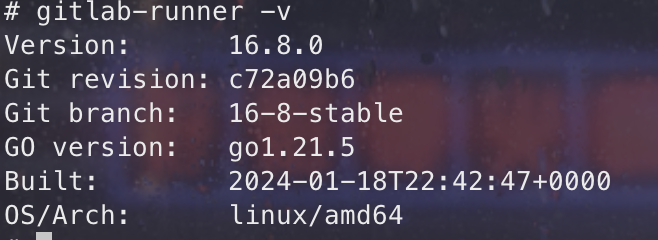

开始注册：

```bash
gitlab-runner register
```

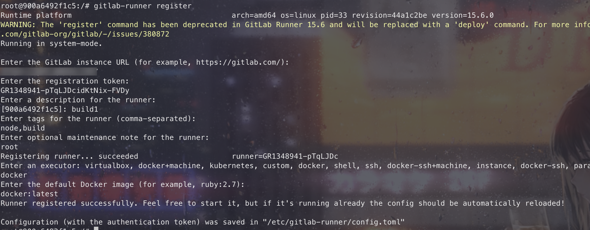

我们按照步骤：

1. 输入 GitLab 地址和 token

   直接从 CI/CD 页面，直接复制即可

   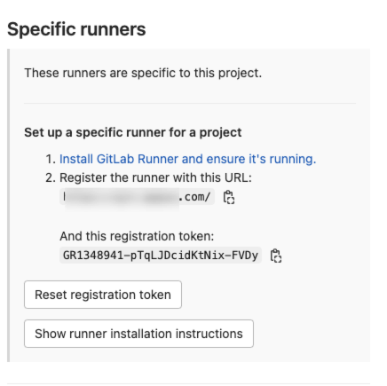

2. 输入 Runner 的描述信息

   描述信息，也是 runner 的名称，此处填 `build`，也可不填，可以在 Gitlab 界面显示进行修改

3. 输入 Tag

   可不填，直接在 Gitlab 界面修改，可以用于指定在构建规定的 tag 时触发 CI，建议**不要为纯数字，否则构建会报错**

4. 输入用户权限备注

   可不填

5. 选择 Runner-Executor，建议 `docker`
6. 选择 Runner-Executor-Version，建议 `docker:latest`

   `node:16.19-slim`，小版本，能省很多内存
   根据提示填写 docker 执行器版本，后续作业以哪个镜像版本来运行 job（可在.gitlab-ci.yml 中修改需要的 image）

所有步骤执行完会生成一个 Runner 的配置文件，默认位置是 `/etc/gitlab-runner/config.toml`，由于我们创建 Runner 容器时挂载了目录，该文件会同步出现在我们创建的本地挂载目录 `/home/gitlab-runner/config/config.toml` 中。

#### 执行器运行结果

```bash
gitlab-runner list
```

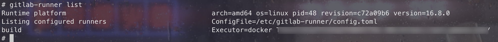

Runner 更多命令：

```bash
gitlab-runner register   # 交互式注册 Runner
gitlab-runner list       # 所有的 Runner 列表
gitlab-runner verify     # 检查注册的 Runner 是否可以连接
gitlab-runner unregister # 取消注册 Runner
gitlab-runner unregister --name test-runner
```

此时可以返回仓库查看

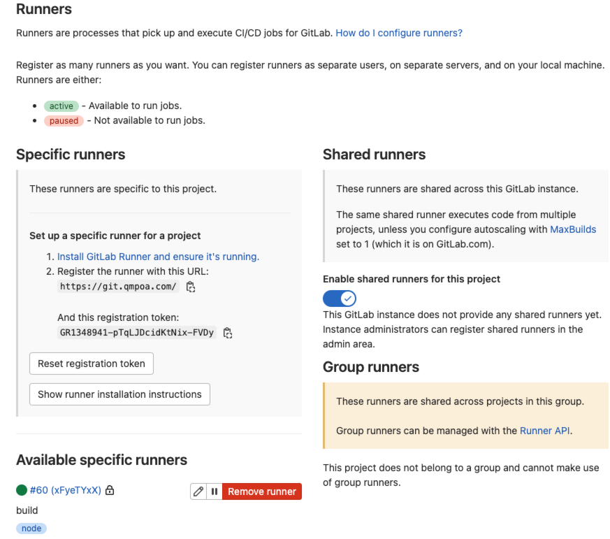

- 页面新增一条可用的指定 Runner
- 如果指示灯是绿色则表示正常

### 再次测试流水线

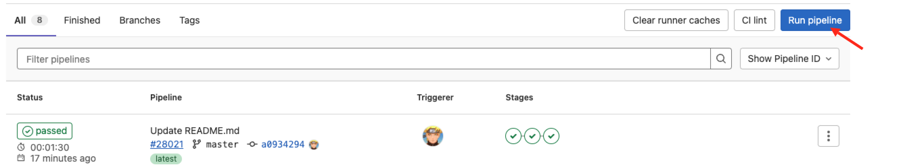

点击 `Run pipeline` 开启一个新的流水线任务：

等待执行完成后，如下所示：

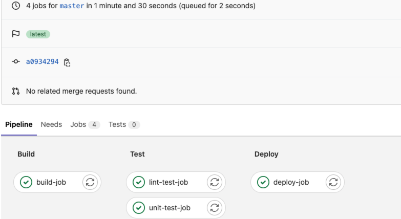

也可以点击进去查看详细信息，如我们的输出信息：

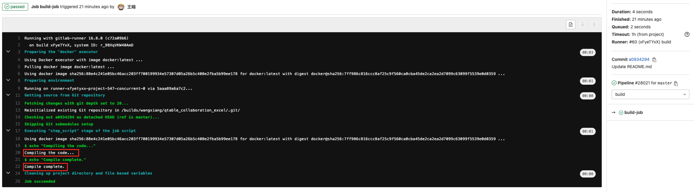

### 遇到的问题

1. 使用 docker 拉取镜像的时候，报错 `missing signature key`

   ```bash
   yum install docker-ce -y
   # 重启docker
   systemctl restart docker
   ```

2. gitlab-runner 连接成功，但作业一直是 `pending` 状态

   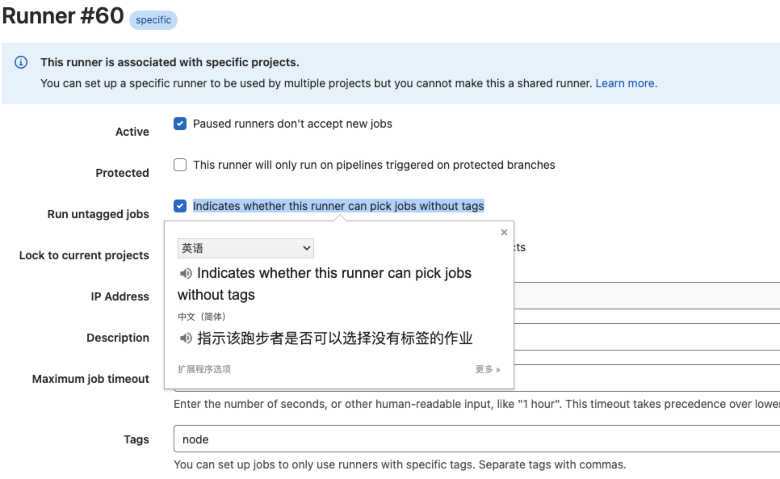

   `Run untagged jobs` 项未勾选，表示此 runner 不能执行没有指定 tag 的 pipeline，勾选上即可

3. 安装了低版本的 gitlab-runner

   ```bash
   # 删除容器
   docker stop <container_id_or_name>
   docker rm <container_id_or_name>
   # 删除镜像
   docker rmi <image_id_or_repository:tag>
   # 重新安装
   ```

## Docker

兄弟们，我终于弄懂 Docker 了 🎉，简直太好用了，对造出 Docker 的大神简直佩服的五体投地。

一直听别人说“Docker 好用”，“Docker 就是个虚拟机”，比如：后端项目部署时不仅包含自己的代码，还需要 mysql、redis、nginx 等服务，还有基础的 JDK 等等，这些东西还需要安装步骤、环境变量的设置等。

如果需要部署多台机器时，全都是重复工作，增加工作量的同时也增加了风险，万一哪一步漏掉了，服务就跑不起来了。

而 Docker 的出现就是为了解决这个问题，首先把上述说的一系列服务封装成成一个镜像，镜像运行起来就是一个容器（容器相当于一个虚拟机，并且帮你安装好了上述的基础服务），可以一次运行多个容器，所以它的 logo 是这样式的。


并且 Docker 提供了端口和文件映射，我们只需要把容器的端口映射到宿主机，就可以访问到容器内的服务了。

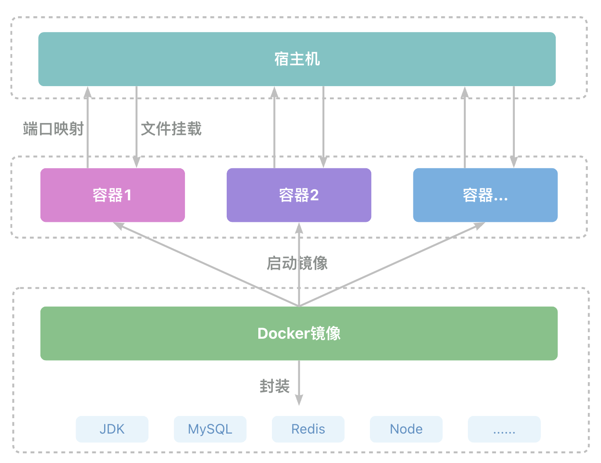

没上手前感觉 Docker 离我好远，“这是个啥呀，我不会所以我不用”；用了一次，呀！真香！

安装 Docker 环境就不说了，网上一搜一大把，**强烈推荐：安装桌面端 Docker**。

[👇 下载地址](https://www.docker.com/products/docker-desktop/)

### 重要概念

如果已经安装完 Docker，首先拉取一个镜像。

```bash
docker pull nginx
```

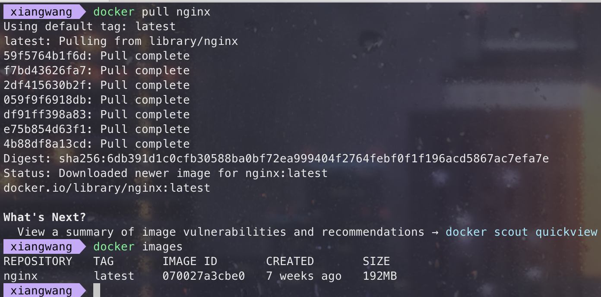

或者直接在桌面端 Docker 中搜索，并拉取：

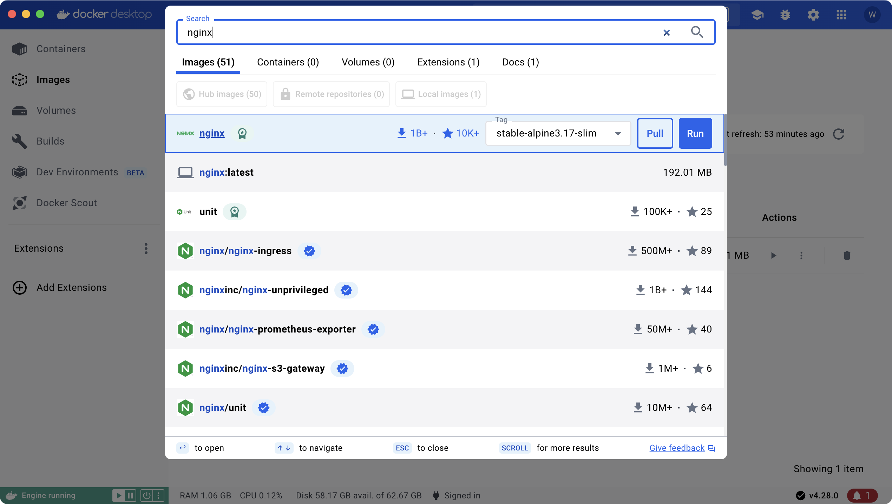

接着看几个 Docker 中经常会提到的名词，了解这几个名词的关系，有助于我们更好的掌握 Docker。

哦，你还不懂 Docker 命令，没事，直接在终端输入 docker，提示就出来了。

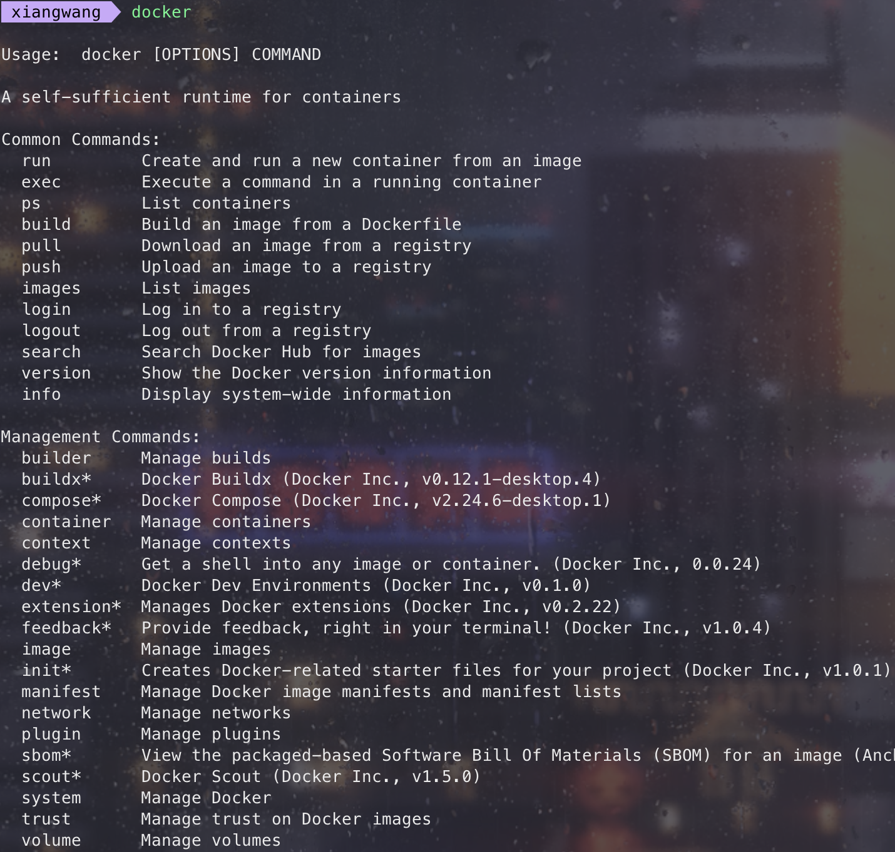

#### images 镜像

images 就是所有镜像的列表，可以通过 pull 拉取更多镜像，可以通过 `docker images` 命令查看：

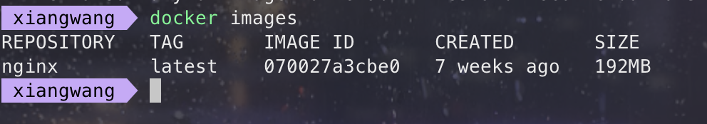

或者直接在桌面端看：

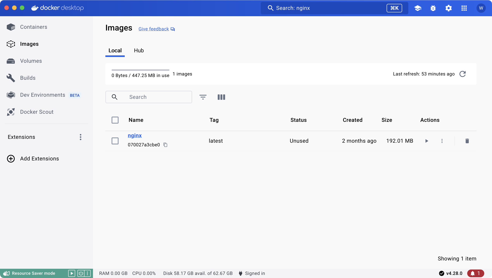

#### containers 容器

containers 就是镜像跑起来的容器，**容器是镜像的一个实例，一个镜像可以跑多个容器**

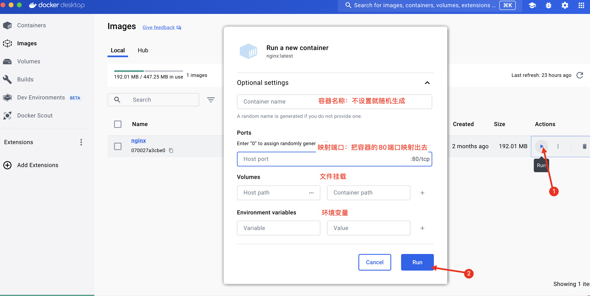

点击 `Run` 就弹出一个表单，填写如下内容：

- 容器名称：不填写，随机生成名字
- 端口映射：就是把容器的端口映射到宿主机的端口上，比如容器内 nginx 服务是 80 端口，需要把宿主机的端口映射到这个端口，在宿主机上才可以访问 nginx 服务
- 数据卷：就是把宿主机某个目录挂载到容器内，可以设置多个，如保存日志的、配置文件、nginx 的 html 目录等，这样容器内的数据就会与宿主机同步，相当于将容器内的数据保存到宿主机了
- 环境变量：就是容器的环境变量，可以设置多个，如数据库连接信息、环境变量等

在桌面端 Docker 中，可以看到当前运行的容器列表：

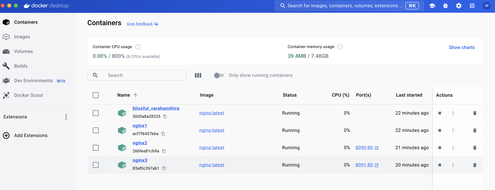

通过 `docker ps` 也可以查看当前启动的容器列表：

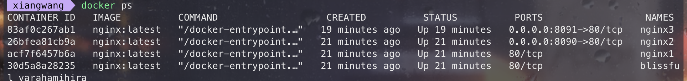

这里我启动 4 个容器：

1. 直接 `Run`，没有任何配置
2. 配置了名称
3. 配置名称和端口
4. 配置名称、端口和文件挂载路径

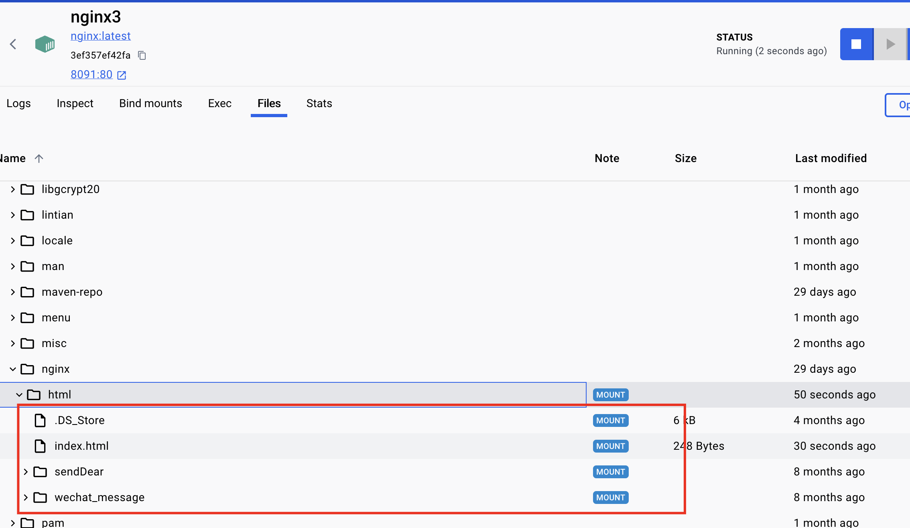

浏览器打开 [http://localhost:8091/](http://localhost:8091/)，显示我们本地的 html 文件内容


上述四个容器，也可以通过 `docker run` 命令行启动，格式为：

```bash
# --name 设置容器名称
# -p 端口映射
# -v 指定数据卷挂载目录，可多次设置
# -e 指定环境变量，Key=Value
# -d 后台运行
docker run --name xxx -p xx:xx -v xx:xx -e xx=xx -d nginx:latest
```

那么，我们刚刚启动的 4 个容器，分别对应的命令就是：

1. `docker run nginx:latest`
2. `docker run --name nginx1 nginx:latest`
3. `docker run --name nginx2 -p 8090:80 nginx:latest`
4. `docker run --name nginx3 -p 8091:80 -v /Users/Desktop/html:/usr/share/nginx/html nginx:latest`

#### volumes

上面已经提到了，数据卷 volume，用来把宿主机某个目录挂载到容器内。

理解了以上几个概念，Docker 也就算入门了。我们来梳理一下流程：首先需要拉取一个镜像，然后通过镜像运行容器，将容器内服务的端口映射到宿主机，就可以访问容器内的服务了，再将对应的目录挂载到宿主机，这样容器内的数据就会与宿主机同步，相当于将容器内的数据保存到宿主机。

上面我们讲了如何使用镜像、容器的过程，在项目里我们不仅仅是使用它，而且还需要用它来帮我们部署多套环境，比如将我们的服务生成 Docker 镜像。那么，如何生成 Docker 镜像呢？

### 如何生成 Docker 镜像

`Dockerfile` 是生成 Docker 镜像的文件，在 `docker run` 的时候执行。

以我们的真实项目为例，首先在项目根目录创建一个 `Dockerfile` 和 `.dockerignore` 文件，

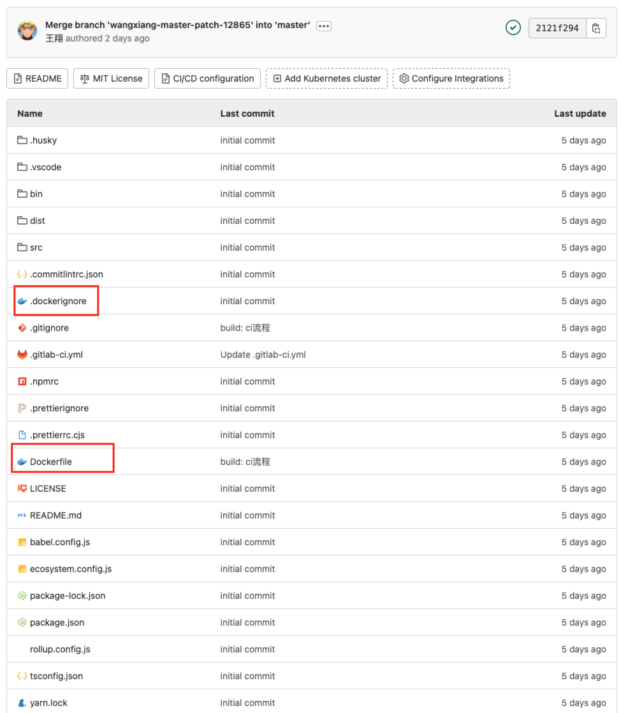

`Dockerfile` 内容如下：

```bash
FROM node:16
WORKDIR /usr/src
COPY . ./
RUN npm install --registry=https://registry.npmmirror.com --ignore-scripts
CMD export PRODUCTION=1; node bin/server.js
```

这些指令的含义如下：

- FROM：基于一个基础镜像来修改，我们项目是一个 node 项目，所以需要基于 node16 来创建镜像
- WORKDIR：指定当前工作目录
- COPY：把容器外的内容复制到容器内

  通过 `WORKDIR` 指定当前工作目录为 `/usr/src`，接着通过 `COPY` 把 Dockerfile 同级目录下的内容复制到容器内的 `/usr/src` 目录下

- RUN：在容器内执行命令，安装依赖
- CMD：启动容器执行的命令

.dockerignore 类似于 .gitignore，在 docker build 时，.gitignore 下的文件会被忽略，不会被打包到 Docker 镜像中。

接着我们就可以使用 docker build 来制作镜像了，语法如下：

```bash
# docker build -t 镜像名:标签名 Dockerfile路径
docker build -t doc-socket-excel:0.0.3 .
# 也可以不需要标签名
# docker build -t doc-socket-excel .
```

通过输出可以看到，首先拉取了 node16 镜像，接着拉取我们的代码并执行命令。

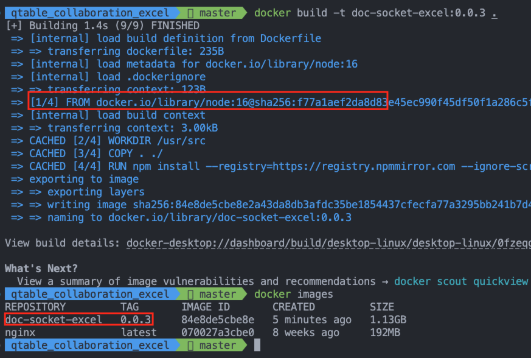

通过 docker images 看到我们的 docker 镜像，通过 docker run 运行容器，通过 docker ps 查看当前运行的容器


接着可以使用 `docker exec -it doc-socket-excel sh` 进入到容器内部，在对应的目录下（之前执行的`WORKDIR`）就能看到我们的项目代码。

最后通过挂载的 logs 目录就能看到我们的项目日志。

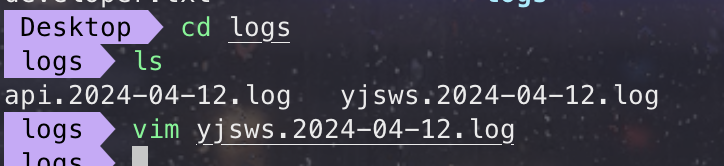

## .gitlab-ci.yml 文件编写

[语法](https://git.qmpoa.com/help/ci/yaml/index)

```yml
variables: # 定义全局变量 
    PROJECT_IMAGES: "irweb:$CI_COMMIT_TAG" # gitlab系统变量，获取提交tag的信息
```