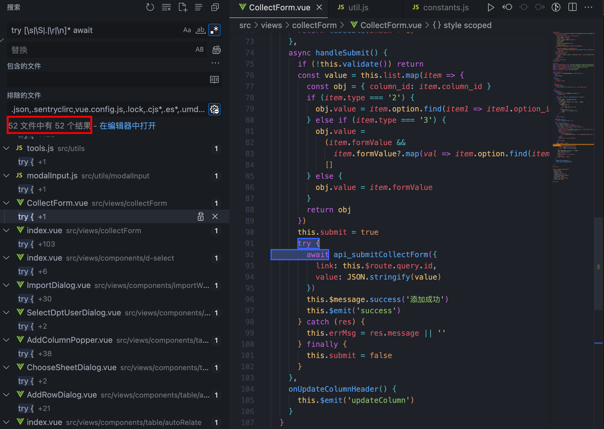
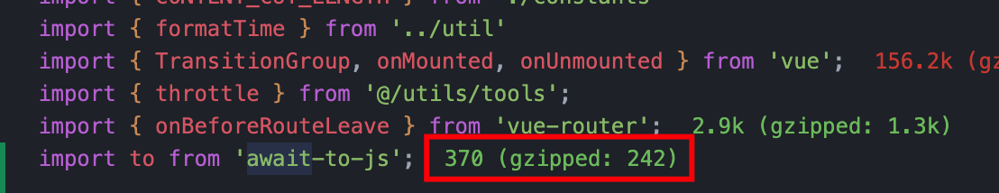

## 写在前面

不知道大家项目里面是怎么处理 async/await 的异常，我斗胆在我们项目里翻了一下，发现大量使用 try-catch 来处理 async/await 异常。



首先说明一下， try-catch 处理并没有什么问题，我只是觉得这么写代码会有点乱，感觉代码逻辑像是断层了一样，不易理解；
其次是代码冗余问题，单个 try-catch 就占了好几行代码，如果每个请求的地方都添加 try-catch，就会显得代码很臃肿。
而对于这种大量相同的冗余代码，完全可以用一种通用的函数来替代。

async/await 是在 ES2017 中引入的，目的是为了让异步操作更加直观、方便，同时也解决了 Promise 的回调地狱问题。想必这些概念大家都已经了解了，**那么我们为什么要捕获 async/await 的异常呢？它们是在什么时候发生异常呢？** 带着问题我们一起看一下本文。

## 什么时候会请求异常

我们都知道 await 后面一般都是异步请求，异步请求发生异常的原因大致有以下几种：

1. 网络问题导致，网络断开连接，请求不到；
2. 网络慢导致异步请求超时。

## 什么情况下需要处理请求异常

一旦有以上情况出现，这个异步请求就会产生异常，而 JavaScript 又是一个单线程语言，代码报错后就会导致后面的代码无法继续执行，所以此时就需要添加 try-catch 来捕获异步请求的异常，使得代码可以继续向后执行。

**但有必要为所有的异步请求都加 try-catch 吗？**

我研究了下我们项目的代码，异步请求加了 try-catch 处理的，有以下几种情况：

### 多个异步请求串行

```js
try {
  // 获取列表list
  const list = await getList(params)
  // 获取单个详情
  const info = await getListById(list[0]?.id)
} catch {}
```

前一个异步请求的返回结果，会作为后一个异步请求的请求参数使用，所以一旦前一个请求异常，后面的请求肯定会异常，所以需要添加 try-catch 处理。

### 处理异步请求的 loading 状态

```js
loading.value = true
try {
  // 获取列表list
  const list = await getList(params)
} finally {
  loading.value = false
}
```

一般我们处理异步请求前，会为其添加 loading 状态，而一旦请求异常出现时，如果不加 try-catch 时就会导致页面一直处于 loading 状态。所以需要在`finally`中将 loading 状态置为 false，`catch中处理时需要外部再处理一次`。

那么，我们如何优雅的处理异步请求中的 try-catch 呢？

## 处理方法

### 使用 Promise 处理

首先需要明确一点：[正常情况下，await 命令后面是一个 Promise 对象](https://es6.ruanyifeng.com/#docs/async#await-%E5%91%BD%E4%BB%A4)。所以它本身就可以使用`.catch`来捕获异常，那么像上面第二种只是处理 loading 状态的操作，完全可以在`.catch`进行处理，然后用`if`判断来控制提前退出，没必要写 try-catch 这种冗余代码。

```js
loading.value = true
let res = await getList().catch(() => (loading.value = false))
if (!res) return
// 请求成功后正常操作
```

### await-to-js 处理函数

简单的异步请求我们可以使用上面这种方法，但遇到多个异步操作时，就需要借助我们今天要说的[await-to-js](https://github.com/scopsy/await-to-js)这个库，它的介绍很简单：**无需 try-catch 即可轻松处理错误**。

而且[源码](https://github.com/scopsy/await-to-js/blob/master/src/await-to-js.ts)贼简单，就 23 行代码，我们一起来看看。

```ts
/**
 * @param { Promise } promise
 * @param { Object= } errorExt - Additional Information you can pass to the err object
 * @return { Promise }
 */
export function to<T, U = Error>(
  promise: Promise<T>,
  errorExt?: object
): Promise<[U, undefined] | [null, T]> {
  return promise
    .then<[null, T]>((data: T) => [null, data])
    .catch<[U, undefined]>((err: U) => {
      if (errorExt) {
        const parsedError = Object.assign({}, err, errorExt)
        return [parsedError, undefined]
      }

      return [err, undefined]
    })
}

export default to
```

大致流程如下：
函数`to`接受参数`Promise`和`errorExt`，如果这个 Promise 成功时返回`[null, data]`，如果异常时会判断是否带有`errorExt`参数（代表传递给 err 对象的附加信息），如果有时会与 catch 捕获的 err 合并返回，如果没有时返回`[err, undefined]`。

很简单的逻辑是不是，接着我们看下它的用法：

- 安装

  ```bash
  # use npm
  npm i await-to-js --save
  # use yarn
  yarn add await-to-js
  ```

- 使用

  首先引入`to`函数，可以看到包很小，只有 370b，gzip 压缩后只有 242b，所以放心引入，别担心什么包大小问题。

  

  我们通过`to`来改写一下上面第一种问题：

  ```js
  import to from 'await-to-js'

  // 获取列表list
  const [err, data] = await to(getList(params))
  if (err) return
  // 获取单个详情
  const info = await to(getListById(list[0]?.id))
  ```

  通过`to`函数改造后，如果返回第一个参数不为空时，说明该请求报错，就可以提前 return 出去，如果不存在第一个参数时，则异步请求成功。

## 总结

本文通过研究 async/await 的异常捕获，发现了两种常见的异步请求异常捕获，并提出了两种简单的解决方法。通过这两种方法，就可以丢掉冗余的 try-catch，然后你就会发现没了 try-catch 的代码看起来都是顺眼的。

很多小伙伴可能也会遇到这个问题：尽管你提出了解决方案，但依旧会有项目组成员不用。你要这么想就错了，自己通过研究、查资料，最终学到了东西就足够了，管别人干嘛！没必要啊。

以上就是本文的全部内容，希望这篇文章对你有所帮助，欢迎点赞和收藏 🙏，如果发现有什么错误或者更好的解决方案及建议，欢迎随时联系。
