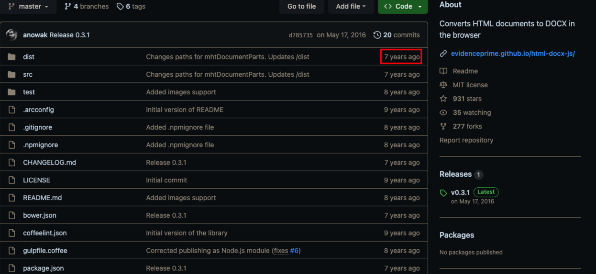
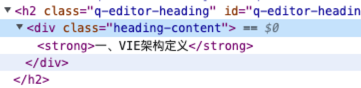

## 前言

我们公司目前在做基于[tiptap](https://tiptap.dev/)的在线协同文档，最近需要做导出 pdf、word 需求。

导出 word 文档使用的是[html-docx-js-typescript](https://github.com/caiyexiang/html-docx-js-typescript)，是用 typescript 重写了一下[html-docx-js](https://github.com/evidenceprime/html-docx-js)，可以看到最近的提交记录是 2016 年，貌似已经不维护了，很多 Issues 没人管。



实在找不到其他的 html 转 word 的插件，最后只能使用它来处理，我把我在使用过程中遇到的问题一一列出来，就有了这篇避坑指南。

### 使用说明

- 安装

  安装`html-docx-js-typescript`，同时安装[FileSaver](https://github.com/eligrey/FileSaver.js)用于浏览器端保存文件。

  ```bash
  npm install html-docx-js-typescript file-saver --save-dev
  npm install @types/html-docx-js @types/file-saver --dev
  ```

- 使用方法

  参考[官方示例](https://github.com/caiyexiang/html-docx-js-typescript#vuejs-usage-demo)

## 使用过程遇到的问题及处理方案

### 字体加粗不生效、字体背景颜色不生效处理

字体加粗`<strong>`和标记文本元素`<mark>`标签需要替换为`<b>`和`<span>`标签

```js
const innerHtml = cloneEle.innerHTML
  // strong在word中不生效问题
  .replace(/<strong>/g, '<b>')
  .replace(/<\/strong>/g, '</b>')
  // 背景色不生效问题
  .replace(/<mark/g, '<span')
  .replace(/<\/mark>/g, '</span>')
```

### h1 - h6 标题高度优化及未同步 word 文档标题

我们文档中的标题对应的 HTML 内容长这样



需要将内容转换为类似`<h1>xxx</h1>`这样，不然 word 中编辑时不能对应标题，修改如下：

```js
// 标题高度和字体失效 需要设置lineHeight和fontWeight
const handleLevelStyle = (cloneEle: HTMLElement) => {
  Array.from({ length: 6 }).forEach((_, index) =>
    (cloneEle.querySelectorAll(`h${index + 1}`) as unknown as HTMLElement[]).forEach((h) => {
      h.innerText = (h.children[0] as HTMLElement).innerText
      h.style.fontSize = ''
    })
  )
}
```

### 图片下多出一个白框

```js
const removeWhiteBox = (cloneEle: HTMLElement) => {
  const separators: NodeListOf<Element> = cloneEle.querySelectorAll(
    '.ProseMirror-separator'
  )
  separators.forEach((separator) =>
    separator.parentElement?.removeChild(separator)
  )
}
```

### 列表 ul、ol

在开始处理之前，先介绍一个插入 DOM 的 API [insertAdjacentElement](https://developer.mozilla.org/zh-CN/docs/Web/API/Element/insertAdjacentElement)。

在 vue、react 这些框架的盛行，基本上我们已经不会再用到 DOM 操作，不过可以了解一下，万一以后用得到呢。

```js
// 将给定元素element插入到调用的元素的某个位置
element.insertAdjacentElement(position, element)
```

参数`position`可以是以下位置

- 'beforebegin': 插入元素之前，类似 insertBefore
- 'afterbegin': 插入元素第一个 children 之前，类似 prepend
- 'beforeend': 插入元素最后一个 children 之后，类似 appendChild
- 'afterend': 插入元素之后，类似 insertAfter

接着我们看一下列表这部分的修改，由于我们项目功能上的需求，列表是使用 div 标签来改造的，所以需要将 div 标签转为 ul/ol，下面是我的实现

```js
const changeDiv2Ul = (div: HTMLElement | Element, parent?: HTMLElement | Element) => {
  const kind = div.getAttribute('data-list-kind')
  const ul = kind === 'ordered' ? document.createElement('ol') : document.createElement('ul')
  const li = document.createElement('li')
  // 去除margin 不然在word中会偏移
  !parent && (ul.style.margin = '0')
  li.innerHTML = div.innerHTML
  ul.appendChild(li)
  parent ? parent.insertAdjacentElement('afterend', ul) : div.insertAdjacentElement('afterend', ul)
  div.parentElement?.removeChild(div)

  li.querySelectorAll('.list-marker').forEach((marker) => marker.parentElement?.removeChild(marker))

  // 内容区域
  li.querySelectorAll('.list-content').forEach((content) => {
    const span = document.createElement('span')
    span.innerHTML = (content.firstChild as HTMLElement).innerHTML
    content.insertAdjacentElement('beforebegin', span)
    if (content.querySelectorAll('.prosemirror-flat-list').length) {
      content.querySelectorAll('.prosemirror-flat-list').forEach((div) => changeDiv2Ul(div, content))
    }
    content.parentElement?.removeChild(content)
  })
}
cloneEle.querySelectorAll('.prosemirror-flat-list').forEach((div) => changeDiv2Ul(div))
```

### 复选框 checkbox

复选框 checkbox 的处理，首先考虑的是转为`<input type='checkbox' />`来处理，结果转完后并没有显示复选框；
接着又想着用 span 标签生成一个方框，`<span style='width: 16px;height: 16px...' />`，这样总能显示了吧！结果依然不行。

正当我想不到办法的时候，突然灵机一动，可不可以把 word 转成 html 后看看 checkbox 最终会显示成啥样呢？

于是通过[在线 word 转 html](http://www.docpe.com/word/word-to-html.aspx)将 word 转为 html 后，看到复选框对应的 html 内容为`<span style="color:#333333; font-family:'Wingdings 2'; font-size:11pt"></span>`，改一下吧。

```js
const span = document.createElement('span')
span.innerHTML = `<span style="color:#333333; font-family:'Wingdings 2'; font-size:11pt"></span>`
marker.insertAdjacentElement('beforebegin', span)
marker.parentElement?.removeChild(marker)
```

转成 word 后，复选框的选中和取消功能也能正常使用。

### 附件导出、多维表等 iframe 内容

参考了一下钉钉文档


这样就很好改了，只需要把附件对应的节点内容，改为链接即可。

```js
cloneEle.querySelectorAll('.attachment-node-wrap').forEach((attach) => {
  const title = `请至One文档查看附件《${attach.getAttribute('name')}》`
  const anchorId = attach.parentElement?.getAttribute('data-id')
  const a = document.createElement('a')
  a.target = '_blank'
  a.href = `${location.href}&anchor=${anchorId}`
  a.innerHTML = `<span>${title}</span>`

  attach.insertAdjacentElement('beforebegin', a)
  attach.parentElement?.removeChild(attach)
})
```

## 未解决的部分

- 表情无法导出、钉钉、飞书都是如此

## 小结

以上是我在使用`html-docs-js`插件时遇到的一些问题及处理方式，如果有遇到同样问题的小伙伴，可以贴下你们的处理方式。或者这里没有提到的问题，也欢迎大家补充。
