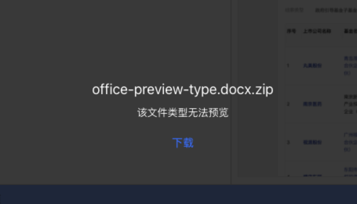

这是我参与「掘金日新计划 · 4 月更文挑战」的第 3 天，活动详情：https://juejin.cn/post/7218068880224550972

## 前言

我们公司目前在做基于[tiptap](https://tiptap.dev/)的在线协同文档，其中有上传附件的功能。在协同操作中，不能让用户看别人上传的附件时，还需要下载到本地，又麻烦体验又差。是需要实现在线预览的功能，方便其他阅读者有更好的阅读体验。

像一般的图片、视频、office 等文件，我们都可以实现在线预览功能，但始终不能覆盖全部，万一用户上传什么奇奇怪怪的文件。所以我们需要做好兜底处理，再无法预览时给用于一个提示。比如下面这张图对压缩文件的处理，提示用户主动下载进行查看。



下面，我们将常见附件进行分类，然后分别看一下不同的预览方式。

## 图片预览

图片的预览可以直接使用``标签即可

```vue
<template>
  
</template>
```

`imgStyle`用于设置图片的样式，比如一般会为图片添加放大、缩小、旋转功能，只需要设置图片的`scale`、`rotate`属性即可。

## 音视频预览

HTML5 的[<video>](https://developer.mozilla.org/zh-CN/docs/Web/HTML/Element/video)和[<audio>](https://developer.mozilla.org/zh-CN/docs/Web/HTML/Element/audio)标签用于播放视频和音频，所以我们可以封装一个组件专门来处理音视频。

```vue
<template>
  <RenderMedia />
</template>
<script setup lang="tsx">
const AUDIO_TYPE = ['mp3', 'ogg', 'mpeg']
const VIDEO_TYPE = ['mp4', 'ogg', 'webm']
const props = defineProps({
  viewType: {
    type: String,
    required: true,
  },
  viewFileUrl: String,
})

const controls: any = 'controls'
const renderAudio = () => (
  <audio
    class="media-content__audio"
    controls={controls}
    controlslist="nodownload"
  >
    {AUDIO_TYPE.map((type) => (
      <source width="100%" src={props.viewFileUrl} type={`audio/${type}`} />
    ))}
    <embed width="100%" src={props.viewFileUrl} />
    <embed width="100%" src={props.viewFileUrl} />
  </audio>
)

const renderVideo = () => (
  <video
    class="media-content__video"
    controls={controls}
    controlslist="nodownload"
    disablePictureInPicture // disablePictureInPicture取消画中画
  >
    {VIDEO_TYPE.map((type) => (
      <source width="100%" src={props.viewFileUrl} type={`video/${type}`} />
    ))}
    <object data={props.viewFileUrl} width="100%">
      <embed src={props.viewFileUrl} width="100%" />
    </object>
  </video>
)

const RenderMedia = () => (
  <div class="media-content">
    {props.viewType === 'audio' ? renderAudio() : renderVideo()}
  </div>
)
</script>
<style lang="scss" scoped>
.media-content {
  width: 100%;
  height: 100%;
  display: flex;
  justify-content: center;
  align-items: center;
}
</style>
```

上面我封装的 vue3+ts 的组件，因为我接触 vue3 不久，还不知道里面的 JSX 语法怎么写，刚好学习了 vue3 中的 JSX 语法[前端 Vuer，请收下这份《Vue3 中使用 JSX 简明语法》](https://juejin.cn/post/7114063575122984973)。

需要注意的是：**在不支持 video 和 audio 元素的浏览器中，标签中间的内容会显示，作为降级处理**。

## pdf

最简单的就是使用浏览器直接打开 pdf，也就是通过 iframe 的方式加载 pdf 文件，当然也可以使用[pdfjs](https://github.com/mozilla/pdfjs-dist#pdfjs)这类比较成熟的 pdf 在线预览方式，我们采用的是 iframe 方式，简单直接。

```vue
<template>
  <iframe
    v-if="viewType === 'pdf'"
    :src="viewFileUrl"
    width="100%"
    height="100%"
    class="file-reader file-reader__iframe"
  />
</template>
```

## 代码、文本等

代码文本等的预览，可以用[codemirror](https://codemirror.net/)来预览，不过一般很少有人附件上传代码，所以我们暂时没做代码的预览，要看直接可以使用代码组件替代。
txt 文本的预览也很简单

1. 先通过 url 将文本以`arraybuffer`方式请求回来；
2. 接着通过 Blob 将 arraybuffer 数据转换成 blob，通过 FileReader 去读里面的内容，最后赋值到我们需要展示的内容上；

   ```js
   const blob = new Blob([bufferData], {
     type: 'text/plain',
   })
   const fileReader = new FileReader()
   fileReader.readAsText(blob, 'utf-8')
   fileReader.onloadend = (e) => {
     content.value = fileReader.result || ''
   }
   ```

3. 将获取到的文本展示在`<pre>`标签中。

   ```vue
   <template>
     <pre class="previewer-content">{{ content }}</pre>
   </template>
   ```

## office 在线预览

office 的预览可以直接采取网上的一些免费在线预览即可。

### 先说几款免费的

1. 首推微软在线 Office Web Viewer

   **优点**

   - 免费，预览效果比较好，[官网地址](https://www.microsoft.com/en-us/microsoft-365/blog/2013/04/10/office-web-viewer-view-office-documents-in-a-browser/)
   - 接入简单，文件地址 url 需要通过`encodeURIComponent`转一下，url，否则会打不开

     ```html
     <iframe
       style="width: 100%; min-height: 600px"
       :src="`https://view.officeapps.live.com/op/view.aspx?src=${encodeURIComponent(url)}`"
       width="100%"
       height="100%"
       frameborder="1"
     />
     ```

   - 支持多种格式
   - Word: .DOCX, .DOCM, .DOTM, .DOTX, .DOC
   - Excel: .XLSX, .XLSB, .XLS, .XLSM
   - PowerPoint: .PPTX, .PPSX, .PPT, .PPS, .PPTM, .POTM, .PPAM, .POTX, .PPSM

   **缺点**

   - Word、PPT 文件不能大于 10M，Excel 文件不能大于 5M-
   - 加载文件较多，各种图片、文字、样式等，页面臃肿，加载速度慢
   - 内网无法使用

2. Google Drive 查看器

   - 免费，预览效果不如 Office Web Viewer
   - 接入简单，同 Office Web Viewer，只需要把 src 改为`https://drive.google.com/viewer?embedded=true&hl=en-US&url=${encodeURIComponent(url)}`即可
   - 缺点：不能预览 word 文件、excel 和 ppt 都行

## 提供私有化部署

1. 微软 Office Online Server

   - [私有化部署](https://learn.microsoft.com/zh-cn/officeonlineserver/office-online-server)，预览效果同 Office Web Viewer

2. kkfileview

   - [官网地址](https://kkfileview.keking.cn/zh-cn/index.html)
   - 支持 office 文档的在线预览，如 doc,docx,xls,xlsx,ppt,pptx,pdf 等，同时支持 txt,zip,rar,图片,视频,音频等格式预览

### 再说付费的预览

1. office365

   [官网](https://www.officeweb365.com/)，[付费使用](https://www.officeweb365.com/Default/price)

2. 阿里云 IMM
   预览效果好，飞书、钉钉文档都是用的它，需要与阿里云 OSS 一起[使用](https://help.aliyun.com/document_detail/63273.html)，[付费使用](https://help.aliyun.com/document_detail/88317.html)

3. XDOC 文档预览

   - [官网地址](https://view.xdocin.com/)，[付费使用](https://view.xdocin.com/view-xdocin-com_6x5f4x.htm)
   - 预览效果不如 Office Web Viewer，但打开速度更快
   - 接入简单，同 Office Web Viewer，只需要把 src 改为`https://view.xdocin.com/view?src=${encodeURIComponent(url)}`即可
   - 缺点：内网无法使用

4. 其他

## 其他格式文件

这些不支持的文件格式，我们只需要提示不可预览，并提供下载的方式即可。
