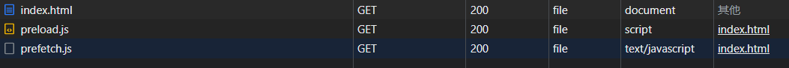

### preload

- 提前加载指定资源，不再出现依赖的font字体隔了一段时间才刷出的情况，字体样式闪动(FOUT，Flash of Unstyled Text)
- preload加载font字体资源不带 crossorigin 会二次获取
  
```html
<!-- 如果跨域请求需要添加crossorigin  -->
<link rel="preload" as="style" crossorigin href="https://xxx.css">
```

### prefetch

- 主要是浏览器加载下一页面可能会用到的资源

```html
<link rel="preload" href="https://xxx.js" as="javascript">
```

### 区别

关于preload和prefetch的区别，我总结了以下，主要是以下几点

- 通过preload和prefetch加载的资源不会立即执行，资源被缓存
- 资源加载完成之前已完成渲染，两种方式不会阻塞关键渲染路径
- preload资源优先级Highest 浏览器立即加载资源
- prefetch资源优先级Lowest 网络空闲时加载
- preload 优先级高于 prefetch
- 可以看VUE页面，首页资源均是preload，而路由对应资源均是prefetch

当使用preload或prefetch加载时，js代码不会立即执行，只有需要使用的时候才会执行

```html
<!DOCTYPE html>
<html lang="en">
<head>
  <meta charset="UTF-8">
  <meta http-equiv="X-UA-Compatible" content="IE=edge">
  <meta name="viewport" content="width=device-width, initial-scale=1.0">
  <!-- preload或prefetch加载不会执行 -->
  <link rel="prefetch" href="./assets/prefetch.js" as="script">
  <link rel="preload" href="./assets/preload.js" as="script">
  <link href="https://fonts.googleapis.com/css2?family=Alumni+Sans+Collegiate+One&family=Alumni+Sans+Pinstripe&display=swap" crossorigin rel="preload" as="font">
  <!-- 正常加载js执行console.log -->
  <!-- <script src="./assets/demo.js"></script> -->
  <style>
    p {
      font-family: 'Alumni Sans Collegiate One', sans-serif;
      font-family: 'Alumni Sans Pinstripe', sans-serif;
    }
  </style>
  <title>Document</title>
</head>
<body>
  <p>Proclame la présente Déclaration universelle des droits de l’homme</p>
</body>
</html>
<!-- demo.js -->
(() => {
  console.log('123')
})()
```

通过控制台可以看到preload比prefetch加载优先级高

