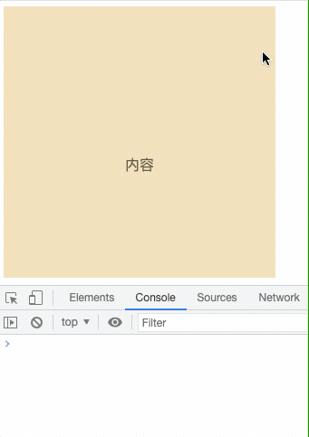
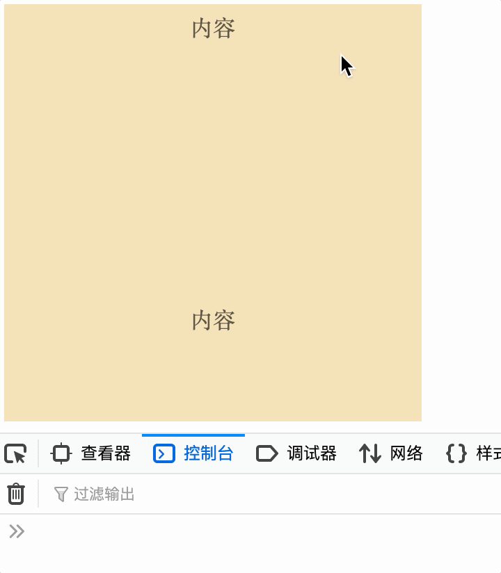

## 前言

相信有不少小伙伴在开发过程中都有处理过这个场景，当页面滚动结束后执行一些操作。我们之前的操作一般都是使用`onscroll`事件配合延迟去实现，往往是滚动还在进行时就触发了事件，并不能精准的捕获到滚动事件完成的时机。而`scrollend`的出现就是为了解决这个问题，让滚动完成事件更加可靠。

## 使用 scroll 实现滚动完成的弊端

如果不使用 scrollend，我们实现滚动结束事件是不是这样的，使用 setTimeout，只要当 100ms 内未滚动时，就判断滚动事件结束。

```js
let scrollEndTimer = null
const callback = () => console.log('滚动事件结束')
document.onscroll = () => {
  clearTimeout(scrollEndTimer)
  scrollEndTimer = setTimeout(callback, 100)
}
```

那么这样操作有哪些问题呢？我们不妨先看看下面这张图片。

仔细观察下你就会发现，这里的滚动结束事件其实是停止滚动 100ms 的时候触发，并不是实际的滚动结束，称为“滚动暂停”可能更接近些。

## scrollend

通过 MDN 上对[scrollend](https://developer.mozilla.org/en-US/docs/Web/API/Element/scrollend_event)的介绍，我们可以知道 scrollend 是在文档视图完成滚动时触发。

### 怎样算是完成滚动呢？

当滚动位置没有更多待处理的更新并且用户已完成他们的手势时，滚动被认为完成。

所以触摸滚动、鼠标滚轮、键盘滚动等活动只要被释放就会触发 scrollend 事件，同时类似 scrollTo() 这类导致滚动位置更新的事件完成后也会触发 scrollend 事件，具体是以下这些事件：

- 用户的触摸已被释放；
- 用户的指针已释放滚动条；
- 用户的按键已被释放；
- 滚动到片段已完成；
- 滚动捕捉已完成；
- scrollTo()已完成；
- 用户已滚动视觉视口

当然，如果滚动位置没有改变，是不会触发 scrollend 事件的，即以下事件不会触发：

- 用户的手势没有导致任何滚动位置变化；
- scrollTo() 没有产生任何移动。

### 浏览器支持

目前 scrollend 事件仅支持 Firefox 109 版本，接下来不久，Chrome 111 版本也将支持该事件。可以通过 [caniuse](https://caniuse.com/?search=scrollend) 看到 scrollend 事件目前支持的版本。

我们可以通过下面代码看一下效果，注意这段代码需要在 Firefox 109 版本浏览器中运行。

```js
const callback = () => console.log('滚动事件结束')
document.querySelector('.scroll-container').onscrollend = callback
```



与上面那张图做比较，可以看出onscroll和onscrollend事件的差别：

- 如果将 onscroll 设置的 setTimeout 时间延长，不是 100ms，比如 1000m 或更长时，会发现两者差别更大一些，onscrollend 是在滚动完成后立即触发，而 onscroll 是在等待时间结束后触发

### 使用注意

在项目中使用的情况下需要判断一下当前浏览器是否支持 scrollend 事件，不支持时还是采用延迟的方式解决

```js
if ('scrollend' in window) {
  document.onscrollend = callback
} else {
  document.onscroll = event {
    clearTimeout(scrollEndTimer)
    scrollEndTimer = setTimeout(callback, 100)
  }
}
```

也可以使用 scrollend 的[polyfill](https://github.com/argyleink/scrollyfills)处理
