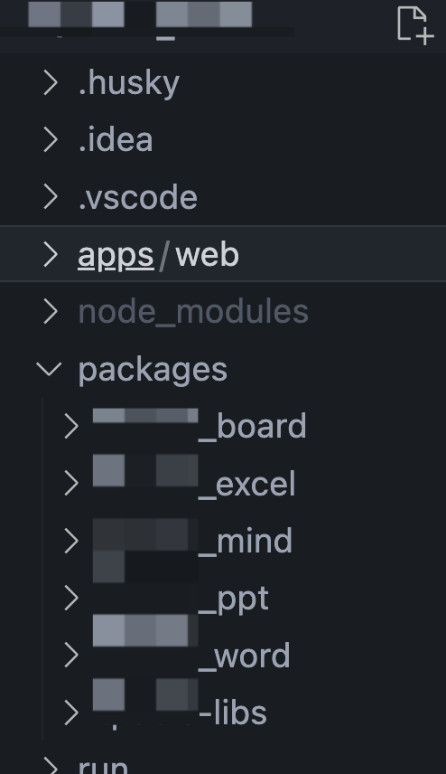
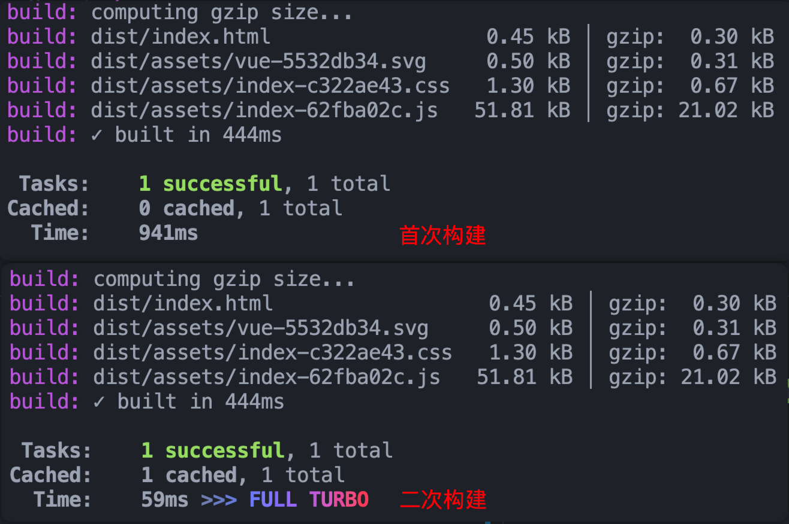
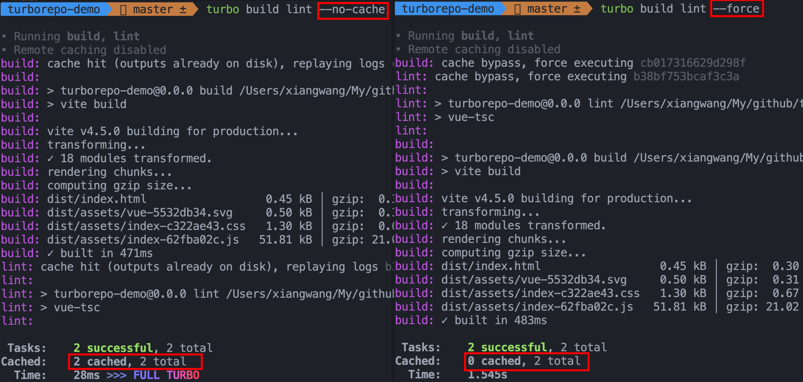
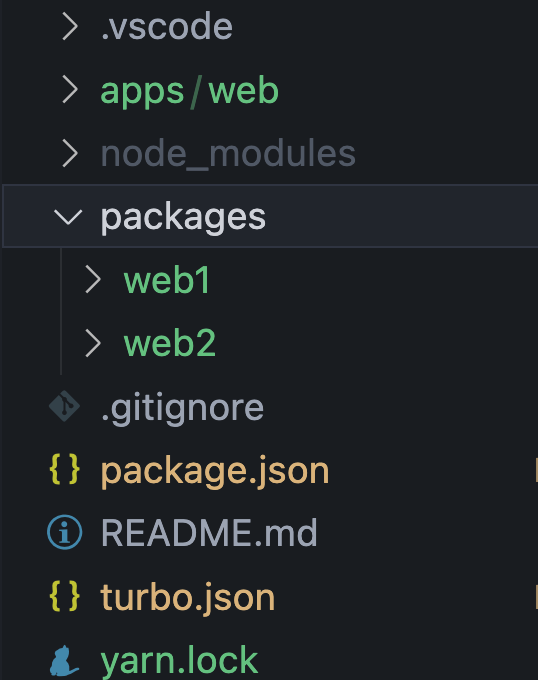
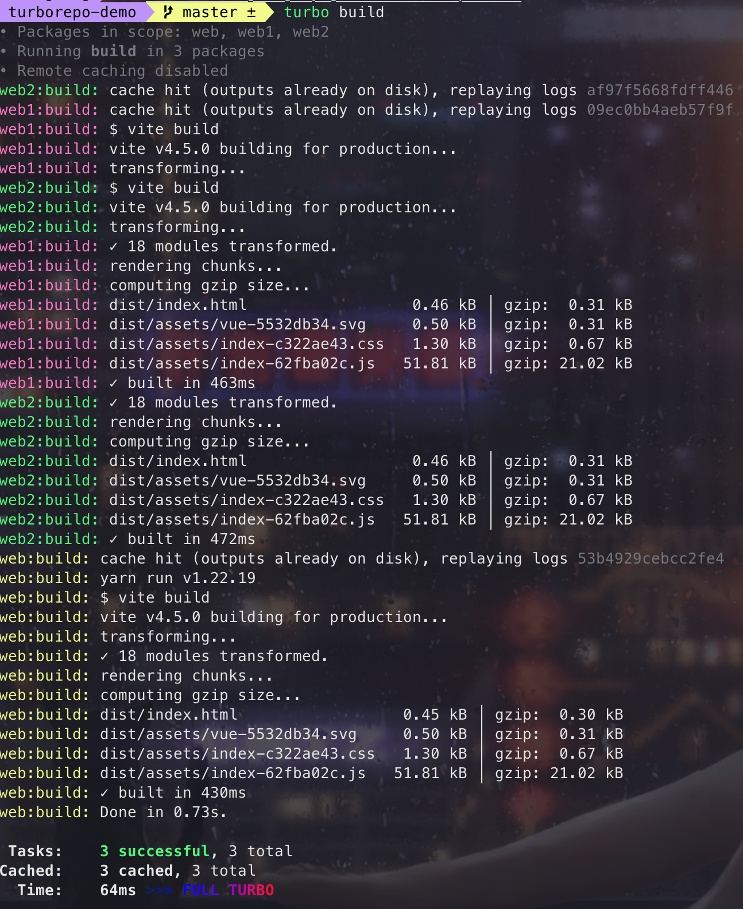

## 前言

我目前在维护公司文档体系的代码，目前为止包含了：文档、excel、脑图、白板这几个单独的项目，还有一个主项目分别引入这几个单独的项目。不好维护并且有一些公共的方法需要在每个项目中重新写一次，刚好有看到 Turborepo，于是就尝试着将目前文档体系内的项目统一为 monorepo 的形式进行管理。

## 什么是 Turborepo

在了解 Turborepo 前先来了解下 **monorepo**。

在通用的开发场景中，人们希望各个项目之间能够足够的独立，各自的开发和发布不会产生太多的耦合，现在很多的项目也是出于这种考虑去拆成一个一个独立的子项目，在单独的代码仓库中进行管理，这就是我们常见的单代码仓库的开发模式。

但是上面的模式，在某些场景下就会显得低效和繁琐。比如一个仓库的代码被很多其他相关的仓库引用，那么只要这个仓库进行发版，所有依赖了这个代码的仓库也要跟着进行依赖升级和发版。如果把所有有依赖关系的代码都放到一个仓库中进行统一维护，当一个库变动时，其它的代码能自动的进行依赖升级，那么就能精简开发流程、提高开发效率。这种**多包的代码仓库管理，就是 monorepo**。

turbo 直译成中文的意思是“涡轮增压”：即一种车用内燃机或航空用发动机用来增加进气量的技术。与机械增压器相比，两者都可增加进入发动机的进气量，从而提高其效率。

官网介绍：Turborepo 是一个针对 JavaScript 和 TypeScript 代码库优化的智能构建系统。

如果直接说如何使用的话，那么感觉会有点乏味，那我们先看下如果不使用 Turborepo，我们之前是如何开发的，看完之后，再详细了解 Turborepo 的好处。

## 传统 multirepo 模式

首先看下，我们文档体系包含了这么多的子项目，如下：



那么，如果没有使用 monorepo 前，当我修复一个文档的 bug 时，我需要以下几步完成：

1. 修改`xxx_word`代码并提交到远程仓库；
2. 将`xxx_word`打包并发布到公司的 npm 仓库；
3. 在`apps/web`中更新`xxx_word`的版本号，重新构建；
4. 如果有其他项目使用`xxx_word`，也需要进行第三步操作。

修改其中一个项目的代码，就需要上面几个步骤，那如果有多个项目需要修改时，重复的操作越来越多，耗费的时间会越来越长。

从上面的例子可以看出，传统 multirepo 项目的弊端如下：

- **多项目代码共享难以实现**，抽离成 npm 包的形式虽然可以解决，但带来时间上的消耗是无法避免的
- **版本管理乱**：多应用版本管理混乱，有的已经 2.x，有的依然是 1.x；
- **项目配置不统一**：如 Eslint、Husky 等代码校验工具需要单独配置，并且可能存在不配置的情况；
- **构建工具不统一**，配置 CI/CD 构建部署的流程时难以统一。

那么，这时候就需要使用 Monorepo 来管理项目，解决以上可能出现的问题，如上图所示：

- 代码共享：主项目在`apps/web`下，依赖的子项目都在`packages`下，此时再对`xxx_word`代码修改时，主项目不用再手动修改子项目的版本号，而是依赖此代码库中的版本；
- 配置共享： 实现 CI/CD 以及代码格式化工具的统一

Monorepo 的改造有多种方式实现，我们是用的 Turborepo 来实现，因为刚好那段时间它最火 🔥。

## Turborepo 改造

根据[官网 QuickStart](https://turbo.build/repo/docs)介绍可以通过多种方式打造 Turborepo 项目：

1. 新建 Turborepo 项目
2. 将已有项目改造成 Turborepo
3. 将已有 monorepo 项目改造为 Turborepo

这里我们主要来讲一下对已有项目中添加 Turborepo 的改造。

## 已有项目改造

首先使用 vite 初始化一个 vue 项目：

接着，在当前项目中安装 turbo

1. 安装 turbo

   ```bash
   yarn add turbo -D
   # or
   npm install turbo -D
   # or
   pnpm add turbo -D
   ```

2. 在根目录下创建 turbo.json 文件

   Turborepo 所有相关的配置，都放入 turbo.json 这个配置项中，主要**用于产物缓存，构建加速，构建流配置。**

   ```json
   {
     "$schema": "https://turbo.build/schema.json",
     "pipeline": {
       "build": {
         "outputs": ["dist/**"]
       },
       "lint": {}
     }
   }
   ```

   $schema：指定配置文件的 JSON Schema，它可以帮助你在编辑器中自动补全和校验配置项，固定值`https://turborepo.org/schema.json`

3. 修改 package.json 的 scripts 字段

   ```json
    "scripts": {
     "dev": "vite",
     "build": "vite build",
     "lint": "vue-tsc",
     "preview": "vite preview"
   },
   ```

此时 Turborepo 就已经引入到使用 vite 创建的项目中，接下来做一些测试：

### 测试 turbo 缓存

上文说了 Turborepo 可以**缓存任务的结果，从而提高任务速度**，我们通过实践来看一下它是如何提高任务的速度。



如上图所示：首先第一次执行任务

```bash
turbo build
```

显示任务数量`Tasks: 1 successful, 1 total`，如果同时执行两个任务

```bash
turbo build lint
```

那么任务数量为`Tasks: 2 successful, 2 total`

第二次执行任务，此时可能会命中缓存，显示如上图的“二次构建”，出现**彩色标签“FULL TURBO”时，说明此时没有真正的构建，而是从缓存中获取任务结果**，可以看到时间缩减了 20 倍左右。

#### 如何禁用缓存

当然，可能有一些任务需要禁用缓存，及每次都需要重新执行，可以通过以下方式实现：

- 禁止写入缓存：--no-cache

  ```bash
  turbo build lint --no-cache
  ```

  `--no-cache`可以**禁止任务写入缓存，但不会禁止使用缓存**，如果已经存在缓存时，那么`--no-cache`将不会产生任何效果。

- 禁止使用缓存：--force

  如果要禁用使用缓存，需要使用`--force`

  ```bash
  turbo build lint --force
  ```



- 禁用特定任务

  可以通过设置 pipeline task 中的`cache`字段禁用特定任务的缓存

  ```json
  "pipeline": {
    "build": {
      "outputs": ["dist/**"]
    },
    "lint": {
      "cache": false
    }
  }
  ```

## Monorepo 配置

假设一个 Monorepo 的项目如下所示：



根目录的 package.json 有一个 workspaces 字段，该字段用来让 Turborepo 知道目录下有哪些 workspace，这些 workspace 就交给 Turborepo 管理，应用程序放 apps 里面，apps 依赖包放 packages 里面。

```json
"workspaces": [
  "apps/*",
  "packages/*"
],
```

修改根目录下的 package.json 的`scripts`

```json
"scripts": {
  "build": "turbo run build",
  "dev": "turbo run dev --parallel",
}
```

在根目录 npm i，会把各 workspace 的 npm 依赖安装在根目录的 node_modules 中，而不是安装在各 workspace 的 node_modules 中；

全局安装

```bash
npm i vue -w
```

单独为某一个 workspace 安装 npm 依赖：

```bash
npm i vue-router -w=xxx
```

各 workspace 的 package.json 中的 name 字段很关键，它是 Turborepo 用来区分不同 workspace 的字段。

### 任务管道 pipeline

作用：**任务管道也就是命令，用配置文件定义任务之间的关系，然后让 Turborepo 优化构建内容和时间**。

pipeline 配置声明了在 monorepo 中哪些任务相互依赖，Turborepo 是通过 pipeline 来处理各个任务和他们的依赖关系的。

如果 Turbo 发现一个工作空间有一个 package.json scripts 对象中有一个匹配的键，它会在执行时将 pipeline 任务配置应用到那个 npm 脚本上。这样你就可以使用 pipeline 来设置你整个 Turborepo 的约定。

#### 配置 pipeline

pipeline 中每个键名都可以通过运行`turbo run`来执行，并且可以使用`dependsOn`来执行当前管道的依赖项。

```json
{
  "pipeline": {
    "build": {
      "dependsOn": ["^build"],
      "outputs": ["dist/**"]
    },
    "lint": {
      "outputs": []
    },
    "dev": {
      "dependsOn": ["^dev"],
      "cache": false
    },
    "test": {
      "dependsOn": ["lint", "build"]
    }
  }
}
```

##### dependsOn 依赖

- 常规依赖

  如果一个任务的执行，只依赖自己包其他的任务，那么可以把依赖的任务放在 dependsOn 数组里

  ```json
  {
    "turbo": {
      "pipeline": {
        "test": {
          "dependsOn": ["lint", "build"]
        }
      }
    }
  }
  ```

- 拓扑依赖

  可以通过`^`符号来显式声明该任务具有拓扑依赖性，需要依赖的包执行完相应的任务后才能开始执行自己的任务

  ```json
  {
    "turbo": {
      "pipeline": {
        "build": {
          "dependsOn": ["^build"]
        }
      }
    }
  }
  ```

- 空依赖

  如果一个任务的 dependsOn 为`undefined`或者`[]`，那么表明这个任务可以在任意时间被执行

  ```json
  {
    "turbo": {
      "pipeline": {
        "lint": {
          "outputs": []
        }
      }
    }
  }
  ```

比如`web`中 package.json 文件中 devDependencies 或者 dependencies 添加了`web1`和`web2`的依赖，此时执行`turbo build`命令运行`web`的打包命令时，会先等待`web1`和`web2`的`build`命令执行完成后，才会执行`web`中的`build`命令：



上面的 dependsOn 配置解释如下：

- build：依赖于其依赖项的 build 命令执行完成
- dev：依赖于其依赖项的 dev 命令执行完成
- test： 依赖于自身的 lint 和 build 命令执行完成
- lint：任何时候可以执行

### 其他字段

- env

  任务所依赖的环境变量，与 globalEnv 作用类似

- outputs

  构建产物输出的目录，当开启缓存时，Turbo 会将对应目录的产物进行缓存

- cache

  布尔类型，是否开启缓存，默认为 true

- inputs

  默认为[]，用于指定哪些文件的变化会触发任务的重新执行。

- outputMode

  设置输出日志记录的类型
  full：默认设置，显示所有输出
  hash-only: 只显示任务的 hash 值
  new-only: 只显示没有命中缓存的任务输出
  errors-only: 只显示失败的任务输出
  none: 隐藏所有任务输出

- persistent

  如果当前任务是一个长时间运行的进程，比如 dev 命令，则可以设为 true

- globalEnv

  globalEnv 是一个字符串数组，用来指定一些环境变量作为全局的哈希依赖。这些环境变量的内容会被包含在全局的哈希算法中，影响所有任务的哈希值。例如，你可以在 globalEnv 中指定 GITHUB_TOKEN，这样当 GITHUB_TOKEN 的值发生变化时，所有任务的缓存都会失效。

  globalEnv 的值是从运行 turbo 命令的环境中获取的，你可以在终端中设置或者使用 .env 文件来管理。

- globalDependencies

  globalDependencies 是一个字符串数组，用来指定一些文件作为全局的哈希依赖。这些文件的内容会被包含在全局的哈希算法中，影响所有任务的哈希值，例如配置 tsconfig.json、jest.config.js，当这些文件内容有变化时，所有构建缓存将会失效

最后贴一下我们项目的 turbo 配置：

```js
{
  "$schema": "https://turbo.build/schema.json",
  "pipeline": {
    "_build": {
      "description": "web 打包指令， 依赖的 word 的 pack 结果",
      "dependsOn": ["^_build", "^pack"],
      "outputs": ["dist/**"],
      "inputs": ["src/**", "public/**", "index.html", "*.config.js", "*.config.cjs", "*.config.ts"],
      "outputMode": "new-only"
    },
    "pack": {
      "description": "word 打包指令",
      "dependsOn": ["^pack"],
      "outputs": ["dist/**"],
      "inputs": ["src/**", "public/**", "packages/**", "*.config.js", "*.config.cjs", "*.config.ts"],
      "outputMode": "new-only"
    },
    "lint": {
      "outputs": []
    },
    "_dev": {
      "description": "调试指令； web 依赖的 word 的 pack 结果",
      "dependsOn": ["^pack"],
      "cache": false
    }
  },
  "globalEnv": ["VITE_API_URL", "VUE_APP_*", "VITE_*"]
}
```

## Turborepo 优势

- 增量构建：缓存构建内容，并跳过已经计算过的内容，通过增量构建来提高构建速度
- 内容 hash：通过文件内容计算出来的 hash 来判断文件是否需要进行构建
- 云缓存：可以和团队成员共享 CI/CD 的云构建缓存，来实现更快的构建
- 并行执行：在不浪费空闲 CPU 的情况下，以最大并行数量来进行构建
- 任务管道：通过定义任务之间的关系，让 Turborepo 优化构建的内容和时间
- 约定式配置：通过约定来降低配置的复杂度，只需要几行简单的 JSON 就能完成配置

## 后续
