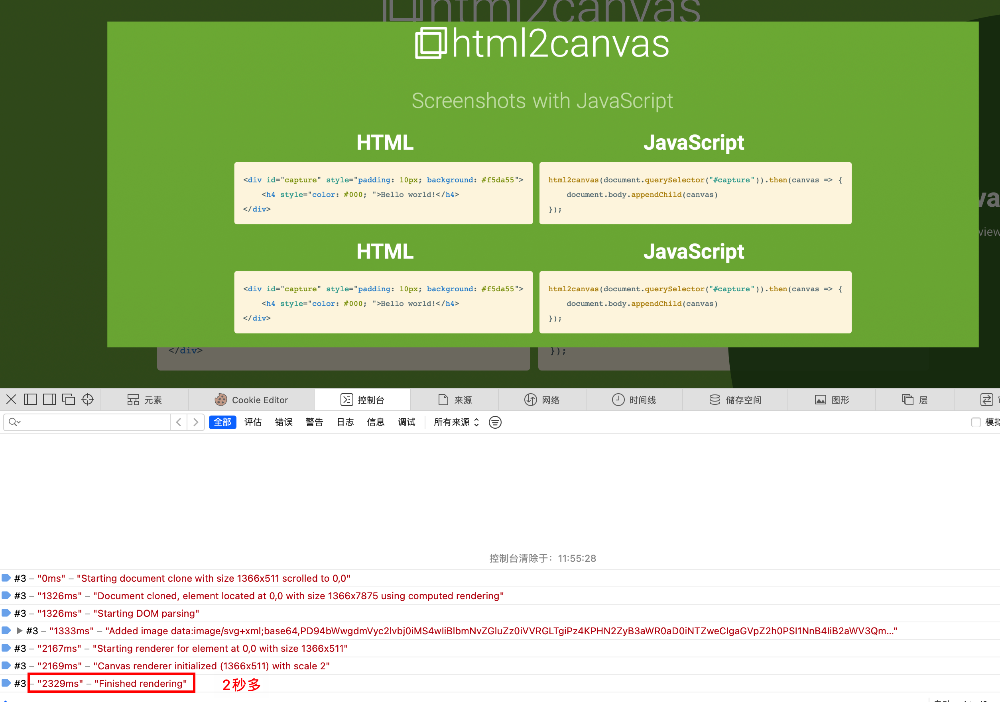

我们来手动修改一下 HTML 内容，增加更多的 DOM 节点，看看它的导出情况

Safari 浏览器使用 html2canvas 在 Document cloned 环节会花费超长时间，严重影响页面正常运行，于是使用 web worker 来改善它。

首先我们来了解下 Web Worker。

## Web Worker

作为一个前端，为了 JavaScript 的单线程问题日日苦恼，怎么没有 Java 那么方便，开多个线程干多个事；又在为单向程暗暗窃喜，因为我们不用去处理多线程的锁问题。

那么，这时候你一定需要 Web Worker，它能让你打开一个新的线程去干另一件事，比如页面正在加载，但是包含了一个较大的 js，执行比较耗时，那么此时就会影响页面的 LCP，但如果我们不在正常流程中执行此 js，而是将它放入一个新的线程中，让它执行完成后再通知主进程，这样既不会影响页面加载的速度，也可以正常的加载页面。

### 是什么

通过以上的 🌰，可以得出结论：Web Worker 可以主线程外创建一个独立线程，这个线程可以独立执行，并且不会阻塞主线程。

### 如何通信

可是：独立线程执行完成后，主线程如何知道呢？

先想一想，iframe 的通信我们用的是什么：[window.postMessage](https://developer.mozilla.org/zh-CN/docs/Web/API/Window/postMessage)，他就可以

没错，就是[Worker.postMessage](https://developer.mozilla.org/zh-CN/docs/Web/API/Worker/postMessage)和 `onmessage` 搭配

此处的 `postMessage` 类似于 [window.postMessage](https://developer.mozilla.org/zh-CN/docs/Web/API/Window/postMessage)，但是在
