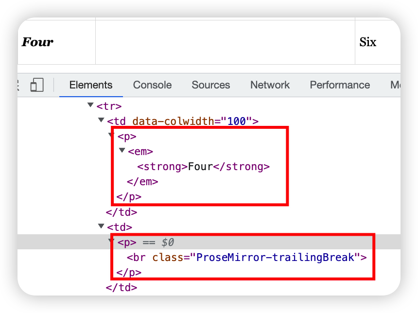
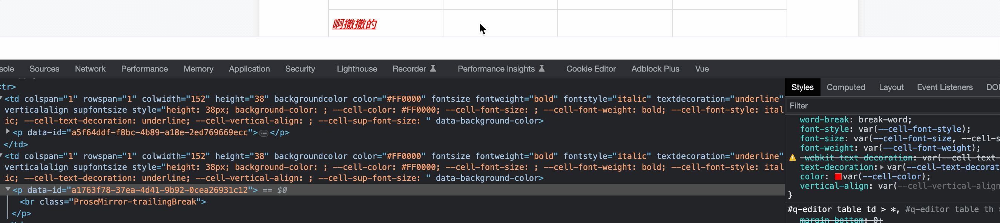
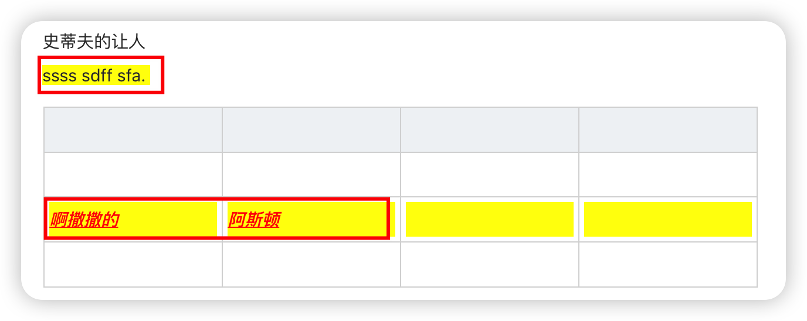
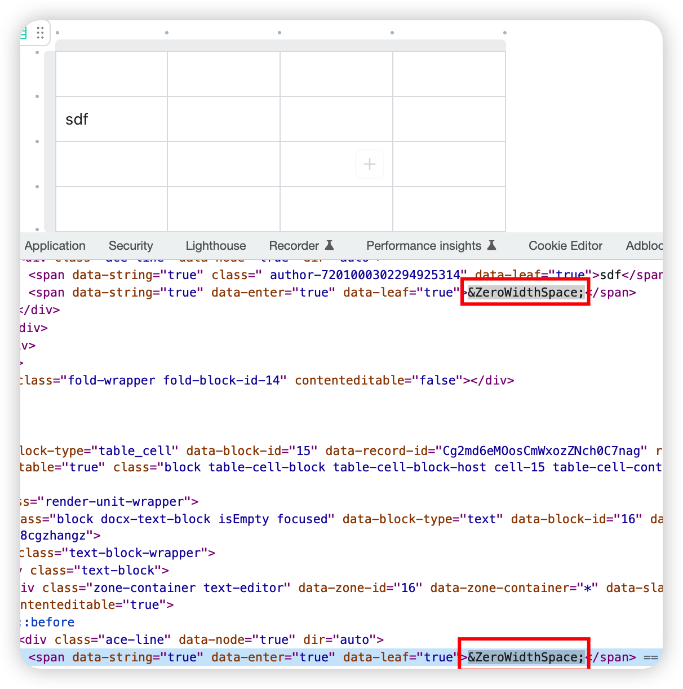
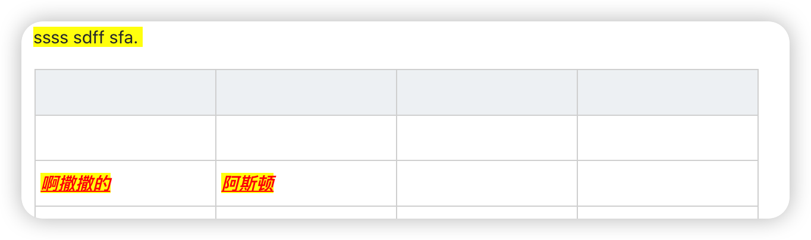

## 提出问题

最近在做富文本组件 prosemirror-tables 方面的优化工作，在对多个单元格设置样式（比如加粗、颜色等等）时，只会对已经有内容的单元格生效，而无内容的单元格不会生效。原因是 prosemirror 添加行内样式都是通过[Mark](https://prosemirror.net/docs/ref/#model.Mark)去设置，当单元格内无内容时，这些 mark 就无法添加，导致新输入的内容都不会有这些样式。


那么如何解决这个问题呢？没错，就是 CSS 自定义属性。

## 解决步骤

如果对[CSS 自定义属性](https://developer.mozilla.org/zh-CN/docs/Web/CSS/Using_CSS_custom_properties)还不了解的同学，可以先到 MDN 上学习一下。

1. 首先在 table 单元格的`attrs`属性上添加以下自定义属性

   ```js
   // tableCell.js
   ...
   addAttributes() {
    ...
    color: {
      default: '',
      renderHTML: (attributes) => {
        return {
          style: `--cell-color: ${attributes.color}`
        }
      }
    },
    fontSize: {
      default: '',
      renderHTML: (attributes) => {
        return {
          style: `--cell-font-size: ${attributes.fontSize}`
        }
      }
    },
    fontWeight: {
      default: '',
      renderHTML: (attributes) => {
        return {
          style: `--cell-font-weight: ${attributes.fontWeight}`
        }
      }
    },
    fontStyle: {
      default: '',
      renderHTML: (attributes) => {
        return {
          style: `--cell-font-style: ${attributes.fontStyle}`
        }
      }
    },
    textDecoration: {
      default: '',
      renderHTML: (attributes) => {
        return {
          style: `--cell-text-decoration: ${attributes.textDecoration}`
        }
      }
    },
    verticalAlign: {
      default: '',
      renderHTML: (attributes) => {
        return {
          style: `--cell-vertical-align: ${attributes.verticalAlign}`
        }
      }
    },
    supFontSize: {
      default: '',
      renderHTML: (attributes) => {
        return {
          style: `--cell-sup-font-size: ${attributes.supFontSize}`
        }
      }
    }
   }
   ...
   ```

   对于为什么要添加`fontSize`和`supFontSize`两个属性，这里后面在做解释。

2. 为 td 和 th 中的 p 标签添加 css 样式。

   ```css
   td,
   th {
     p {
       font-style: var(--cell-font-style);
       font-size: var(--cell-font-size, --cell-sup-font-size);
       font-weight: var(--cell-font-weight);
       text-decoration: var(--cell-text-decoration);
       color: var(--cell-color);
       vertical-align: var(--cell-vertical-align);
     }
   }
   ```

   通过拿到父节点上设置的 CSS 自定义属性设置对应的样式，比如`font-style`字体样式通过父节点上的`--cell-font-style`属性来设置，这样一来就可以实现，当前单元格是否有内容，都可以应用我们设置的单元格。说实话，以前都是用 CSS 自定义属性做全局属性，然后对整个文档生效，没注意到[自定义属性的继承性](https://developer.mozilla.org/zh-CN/docs/Web/CSS/Using_CSS_custom_properties#%E8%87%AA%E5%AE%9A%E4%B9%89%E5%B1%9E%E6%80%A7%E7%9A%84%E7%BB%A7%E6%89%BF%E6%80%A7)，刚好借机复习一下。

3. 修改 tiptap 默认的设置[行内样式](https://tiptap.dev/api/extensions/color)的方法，判断只要当前在表格内，则按照表格的方式设置样式，否则走 tiptap 默认的方式。

   ```js
   // 设置表格样式
   const result = setTableCellAttr(props.editor, 'color', color)
   if (result) return
   // 原来的设置字体颜色
   props.editor.chain().focus().setColor(color).run()
   ```

   按照这个方式把需要改动的行内样式都处理一下，处理完了我们可以看一波改动效果有没有生效
   
   嗯，目前为止一切都很完美，就是我们想要的效果，不过在对上下标和文字背景色需要做一下处理。

4. 对上标、下标特殊处理

   `vertical-align：super`使元素的基线与父元素的上标基线对齐，意味着可以让行内元素相对于该元素所在父元素上浮一定距离，形成垂直对齐文本的上标；而`vertical-align：sup`使元素的基线与父元素的下标基线对齐，意味着可以让行内元素相对于该元素所在父元素下沉一定距离，形成垂直对齐文本的下标。

   再配合字体`font-size`属性即可模拟 html 中的上下标，代码如下：

   ```css
   p {
     // 上标
     vertical-align：super;
     font-size: smaller;
     // 下标
     vertical-align：sup;
   }
   ```

   这也就是为什么上面的 css 样式中`font-size`属性设置为`var(--cell-font-size, --cell-sup-font-size)`两个属性，因为既要保留原有的字体大小设置，又要在设置上下标时对字体做特殊处理，而一旦取消对上下标的引用，字体还能改为原有的设置。

5. 对文本背景色特殊处理

   
   在设置字体背景色的时候还有个问题，如上图所示：本应该设置的是字体的背景，而在单元格中几乎占据了整个单元格位置。因为在 prosemirror-tables 中创建表格时单元格默认是无内容的，这时候只需要在创建表格时为单元格添加初始内容即可，prosemirror-model 提供的`createAndFill`方法支持传入初始内容。

   ```js
   // createCell.js
   ...
   return cellType.createAndFill(
    attrs,
    Fragment.fromJSON(schema, [
      {
        type: 'paragraph',
        content: [
          {
            marks: [
              {
                type: 'highlight',
                attrs: {
                  color: 'transparent'
                }
              }
            ],
            type: 'text',
            text: ''
          }
        ]
      }
    ])
   )
   ...
   ```

   测试下代码，发下添加表格时会报错`Empty text nodes are not allowed`，也就是说这里的`text`必须传入内容才行，那么传入什么既能不在页面显示又能让`text`不为空呢？参考一下[飞书文档](https://tafy4uwq03.feishu.cn/docx/BwgbdHFwfoil1AxQNJuch1snngP)，看下别人家的处理方式
   

   可以看到飞书文档会在空白单元格的 HTML 内容使用`&ZeroWidthSpace;`来填充，而且在页面中是看不出什么区别的。那么，什么是`&ZeroWidthSpace;`呢？

### 零宽度字符

零宽度字符在浏览器上是隐藏不显示的，相当于`display: none`，但是获取文本长度时会占位置，最常见的零宽度字符有以下几种：

- 零宽不换行空格

  HTML 实体编码中的一个字符实体，它代表的是“零宽度非换行空格”（zero width no-break space），也称作 BOM（Byte Order Mark）。零宽度非换行空格是一种特殊的 Unicode 字符，它在显示时不会产生空格，但会防止文本在该位置换行。BOM 是一种用于标记 Unicode 文件编码的特殊字符，它位于文件的开头，用来指示文件的字节序（byte order）和编码方式。当文本编辑器打开一个 Unicode 文件时，会读取文件的开头，如果存在 BOM，就会根据 BOM 中指定的编码方式来解析文件。在 HTML 中，使用实体编码的方式插入零宽度非换行空格，可以在需要防止自动换行的位置上插入该字符，以达到布局上的特殊要求。但是，由于一些历史原因，某些浏览器对该实体编码的支持存在问题，因此在编写 HTML 时建议使用其他的方式来插入零宽度非换行空格，HTML 字符值引用是`&#xFEFF;`，Unicode 映射为`\uFEFF`。

- 零宽空格

  最常见和我们使用最多的空格，可以在 HTML 片段中看到他是`&ZeroWidthSpace;`，中文称为“零宽空格”，这个字符在主流文本编辑器中均没有任何显示效果，但拷贝时会带上，HTML 字符值引用是`&#8203;`，Unicode 映射为`U+200B`。

- 零宽不连字

  HTML 片段中看到他是`&zwj;`，中文称为“零宽不连字”，这个字符放在电子文本的两个字符之间，抑制本来会发生的连字，而是以这两个字符原本的字形来绘制。HTML 字符值引用是`&#8204;`，Unicode 映射为`U+200C`。

- 零宽连字

  HTML 片段中看到他是`&zwnj;`，中文称为“零宽连字”，这个字符是一个控制字符，放在某些需要复杂排版语言（如阿拉伯语、印地语）的两个字符之间，使得这两个本不会发生连字的字符产生了连字效果。HTML 字符值引用是`&#8205;`，Unicode 映射为`U+200D`。

比如，可以利用零宽不换行空格处理可编辑文本中图片前后的光标问题，这样就可以让图片的光标不那么丑陋：

```html
<div contenteditable="true">
  <span>&#xFEFF;</span>
  
  <span>&#xFEFF;</span>
</div>
```

他们的作用还有数据防爬、传递隐藏信息、逃脱敏感词过滤等，在这篇文章其实就是用了它的传递隐藏信息这个特性。
而如果需要有复制需求的话，需要在拿到文本后将零宽字符给替换掉。

```js
text.replace(/[\u200b-\u200f\uFEFF\u202a-\u202e]/g, '')
```

于是我们将`createAndFill`改为下面这样就 ok 了

```js
// createCell.js
...
{
  marks: [
    {
      type: 'highlight',
      attrs: {
        color: 'transparent'
      }
    }
  ],
  // 零宽度空格
  type: 'text',
  text: '\u200B'
}
...
```


这样一来，就解决了单元格添加背景色时，显示文字的背景色，而不是整个 p 标签的背景色。

## 总结

最后再总结一下在 prosemirror-tables 中修改单元格样式的方法：

1. 为单元格添加自定义 CSS 属性，并在 css 文件中使用它们；
2. 修改 tiptap 默认的设置行内样式的方法；
3. 特殊情况处理，上下标和文本背景色的处理。
