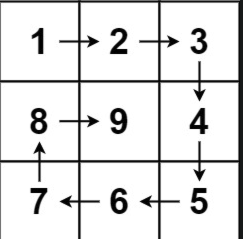

## 209. 长度最小的子数组 🌟🌟

[力扣链接](https://leetcode.cn/problems/minimum-size-subarray-sum/description/)

### 题目描述

给定一个含有 n 个正整数的数组和一个正整数 s ，找出该数组中满足其和 ≥ s 的长度最小的 连续 子数组，并返回其长度。如果不存在符合条件的子数组，返回 0。

示例：

- 输入：s = 7, nums = [2,3,1,2,4,3]
- 输出：2
- 解释：子数组 [4,3] 是该条件下的长度最小的子数组。

提示：

- 1 <= target <= 10^9
- 1 <= nums.length <= 10^5
- 1 <= nums[i] <= 10^5

### 解题思路

#### 暴力解法

- 两层 for 循环
- 外层循环：sum 清零
- 内层循环：计算 sum 值，如果大于 s，则停止内存循环，计算 subLength，与前一次比较
- 时间复杂度 O(n^2)

```js
const s = 7
const nums = [2, 3, 1, 2, 4, 3]
// 暴力 双循环
const minSubArrayLen = (nums, s) => {
  const length = nums.length
  let result = Infinity
  let subLength = 0
  for (let i = 0; i < length; i++) {
    let sum = 0
    for (let j = i; j < length; j++) {
      sum += nums[j]
      if (sum >= s) {
        subLength = j - i + 1
        result = result < subLength ? result : subLength
        break
      }
    }
  }

  return result === Infinity ? 0 : subLength
}
minSubArrayLen(nums, s)
```

#### 滑动窗口

- **重点：**
- 一个 for 循环实现两个 for 循环的事情
- **循环索引表示滑动串口的终止位置**：如果表示起始位置，终止位置需要遍历右侧区间所有元素，重新计算右侧区间大于等于 s 的下标，相似于两次 for 循环了；而如果为终止位置时，左侧区间使用上次的值，不用重新计算
- **如何移动起始位置**：终止位置随索引向后移动，左侧区间和大于等于 s 时，向后移动起始位置，重新定义区间

  判断条件：

  ```js
  while (sum >= s) {
    subLength = j - i + 1
    result = result < subLength ? result : subLength
    sum -= nums[i]
    i++
  }
  ```

### 代码

```ts
// 滑动窗口
const minSubArrayLen = (sums, s) => {
  const length = sums.length
  let result = Infinity
  let subLength = 0
  let i = 0
  let sum = 0
  for (let j = 0; j < length; j++) {
    sum += nums[j]
    while (sum >= s) {
      subLength = j - i + 1
      result = result < subLength ? result : subLength
      sum -= nums[i]
      i++
    }
  }

  return result === Infinity ? 0 : result
}
minSubArrayLen(nums, s)
```

## 59.螺旋矩阵 II 🌟🌟

[力扣链接](https://leetcode.cn/problems/remove-element/description/) 🌟🌟

### 题目描述

给你一个正整数 n ，生成一个包含 1 到 n2 所有元素，且元素按顺时针顺序螺旋排列的 n x n 正方形矩阵 matrix 。

示例:



输入: 3 输出: [ [ 1, 2, 3 ], [ 8, 9, 4 ], [ 7, 6, 5 ] ]

### 解题思路

模拟画正方形矩阵

- **重点**
- **循环不变量**：模拟顺时针画矩阵

  ```js
  圈数：n / 2
  起始位置：startX = 0;startY = 0 循环一圈 start++X startY++
  终止位置：offset = 1 循环一圈 offset++
  填充数：count = 0；每次count++
  ```

- **左闭右开**：四条边都坚持左闭右开的规则，统一

  ```js
  for (let j = 0; j < startX - offset; j++)
  for (let i = 0; i < startY - offset; i++)
  for (j; j < startX; j--)
  for (i; i < startY; i--)

  每转一圈 startX++ startY++ offset++
  ```

### 代码

```js
const generateMatrix = (n) => {
  let startX = (startY = 0) // 起始位置
  let count = 1 // 填充数
  let res = new Array(n).fill(0).map(() => new Array(n).fill(0)) // 二维数组

  let loop = Math.floor(n / 2) // 圈数
  let offset = 1 // 控制每层填充数字

  while (loop--) {
    let row = startX
    col = startY
    // 从左往右
    for (; col < n - offset; col++) {
      res[row][col] = count++
    }
    // 从上往下
    for (; row < n - offset; row++) {
      res[row][col] = count++
    }
    // 从右往左
    for (; col > startX; col--) {
      res[row][col] = count++
    }
    // 从下往上
    for (; row > startY; row--) {
      res[row][col] = count++
    }
    // 更新起始位置
    startX++
    startY++
    // 更新边距
    offset++
  }
  // n为基数 特殊处理中间值
  if (n % 2 === 1) {
    const mid = Math.floor(n / 2)
    res[mid][mid] = count++
  }
  return res
}
```
