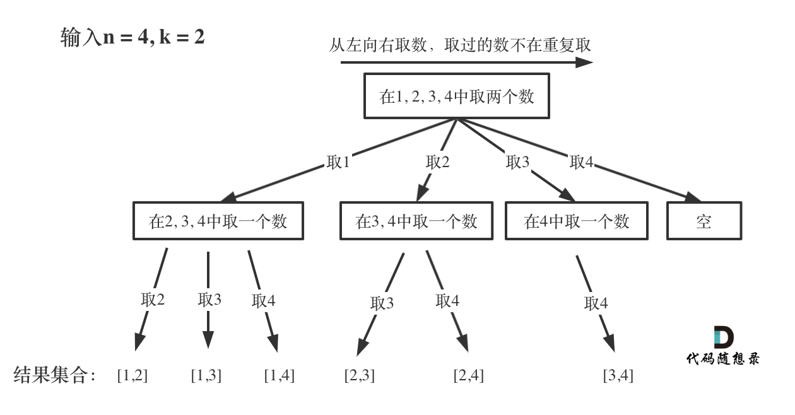

## 回溯算法

- 回溯法也叫做回溯搜索法
- 回溯是递归算法的一种：本质是**穷举**，通过**深度优先搜索**遍历所有可能的解空间，并在**发现当前路径无法得到有效解时，回退到上一步尝试其他分支**

理解：类似于走迷宫，一条路走到底发现没有出口，继续返回到前一步的另一个路径，直到找到出口。

### 回溯法的效率

回溯法暴力穷举时，可以通过**剪枝**来优化，即**剪掉不需要处理的路径**，从而减少不必要的搜索。

### 回溯法核心理解

回溯法可以抽象为一个 n 叉树结构，树的宽度表示处理的集合的大小，树的高度表示递归的深度。

1. 解空间树模型

   - 将问题转化为**树形结构**的决策过程，每个节点代表一个**决策步骤**
   - 叶子节点对应问题的**候选解**，路径代表**决策序列**

2. 三要素

   - 路径：记录做出的选择
   - 选择列表：当前可做的选择，通常而言，用数组存储可以选择的操作
   - 结束条件：到达决策树底层，就是递归的结束点，也就是搜索的结束点

### 回溯法模板

#### 回溯三部曲

1. 回溯函数返回值以及参数

   - 回溯算法返回值一般为 void

   ```js
   void backtracking(参数)
   ```

2. 回溯算法终止条件

   既然是树形结构，那么搜到叶子节点，也就找到了满足条件的一条答案，收集结果，结束本层递归

   ```js
   if (满足结束条件) {
     收集结果
     return
   }
   ```

3. 单层搜索的过程

   回溯法一般是在集合中递归搜索，集合的大小构成了树的宽度，递归的深度构成的树的深度。

   **for 循环可以理解是横向遍历每个元素，backtracking（递归）就是纵向遍历，这样就把这棵树全遍历完了**

   ```js
   for (let i in 选择列表) {
     // 对一个选择列表做相应的选择

     做选择
     路径.push(选择)

     backtrack(新路径, 新选择列表)

     // 既然是回溯算法,那么在一次分岔路做完选择后
     // 需要回退我们之前做的操作
     // 保持路径状态一致性，确保不同分支间不互相干扰

     撤销选择
     路径.pop()
   }
   ```

#### 回溯模板

```js
result = []

function backtrack(路径, 选择列表) {
  if ('满足结束条件') {
    // 记录结果
    result.push(路径)
    return
  } else {
    for (let i in 选择列表) {
      // 对一个选择列表做相应的选择

      做选择
      路径.push(选择)

      backtrack(新路径, 新选择列表)

      // 既然是回溯算法,那么在一次分岔路做完选择后
      // 需要回退我们之前做的操作
      // 保持路径状态一致性，确保不同分支间不互相干扰

      撤销选择
      路径.pop()
    }
  }
}
```

### 关键优化技巧

1. 剪枝策略

   - 可行性剪枝：提前终止不可能产生解的分支

     ```js
     if 当前选择导致不可行: continue
     ```

   - 最优性剪枝：放弃非最优路径

     ```js
     if 当前路径已劣于已知最优解: continue
     ```

2. 记忆化搜索

   - 使用哈希表记录已访问状态，避免重复计算
   - 适用于存在重叠子问题的情况

3. 决策顺序优化

   - 优先选择约束强的决策，减少搜索空间
   - 例如数独求解时优先填充候选数少的格子

## 77. 组合 🌟🌟

- 组合：[1, 2, 3]、[1, 3, 2]、[2, 3, 1]等都是同一个组合
- 排列：[1, 2, 3]、[1, 3, 2]、[2, 3, 1]等都是不同的排列

[力扣链接](https://leetcode.cn/problems/combinations/) 🌟🌟

### 题目描述

给定两个整数 n 和 k，返回 1 ... n 中所有可能的 k 个数的组合。

示例: 输入: n = 4, k = 2 输出: [ [2,4], [3,4], [2,3], [1,2], [1,3], [1,4], ]

### 解题思路

暴力法：两层 for 循环

```js
for (let i = 0; i < n; i++) {
  for (let j = i + 1; j < n; j++) {
    result.push([i + 1, j + 1])
  }
}
```

但如果有 k>2 时，就需要多层 for 循环，暴力解法多层 for 循环嵌套很难写出来。

此时就需要**使用回溯法来解决，用递归来解决多层嵌套循环**的问题

#### 回溯法解题步骤

**画图**，将需要解决的问题抽象为 n 叉树



可以看出：**n 相当于树的宽度，k 相当于树的高度**

一维数组 path 来存放符合条件的结果，二维数组 result 来存放结果集

回溯三部曲：

1. 回溯函数返回值以及参数

   - 参数 1：n
   - 参数 2：k
   - 参数 3：startIndex，用于记录当前递归的起始位置

     ```js
     void backtracking(int n, int k, int startIndex)
     ```

2. 回溯函数终止条件

   到达叶子节点时结果递归函数，那么何时到底叶子节点呢？

   收集结果的数组大小等于 k 时，说明已经找到了子集大小为 k 的组合，结果中保存的就是根节点到叶子结点的路径。

   ```js
   if (path.length == k) {
     result.push(path)
     return
   }
   ```

3. 单层搜索的过程

   for 循环可以理解是横向遍历每个元素，backtracking（递归）就是纵向遍历，这样就把这棵树全遍历完了

   ```js

   for (int i = startIndex; i <= n; i++) { // 控制树的横向遍历
       path.push(i); // 处理节点
       backtracking(n, k, i + 1); // 递归：控制树的纵向遍历，注意下一层搜索要从i+1开始
       path.pop(); // 回溯，撤销处理的节点
   }
   ```

### 代码

```js
function combine(n, k) {
  let result = []
  let path = []

  const backtracking = (n, k, startIndex) => {
    if (path.length == k) {
      result.push([...path])
      return
    }

    for (let i = startIndex; i <= n; i++) {
      path.push(i)
      backtracking(n, k, i + 1)
      path.pop()
    }
  }
  backtracking(n, k, 1)
  return result
}
```

#### 剪枝优化

以 n=5，k=3 来详细拆解剪枝优化的逻辑

当剩余元素不足以完成组合时，提前终止循环。例如，若还需选 k - path.length 个元素，则循环上限为 `n - (k - path.length) + 1`。

- 未剪枝的情况

  ```text
  所有可能的第一个元素：1,2,3,4,5
  但选4或5会导致后续无法完成组合：
            root
          /  |  |  \  \
          1   2  3  4  5  → 4和5的分支无法生成有效组合
        /|\  ...
        ...（大量无效递归）
  ```

- 剪枝后的情况

  ```text
  只允许第一个元素选1,2,3：
          root
          /  |  \
        1   2   3  → 每个分支都能保证后续有足够元素
        /|\ /|\ /|\
      ...（有效路径）
  ```

```js
function combine(n, k) {
  let result = []
  let path = []

  const backtracking = (n, k, startIndex) {
    if (path.length === k) {
      result.push([...path])
      return
    }
    const remaining = k - path.length
    for (let i = startIndex; i <= n - remaining + 1; i++) {
      path.push(i)
      backtracking(n, k, i + 1)
      path.pop()
    }
  }
  backtracking(n, k, 1)
  return result
}
```

## 216.组合总和 III 🌟🌟

[力扣链接](https://leetcode.cn/problems/combination-sum-iii/description/) 🌟🌟

### 题目描述

找出所有相加之和为 n 的 k 个数的组合。组合中只允许含有 1 - 9 的正整数，并且每种组合中不存在重复的数字。

说明：

- 所有数字都是正整数。
- 解集不能包含重复的组合。

示例 1: 输入: k = 3, n = 7 输出: [[1,2,4]]

示例 2: 输入: k = 3, n = 9 输出: [[1,2,6], [1,3,5], [2,3,4]]

### 解题思路

本题：**k 相当于树的深度，9 就是树的宽度**，即在组合[1,2,3,4,5,6,7,8,9]中求 k 个数和为 n 的组合。

此时依然使用一维数组 path 来存放符合条件的结果，二维数组 result 来存放结果集

回溯三部曲：

1. 回溯函数返回值以及参数

   - 参数 1：n
   - 参数 2：k
   - 参数 3：startIndex，用于记录当前递归的起始位置
   - 参数 4：sum，存储当前路径的和，path 内元素的总和

     ```js
     void backtracking(n, k, startIndex, sum)
     ```

2. 回溯函数终止条件

   到达叶子节点时结果递归函数，那么何时到底叶子节点呢？

   收集结果的数组大小等于 k 时，并且 sum 等于 n，使用 result 收集。

   ```js
   if (path.length == k) {
     if (sum === n) result.push(path)
     return
   }
   ```

3. 单层搜索的过程

   for 循环可以理解是横向遍历每个元素，backtracking（递归）就是纵向遍历，这样就把这棵树全遍历完了

   ```js

   for (int i = startIndex; i <= 9; i++) { // 控制树的横向遍历
       path.push(i); // 处理节点
       sum += i
       backtracking(n, k, i + 1, sum); // 递归：控制树的纵向遍历，注意下一层搜索要从i+1开始
       path.pop(); // 回溯，撤销处理的节点
       sum -= i
   }
   ```

### 代码

```js
var combinationSum3 = function (k, n) {
  let result = []
  let path = []

  const backtracking = (startIndex, sum) => {
    if (path.length === k) {
      if (n === sum) result.push([...path])
      return
    }

    for (let i = startIndex; i <= 9; i++) {
      path.push(i)
      sum += i
      backtracking(i + 1, sum)

      sum -= i
      path.pop()
    }
  }
  backtracking(1, 0)

  return result
}
```

#### 剪枝优化

- **和超过目标值**：若当前路径和超过目标值 sum > n，直接返回，减少递归次数
- **剩余数字不足**：若剩余可选数字不足以填满所需数量 for 循环，提前终止

```js
var combinationSum3 = function (k, n) {
  let result = []
  let path = []

  const backtracking = (startIndex, sum) => {
    // 剪枝：和超过目标值
    if (sum > n) return
    if (path.length === k) {
      if (n === sum) result.push([...path])
      return
    }
    // 计算剩余需要的数字数量
    const need = k - path.length
    // 剪枝：i的上界为 9 - need + 1
    for (let i = startIndex; i <= 9 - need + 1; i++) {
      path.push(i)
      sum += i
      backtracking(i + 1, sum)

      sum -= i
      path.pop()
    }
  }
  backtracking(1, 0)

  return result
}
```

## 17.电话号码的字母组合 🌟🌟

[力扣链接](https://leetcode.cn/problems/letter-combinations-of-a-phone-number/description/) 🌟🌟

### 题目描述

给定一个仅包含数字 2-9 的字符串，返回所有它能表示的字母组合。

给出数字到字母的映射如下（与电话按键相同）。注意 1 不对应任何字母。

示例:

- 输入："23"
- 输出：["ad", "ae", "af", "bd", "be", "bf", "cd", "ce", "cf"].

说明：尽管上面的答案是按字典序排列的，但是你可以任意选择答案输出的顺序

### 解题思路

本题：**输入数字的个数相当于树的深度，每个按键对应的字母就是树的宽度**

此时依然使用字符串 s 来存放符合条件的结果，数组 result 来存放结果集

回溯三部曲：

1. 回溯函数返回值以及参数

   - 参数 1：index 当前处理的数字位置

2. 回溯函数终止条件

   当 index 等于数字个数，那么使用 result 收集结果

   ```js
   if (index === digits.length) {
     result.push(currentStr)
     return
   }
   ```

3. 单层搜索的过程

   for 循环可以理解是遍历当前数字对应的所有字母，backtracking（递归）就是纵向遍历，处理下一个数字

   ```js
   for (let char in letters) {
   }
   ```

### 代码

```js
function letterCombinations(digits) {
  if (!digits?.length) return []

  const result = []
  const path = []
  const map = {
    2: 'abc',
    3: 'def',
    4: 'ghi',
    5: 'jkl',
    6: 'mno',
    7: 'pqrs',
    8: 'tuv',
    9: 'wxyz',
  }

  const backtracking = (index) => {
    if (path.length === digits.length) {
      result.push(path.join(''))
      return
    }

    const letters = map[digits[index]]
    for (let char of letters) {
      path.push(char)
      backtracking(index + 1)
      path.pop()
    }
  }
  backtracking(0)
  return result
}
```
