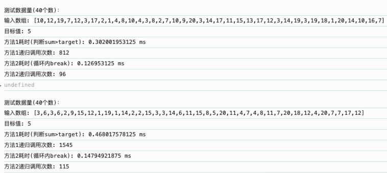
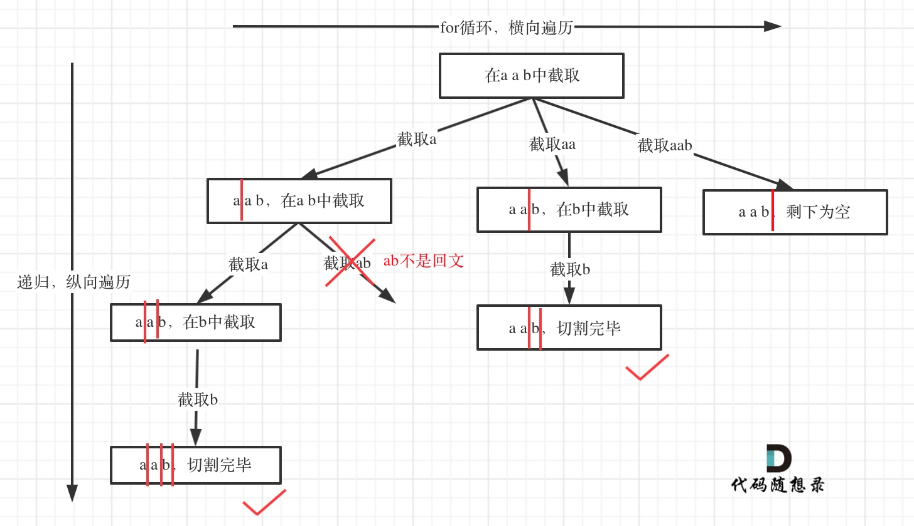

## 39. 组合总和 🌟🌟

[力扣链接](https://leetcode.cn/problems/combination-sum/description/) 🌟🌟

### 题目描述

给定一个无重复元素的数组 candidates 和一个目标数 target ，找出 candidates 中所有可以使数字和为 target 的组合。

candidates 中的数字可以无限制重复被选取。

说明：

- 所有数字（包括 target）都是正整数。
- 解集不能包含重复的组合。

示例 1：

- 输入：candidates = [2,3,6,7], target = 7,
- 所求解集为： [ [7], [2,2,3] ]

示例 2：

- 输入：candidates = [2,3,5], target = 8,
- 所求解集为： [ [2,2,2,2], [2,3,3], [3,5] ]

### 解题思路

本题与 [77. 组合](http://wangxiang.website/docs/leetcode/back-tracking-code.html#_77-%E7%BB%84%E5%90%88-%F0%9F%8C%9F%F0%9F%8C%9F) 区别是：**无数量要求**、**可无限重复**，限制总和。

1. 无限递归，直到总和大于 target，使用 result 收集。
2. 每次递归都是整个 candidates

#### 回溯法解题步骤

一维数组 path 来存放符合条件的结果，二维数组 result 来存放结果集

回溯三部曲：

**何时使用 startIndex？**

如果是一个集合求组合，就需要 startIndex；如果多个集合求组合，就不用 startIndex（各个集合相互不影响）

1. 回溯函数返回值以及参数

   - 参数 1：sum，记录 path 总和
   - 参数 2：startIndex，用于记录当前递归 for 循环的起始位置

     ```js
     void backtracking(sum, startIndex)
     ```

2. 回溯函数终止条件

   - sum 大于 target 时，终止
   - sum 等于 target 时，使用 result 收集

   ```js
   if (sum > target) {
     return
   }
   if (sum == target) {
     result.push(path)
     return
   }
   ```

3. 单层搜索的过程

   从 startIndex 开始，搜索 candidates 集合

   ```js
   for (let i = startIndex; i < candidates.length; i++) {
     const candidate = candidates[i]
     path.push(candidate)
     sum += candidate
     // 不用i+1了，表示可以重复读取当前的数
     backtracking(sum, i)
     sum -= candidate
     path.pop()
   }
   ```

### 代码

```js
var combinationSum = function (candidates, target) {
  let result = []
  let path = []
  const backtracking = (sum, startIndex) => {
    if (sum > target) {
      return
    }
    if (sum === target) {
      result.push([...path])
      return
    }

    for (let i = startIndex; i < candidates.length; i++) {
      const candidate = candidates[i]
      path.push(candidate)
      sum += candidate
      backtracking(sum, i)
      sum -= candidate
      path.pop()
    }
  }
  backtracking(0, 0)
  return result
}
```

#### 剪枝优化

- 未剪枝的情况

  进入 backtracking 后判断 sum>target 后返回，此时已经进入下一次递归。

- 剪枝后的情况

  在 for 循环内，如果下一层 sum>target 时，就可以提前结束本轮 for 循环遍历

```js
var combinationSum = function (candidates, target) {
  let result = []
  let path = []
  candidates.sort((a, b) => a - b) // 排序
  const backtracking = (sum, startIndex) => {
    if (sum === target) {
      result.push([...path])
      return
    }

    for (let i = startIndex; i < candidates.length; i++) {
      const candidate = candidates[i]
      // 提前结束
      if (sum + candidate > target) break
      path.push(candidate)
      sum += candidate
      backtracking(sum, i)
      sum -= candidate
      path.pop()
    }
  }
  backtracking(0, 0)
  return result
}
```

### 总结

剪枝操作写在**回溯函数的开头** 和 **循环内部提前 break**的区别：

#### 1. 剪枝位置对比分析

通过以下代码片段展示两种方式的差异：

##### 方式一：在循环内提前 `break`（更优）

```js
const backtrack = (start, path, sum) => {
  if (sum === target) {
    /* 记录结果 */
  }
  for (let i = start; i < candidates.length; i++) {
    const num = candidates[i]
    if (sum + num > target) break // ✅ 剪枝：后续元素更大，无需尝试
    path.push(num)
    backtrack(i, path, sum + num) // 允许重复选当前元素
    path.pop()
  }
}
```

##### 方式二：在函数开头判断 `sum > target`

```js
const backtrack = (start, path, sum) => {
  if (sum > target) return // ❌ 剪枝：无法阻止无效递归
  if (sum === target) {
    /* 记录结果 */
  }
  for (let i = start; i < candidates.length; i++) {
    const num = candidates[i]
    path.push(num)
    backtrack(i, path, sum + num)
    path.pop()
  }
}
```

#### 2. 核心差异解析

| 特性             | 循环内 `break`           | 函数开头 `return`        |
| ---------------- | ------------------------ | ------------------------ |
| **剪枝时机**     | 在尝试添加元素前预判     | 在递归进入后检测         |
| **作用范围**     | 阻止当前及后续元素的递归 | 仅终止当前递归路径       |
| **是否依赖排序** | 需要数组有序             | 不依赖排序               |
| **效率**         | 更高（提前阻断无效分支） | 较低（允许进入无效递归） |

#### 3. 实例对比演示

以 `candidates = [2,3,6,7]`, `target = 7` 为例：

##### 场景：当前路径和为 `sum = 5`，尝试添加 `3`

- 方式一（循环内 `break`）：  
  计算 `sum + 3 = 8 > 7` → 直接 `break`，跳过 `3` 及后续更大的 `6,7`，不再递归。**节省 3 次无效递归调用**。
- 方式二（函数开头 `return`）：  
  先添加 `3` → `sum = 8` → 进入递归后触发 `sum > target` 返回。**浪费了 1 次递归调用**，且后续更大的元素 `6,7` 仍会被递归。

#### 4. 数学原理

假设数组已排序（升序），对于任意 `i`，有 `candidates[i] <= candidates[i+1]`。  
当 `sum + candidates[i] > target` 时，对任意 `j > i`，必然有：

```js
sum + candidates[j] >= sum + candidates[i] > target
```

因此，在循环内 `break` 可以 **安全跳过所有后续元素**，而函数开头的判断无法阻止进入这些无效分支。

#### 5. 性能对比数据

| 指标         | 循环内 `break` | 函数开头 `return` |
| ------------ | -------------- | ----------------- |
| 递归调用次数 | 8              | 11                |
| 无效路径处理 | 立即终止       | 延迟终止          |
| 时间复杂度   | O(2^N)         | O(2^N) 但常数更大 |

```js
...
let count = 0  // 添加计数器
const backtracking = (sum, startIndex) => {
  count++  // 每次调用递归函数时计数加1
  ...
}
...

// 生成测试数据
function generateTestCase(size) {
  const candidates = Array.from(
    { length: size },
    () => Math.floor(Math.random() * 20) + 1
  )
  const target = 5
  return { candidates, target }
}

// 执行性能测试
function runPerformanceTest() {
  const testCases = [{ size: 40, label: '数据量(40个数)' }]

  testCases.forEach(({ size, label }) => {
    console.log(`\n测试${label}：`)
    const { candidates, target } = generateTestCase(size)
    console.log(`输入数组: [${candidates}]`)
    console.log(`目标值: ${target}`)

    console.time('方法1耗时(判断sum>target)')
    const result1 = combinationSum1(candidates, target)
    console.timeEnd('方法1耗时(判断sum>target)')
    console.log(`方法1递归调用次数: ${result1.recursionCount}`)

    console.time('方法2耗时(循环内break)')
    const result2 = combinationSum2(candidates, target)
    console.timeEnd('方法2耗时(循环内break)')
    console.log(`方法2递归调用次数: ${result2.recursionCount}`)
  })
}

// 运行测试
runPerformanceTest()
```



这里的测试用例，将 target 设置为 5，数组较大时，提前 break 耗时远远小于 函数开头的判断，递归次数也远小于函数开头的判断。

#### 6. 如何选择剪枝方式

- 优先循环内 `break`：  
  需先对数组排序，但能最大化剪枝效果，适合处理有序数据集（如组合总和问题）
- 函数开头 `return`：  
  适用于无序数组，或无法预判路径和的情况（如子集问题），但效率较低

## 40.组合总和 II 🌟🌟

[力扣链接](https://leetcode.cn/problems/combination-sum-ii/description/) 🌟🌟

### 题目描述

给定一个数组  candidates  和一个目标数  target ，找出  candidates  中所有可以使数字和为  target  的组合。

candidates  中的每个数字在每个组合中只能使用一次。

说明：所有数字（包括目标数）都是正整数。解集不能包含重复的组合。

- 示例  1:
- 输入: candidates = [10,1,2,7,6,1,5], target = 8,
- 所求解集为:

```js
;[
  [1, 7],
  [1, 2, 5],
  [2, 6],
  [1, 1, 6],
]
```

- 示例  2:
- 输入: candidates = [2,5,2,1,2], target = 5,
- 所求解集为:

```js
;[[1, 2, 2], [5]]
```

### 解题思路

本题与 [39. 组合总和](#39-组合总和-) 区别是：**不能重复**、**集合有重复元素**

**重点：集合重复元素进行去重操作**，跳过同一层中重复的元素，避免生成重复组合

回溯三部曲：

1. 回溯函数返回值以及参数

   - 参数 1：startIndex，用于记录当前递归的起始位置
   - 参数 2：sum，存储当前路径的和，path 内元素的总和

     ```js
     void backtracking(startIndex, sum)
     ```

2. 回溯函数终止条件

   ```js
   if (sum > target) {
     return
   }
   if (sum == target) {
     result.push_back(path)
     return
   }
   ```

3. 单层搜索的过程

   这里需要进行去重操作，判断同一层相同的元素是否已经使用过。

   - 需要对数组排序
   - 判断 `candidates[i] === candidates[i - 1]`，则说明已经使用过，continue

   ```js

   ```

### 代码

- **去重条件**：确保在同一层递归中检测重复元素，`i > start 在同一层级中尝试选择后续元素`，`candidates[i] === candidates[i-1] 检测重复元素`
- **剪枝操作**：若当前路径和加上候选元素超过目标，终止后续递归

```js
var combinationSum2 = function (candidates, target) {
  const result = []
  const path = []

  candidates.sort((a, b) => a - b)
  const backtracing = (startIndex, sum) => {
    if (sum === target) {
      result.push([...path])
      return
    }

    for (let i = startIndex; i <= candidates.length; i++) {
      if (i > startIndex && candidates[i] === candidates[i - 1]) continue

      const num = candidates[i]
      sum += num
      if (sum > target) break
      path.push(num)
      backtracing(i + 1, sum)
      sum -= num
      path.pop()
    }
  }
  backtracing(0, 0)
  return result
}
```

## 131.分割回文串 🌟🌟

[力扣链接](https://leetcode.cn/problems/palindrome-partitioning/description/) 🌟🌟

### 题目描述

给定一个字符串 s，将 s 分割成一些子串，使每个子串都是回文串。

返回 s 所有可能的分割方案。

示例: 输入: "aab" 输出: [ ["aa","b"], ["a","a","b"] ]

### 解题思路

**切割问题类似组合问题**

- 组合问题：选取一个 a 之后，在 ab 中再去选取第二个，选取 a 之后在 b 中选取第三个...
- 切割问题：切割一个 a 之后，在 ab 中再去切割第二个，切割 a 之后在 b 中切割第三个...



回溯三部曲：

1. 回溯函数返回值以及参数

   - 参数 1：startIndex 表示切割的位置（**不能重复切割，所以需要**）

2. 回溯函数终止条件

   当切割线切到字符串最后面，说明找到了一种切割方法，此时就是本层递归的终止条件

   在处理组合问题的时候，递归参数需要传入 startIndex，表示下一轮递归遍历的起始位置，这个 startIndex 就是切割线

   ```js
   if (start === n) {
     // 分割到末尾
     result.push([...path])
     return
   }
   ```

3. 单层搜索的过程

   for 循环中从 startIndex 到 i 就是要截取的子串，判断子串是否为回文，如果是，则加入到 path 中，不是则跳过

   ```js
   for (let end = start; end < n; end++) {
     if (isPalindrome(start, end)) {
       // 当前子串是回文
       path.push(s.slice(start, end + 1)) // 记录回文子串
       backtracking(end + 1) // 递归处理剩余部分
       path.pop() // 回溯
     }
   }
   ```

### 代码

```js
var partition = function (s) {
  const result = []
  const path = []
  const n = s.length

  // 判断子串 s[left..right] 是否为回文
  const isPalindrome = (left, right) => {
    while (left < right) {
      if (s[left] !== s[right]) return false
      left++
      right--
    }
    return true
  }

  const backtracking = (start) => {
    if (start === n) {
      // 分割到末尾
      result.push([...path])
      return
    }
    for (let end = start; end < n; end++) {
      if (isPalindrome(start, end)) {
        // 当前子串是回文
        path.push(s.slice(start, end + 1)) // 记录回文子串
        backtracking(end + 1) // 递归处理剩余部分
        path.pop() // 回溯
      }
    }
  }

  backtracking(0)
  return result
}
```

### 示例演示

输入 `s = "aab"` 的执行流程：

复制

```text
回溯树：
start=0
├─ end=0 ("a") → 有效
│  ├─ start=1
│  │  ├─ end=1 ("a") → 有效
│  │  │  └─ start=2 ("b") → 记录 ["a","a","b"]
│  │  └─ end=2 ("ab") → 非回文，跳过
│  └─ ...其他分支
├─ end=1 ("aa") → 有效
│  └─ start=2 ("b") → 记录 ["aa","b"]
└─ end=2 ("aab") → 非回文，跳过
输出：[["a","a","b"], ["aa","b"]]
```
