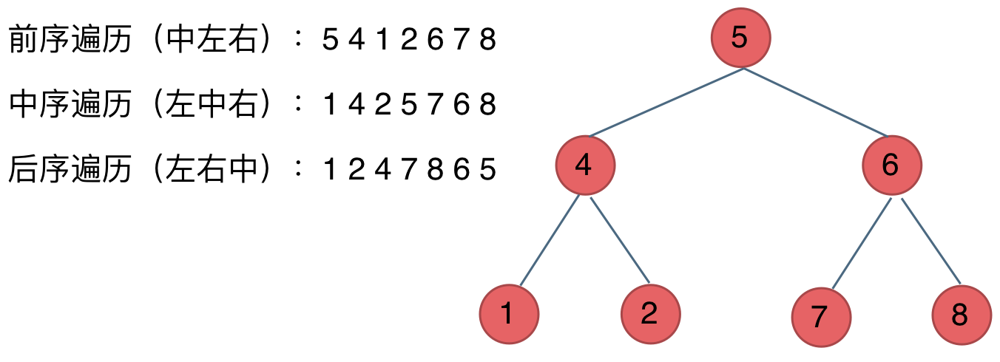

## 二叉树基础

树形结构，每个节点最多有两个子节点，称为**左子节点和右子节点**。

- 根节点：顶级节点，没有父节点
- 叶子结点：没有子节点的节点
- 子树：每个节点的左、右子节点分别构成左子树和右子树
- 深度：从根节点到最远叶子节点的最长路径上的节点数

### 分类

```js
// 构建示例树:
//       1
//      / \
//     2   3
//    / \
//   4   5
```

#### 普通二叉树

任意节点最多有两个子节点

#### 满二叉树

1. **所有叶子结点都在同一层**
2. 深度为 k 的满二叉树，最多有 2^k - 1 个节点

#### 完全二叉树

1. **除最后一层外，其他层节点必须填满，并且最后一层叶子节点必须靠左**
2. 若最底层为第 h 层（h 从 1 开始），则该层包含 1~ 2^(h-1) 个节点。

#### 二叉搜索树 BST

- 左子树所有节点值 < 根节点值
- 右子树所有节点值 > 根节点值

#### 平衡二叉搜索树 AVL

- 任意节点的左右子树高度差不超过 1
- 左右子树都会平衡二叉树

### 二叉树的存储方式

- 链式存储
- 顺序存储

一般使用链式存储

### 二叉树的遍历

#### 深度优先遍历

先往深走，遇到叶子结点再往回走

- 前序遍历：中左右
- 中序遍历：左中右
- 后序遍历：左右中

如下图例子所示：


**这里的前中后，指的是中间节点的遍历顺序**

#### 广度优先遍历

一层一层遍历

### 二叉树的定义

```js
// ES5
function TreeNode(val) {
  this.val = val // 节点值
  this.left = null // 左子节点（默认为空）
  this.right = null // 右子节点（默认为空）
}

// ES6
class TreeNode {
  constructor(val) {
    this.val = val
    this.left = null
    this.right = null
  }
}
```

## 二叉树递归排序

递归方法论：

1. **确定递归的参数和返回值**
2. **确定终止条件**，如果没有终止，会导致栈溢出
3. **确定单层递归的逻辑**

以前序遍历（根 -> 左 -> 右）为例：

1. 确定递归的参数和返回值

   - 递归参数：当前遍历节点
   - 返回值：存储遍历节点的数组

2. 确定终止条件

   - 如果本层遍历节点为空，则直接 return

3. 确定单层递归的逻辑

   - 前序遍历：中 左 右

```js
// 前序遍历
function preorderTraversal(root) {
  if (!root) return []
  return [
    root.val,
    ...perorderTraversal(root.left),
    ...preorderTraversal(root.right),
  ]
}

// 中序遍历
function inorderTraversal(root) {
  if (!root) return []
  return [
    ...perorderTraversal(root.left),
    root.val,
    ...preorderTraversal(root.right),
  ]
}

// 后序遍历
function postorderTraversal(root) {
  if (!root) return []
  return [
    ...perorderTraversal(root.left),
    ...preorderTraversal(root.right),
    root.val,
  ]
}
```

- [144.二叉树的前序遍历](https://leetcode.cn/problems/binary-tree-preorder-traversal/description/)
- [145.二叉树的后序遍历](https://leetcode.cn/problems/binary-tree-postorder-traversal/description/)
- [94.二叉树的中序遍历](https://leetcode.cn/problems/binary-tree-inorder-traversal/description/)

## 二叉树迭代遍历（非递归）

递归在底层也是通过栈来实现的

通过栈来模拟现二叉树的迭代遍历，避免递归造成的溢出风险

### 前序遍历

1. 初始化栈，将根节点入栈
2. 循环处理：
   1. 弹出栈顶元素，数值保存到数组中
   2. 如果有右子节点，入栈（**先右后左，保证左子树先出栈**）
   3. 如果有左子节点，入栈
3. 如果栈为空，则遍历结束

```js
function preorderTraversal(root) {
  if (!root) return []
  const stack = [root]
  const result = []

  while (stack.length) {
    const current = stack.pop()
    result.push(current.val)

    if (current.right) stack.push(current.right)
    if (current.left) stack.push(current.left)
  }
  return result
}
```

### 中序遍历

遍历二叉树的迭代过程，主要有两个操作：

1. 访问：遍历节点
2. 处理：将元素放进 result 数组中

中序遍历和前序遍历不同的是：

1. 前序遍历：先访问中间节点，同时处理的也是中间节点，即**访问和处理的元素顺序一致**
2. 中序遍历：先访问根结点，然后一层一层向下访问，直到到达左子树的最底部，再进行处理

```js
function inorderTraversal(root) {
  if (!root) return []
  const result = []
  const stack = []

  let cur = root
  while (cur || stack.length) {
    // 一直访问左子树，直到左子树为空
    while (cur) {
      stack.push(cur)
      cur = cur.left
    }

    // 循环处理栈
    cur = stack.pop()
    result.push(cur.val)
    // 处理右子树
    cur = cur.right
  }

  return result
}
```

### 后序遍历

- 前序遍历是 中 -> 左 -> 右
- 后序遍历是 左 -> 右 -> 中
- 只需要把前序遍历修改顺序成 中 -> 右 -> 左 的顺序，即**先入栈左子树，再入栈右子树**
- 再将数组结果进行反转（数指针）

```js
function postorderTraversal(root) {
  if (!root) return []
  const result = []
  const stack = [root]

  while (stack.length) {
    const current = stack.pop()
    result.push(current.val)

    if (current.left) stack.push(current.left)
    if (current.right) stack.push(current.right)
  }

  return result.reverse()
}
```

## 二叉树的统一迭代法

上面写出的中序遍历与其他两个的迭代法风格不统一，其主要原因是：**要访问和要处理的节点不一致**。

**此时可以将访问的节点放入栈中，再把要处理的节点也放入栈中但是需要另外做标记**

### 如何标记

空指针标记法：**要处理的节点放入栈后，紧接这放入一个空指针作为标记**，当栈中弹出 null 时，表示下一个节点需要被处理（即加入结果）。

那么此时压栈顺序应该如下：

- 前序遍历：中 -> 左 -> 右，压栈顺序为：右 -> 左 -> 中 -> null
- 中序遍历：左 -> 中 -> 右，压栈顺序为：右 -> 中 -> null -> 左
- 后序遍历：左 -> 右 -> 中，压栈顺序为：中 -> null -> 右 -> 左

如：

```js
// 构建示例树:
//       1
//      / \
//     2   3
//    / \
//   4   5
```

前序遍历：中 -> 左 -> 右，压栈顺序为：右 -> 左 -> 中 -> null

1. 初始化栈，将 1 压入栈
2. 循环处理：
   1. 弹出栈顶元素
      1. 为 null，则下个元素就是要处理的元素，添加到结果中，继续处理下一个元素
      2. 不为 null，则继续处理当前元素
   2. 压入 3，先右后左
   3. 压入 2
   4. 压入 null
3. 返回结果

```js
/**
 * 前序遍历统一迭代法
 * 顺序：中 -> 左 -> 右
 * 压栈顺序：右 -> 左 -> 中 -> null
 */
function preorderTraversal(root) {
  const result = []
  const stack = [root]
  while (stack.length) {
    const cur = stack.pop()

    if (!cur) {
      result.push(cur.pop().val)
      continue
    }

    if (cur.right) stack.push(cur.right)
    if (cur.left) stack.push(cur.left)
    stack.push(cur)
    stack.push(null)
  }
  return result
}
```

### 通过入栈顺序调整处理时机

入栈顺序决定了根节点的处理时机：

前序遍历：

```js
stack.push(node)
stack.push(null) // 根节点标记为待处理
stack.push(node.right) // 右子节点入栈（后处理）
stack.push(node.left) // 左子节点入栈（先处理）
```

根节点先被处理（标记后立即弹出 null）。

中序遍历：

```js
stack.push(node.right) // 右子节点入栈（后处理）
stack.push(node)
stack.push(null) // 根节点标记为待处理
stack.push(node.left) // 左子节点入栈（先处理）
```

根节点在左子树处理后处理。

后序遍历：

```js
stack.push(node)
stack.push(null) // 根节点标记为待处理
stack.push(node.right) // 右子节点入栈（后处理）
stack.push(node.left) // 左子节点入栈（先处理）
```

根节点在左右子树均处理后处理。

### 统一迭代法的核心逻辑

通过 **空指针标记** 和 **入栈顺序控制**，将三种遍历统一为同一框架：

1. 标记待处理的根节点：将根节点与空指针一起入栈(**在统一迭代法中，无论是哪种遍历方式，处理节点的时机都是在中节点的位置**)，表示该节点需要后续处理。
2. 控制子节点的入栈顺序：调整左右子节点的入栈顺序，间接决定根节点的处理时机。

## 二叉树的层序遍历

- 深度优先遍历：递归和迭代都使用栈来实现
- 广度优先遍历：二叉树的层序遍历（一层一层遍历二叉树），需要借助队列来实现

### 思路

1. 初始化队列：将根节点加入队列
2. 循环处理队列：
   1. 记录当前层的节点数量（队列长度）
   2. 依次取出当前层的所有节点，并将它们的值存入当前层的结果列表
   3. 将每个节点的非空左、右子节点加入队列
3. 逐层收集结果：将每层的节点值列表合并为最终结果

```js
//       1
//     /   \
//    2     3
//   / \     \
//  4   5     6
```

层序遍历过程：

1. 初始队列：[1] → 处理第 1 层 → result = [[1]]，子节点入队 [2, 3]
2. 处理第 2 层：弹出 2 和 3 → result = [[1], [2, 3]]，子节点入队 [4, 5, 6]
3. 处理第 3 层：弹出 4、5、6 → result = [[1], [2, 3], [4, 5, 6]]

### 代码实现

```js
function levelOrder(root) {
  if (!root) return []
  const result = []
  const queue = [root]

  while (queue.length) {
    const size = queue.length
    const curLevel = []

    for (let i = 0; i < size; i++) {
      const cur = queue.shift()
      curLevel.push(cur.val)

      if (cur.left) queue.push(cur.left)
      if (cur.right) queue.push(cur.right)
    }

    result.push(curLevel)
  }
  return result
}
```

leetcode 相关题目：

- [102.二叉树的层序遍历](https://leetcode.cn/problems/binary-tree-level-order-traversal/)
- [107.二叉树的层次遍历 II](https://leetcode.cn/problems/binary-tree-level-order-traversal-ii/) 二叉树层序遍历后**结果反转**
- [199.二叉树的右视图](https://leetcode.cn/problems/binary-tree-right-side-view/) 二叉树层序遍历后**遍历结果，拿子数组最后一个**
- [637.二叉树的层平均值](https://leetcode.cn/problems/average-of-levels-in-binary-tree/) 二叉树层序遍历**不记录节点值，记录每层总和的平均值**
- [429.N 叉树的层序遍历](https://leetcode.cn/problems/n-ary-tree-level-order-traversal/) 二叉树层序遍历**往队列 push 下层节点时，不再是 left 和 right，而是遍历 children**
- [515.在每个树行中找最大值](https://leetcode.cn/problems/find-largest-value-in-each-tree-row/) 二叉树层序遍历**不记录节点值，记录每层最大值**
- [116.填充每个节点的下一个右侧节点指针](https://leetcode.cn/problems/populating-next-right-pointers-in-each-node/) 二叉树层序遍历**如果不是每层最后一个节点，则将它的 next 指针指向队首，返回二叉树头节点**
- [117.填充每个节点的下一个右侧节点指针 II](https://leetcode.cn/problems/populating-next-right-pointers-in-each-node-ii/) 和 116 代码一摸一样
- [104.二叉树的最大深度](https://leetcode.cn/problems/maximum-depth-of-binary-tree/) 二叉树层序遍历，**记录一下遍历的层数就是二叉树的深度**
- [111.二叉树的最小深度](https://leetcode.cn/problems/minimum-depth-of-binary-tree/) 与 104 相似，只是当当前节点左右节点都为 null 时，提前返回 depth 深度
