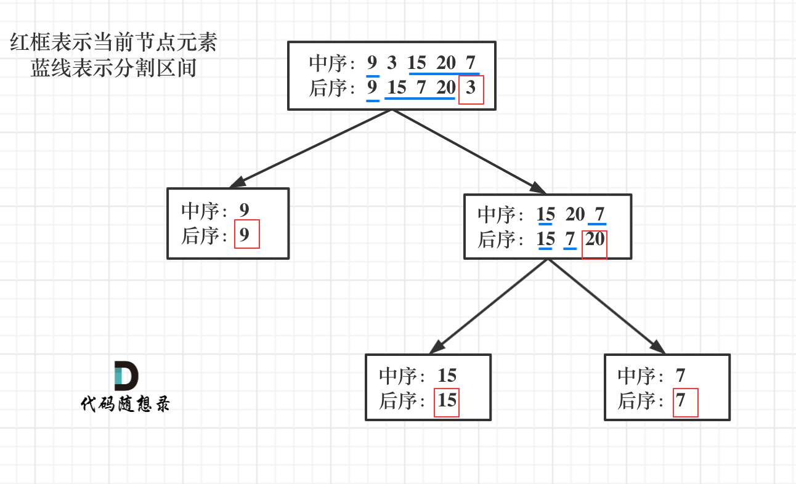

## 110.平衡二叉树 🌟🌟

[力扣链接](https://leetcode.cn/problems/find-bottom-left-tree-value/description/) 🌟🌟

### 题目描述

给定一个二叉树，在q树的最后一行找到最左边的值。

示例 1:

给定二叉树 [2, 1, 3]

```js
//       2
//      / \
//     1  3
```

输出：1

示例 2:

给定二叉树 [1, 2, 3, 4, 5, 6, 7]

```js
//       1
//      / \
//     2  3
//    /  / \
//   4  5  6
//      /
//     7
```

输出：7

### 解题思路

- 关键：在树的**最底层**找到**最左边**的值
- **最底层**：二叉树最大深度的一层
- **最左边**：该层中最靠左边的节点

#### 递归

递归三部曲：

1. 明确递归函数的参数和返回值

   - 参数 1：当前传入节点
   - 参数 2：当前节点的深度
   - 返回值：无

2. 明确终止条件

   - 遇到叶子节点 `!root.left && !root.right`，当前深度与最大深度比较，大于最大深度，则更新最大深度 maxDepth 和最大深度最左边的值 result

3. 确定单层递归逻辑

   - 分别计算左子树和右子树最大深度

```js
function findBottomLeftValue(root) {
  let result = 0
  let maxDepth = 0

  const traverse = (node, depth) => {
    if (!node) return

    if (!node.left && !node.right) {
      if (depth > maxDepth) {
        maxDepth = depth
        result = node.val
      }
    }

    traverse(node.left, depth + 1)
    traverse(node.right, depth + 1)
  }

  traverse(root, 0)
}
```

#### 迭代

**求最后一行第一个节点的数值**

```js
function findBottomLeftValue(root) {
  if (!root) return null
  let result = 0
  const queue = [root]

  while (queue.length) {
    const length = queue.length
    for (let i = 0; i < length; i++) {
      const cur = queue.shift()
      if (i === 0) result = cur.val
      cur.left && queue.push(cur.left)
      cur.right && queue.push(cur.right)
    }
  }

  return result
}
```

## 112. 路径总和 🌟

[力扣链接](https://leetcode.cn/problems/path-sum/description/) 🌟

### 题目描述

给定一个二叉树和一个目标和，判断该树中是否存在根节点到叶子节点的路径，这条路径上所有节点值相加等于目标和。

说明: 叶子节点是指没有子节点的节点。

示例: 给定如下二叉树，以及目标和 sum = 22，

```js
//       5
//      / \
//     4  8
//    /  / \
//   11 13 4
//   /\     \
//  7 2     1
```

返回 true, 因为存在目标和为 22 的根节点到叶子节点的路径 5->4->11->2。

### 解题思路

#### 递归

递归三部曲：

1. 确定递归函数的参数和返回值

   - 参数 1：根节点
   - 参数 2：计数器，用来计算二叉树的一条边之和是否等于目标值
   - 返回值：bool

2. 确定终止条件

   从根节点开始目标值递减，直到叶子节点时判断是否为 0

   ```js
   if (!node.left && !node.right) {
     return count === 0
   }
   ```

3. 确定单层递归逻辑

   - 递归左右子节点，传递剩余和 `count - cur.left.val` `count - cur.right.val`

```js
function hasPathSum(root, count) {
  if (!root) return false

  if (!root.left && !root.right) {
    return count === root.val
  }

  return (
    hasPathSum(root.left, count - root.val) ||
    hasPathSum(root.right, count - root.val)
  )
}
```

#### 迭代

与递归不同，迭代记录当前路径和，再与目标值进行比较

步骤：

1. 初始化栈：根节点和初始和存入栈
2. 遍历栈：弹出节点及当前和，若为叶子且和等于目标值，返回 true
3. 压入子节点：将左右子节点及更新后的和压入栈

```js
function hasPathSum(root, count) {
  if (!root) return false

  const stack = [[root, root.val]]
  while (stack.length) {
    const [node, currentCount] = stack.pop()

    if (!node.left && !node.right && count === currentCount) {
      return true
    }

    node.left && stack.push([node.left, currentCount + node.left.val])
    node.right && stack.push([node.right, currentCount + node.right.val])
  }

  return false
}
```

## 113. 路径总和 II 🌟🌟

[力扣链接](https://leetcode.cn/problems/path-sum-ii/description/) 🌟🌟

### 题目描述

给你二叉树的根节点 root 和一个整数目标和 targetSum ，找出所有 从根节点到叶子节点 路径总和等于给定目标和的路径。

叶子节点 是指没有子节点的节点。

示例: 给定如下二叉树，以及目标和 sum = 22，

```js
//       5
//      / \
//     4  8
//    /  / \
//   11 13 4
//   /\   / \
//  7 2   5 1
```

输出：[[5,4,11,2],[5,8,4,5]]

### 解题思路

#### 递归

递归三部曲：

1. 确定递归函数的参数和返回值

   - 参数 1：根节点
   - 参数 2：计数器，用来计算二叉树的一条边之和是否等于目标值
   - 返回值：void

2. 确定终止条件

   从根节点开始目标值递减，当前节点是叶子节点且剩余和等于节点值 → 保存路径。

   ```js
   if (!node.left && !node.right && node.val === count) {
   }
   ```

3. 确定单层递归逻辑

   - 递归左右子节点，传递剩余和 `count - cur.val` `count - cur.val`
   - 递归结束后回溯（从路径中移除当前节点）

```js
function pathSum(root, count) {
  if (!root) return
  const result = []
  const currentPath = []

  const traverse = (node, targetNum) => {
    if (!node) return

    currentPath.push(node.val)
    if (!node.left && !node.right && node.val === targetNum) {
      result.push([...currentPath]) // 深拷贝 避免后续影响
    }

    node.left && traverse(node.left, targetNum - node.left.val)
    node.right && traverse(node.right, targetNum - node.right.val)
    currentPath.pop() // 回溯：移除当前节点
  }

  traverse(root, count)

  return result
}
```

#### 迭代

用栈存储节点、剩余和及当前路径。遍历时更新路径和剩余和，遇到叶子节点且满足条件则保存路径。

步骤：

1. 初始化栈：根节点、目标和、空路径入栈
2. 遍历栈：弹出节点，若为叶子且剩余和等于节点值，保存路径
3. 压入子节点：将左右子节点、更新后的剩余和及新路径压入栈

```js
function pathSum(root, targetSum) {
  if (!root) return []

  const result = []
  const stack = [[root, targetSum, []]]
  while (stack.length) {
    const [node, currentCount, path] = stack.pop()

    const currentPath = [...path, node.val]
    if (!node.left && !node.right && node.val === currentCount) {
      result.push(currentPath)
    }

    node.left && stack.push([node.left, currentCount - node.val, currentPath])
    node.right && stack.push([node.right, currentCount - node.val, currentPath])
  }

  return result
}
```

## 106. 从中序与后序遍历序列构造二叉树 🌟🌟

[力扣链接](https://leetcode.cn/problems/construct-binary-tree-from-inorder-and-postorder-traversal/description/) 🌟🌟

### 题目描述

根据一棵树的中序遍历与后序遍历构造二叉树。

注意: 你可以假设树中没有重复的元素。

例如，给出

中序遍历 inorder = [9,3,15,20,7]
后序遍历 postorder = [9,15,7,20,3] 返回如下的二叉树：

```js
//       3
//      / \
//     9  20
//       / \
//      15 7
```

### 解题思路

构造二叉树流程：



1. 如果后序数组大小为零，说明时空节点，停止
2. 如果不为空，取后序数组最后一个元素就是根节点（**后序确定根节点**）
3. 找到后序数组最后一个元素在中序数组中的位置，作为切割点（**中序分割左右子树**）
4. 切割中序数组，中序左数组作为左子树，中序右数组作为右子树
5. 根据中序左数组长度
6. 切割后序数组，切成后序左数组作为左子树，和后序右数组作为右子树
7. 递归 1 - 5 步骤

#### 递归三部曲

1. 确定递归函数的参数和返回值

   - 参数 1：中序数组
   - 参数 2：后序数组
   - 返回值：根节点

2. 确定终止条件

   - 数组长度为空时，返回 null

3. 确定单层递归逻辑

   - 获取后序数组最后一个元素，作为根节点 `const rootVal = postorder.pop()`
   - 获取中序数组中根节点的 index `const rootIndex = inorder.indexOf(rootVal)`
   - 以根节点创建树 `const root = new TreeNode(rootVal)`
   - 递归构造左子树 `root.left = buildTree(inorder.slice(0, rootIndex), postorder.slice(0, rootIndex))`
   - 递归构造右子树 `root.right = buildTree(inorder.slice(rootIndex + 1), postorder.slice(rootIndex))`

### 代码

```js
function buildTree(inorder, postorder) {
  if (inorder.length === 0) return null

  const rootVal = postorder.pop()
  const rootIndex = inorder.indexOf(rootVal)
  const root = new TreeNode(rootVal)

  root.left = buildTree(
    inorder.slice(0, rootIndex),
    postorder.slice(0, rootIndex)
  )
  root.right = buildTree(
    inorder.slice(rootIndex + 1),
    postorder.slice(rootIndex)
  )

  return root
}
```

## 105. 从前序与中序遍历序列构造二叉树 🌟🌟

[力扣链接](https://leetcode.cn/problems/construct-binary-tree-from-preorder-and-inorder-traversal/description/) 🌟🌟

### 题目描述

给给定两个整数数组 preorder 和 inorder ，其中 preorder 是二叉树的先序遍历， inorder 是同一棵树的中序遍历，请构造二叉树并返回其根节点。

### 解题思路

#### 代码

```js
var buildTree = function (preorder, inorder) {
  if (!preorder.length) return null
  const rootVal = preorder.shift()
  const rootIndex = inorder.indexOf(rootVal)
  const root = new TreeNode(rootVal)

  root.left = buildTree(
    preorder.slice(0, rootIndex),
    inorder.slice(0, rootIndex)
  )
  root.right = buildTree(
    preorder.slice(rootIndex),
    inorder.slice(rootIndex + 1)
  )
  return root
}
```
