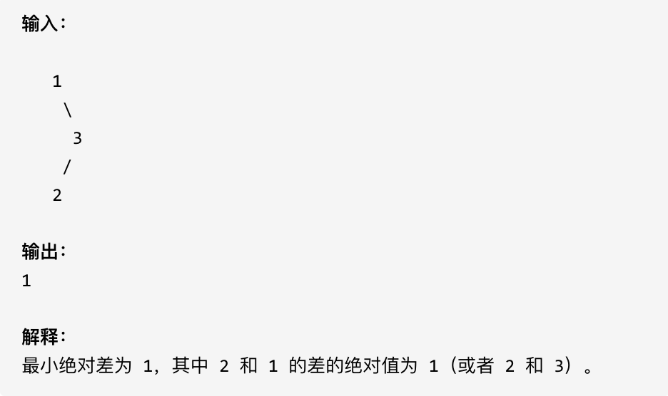

## 530.二叉搜索树的最小绝对差 🌟

[力扣链接](https://leetcode.cn/problems/minimum-absolute-difference-in-bst/description/) 🌟

### 题目描述

给你一棵所有节点为非负值的二叉搜索树，请你计算树中任意两节点的差的绝对值的最小值。

示例 ：



### 解题思路

1. 利用中序遍历，得到一个有序数组
2. 求有序数组，相邻元素的最小差值

时间复杂度和空间复杂度都是 O(n)

优化：
不需要存储整个数组，而是在中序遍历的过程中，记录前一个节点的值，然后每次计算当前节点与前一个节点的差值，并维护一个最小值

#### 递归

递归三部曲：

1. 明确递归函数的参数和返回值

   - 参数 1：根节点
   - 返回值：不需要返回值，实时更新最小值

2. 明确终止条件

   - 节点不存在时，终止

3. 确定单层递归逻辑

   - 递归左子树
   - 处理中间节点逻辑

     ```js
     // 前一个节点值
     if (prev) {
       minDiff = Math.min(minDiff, node.val - prev)
     }
     prev = node.val
     ```

   - 递归右子树

```js
function getMinimumDifference(root) {
  let minDiff = Infinity
  let prev = null

  const traverse = (root) => {
    if (!root) return

    traverse(root.left)
    if (prev) minDiff = Math.min(minDiff, root.val - prev.val)
    prev = root
    traverse(root.right)
  }

  traverse(root)
  return minDiff
}
```

#### 迭代

- 初始化战，先将所有左子节点入栈
- 依次弹出节点处理，处理完当前节点后转向右子树
- 同样维护 prev 和 minDiff，实时计算相邻节点差值

```js
var getMinimumDifference = function (root) {
  let stack = []
  let curr = root
  let prev = null
  let minDiff = Infinity

  while (curr || stack.length) {
    while (curr) {
      stack.push(curr)
      curr = curr.left
    }
    curr = stack.pop()
    if (prev !== null) {
      minDiff = Math.min(minDiff, curr.val - prev)
    }
    prev = curr.val
    curr = curr.right
  }
  return minDiff
}
```

## 501.二叉搜索树中的众数 🌟

[力扣链接](https://leetcode.cn/problems/find-mode-in-binary-search-tree/) 🌟

### 题目描述

给定一个有相同值的二叉搜索树（BST），找出 BST 中的所有众数（出现频率最高的元素）。

假定 BST 有如下定义：

- 结点左子树中所含结点的值小于等于当前结点的值
- 结点右子树中所含结点的值大于等于当前结点的值
- 左子树和右子树都是二叉搜索树

例如：

给定 BST [1,null,2,2],

```js
//       1
//        \
//        2
//       /
//      2
```

返回[2].

提示：如果众数超过 1 个，不需考虑输出顺序

进阶：你可以不使用额外的空间吗？（假设由递归产生的隐式调用栈的开销不被计算在内）

### 解题思路

#### 递归

如果不是二叉搜索树，遍历树节点，用 map 统计频率

如果是二叉搜索树，中序遍历时统计当前值的出现次数，每访问一个节点，比较节点值和 currentVal。如果相同，currentCount 加 1；否则，重置 currentVal 和 currentCount 为 1

递归三部曲：

1. 确定递归函数的参数和返回值

   - 参数：根节点
   - 返回值：不需要

2. 确定终止条件

   遇到空节点返回

   ```js
   if (!root) return
   ```

3. 确定单层递归逻辑

   - 递归处理左子树
   - 中间节点处理逻辑
     - 当前值 currentVal 等于 root.val 时，当前节点的频率 currentCount++
     - 否则重置 currentCount=1，currentVal=root.val
     -
     - 比较当前节点的频率和最大频率 maxCount
       - 相同，将当前节点加入结果数组；
       - 大于最大频率，更新最大频率和结果数组
   - 递归处理右子树

```js
function findMode(root) {
  let maxCount = 0
  let result = []
  let currentVal = null
  let currentCount = 0

  const inOrderTraverse = (root) => {
    if (!root) return
    inOrderTraverse(root.left)

    if (node.val === currentVal) {
      currentCount++
    } else {
      currentVal = node.val // 发现新数值
      currentCount = 1 // 重置计数器
    }
    if (currentCount > maxCount) {
      maxCount = currentCount // 刷新最高纪录
      result = [currentVal] // 清空旧结果
    } else if (currentCount === maxCount) {
      result.push(currentVal) // 并列众数加入
    }

    inOrderTraverse(root.right)
  }

  inOrderTraverse(root)

  return result
}
```

#### 迭代

```js
const findMode = function (root) {
  let currentVal = null
  let currentCount = 0
  let maxCount = 0
  let result = []
  const stack = []
  let node = root

  while (node || stack.length) {
    // 深入左子树
    while (node) {
      stack.push(node)
      node = node.left
    }

    node = stack.pop() // 取出当前节点

    // 统计频率
    if (node.val === currentVal) {
      currentCount++
    } else {
      currentVal = node.val
      currentCount = 1
    }

    // 更新结果
    if (currentCount > maxCount) {
      maxCount = currentCount
      result = [currentVal]
    } else if (currentCount === maxCount) {
      result.push(currentVal)
    }

    // 转向右子树
    node = node.right
  }

  return result
}
```

## 236. 二叉树的最近公共祖先 🌟🌟

[力扣链接](https://leetcode.cn/problems/lowest-common-ancestor-of-a-binary-tree/description/) 🌟🌟

### 题目描述

给定一个二叉树, 找到该树中两个指定节点的最近公共祖先。

百度百科中最近公共祖先的定义为：“对于有根树 T 的两个结点 p、q，最近公共祖先表示为一个结点 x，满足 x 是 p、q 的祖先且 x 的深度尽可能大（一个节点也可以是它自己的祖先）。”

例如，给定如下二叉树: root = [3,5,1,6,2,0,8,null,null,7,4]

示例:

```js
//        3
//       / \
//      5   1
//     / \ / \
//    6  2 0 8
//      / \
//     7  4
```

示例 1: 输入: root = [3,5,1,6,2,0,8,null,null,7,4], p = 5, q = 1 输出: 3 解释: 节点 5 和节点 1 的最近公共祖先是节点 3。

示例  2: 输入: root = [3,5,1,6,2,0,8,null,null,7,4], p = 5, q = 4 输出: 5 解释: 节点 5 和节点 4 的最近公共祖先是节点 5。因为根据定义最近公共祖先节点可以为节点本身。

说明:

- 所有节点的值都是唯一的。
- p、q 为不同节点且均存在于给定的二叉树中

### 解题思路

**二叉树中两个节点的公共祖先可能有多个（比如，根节点肯定是所有节点的公共祖先。），但最近的那个就是离他们最近的共同父节点。**

采用后序遍历

#### 递归

递归三部曲：

1. 确定递归函数的参数和返回值

   - 参数 1：根节点
   - 参数 2：p
   - 参数 3：q
   - 返回值：找到 p 或 q 就返回

2. 确定终止条件

   如果 root 为 null 或者找到数值了，返回 root

   ```js
   if (!root || node === q || root === p) return root
   ```

3. 确定单层递归逻辑

   - 递归遍历左子树
   - 递归遍历右子树
   - 处理中间逻辑
     - 如果左右都不为 null，则说明 q 和 p 分别在左子树和右子树中找到了，当前 root 节点就是要找的最近公共祖先
     - 如果单侧找到目标，则返回找到结果

```js
const lowestCommonAncestor = function (root, p, q) {
  // 递归终止条件：空节点或找到目标节点
  if (!root || root === p || root === q) return root

  // 递归查找左右子树
  const left = lowestCommonAncestor(root.left, p, q)
  const right = lowestCommonAncestor(root.right, p, q)

  // 情况判断
  if (left && right) return root // 当前节点为LCA
  return left || right // 返回非空子节点
}
```