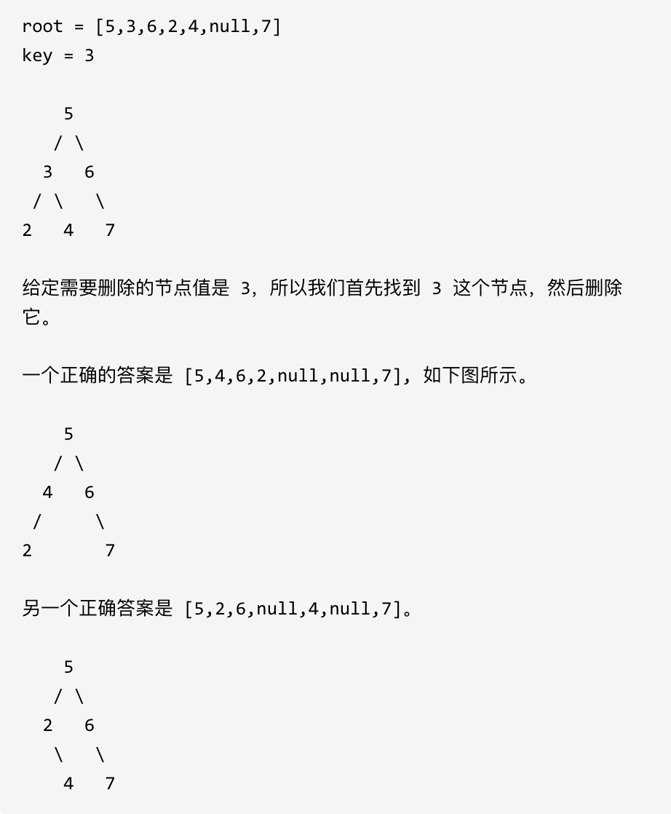

## 235. 二叉搜索树的最近公共祖先 🌟🌟

[力扣链接](https://leetcode.cn/problems/lowest-common-ancestor-of-a-binary-search-tree/description/) 🌟🌟

### 题目描述

给定一个二叉搜索树, 找到该树中两个指定节点的最近公共祖先。

百度百科中最近公共祖先的定义为：“对于有根树 T 的两个结点 p、q，最近公共祖先表示为一个结点 x，满足 x 是 p、q 的祖先且 x 的深度尽可能大（一个节点也可以是它自己的祖先）。”

例如，给定如下二叉搜索树: root = [6,2,8,0,4,7,9,null,null,3,5]

示例 1:

- 输入: root = [6,2,8,0,4,7,9,null,null,3,5], p = 2, q = 8
- 输出: 6
- 解释: 节点 2 和节点 8 的最近公共祖先是 6。

示例 2:

- 输入: root = [6,2,8,0,4,7,9,null,null,3,5], p = 2, q = 4
- 输出: 2
- 解释: 节点 2 和节点 4 的最近公共祖先是 2, 因为根据定义最近公共祖先节点可以为节点本身。

说明:

- 所有节点的值都是唯一的。
- p、q 为不同节点且均存在于给定的二叉搜索树中。

```js
// 输出 树根节点
//       6
//      / \
//     2   8
//    / \ / \
//   0  4 7 9
//     / \
//    3  5
```

### 解题思路

二叉搜索树

- p 和 q 值都小于当前节点值时，p 和 q 的最近公共祖先就在左子树
- p 和 q 值都大于当前节点值时，p 和 q 的最近公共祖先就在右子树
- 否则，**当前节点就是 p 和 q 的最近公共祖先**（此时 p 和 q 分布在当前节点的两侧，或其中一个等于当前节点）

  如上述二叉搜索树：如果 2 处于[p, q]之间时，此时 p 就在节点 2 的左子树，q 在节点 2 的右子树，那么 2 就一定是 p 和 q 的最近公共祖先。

递归三部曲：

1. 明确递归函数的参数和返回值

   - 参数 1：当前节点
   - 参数 2：p
   - 参数 3:q
   - 返回值：最近公共节点

2. 明确终止条件

   - 当节点为 null 返回 null

3. 确定单层递归逻辑

   - p 和 q 值都大于 当前节点值时，继续遍历左子树
   - p 和 q 值都小于 当前节点值时，继续遍历右子树
   - 否则，返回当前节点

     ```js
     if (cur.val > p.val && cur.val > q.val)
       if (cur.val < p.val && cur.val < q.val)
         // 遍历左子树
         // 遍历右子树
         return cur
     ```

```js
function lowestCommonAncestor(root, p, q) {
  if (!root) return null

  if (root.val > p.val && root.val > q.val) {
    return lowestCommonAncestor(root.left, p, q)
  } else if (root.val < p.val && root.val < q.val) {
    return lowestCommonAncestor(root.right, p, q)
  } else {
    return root
  }
}
```

```js
// 迭代法
var lowestCommonAncestor = function (root, p, q) {
  if (!root) return null
  while (root) {
    if (root.val < p.val && root.val < q.val) {
      return lowestCommonAncestor(root.right, p, q)
    }
    if (root.val > p.val && root.val > q.val) {
      return lowestCommonAncestor(root.left, p, q)
    }
    return root
  }
}
```

## 701.二叉搜索树中的插入操作 🌟🌟

[力扣链接](https://leetcode.cn/problems/insert-into-a-binary-search-tree/) 🌟🌟

### 题目描述

给定二叉搜索树（BST）的根节点和要插入树中的值，将值插入二叉搜索树。 返回插入后二叉搜索树的根节点。 输入数据保证，新值和原始二叉搜索树中的任意节点值都不同。

注意，可能存在多种有效的插入方式，只要树在插入后仍保持为二叉搜索树即可。 你可以返回任意有效的结果。

示例:

```js
// 给定二叉搜索树：
//       4
//      / \
//     2  7
//    / \
//   1  3
// 和 插入的值：5

// 返回二叉树
//       4
//      / \
//     2   7
//    /\  /
//   1 3 5
// 或者这个树也是有效的
//       5
//      / \
//     2   7
//    / \
//   1  3
//      \
//      4
```

提示：

- 给定的树上的节点数介于 0 和 10^4 之间
- 每个节点都有一个唯一整数值，取值范围从 0 到 10^8
- -10^8 <= val <= 10^8
- 新值和原始二叉搜索树中的任意节点值都不同

## [#](https://programmercarl.com/0701.%E4%BA%8C%E5%8F%89%E6%90%9C%E7%B4%A2%E6%A0%91%E4%B8%AD%E7%9A%84%E6%8F%92%E5%85%A5%E6%93%8D%E4%BD%9C.html#算法公开课)

### 解题思路

#### 递归

递归三部曲：

1. 确定递归函数的参数和返回值

   - 参数 1：当前节点
   - 参数 2：要插入的值
   - 返回值：root

2. 确定终止条件

   如果当前节点为 null，则根据值创建新节点

   ```js
   if (!root1) return new TreeNode(val)
   ```

3. 确定单层递归逻辑

   - 当前节点值大于 val，继续遍历左子树
   - 当前节点值小于 val，继续遍历右子树
   - 否则，返回返回当前节点

```js
function insertIntoBST(root, val) {
  const setInOrder = (root, val) => {
    if (!root) return new TreeNode(val)

    if (root.val > val) root.left = setInOrder(root.left, val)
    if (root.val < val) root.right = setInOrder(root.right, val)

    return root
  }

  return setInOrder(root, val)
}
```

#### 迭代

步骤：

1. 记录当前节点 root 以及父节点 parent（初始化时定义）
2. 循环遍历当前节点，比较当前节点值和插入值
3. 如果当前节点不为空，更新当前节点为左或右子节点，同时更新父节点
4. 如果当前节点为空，根据父节点的值和插入值的大小，决定插入到左还是右
5. 返回 root

```js
function insertIntoBST(root, val) {
  if (!root) {
    return new TreeNode(val)
  } else {
    let parent = null
    let cur = root
    while (cur) {
      parent = cur
      if (cur.val > val) {
        cur = cur.left
      } else {
        cur = cur.right
      }
    }
    let node = new TreeNode(val)
    if (parent.val > val) {
      parent.left = node
    } else {
      parent.right = node
    }
  }
  return root
}
```

## 450.删除二叉搜索树中的节点 🌟🌟

[力扣链接](https://leetcode.cn/problems/delete-node-in-a-bst/description/) 🌟🌟

### 题目描述

给定一个二叉搜索树的根节点 root 和一个值 key，删除二叉搜索树中的 key 对应的节点，并保证二叉搜索树的性质不变。返回二叉搜索树（有可能被更新）的根节点的引用。

一般来说，删除节点可分为两个步骤：

首先找到需要删除的节点； 如果找到了，删除它。 说明： 要求算法时间复杂度为 $O(h)$，h 为树的高度。

示例:



### 解题思路

删除节点情况：

1. 没找到删除节点，则返回 null
2. 删除节点是叶子节点，直接删除，不影响其他节点
3. 删除节点只有一个子节点，删除节点，并用子节点替换删除节点
4. 删除节点有两个子节点，则将删除节点的左子树头结点（左孩子）放到删除节点的右子树的最左面节点的左孩子上（右子树中最小值），返回删除节点右孩子为新的根节点

#### 递归

递归三部曲：

1. 确定递归函数的参数和返回值

   - 参数 1：根节点
   - 参数 2：要删除的值
   - 返回值：搜索的值所在的节点

2. 确定终止条件

   如果 root 为 null 则说明没找到删除的节点，返回 root

   ```js
   if (!root) return root
   ```

3. 确定单层递归逻辑

   - 要删除的值大于 root.val，则继续递归右子树
   - 要删除的值小于 root.val，则继续递归左子树
   - 要删除的值就是当前节点时：
     - 节点是叶子结点
     - 节点只有一个子节点，则返回
     - 左右节点都存在，将将当前节点的左子树头节点指向右子树最左边节点，并将右子树指向删除节点的父节点

```js
function deleteNode(root, key) {
  if (!root) return root
  if (root.val > key) {
    root.left = deleteNode(root.left, key)
  } else if (root.val < key) {
    root.right = deleteNode(root.right, key)
  } else {
    if (!root.left && !root.right) return null
    if (!root.left && root.right) return root.right
    if (!root.right && root.left) return root.left

    const rightNode = root.right
    const minNode = getMinNode(root.right)
    root.val = minNode.val
    root.right = deleteNode(rightNode, minNode.val)
  }
  return root
}
function getMinNode(node) {
  while (node.left) node = node.left;
  return node;
}
```

#### 迭代

```js
function deleteNodeIterative(root, key) {
  let parent = null;
  let current = root;
  
  // 查找目标节点
  while (current && current.val !== key) {
    parent = current;
    current = key < current.val ? current.left : current.right;
  }
  
  if (!current) return root; // 未找到
  
  // Case 1: 无子节点
  if (!current.left && !current.right) {
    if (!parent) return null; // 删除根节点
    parent[current === parent.left ? 'left' : 'right'] = null;
    return root;
  }
  
  // Case 2: 单个子节点
  if (!current.left || !current.right) {
    const child = current.left || current.right;
    if (!parent) return child; // 删除根节点
    parent[current === parent.left ? 'left' : 'right'] = child;
    return root;
  }
  
  // Case 3: 两个子节点
  const successorParent = current;
  let successor = current.right;
  while (successor.left) {
    successorParent = successor;
    successor = successor.left;
  }
  
  current.val = successor.val;
  if (successorParent === current) {
    successorParent.right = successor.right;
  } else {
    successorParent.left = successor.right;
  }
  
  return root;
}
```
