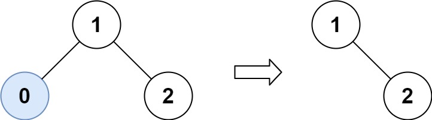

## 669. 修剪二叉搜索树 🌟🌟

[力扣链接](https://leetcode.cn/problems/trim-a-binary-search-tree/) 🌟🌟

### 题目描述

给定一个二叉搜索树，同时给定最小边界 L 和最大边界 R。通过修剪二叉搜索树，使得所有节点的值在[L, R]中 (R>=L) 。你可能需要改变树的根节点，所以结果应当返回修剪好的二叉搜索树的新的根节点。

示例 1:



示例 2:


### 解题思路

修剪二叉搜索树的关键：**当某个节点的值不在范围内时，应该如何调整其子树，使得调整后的树仍然保持 BST 的结构**。

#### 递归

- 当前节点值小于 low，其左子树的所有节点值更小，都不在范围内，这时候递归处理右子树，并返回处理后的节点作为当前节点
- 当前节点值大于 high，其右子树的所有节点值更大，都不在范围内，递归处理左子树，并返回处理后的节点作为当前节点
- 当前节点值在 low 和 high 之间时，需要同时处理左右子树，并将处理后的节点作为当前节点的左右孩子

递归三部曲：

1. 明确递归函数的参数和返回值

   - 参数 1：当前节点
   - 参数 2：low
   - 参数 3：high
   - 返回值：处理后的节点

2. 明确终止条件

   - 当节点为 null 返回 null

3. 确定单层递归逻辑

   - node.val < low，左子树都小于 low，递归处理右子树

     ```js
     if (node.val < low) {
       return trimBST(root.right, low, high)
     }
     ```

   - node.val > high，右子树都大于 high，递归处理左子树

     ```js
     if (node.val > high) {
       return trimBST(root.left, low, high)
     }
     ```

   - 否则，node.val 在范围内，递归左右子树

     ```js
     node.left = trimBST(root.left, low, high)
     node.right = trimBST(root.right, low, high)
     return node
     ```

```js
function trimBST(root, low, high) {
  if (!root) return null

  if (root.val < low) {
    return trimBST(root.right, low, high)
  }
  if (root.val > high) {
    return trimBST(root.left, low, high)
  }

  root.left = trimBST(root.left, low, high)
  root.right = trimBST(root.right, low, high)
  return root
}
```

#### 迭代

迭代方法通过队列遍历所有节点，逐步调整结构：

1. **调整根节点**：找到第一个符合范围的节点作为新根。
2. **层序处理每个节点**：
   - **处理左子节点**：若左子节点的值小于 `low`，则用其右子树替换，直到符合条件。
   - **处理右子节点**：若右子节点的值大于 `high`，则用其左子树替换，直到符合条件。

```js
function trimBST(root, low, high) {
  // 1. 调整根节点
  while (root && (root.val < low || root.val > high)) {
    root = root.val < low ? root.right : root.left
  }
  if (!root) return null

  // 2. 层序遍历处理所有节点
  const queue = [root]
  while (queue.length) {
    const node = queue.shift()

    // 处理左子节点
    while (node.left && node.left.val < low) {
      node.left = node.left.right
    }
    if (node.left) queue.push(node.left)

    // 处理右子节点
    while (node.right && node.right.val > high) {
      node.right = node.right.left
    }
    if (node.right) queue.push(node.right)
  }

  return root
}
```

## 108.将有序数组转换为二叉搜索树 🌟

[力扣链接](https://leetcode.cn/problems/convert-sorted-array-to-binary-search-tree/description/) 🌟

### 题目描述

将一个按照升序排列的有序数组，转换为一棵高度平衡二叉搜索树。

本题中，一个高度平衡二叉树是指一个二叉树每个节点 的左右两个子树的高度差的绝对值不超过 1。


### 解题思路

升序数组：**二叉搜索树的中序遍历结果就是一个升序数组**

#### 利用升序数组构造二叉搜索树

不能随便选节点作为根，而是需要让左右子树的节点数尽可能接近，这样高度差才会小

如：[-10, -3, 0, 5, 9]

- 数字长度为奇数，中间元素为 0，作为根节点，左右各两个节点[-10, -3]
- 此时左右节点长度为偶数，根节点选择中间任何一个节点都可以

  ```js
  // 例如4个元素，索引是0到3
  // 中间位置的计算是(0+3)/2=1.5
  // Math.floor得到1，所以mid=1
  // 或Math.ceil的话得到2
  // 这两种取法都会导致不同的树结构，但都是平衡的
  ```

#### 递归

递归三部曲：

1. 确定递归函数的参数和返回值

   - 参数 1：有序数组
   - 参数 2：left 区间
   - 参数 3：right 区间
   - 返回值：树节点（用于构造中节点的左右孩子）

2. 确定终止条件

   当左区间 left>右区间 right 时，就是空节点

   ```js
   if (left > right) return null
   ```

3. 确定单层递归逻辑

   - 取中间节点 `const mid = left + ((right - left) / 2)`
   - 构造树节点 `const root = new TreeNode(nums[mid])`
   - 根据区间，继续构造左右子树

```js
function sortedArrayToBST(nums) {
  const buildTree = (nums, left, right) => {
    if (left > right) return null

    const mid = Math.floor(left + (right - left) / 2)
    const root = new TreeNode(nums[mid])

    root.left = buildTree(nums, left, mid - 1)
    root.right = buildTree(nums, mid + 1, right)
    return root
  }

  return buildTree(nums, 0, nums.length - 1)
}
```

## 538.把二叉搜索树转换为累加树 🌟🌟

[力扣链接](https://leetcode.cn/problems/convert-bst-to-greater-tree/description/) 🌟🌟

### 题目描述

给出二叉 搜索 树的根节点，该树的节点值各不相同，请你将其转换为累加树（Greater Sum Tree），使每个节点 node 的新值等于原树中大于或等于 node.val 的值之和。

提醒一下，二叉搜索树满足下列约束条件：

节点的左子树仅包含键 小于 节点键的节点。 节点的右子树仅包含键 大于 节点键的节点。 左右子树也必须是二叉搜索树。

示例 1：


提示：

- 树中的节点数介于 0 和 104 之间。
- 每个节点的值介于 -104 和 104 之间。
- 树中的所有值 互不相同 。
- 给定的树为二叉搜索树。

### 解题思路

累加树：每个节点的值变成该树中所有大于或等于该节点值的总和

- 因此，应该**从最大的节点开始累加**
- 二叉搜索树，最右侧的节点是最大的
- 逆中序遍历：右 -> 中 -> 左

#### 递归

递归三部曲：

1. 确定递归函数的参数和返回值

   - 参数 1：根节点
   - 返回值：不需要

2. 确定终止条件

   遇到空节点终止，返回

   ```js
   if (!root) return
   ```

3. 确定单层递归逻辑

   - 右 -> 中 -> 左顺序
   - 中节点处理逻辑：`root.val += sum`

```js
function convertBST(root) {
  let sum = 0
  const traverse = (root) => {
    if (!root) return

    root.right && traverse(root.right)
    sum += root.val
    root.val = sum
    root.left && traverse(root.left)
  }

  traverse(root)

  return root
}
```

#### 迭代

步骤解析：

- 栈模拟遍历：用栈实现反向中序遍历。
- 循环处理右子树：先将所有右子节点压入栈中，再逐个处理并转向左子树。

```js
const convertBST = function (root) {
  let sum = 0
  let stack = []
  let curr = root

  while (curr || stack.length) {
    // 将当前节点的所有右子节点入栈
    while (curr) {
      stack.push(curr)
      curr = curr.right
    }
    curr = stack.pop() // 处理当前节点
    sum += curr.val
    curr.val = sum
    curr = curr.left // 转向左子树
  }
  return root
}
```
