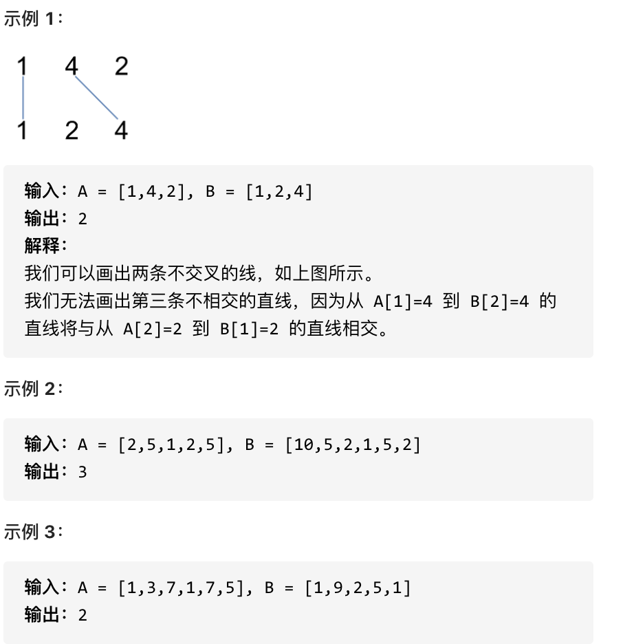

## 1143.最长公共子序列 🌟🌟

[力扣链接](https://leetcode.cn/problems/longest-common-subsequence/) 🌟🌟

### 题目描述

给定两个字符串  text1 和  text2，返回这两个字符串的最长公共子序列的长度。

一个字符串的子序列是指这样一个新的字符串：它是由原字符串在不改变字符的相对顺序的情况下删除某些字符（也可以不删除任何字符）后组成的新字符串。

例如，"ace" 是 "abcde" 的子序列，但 "aec" 不是 "abcde" 的子序列。两个字符串的「公共子序列」是这两个字符串所共同拥有的子序列。

若这两个字符串没有公共子序列，则返回 0。

示例 1:

- 输入：text1 = "abcde", text2 = "ace"
- 输出：3
- 解释：最长公共子序列是 "ace"，它的长度为 3。

示例 2:

- 输入：text1 = "abc", text2 = "abc"
- 输出：3
- 解释：最长公共子序列是 "abc"，它的长度为 3。

示例 3:

- 输入：text1 = "abc", text2 = "def"
- 输出：0
- 解释：两个字符串没有公共子序列，返回 0。

提示:

- 1 <= text1.length <= 1000
- 1 <= text2.length <= 1000 输入的字符串只含有小写英文字符。

### 解题思路

- 字符串子序列：**是一个新字符串，由原字符串在不改变字符的相对顺序的情况下删除或不删除某些自负后组成的**

本题与[最长公共子串](./dynamic-programming-code10.md/#718-最长重复子数组-)的区别是：**不需要连续**

动规五部曲：

1. 确定 dp 数组及下标的含义

   dp[i][j]表示长度为[0, i-1]的字符串 text1 与长度为[0, j-1]的字符串 text2 的最长公共子序列

   **核心思想**：dp[i][j]不是从[0, i]的字符串 text1 和[0, j]的字符串 text2 的最长公共子序列

   1. 为了方便初始化
   2. 为了方便处理边界条件

2. 确定递推公式

   如果 text1[i - 1]和 text2[j - 1]相同，则说明找到公共元素：

   ```js
   dp[i][j] = dp[i - 1][j - 1] + 1
   ```

   如果不相同，则需要找 text1[i - 2]和 text2[j - 1]、text1[i - 1]和 text2[j - 2]的最长公共子序列中最大的：

   ```js
   dp[i][j] = Math.max(dp[i - 1][j], dp[i][j - 1])
   ```

3. dp 数组初始化

   - `dp[i][0] = 0`：text2 为空字符串，text1[0, i-1]和空字符串的最长公共子序列长度为 0
   - `dp[0][j] = 0`：text1 为空字符串，text2[0, j-1]和空字符串的最长公共子序列长度为 0
   - 其他下标会被覆盖，初始为 0 即可

   这里体现了为什么要那么定义 dp 数组？**简化初始化 dp 数组的过程**

4. 确定遍历顺序

   dp[i][j]由 dp[i-1][j-1]、dp[i-1][j]和 dp[i][j-1]推导出，所以必须从前往后、从上往下遍历

   ```js
   for (let i = 1; i < text1.length; i++) {
     for (let j = 1; j < text2.length; j++) {}
   }
   ```

5. 举例推导 dp 数组

   以输入：text1 = "abcde", text2 = "ace" 为例，dp 结果如下：

   ```js
   dp = [
     [0, 0, 0, 0],
     [0, 1, 1, 1],
     [0, 1, 1, 1],
     [0, 1, 2, 2],
     [0, 1, 2, 2],
     [0, 1, 2, 3],
   ]
   ```

   最终 dp[text1.length][text2.length]即为最长公共子序列长度

   为什么结果是 dp[text1.length][text2.length]，而不是 Math.max(...dp)?

   - 两个字符串越长，公共子序列可能就越长，最后返回的是 dp[text1.length][text2.length] 就一定是最大值
   - [最长重复子数组](./dynamic-programming-code10.md/#718-最长重复子数组-)，因为必须是连续的，所以可能出现在任意位置

### 代码

```js
var longestCommonSubsequence = function (text1, text2) {
  const n = text1.length
  const m = text2.length

  // 初始化全为0
  // dp[i][0] = 0 text2为空字符串
  // dp[0][j] = 0 text1为空字符串
  const dp = new Array(n + 1).fill().map(() => new Array(m + 1).fill(0))

  for (let i = 1; i <= n; i++) {
    for (let j = 1; j <= m; j++) {
      if (text1[i - 1] === text2[j - 1]) {
        dp[i][j] = dp[i - 1][j - 1] + 1
      } else {
        dp[i][j] = Math.max(dp[i - 1][j], dp[i][j - 1])
      }
    }
  }
  console.log(dp)
  return dp[n][m]
}
```

## 1035.不相交的线 🌟🌟

[力扣链接](https://leetcode.cn/problems/uncrossed-lines/description/) 🌟🌟

### 题目描述

在两条独立的水平线上按给定的顺序写下 nums1 和 nums2 中的整数。

现在，可以绘制一些连接两个数字 nums1[i] 和 nums2[j] 的直线，这些直线需要同时满足：

- nums1[i] == nums2[j]
- 且绘制的直线不与任何其他连线（非水平线）相交。

请注意，连线即使在端点也不能相交：每个数字只能属于一条连线。

以这种方法绘制线条，并返回可以绘制的最大连线数。



### 解题思路

在[1143.最长公共子序列](#1143最长公共子序列-)基本一致

- 两个数组的元素相等时，可以连接一条线，且不与其他线相交，就是**在 num1 中找到一个与 nums2 相同的子序列，不能改变相对顺序**
- **求绘制的最大连线数，其实就是求两个字符串的最长公共子序列的长度**

动规五部曲：

1. 确定 dp 数组及下标的含义

   dp[i][j]表示 nums1[0, i-1]和 nums2[0, j- 1]的最长公共子序列

2. 确定递推公式

   如果 nums1[i - 1]和 nums2[j - 1]相等，则说明找到公共元素：

   ```js
   dp[i][j] = dp[i - 1][j - 1] + 1
   ```

   如果不相等，则需要找 nums1[i - 2]和 nums2[j - 1]、nums1[i - 1]和 nums2[j - 2]的最长公共子序列中最大的：

   ```js
   dp[i][j] = Math.max(dp[i - 1][j], dp[i][j - 1])
   ```

3. dp 数组初始化

   初始化全为 0

4. 确定遍历顺序

   从前往后，从上到下遍历

5. 举例推导 dp 数组

   以 nums1 = [2,5,1,2,5]，nums2 =[10,5,2,1,5,2] 为例，得到的 dp 数组为：

   ```js
   dp = [
     [0, 0, 0, 0, 0, 0, 0],
     [0, 0, 0, 1, 1, 1, 1],
     [0, 0, 1, 1, 1, 2, 2],
     [0, 0, 1, 1, 2, 2, 2],
     [0, 0, 1, 2, 2, 2, 3],
     [0, 0, 1, 2, 2, 3, 3],
   ]
   ```

### 代码

```js
var maxUncrossedLines = function (nums1, nums2) {
  const n = nums1.length
  const m = nums2.length

  const dp = new Array(n + 1).fill().map(() => new Array(m + 1).fill(0))

  for (let i = 1; i <= n; i++) {
    for (let j = 1; j <= m; j++) {
      if (nums1[i - 1] === nums2[j - 1]) {
        dp[i][j] = dp[i - 1][j - 1] + 1
      } else {
        dp[i][j] = Math.max(dp[i - 1][j], dp[i][j - 1])
      }
    }
  }
  console.log(dp)
  return dp[n][m]
}
```

## 53. 最大子序和 🌟🌟

[力扣链接](https://leetcode.cn/problems/maximum-subarray/description/) 🌟🌟

### 题目描述

给定一个整数数组 nums ，找到一个具有最大和的连续子数组（子数组最少包含一个元素），返回其最大和。

示例:

- 输入: [-2,1,-3,4,-1,2,1,-5,4]
- 输出: 6
- 解释:  连续子数组  [4,-1,2,1] 的和最大，为  6。

### 解题思路

之前使用贪心法解决：只要连续和为负数，就丢弃重新开始

动规五部曲：

1. 确定 dp 数组及下标的含义

   dp[i]表示以 nums[i]为结尾的最大子序和

2. 确定递归公式

   dp[i]由两个状态推导：

   1. `dp[i] = dp[i-1] + nums[i]`，即：nums[i]加入当前连续子序和
   2. `dp[i] = nums[i]`，即重新计算连续子序和

   ```js
   // 两者取最大
   dp[i] = Math.max(dp[i - 1] + nums[i], nums[i])
   ```

3. dp 数组初始化

   dp[0] = nums[0]，dp[0]必须初始化

4. 确定遍历顺序

   从前往后

   ```js
   for (let i = 1; i < nums.length; i++) {}
   ```

5. 举例推导 dp 数组

   以 nums = [-2,1,-3,4,-1,2,1,-5,4]为例，得到 dp 数组：

   ```js
   dp = [-2, 1, -2, 4, 3, 5, 6, 1, 5]
   ```

### 代码

```js
var maxSubArray = function (nums) {
  const n = nums.length
  const dp = new Array(n).fill(0)

  dp[0] = nums[0]

  for (let i = 1; i < n; i++) {
    dp[i] = Math.max(dp[i - 1] + nums[i], nums[i])
  }
  console.log(dp)
  return Math.max(...dp)
}
```

## 392.判断子序列 🌟

[力扣链接](https://leetcode.cn/problems/is-subsequence/) 🌟

### 题目描述

给定字符串 s 和 t ，判断 s 是否为 t 的子序列。

字符串的一个子序列是原始字符串删除一些（也可以不删除）字符而不改变剩余字符相对位置形成的新字符串。（例如，"ace"是"abcde"的一个子序列，而"aec"不是）。

示例 1：

- 输入：s = "abc", t = "ahbgdc"
- 输出：true

示例 2：

- 输入：s = "axc", t = "ahbgdc"
- 输出：false

提示：

- 0 <= s.length <= 100
- 0 <= t.length <= 10^4

两个字符串都只由小写字符组成。

### 解题思路

快慢指针：快指针指向原字符串，慢指针指向子序列字符串

动规五部曲：

1. 确定 dp 数组及下标的含义

   dp[i][j]表示以 s[i - 1]和 t[j - 1]为结尾的字符串，相同子序列的长度

2. 确定递归公式

   dp[i][j]有两种情况：

   - s[i - 1] === t[j - 1]，t 中找到一个字符串在 s 中出现

     ```js
     dp[i][j] = dp[i - 1][j - 1] + 1
     ```

   - s[i - 1] !== t[j - 1]，需要在 t 中删除元素继续匹配

     t 删除当前元素 t[j - 1]，dp[i][j]就等于 s[i - 1]和 t[j - 2]的比较结果

     ```js
     dp[i][j] = dp[i][j - 1]
     ```

     如果[1143.最长公共子序列](#1143最长公共子序列-)，s 和 t 都可以删除元素，需要求 s[i - 1]和 t[j - 2]、s[i - 2]和 t[j - 1]的最长公共子序列较大值

3. dp 数组初始化

   - dp[i][0] = 0：t 为空字符串
   - dp[0][j] = 0：s 为空字符串

4. 确定遍历顺序

   从上到下，从左往右

   ```js
   for (let i = 1; i < s.length; i++) {
     for (let j = 1; j < t.length; j++) {}
   }
   ```

5. 举例推导 dp 数组

   以 s = "abc"，t = "ahbgdc" 为例，得到 dp 数组：

   ```js
   dp = [
     [0, 0, 0, 0, 0, 0, 0],
     [0, 1, 1, 1, 1, 1, 1],
     [0, 0, 0, 2, 2, 2, 2],
     [0, 0, 0, 0, 0, 0, 3],
   ]
   ```

   计算 dp[n][m] === n，s 就是 t 的子序列

### 代码

```js
var isSubsequence = function (s, t) {
  const n = s.length
  const m = t.length
  const dp = new Array(n + 1).fill().map(() => new Array(m + 1).fill(0))

  for (let i = 1; i <= n; i++) {
    for (let j = 1; j <= m; j++) {
      if (s[i - 1] === t[j - 1]) {
        dp[i][j] = dp[i - 1][j - 1] + 1
      } else {
        dp[i][j] = dp[i][j - 1]
      }
    }
  }
  console.log(dp)
  return dp[n][m] === n
}
```
