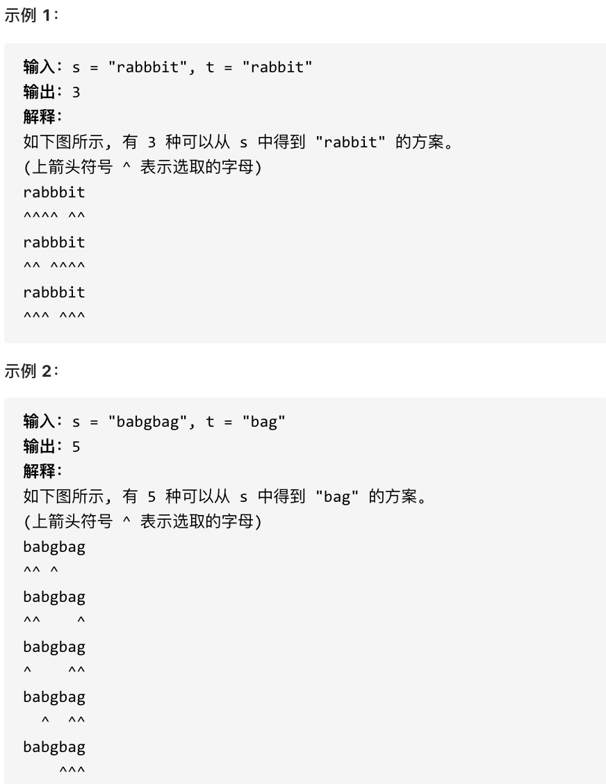

## 115.不同的子序列 🌟🌟

[力扣链接](https://leetcode.cn/problems/distinct-subsequences/description/) 🌟🌟

### 题目描述

给定一个字符串 s 和一个字符串 t ，计算在 s 的子序列中 t 出现的个数。

字符串的一个 子序列 是指，通过删除一些（也可以不删除）字符且不干扰剩余字符相对位置所组成的新字符串。（例如，"ACE" 是 "ABCDE" 的一个子序列，而 "AEC" 不是）

题目数据保证答案符合 32 位带符号整数范围。



### 解题思路

动规五部曲：

1. 确定 dp 数组及下标的含义

   dp[i][j]表示 s[0..i-1]的子序列中，t[0..j-1]出现的次数

2. 确定递推公式

   假设 `s = "bagg" t = "bag"`，可以看出 s 中有两个子序列等于 t：

   1. 子序列 1：使用第一个 g → `b(s[0]) + a(s[1]) + g(s[2]) → bag`
   2. 子序列 2：使用第二个 g → `b(s[0]) + a(s[1]) + g(s[3]) → bag`

   看下过程，当处理到 s[3]（第二个 g）和 t[2]（g）时：

   - **如果使用 s[3]**：需要前 `s[0..2](bag)` 已经匹配了 `t[0..1](ba)`，此时已匹配上
   - **不使用 s[3]**：需要前 `s[0..3](bagg)` 已经匹配了 `t[0..2](bag)`，使用第一个 g 可以匹配
   - 因此：1（使用） + 1（不使用但已存在）= 2 种方式

   由上可知，虽然 s[3]（第二个 g）与 t[2]（g）匹配，但也可以选择不使用它，继续用前面的字符匹配，可以得出结论：

   - 当 s[i-1]和 t[j-1]相等时, **需要求 s 的前面有多少个"ba" + 前面有多少个已经匹配好的"bag"**，即用/不用当前字符
   - 若 s[i-1]和 t[j-1]不相等, **只需要求 s 的前面有多少个已经匹配好的"bag"**，即必须不用当前字符

   **递推公式：**

   当 s[i-1] === t[j-1] 时，dp[i][j] 由两部分组成：

   1. 使用当前字符匹配 dp[i-1][j-1]：表示前 i-1 个字符已匹配前 j-1 个字符，现在加上 s[i-1] 完成匹配
   2. 不使用当前字符匹配 dp[i-1][j]：表示即使 s[i-1] 可用，也选择忽略它，继续用前 i-1 个字符匹配前 j 个字符

   两种可能相加

   ```js
   dp[i][j] = dp[i - 1][j - 1] + dp[i - 1][j]
   ```

   当 s[i-1] !== t[j-1] 时,dp[i][j]只能由前面已经匹配好的子序列组成：

   ```js
   dp[i][j] = dp[i - 1][j]
   ```

3. dp 数组初始化

   - dp[i][0] = 1（t 为空时，s 有 1 种方式匹配：删除所有字符）
   - dp[0][j] = 0（j>0 时，s 为空无法匹配非空 t）
   - dp[0][0] = 1

   当 i=0 时，表示 s 的前 0 个字符（即空字符串），类似地 j=0 表示 t 的前 0 个字符，这时候如果 t 是空字符串，那么 s 中有一个子序列（空序列）与之匹配，所以 dp[0][0]应该是 1。

4. 确定遍历顺序

   dp[i][j]由 dp[i-1][j-1]、dp[i-1][j]推导出，所以必须从前往后、从上往下遍历

   ```js
   for (let i = 1; i < s.length; i++) {
     for (let j = 1; j < t.length; j++) {}
   }
   ```

5. 举例推导 dp 数组

   以 s："baegg"，t："bag"为例，推导 dp 数组状态如下：

   ```js
   dp = [
     [1, 0, 0, 0],
     [1, 1, 0, 0],
     [1, 1, 1, 0],
     [1, 1, 1, 0],
     [1, 1, 1, 1],
     [1, 1, 1, 2],
   ]
   ```

### 代码

```js
var numDistinct = function (s, t) {
  const n = s.length
  const m = t.length

  const dp = new Array(n + 1).fill().map(() => new Array(m + 1).fill(0))

  for (let i = 0; i <= n; i++) {
    dp[i][0] = 1
  }

  for (let i = 1; i <= n; i++) {
    for (let j = 1; j <= m; j++) {
      if (s[i - 1] === t[j - 1]) {
        dp[i][j] = dp[i - 1][j - 1] + dp[i - 1][j]
      } else {
        dp[i][j] = dp[i - 1][j]
      }
    }
  }
  console.log(dp)

  return dp[n][m]
}
```

## 583. 两个字符串的删除操作 🌟🌟

[力扣链接](https://leetcode.cn/problems/delete-operation-for-two-strings/) 🌟🌟

### 题目描述

给定两个单词 word1 和 word2，找到使得 word1 和 word2 相同所需的最小步数，每步可以删除任意一个字符串中的一个字符。

示例：

- 输入: "sea", "eat"
- 输出: 2
- 解释: 第一步将"sea"变为"ea"，第二步将"eat"变为"ea"

### 解题思路

本题和[115.不同的子序列](#115不同的子序列-)相比，两个字符串都可以删除，整体思路是一样的。

动规五部曲：

1. 确定 dp 数组及下标的含义

   dp[i][j]表示 word1[0, i-1]和 word2[0, j-1]达到相等所需要的最小删除次数

2. 确定递推公式

   如果 word1[i - 1]和 word2[j - 1]相等时：

   **考虑这两个元素的删除操作** 和 **不考虑这两个元素的删除操作**，对两个字符串达到相等的最小删除次数是没有影响的

   ```js
   dp[i][j] = dp[i - 1][j - 1]
   ```

   如果不相等，则需要删元素，有三种情况：

   - 删 word1[i-1]，最少操作次数为 `dp[i - 1][j] + 1`
   - 删 word2[j-1]，最少操作次数为 `dp[i][j - 1] + 1`
   - 两个同时删除，最少操作次数为 `dp[i - 1][j - 1] + 2`

   取三个最小值

   ```js
   dp[i][j] = Math.min(dp[i - 1][j] + 1, dp[i][j - 1] + 1, dp[i - 1][j - 1] + 2)
   ```

3. dp 数组初始化

   - dp[i][0] = i：word2 为空字符串，word1[0...i-1]，需要删除所有元素，才能和 word2 相同
   - dp[0][j] = j：word1 为空字符串，word2[0...j-1]，需要删除所有元素，才能和 word1 相同

4. 确定遍历顺序

   从前往后，从上到下遍历

5. 举例推导 dp 数组

   以 word1:"sea"，word2:"eat"为例，推导 dp 数组状态图如下：

   ```js
   dp = [
     [0, 1, 2, 3],
     [1, 2, 3, 4],
     [2, 1, 2, 3],
     [3, 2, 1, 2],
   ]
   ```

### 代码

```js
var minDistance = function (word1, word2) {
  const n = word1.length
  const m = word2.length

  const dp = new Array(n + 1).fill().map(() => new Array(m + 1).fill(0))

  for (let i = 0; i <= n; i++) dp[i][0] = i
  for (let j = 0; j <= m; j++) dp[0][j] = j

  for (let i = 1; i <= n; i++) {
    for (let j = 1; j <= m; j++) {
      if (word1[i - 1] === word2[j - 1]) {
        dp[i][j] = dp[i - 1][j - 1]
      } else {
        dp[i][j] = Math.min(
          dp[i - 1][j] + 1,
          dp[i][j - 1] + 1,
          dp[i - 1][j - 1] + 2
        )
      }
    }
  }
  console.log(dp)

  return dp[n][m]
}
```

### 版本二：利用最长公共子序列

[1143.最长公共子序列](./dynamic-programming-code11.md/#1143最长公共子序列-)，分别计算两个字符串的最长公共子序列长度，然后用两个字符串的长度减去两倍的最长公共子序列长度

```js
var minDistance = function (word1, word2) {
  const n = word1.length
  const m = word2.length

  const dp = new Array(n + 1).fill().map(() => new Array(m + 1).fill(0))

  // 最长公共子序列
  for (let i = 1; i <= n; i++) {
    for (let j = 1; j <= m; j++) {
      if (word1[i - 1] === word2[j - 1]) {
        dp[i][j] = dp[i - 1][j - 1] + 1
      } else {
        dp[i][j] = Math.max(dp[i - 1][j], dp[i][j - 1])
      }
    }
  }
  console.log(dp)

  return n + m - dp[n][m] * 2
}
```

## 72. 编辑距离 🌟🌟

[力扣链接](https://leetcode.cn/problems/edit-distance/description/) 🌟🌟

### 题目描述

给你两个单词  word1 和  word2，请你计算出将  word1  转换成  word2 所使用的最少操作数  。

你可以对一个单词进行如下三种操作：

- 插入一个字符
- 删除一个字符
- 替换一个字符
- 示例  1：
- 输入：word1 = "horse", word2 = "ros"
- 输出：3
- 解释： horse -> rorse (将 'h' 替换为 'r') rorse -> rose (删除 'r') rose -> ros (删除 'e')
- 示例  2：
- 输入：word1 = "intention", word2 = "execution"
- 输出：5
- 解释： intention -> inention (删除 't') inention -> enention (将 'i' 替换为 'e') enention -> exention (将 'n' 替换为 'x') exention -> exection (将 'n' 替换为 'c') exection -> execution (插入 'u')

提示：

- 0 <= word1.length, word2.length <= 500
- word1 和 word2 由小写英文字母组成

### 解题思路

给定两个字符串 word1 和 word2，计算将 word1 转换为 word2 所需的最小操作次数。允许的操作包括：

- 插入一个字符
- 删除一个字符
- 替换一个字符

动规五部曲：

1. 确定 dp 数组及下标的含义

   dp[i][j]表示 word1[0...i-1]和 word2[0...j-1]的最小编辑距离

2. 确定递归公式

   如果 word1[i-1] 和 word2[j-1]相等时：

   无需操作，直接继承前一步结果：

   ```js
   dp[i][j] = dp[i - 1][j - 1]
   ```

   如果 word1[i-1] 和 word2[j-1]不相等时，可以有三种编辑方式：

   - 删除：删除 word1 一个元素，就是 word1[0...i-2]和 word2[0...i-1]的最近编辑距离，再加一个操作，即 dp[i-1][j] + 1
   - 插入：在 word1 中插入 word2[j-1]， 此时操作次数为 dp[i][j-1] + 1
   - 替换：将 word1 元素替换为 word2[j-1]，操作次数为 dp[i-1][j-1] + 1

     综上，递推公式为：

     ```js
     dp[i][j]=Math.min(dp[i][j−1],dp[i−1][j],dp[i−1][j−1])+1
     ```

3. dp 数组初始化

   - dp[i][0] = i：将 word1 前 i 个字符转换为空字符串，需删除 i 次
   - dp[0][j] = j：将空字符串转换为 word2 前 j 个字符，需插入 j 次

4. 确定遍历顺序

   从前往后，从上到下

5. 举例推导 dp 数组

   以示例 1 为例，输入：word1 = "horse", word2 = "ros"为例，dp 状态如下：

   ```js
   dp = [
     [0, 1, 2, 3],
     [1, 1, 2, 3],
     [2, 2, 1, 2],
     [3, 2, 2, 2],
     [4, 3, 3, 2],
     [5, 4, 4, 3],
   ]
   ```

### 代码

```js
var minDistance = function (word1, word2) {
  const n = word1.length
  const m = word2.length

  const dp = new Array(n + 1).fill().map(() => new Array(m + 1).fill(0))

  for (let i = 0; i <= n; i++) dp[i][0] = i
  for (let j = 0; j <= m; j++) dp[0][j] = j
  for (let i = 1; i <= n; i++) {
    for (let j = 1; j <= m; j++) {
      if (word1[i - 1] === word2[j - 1]) {
        dp[i][j] = dp[i - 1][j - 1]
      } else {
        dp[i][j] = Math.min(
          dp[i - 1][j] + 1,
          dp[i][j - 1] + 1,
          dp[i - 1][j - 1] + 1
        )
      }
    }
  }
  console.log(dp)

  return dp[n][m]
}
```

## 总结

- [392.判断子序列](./dynamic-programming-code11.md/#392判断子序列-)：

  - 仅需处理删除操作，验证 `s` 是否为 `t` 的子序列
  - 双指针或动态规划解决，为编辑距离问题中的删除操作提供基础

- [115.不同的子序列](#115不同的子序列-)：

  - 计算 `s` 的子序列中出现 `t` 的次数
  - 状态转移需考虑是否使用当前字符匹配，为编辑距离的“选择操作”提供思路

- [583.两个字符串的删除操作](#583两个字符串的删除操作-)：

  - 转化为求最长公共子序列（LCS），删除次数公式为：删除次数=len(s1)+len(s2)−2×LCS 长度
  - 动态规划表设计为 dp[i][j] 表示 s1[0..i-1] 和 s2[0..j-1] 的 LCS 长度。
