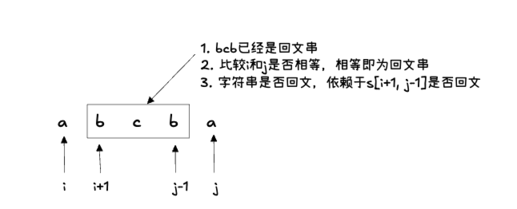

## 647. 回文子串 🌟🌟

[力扣链接](https://leetcode.cn/problems/palindromic-substrings/description/) 🌟🌟

### 题目描述

给给定一个字符串，你的任务是计算这个字符串中有多少个回文子串。

具有不同开始位置或结束位置的子串，即使是由相同的字符组成，也会被视作不同的子串。

示例 1：

- 输入："abc"
- 输出：3
- 解释：三个回文子串: "a", "b", "c"

示例 2：

- 输入："aaa"
- 输出：6
- 解释：6 个回文子串: "a", "a", "a", "aa", "aa", "aaa"

提示：输入的字符串长度不会超过 1000 。

### 解题思路

#### 暴力解法

两层 for 循环，遍历区间起始位置和终止位置，然后还需要一层遍历判断这个区间是不是回文。所以时间复杂度：O(n^3)

```js
var countSubstrings = function (s) {
  const isPalindrome = (left, right) => {
    while (left < right) {
      if (s[left] === s[right]) {
        left++
        right--
      } else {
        return false
      }
    }
    return true
  }

  let count = 0
  const n = s.length
  for (let i = 0; i < n; i++) {
    for (let j = i; j < n; j++) {
      if (isPalindrome(i, j)) count++
    }
  }

  return count
}
```

#### 动规解法

动规五部曲：

1. 确定 dp 数组及下标的含义

   **子序列 dp 数组的定义一般是题目求什么，就如何定义 dp 数组**

   如果本题 dp 数组定义为：dp[i]表示下标 i 结尾的字符串有 dp[i]个回文串，找不出 dp[i]与 dp[i - 1]的关系

   查看回文串的性质

   

   因此判读一个子字符串 s[i, j]是否为回文串，依赖于子字符串 s[i+1, j-1]是否为回文串

   由此，**dp[i][j]表示 s[i...j]是否为回文串**

2. 确定递推公式

   - s[i] 不等于 s[j]，则 s[i, j]不可能为回文串，dp[i][j] = false
   - s[i] 等于 s[j]时，有以下三种情况：
     - i == j，单个字符，dp[i][j] = true
     - i + 1 == j，两个相同字符，dp[i][j] = true
     - i + 1 < j，需要判断 dp[i + 1][j - 1] 是否为回文串

   ```js
   if (s[i] === s[j]) {
     if (i === j || i + 1 === j) {
       dp[i][j] = true
       result++
     } else {
       dp[i][j] = dp[i + 1][j - 1]
       if (dp[i][j]) result++
     }
   }
   ```

3. dp 数组初始化

   dp[i][j]全部初始化为 false

4. 确定遍历顺序

   dp[i][j]由 dp[i+1][j-1]推出，因此需要从下到上遍历

5. 举例推导 dp 数组

   以 输入："aaa"，dp[i][j]数组如下：

   ```js
   dp = [
     [true, true, true],
     [false, true, true],
     [false, false, true],
   ]
   ```

### 代码

```js
var countSubstrings = function (s) {
  const n = s.length
  const dp = new Array(n).fill().map(() => new Array(n).fill(false))

  let result = 0
  for (let i = n - 1; i >= 0; i--) {
    for (let j = i; j < n; j++) {
      if (i === j || i + 1 === j) {
        if (i - j <= 1) {
          dp[i][j] = true
          result++
        } else {
          dp[i][j] = dp[i + 1][j - 1]
          if (dp[i][j]) result++
        }
      }
    }
  }
  console.log(dp)
  return result
}
```

## 516.最长回文子序列 🌟🌟

[力扣链接](https://leetcode.cn/problems/longest-palindromic-subsequence/description/) 🌟🌟

### 题目描述

给定一个字符串 s ，找到其中最长的回文子序列，并返回该序列的长度。可以假设 s 的最大长度为 1000 。

示例 1: 输入: "bbbab" 输出: 4 一个可能的最长回文子序列为 "bbbb"。

示例 2: 输入:"cbbd" 输出: 2 一个可能的最长回文子序列为 "bb"。

提示：

- 1 <= s.length <= 1000
- s 只包含小写英文字母

### 解题思路

**回文子序列不需要连续**

动规五部曲：

1. 确定 dp 数组及下标的含义

   dp[i][j]表示 s[i, j]内最长的回文子序列长度

2. 确定递推公式

   两种情况：

   - s[i] 等于 s[j]，子序列长度+2，dp[i][j] = dp[i + 1][j - 1] + 2
   - s[i] 不等于 s[j]，同时加入 s[i]和 s[j]不能构成回文子序列，因此分别加入 s[i]和 s[j]看哪个组成的回文子序列更长，dp[i][j] = Math.max(dp[i + 1][j], dp[i][j - 1])

   ```js
   if (s[i] === s[j]) {
     dp[i][j] = dp[i + 1][j - 1] + 2
   } else {
     dp[i][j] = Math.max(dp[i + 1][j], dp[i][j - 1])
   }
   ```

3. dp 数组初始化

   - 当 i===j 时，dp[i][j] = 1：单个字符的回文子序列长度为 1，必须初始化
   - 当 i!=j 时，dp[i][j] = 0：初始化为 0，被覆盖

4. 确定遍历顺序

   从下到上，从左到右

5. 举例推导 dp 数组

   以 s:"cbbd" 为例，dp 数组如下：

   ```js
   dp = [
     [
       [1, 1, 2, 2],
       [0, 1, 2, 2],
       [0, 0, 1, 1],
       [0, 0, 0, 1],
     ],
   ]
   ```

### 代码

```js
var longestPalindromeSubseq = function (s) {
  const n = s.length
  const dp = new Array(n).fill().map(() => new Array(n).fill(0))

  for (let i = 0; i < n; i++) {
    dp[i][i] = 1
  }

  for (let i = n - 1; i >= 0; i--) {
    for (let j = i + 1; j < n; j++) {
      if (s[i] === s[j]) {
        dp[i][j] = dp[i + 1][j - 1] + 2
      } else {
        dp[i][j] = Math.max(dp[i + 1][j], dp[i][j - 1])
      }
    }
  }
  console.log(dp)

  return dp[0][n - 1]
}
```

## 总结
