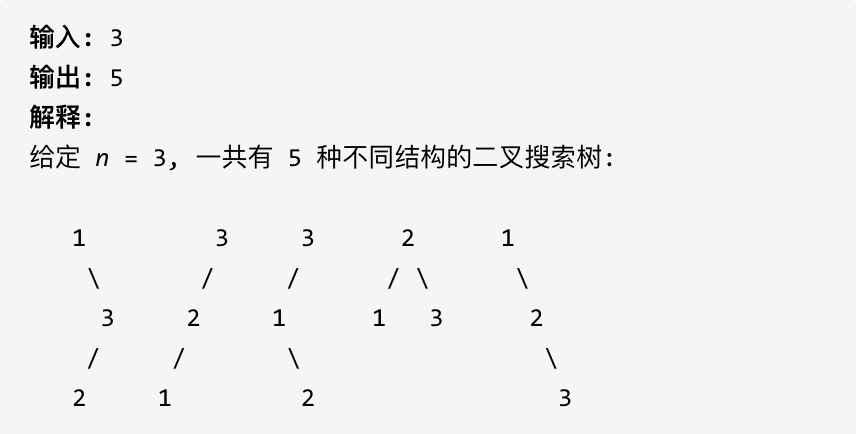

**找问题最好的方式就是把 dp 数组打印出来，看看是不是和我们推导的公式一致。**

**做动规题目前，一定要把状态转移在 dp 数组上的具体情况模拟一遍，确定最后推出的是想要的结果。**

## 62.不同路径 🌟

[力扣链接](https://leetcode.cn/problems/fibonacci-number/description/) 🌟

### 题目描述

一个机器人位于一个 m x n 网格的左上角 （起始点在下图中标记为 “Start” ）。

机器人每次只能向下或者向右移动一步。机器人试图达到网格的右下角（在下图中标记为 “Finish” ）。

问总共有多少条不同的路径？

示例 1：


- 输入：m = 3, n = 7
- 输出：28

示例 2：

- 输入：m = 2, n = 3
- 输出：3

解释： 从左上角开始，总共有 3 条路径可以到达右下角。

1. 向右 -> 向右 -> 向下
2. 向右 -> 向下 -> 向右
3. 向下 -> 向右 -> 向右

示例 3：

- 输入：m = 7, n = 3
- 输出：28

示例 4：

- 输入：m = 3, n = 3
- 输出：6

提示：

- 1 <= m, n <= 100
- 题目数据保证答案小于等于 `2 * 10^9`

### 解题思路

题意：机器人从 (0, 0) 出发，到 (m - 1, n -1) 终点，只能向右或向下移动，问有多少种不同的**路径**（注意路径，不是步数）。

动规五部曲

1. 确定 dp 数组及下标的含义

   `dp[i][j]` 表示从(0,0)出发，到达(i, j)有 `dp[i][j]` 种不同的路径

2. 确认递推公式

   机器人只能向右或向下移动，所以到达(i, j)的路径数等于从上方 (i-1,j) 向下移动一步和从左方 (i,j-1) 向右移动一步的路径数之和，即`dp[i][j] = dp[i-1][j] + dp[i][j-1]`

3. dp 数组初始化

   需要初始化第一行和第一列，即 `dp[i][0]`、`dp[0][j]`，初始化的路径数都是 1，因为从 (0,0) 出发，到达 (i，0) 或者 (0, j) 都只有一种路径

   ```js
   for (let i = 0; i < m; i++) dp[i][0] = 1
   for (let j = 0; j < n; j++) dp[0][j] = 1
   ```

4. 确定遍历顺序

   从左到右、从上到下一层一层遍历

5. 举例推导 dp 数组

   当 m = 3, n= 7 时，dp 数组为：

   ```text
   [
     [1,1,1,1,1,1,1],
     [1,2,3,4,5,6,7],
     [1,3,6,10,15,21,28]
   ]
   ```

   最后看打印出的 dp 数组是否和我们推导的一致

### 代码

```js
var uniquePaths = function (m, n) {
  const dp = new Array(m).fill().map(() => new Array(n))
  for (let i = 0; i < m; i++) dp[i][0] = 1
  for (let j = 0; j < n; j++) dp[0][j] = 1

  for (let i = 1; i < m; i++) {
    for (let j = 1; j < n; j++) {
      dp[i][j] = dp[i - 1][j] + dp[i][j - 1]
    }
  }
  console.log(dp)
  return dp[m - 1][n - 1]
}
```

## 63. 不同路径 II 🌟🌟

[力扣链接](https://leetcode.cn/problems/unique-paths-ii/description/) 🌟🌟

### 题目描述

一个机器人位于一个 m x n 网格的左上角 （起始点在下图中标记为 “Start” ）。

机器人每次只能向下或者向右移动一步。机器人试图达到网格的右下角（在下图中标记为 “Finish” ）。

现在考虑网格中有障碍物。问总共有多少条不同的路径？


网格中的障碍物和空位置分别用 1 和 0 来表示。

示例 1：


- 输入：obstacleGrid = [[0,0,0],[0,1,0],[0,0,0]]
- 输出：2 解释：
- 3x3 网格的正中间有一个障碍物。
- 从左上角到右下角一共有 2 条不同的路径：
  1. 向右 -> 向右 -> 向下 -> 向下
  2. 向下 -> 向下 -> 向右 -> 向右

示例 2:


- 输入：obstacleGrid = [[0,1],[0,0]]
- 输出：1

### 解题思路

与 [62.不同路径](#62不同路径-) 类似，只是增加了障碍物，障碍物的位置值为 1，空位置值为 0。

动规五部曲：

1. 确定 dp 数组以及下标的含义

   `dp[i][j]` 表示从(0,0)出发，到达(i, j)有 `dp[i][j]` 种不同的路径

2. 确定递推公式

   与上题的递推公式一样，只是需要判断当前位置是否有障碍物

   ```js
   if (obstacleGrid[i][j] === 0) {
     // 当(i, j)没有障碍物，再推导dp[i][j]的值
     dp[i][j] = dp[i - 1][j] + dp[i][j - 1]
   }
   ```

3. dp 数组初始化

   与上题一样，只不过再次基础上加了障碍，障碍之后（包括障碍）都是走不到的位置了，所以障碍之后的 `dp[i][0]`或者`dp[0][j]`都为 0

   ```js
   for (let i = 0; i < m; i++) {
     if (obstacleGrid[i][0] === 0) {
       dp[i][0] = 0
     }
   }
   for (let j = 0; j < n; j++) {
     if (obstacleGrid[0][j] === 0) {
       dp[0][j] = 0
     }
   }
   ```

4. 确定遍历顺序

   1. 从左到右、从上到下一层一层遍历
   2. 遍历的时候，需要判断当前位置是否有障碍物

5. 举例推导 dp 数组

   输入 obstacleGrid = [[0,0,0],[0,1,0],[0,0,0]]时，dp 数组为：

   ```text
    [
      [1,1,1],
    ],
    [
      [1,0,1],
    ],
    [
      [1,1,2],
    ]
   ```

```js
var uniquePathsWithObstacles = function (obstacleGrid) {
  const m = obstacleGrid.length
  const n = obstacleGrid[0].length

  const dp = new Array(m).fill().map(() => new Array(n).fill(0))

  for (let i = 0; i < m && obstacleGrid[i][0] === 0; i++) {
    dp[i][0] = 1
  }
  for (let j = 0; j < n && obstacleGrid[0][j] === 0; j++) {
    dp[0][j] = 1
  }

  for (let i = 1; i < m; i++) {
    for (let j = 1; j < n; j++) {
      if (obstacleGrid[i][j] === 0) {
        dp[i][j] = dp[i - 1][j] + dp[i][j - 1]
      }
    }
  }

  console.log(dp)
  return dp[m - 1][n - 1]
}
```

## 343. 整数拆分 🌟🌟

[力扣链接](https://leetcode.cn/problems/integer-break/description/) 🌟🌟

### 题目描述

给定一个正整数  n，将其拆分为至少两个正整数的和，并使这些整数的乘积最大化。 返回你可以获得的最大乘积。

示例 1:

- 输入: 2
- 输出: 1
- 解释: 2 = 1 + 1, 1 × 1 = 1。

示例  2:

- 输入: 10
- 输出: 36
- 解释: 10 = 3 + 3 + 4, 3 × 3 × 4 = 36。
- 说明: 你可以假设  n  不小于 2 且不大于 58。

### 解题思路

应该如何拆分得到最大值呢？

比如 6 可以拆分为：

1. 1 + 1 + 1 + 1 + 1 + 1，乘积为 1
2. 2 + 1 + 1 + 1 + 1，乘积为 2
3. 2 + 2 + 2，乘积为 8
4. 2 + 3 + 1，乘积为 6
5. 2 + 4, 乘积为 8
6. 3 + 1 + 1 + 1，乘积为 3
7. 3 + 3，乘积为 9
8. ...

那么此处拆 6 的方式有很多种，那么如何得到最大值？

对于整数 i，尝试将其拆分为 j 和 i-j，此时有两种情况：

1. 不继续拆分：乘积为 `j * (i-j)`
2. 继续拆分：乘积为 `j * dp[i-j]`（`dp[i-j]` 是拆分 i-j 的最大乘积）

示例：n = 4

- dp[2] = 1
- dp[3] = `Math.max(1 * 2, 1 * dp[2]) = max(2, 1) = 2`
- dp[4] = `Math.max(1 * 3, 1 * dp[3], 2 * 2, 2 * dp[2]) = max(3, 2, 4, 2) = 4`

实际拆分方式：2+2，乘积为 2×2 = 4。

动规五部曲

1. 确定 dp 数组以及下标的含义

   dp[i] 表示拆分数字 i，可以得到的最大乘积

2. 确定递推公式

   由上可知，取 `j * dp[i-j]` 和 `j * (i - j)` 的最大值，即 `dp[i] = Math.max(j * dp[i-j], j * (i - j), dp[i])`

3. dp 数组初始化

   dp[2] = 1：数字 2 只能拆分为 1+1，乘积为 1×1 = 1。

4. 确定遍历顺序：从前往后，先有 dp[i - j]再有 dp[i]。
5. 举例推导 dp 数组

   当 n 为 10 的时候，dp 数组里的数值为：

   ```text
   [0, 1, 1, 2, 4, 6, 9, 12, 18, 27, 36]
   ```

```js
var integerBreak = function (n) {
  const dp = new Array(n + 1).fill(0)
  dp[2] = 1

  for (let i = 3; i <= n; i++) {
    for (let j = 1; j < i; j++) {
      dp[i] = Math.max(dp[i], j * (i - j), j * dp[i - j])
    }
  }

  console.log(dp)
  return dp[n]
}
```

## 96.不同的二叉搜索树 🌟🌟

[力扣链接](https://leetcode.cn/problems/unique-binary-search-trees/description/) 🌟🌟

### 题目描述

给定一个整数 n，求以 1 ... n 为节点组成的二叉搜索树有多少种？

示例 1:


