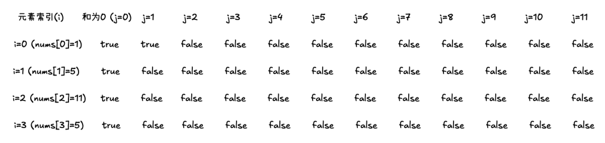
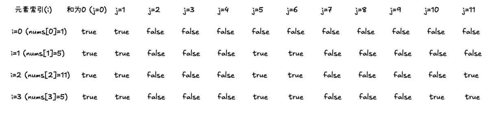

**找问题最好的方式就是把 dp 数组打印出来，看看是不是和我们推导的公式一致。**

**做动规题目前，一定要把状态转移在 dp 数组上的具体情况模拟一遍，确定最后推出的是想要的结果。**

## 01 背包理论基础

01 背包问题是指有 n 件物品和一个最多能背重量为 w 的背包。第 i 件物品的重量为 weight[i]，价值为 value[i]，**每个物品只能选择一次**，在不超过背包容量的情况下，使得物品的总价值最大。比如：旅行时行李箱大小有限，如何选择最有价值的物品装满行李箱。

首先思考如何使用暴力解法？

每件物品的状态有两种：**放入背包或不放入背包**，有 2^n 种状态，可以使用回溯法搜索出所有的情况，时间复杂度为 O(2^n)。

回溯三部曲：

初始化 maxValue = 0 表示总价值

1. 回溯函数返回值以及参数

   - 参数 1：startIndex 表示当前处理的物品索引
   - 参数 2：currentWeight 表示当前已选物品的总重量
   - 参数 3：currentValue 表示已选物品的总价值

2. 回溯函数终止条件

   当 startIndex 等于物品数量 n 时，比较并更新最大价值

3. 单层搜索的过程

   - 不选当前物品：直接处理下一个物品（index + 1），重量和价值不变
   - 选当前物品：如果加入后不超过容量，则更新重量和价值，再处理下一个物品

   ```js
   // 不选当前物品，直接处理下一个
   backtrack(startIndex + 1, currentWeight, currentValue)

   // 选当前物品（需检查容量）
   if (currentWeight + weight[startIndex] <= W) {
     backtrack(
       startIndex + 1,
       currentWeight + weight[startIndex],
       currentValue + value[startIndex]
     )
   }
   ```

```js
function knapsack01Backtrack(W, weight, value) {
  let maxValue = 0
  const n = weight.length

  const backtracking = (startIndex, currentWeight, currentValue) => {
    if (startIndex === n) {
      maxValue = Math.max(maxValue, currentValue)
      return
    }

    // 不选当前物品，直接处理下一个
    backtracking(startIndex + 1, currentWeight, currentValue)

    // 选当前物品（需检查容量）
    if (currentWeight + weight[startIndex] <= W) {
      backtracking(
        startIndex + 1,
        currentWeight + weight[startIndex],
        currentValue + value[startIndex]
      )
    }
  }

  backtracking(0, 0, 0)
  return maxValue
}
```

**暴力解法是指数级别的时间复杂度，所以需要动态规划的解法来优化**

### 01 背包动态规划解法（常规解法）

以下面的输入为例：

背包最大重量为 4。

物品为：

|        | 重量 | 价值 |
| ------ | ---- | ---- |
| 物品 0 | 1    | 15   |
| 物品 1 | 3    | 20   |
| 物品 2 | 4    | 30   |

问背包能背的物品最大价值是多少？

#### 二维 dp 数组 01 背包

动规五部曲：

1. 确定 dp 数组以及下标的含义

   需要定义二维数组：一个维度表示背包容量，一个维度表示表示物品，即 `dp[i][j]` 表示前 i 个物品放入容量为 j 的背包时的最大价值。

   1. 处理物品 0（重量 1，价值 15）

      当 j = 0（容量为 0）时，无法放入，价值为 0；若 j ≥ 1，可以放入物品 0，价值为 15。

      | 背包容量 | 0   | 1   | 2   | 3   | 4   |
      | -------- | --- | --- | --- | --- | --- |
      | 物品 0   | 0   | 15  | 15  | 15  | 15  |

   2. 处理物品 1（重量 3，价值 20）

      - 容量 1-2：无法放入物品 1，继承物品 0 的值 15
      - 容量 3：

        - 不放入物品 1：那么背包的价值应该是 `dp[1][3]` = `dp[0][3] = 15`，即容量为 3 的背包，只放物品 0 的情况
        - 放入物品 1：那么**背包要先留出物品 1 的容量**，目前容量为 3，物品 1 的重量为 3，背包剩余容量为 0 时的价值为 `dp[0][0] = 0`，所以 `dp[1][3]` = `dp[0][3-3] + 20 = 0 + 20 = 20`
        - 取最大值 `20`

      - 容量 4：

        - 不放入物品 1：那么背包的价值应该是 `dp[1][4]` = `dp[0][4] = 15`，即容量为 4 的背包，只放物品 0 的情况
        - 放入物品 1：目前容量为 4，物品 1 的重量为 3，背包剩余容量为 1，背包容量为 1 时的价值为 `dp[0][1] = 15`, 所以`dp[1][4]` = `dp[0][4-3] + 20 = 15 + 20 = 35`
        - 取最大值 `35`

        | 背包容量 | 0   | 1   | 2   | 3   | 4   |
        | -------- | --- | --- | --- | --- | --- |
        | 物品 0   | 0   | 15  | 15  | 15  | 15  |
        | 物品 1   | 0   | 15  | 15  | 20  | 35  |

   3. 处理物品 2（重量 4，价值 30）

      - 容量 1-3：无法放入物品 2，继承物品 1 的值。
      - 容量 4：

        - 不放入物品 2：`dp[2][4]` = `dp[1][4] = 35`，即容量为 4 的背包，放入物品 0 和 1 的情况
        - 放入物品 2：目前容量为 4，物品重量为 4，放入后背包剩余 0 的价值为 `dp[0][0] = 0`，所以`dp[2][4]` = `dp[1][4-4] + 30 = 0 + 30 = 30`
        - 取最大值 `35`

      | 背包容量 | 0   | 1   | 2   | 3   | 4   |
      | -------- | --- | --- | --- | --- | --- |
      | 物品 0   | 0   | 15  | 15  | 15  | 15  |
      | 物品 1   | 0   | 15  | 15  | 20  | 35  |
      | 物品 2   | 0   | 15  | 15  | 20  | 35  |

2. 确认递推公式

   通过上面的示例，我们可以得出不放入第 i 个物品和放入第 i 个物品的最大价值：

   1. 不放入第 i 个物品：背包容量为 j，里面不放物品 i 的最大价值是 `dp[i][j] = dp[i-1][j]`
   2. 放入第 i 个物品：背包空出物品 i 的容量后，背包容量为 `j - weight[i]`，`dp[i-1][j-weight[i]]` 为背包容量为 `j - weight[i]` 且不放物品 i 的最大价值， `dp[i][j] = dp[i-1][j-weight[i]] + value[i]` 就是背包放入物品 i 得到的最大价值

   两者取最大值：`dp[i][j] = Math.max(dp[i-1][j], dp[i-1][j-weight[i]] + value[i])`

3. dp 数组初始化

   **初始化一定要和 dp 数组的定义吻合，否则到递推公式的时候会越来越乱**

   - 当 j = 0（背包容量为 0）时，背包价值为 0，即`dp[i][0] = 0`
   - 由状态转移方程可知，i 是由 i-1 推导出来的，所以 i 为 0 需要初始化
     - 当 `j < weight[0]` 时，`dp[0][j] = 0`，背包容量比编号 0 的物品重量小
     - 当 `j >= weight[0]` 时，`dp[0][j] = value[0]`，背包容量比编号 0 的物品重量大，可以放入，此时价值就是 `value[0]`

   此时，dp 数组初始化应该如下：

   | 背包容量 | 0   | 1   | 2   | 3   | 4   |
   | -------- | --- | --- | --- | --- | --- |
   | 物品 0   | 0   | 15  | 15  | 15  | 15  |
   | 物品 1   | 0   |     |     |     |     |
   | 物品 2   | 0   |     |     |     |     |

   由递推公式可以 `dp[i][j]` 都会由左上方的值决定，所以初始化任何数都可以，统一填充为 0

4. 确定遍历顺序

   有两个维度，物品和背包容量，**先遍历物品还是先遍历背包容量呢？**

   先遍历物品，再遍历背包容量，就类似于上面的推导过程，比较好理解

   ```js
   for (let i = 1; i < weight.length; i++) {
     // 物品
     for (let j = 0; j <= W; j++) {
       // 背包容量
       // 1. 不放入物品 i
       if (j < weight[i]) {
         dp[i][j] = dp[i - 1][j]
       } else {
         // 2. 放入物品 i
         dp[i][j] = Math.max(dp[i - 1][j], dp[i - 1][j - weight[i]] + value[i])
       }
     }
   }
   ```

5. 举例推导 dp 数组

   上述示例的 dp 数组应该是：

   ```text
   [
     [0, 15, 15, 15, 15],
     [0, 15, 15, 20, 35],
     [0, 15, 15, 20, 35]
   ]
   ```

#### 代码

```js
function knapsack01(W, weight, value) {
  const n = weight.length
  const dp = new Array(n).fill().map(() => new Array(W + 1).fill(0))

  // 初始化 dp 数组
  for (let j = 0; j <= W; j++) {
    if (j >= weight[0]) {
      dp[0][j] = value[0]
    }
  }

  for (let i = 1; i < n; i++) {
    for (let j = 0; j <= W; j++) {
      if (j < weight[i]) {
        dp[i][j] = dp[i - 1][j]
      } else {
        dp[i][j] = Math.max(dp[i - 1][j], dp[i - 1][j - weight[i]] + value[i])
      }
    }
  }

  console.log(dp)
  return dp[n - 1][W]
}
```

### 01 背包动态规划解法（滚动数组）

[上面二维数组](#01-背包动态规划解法常规解法)的解法中，每个状态 `dp[i][j]` 依赖于上一行的数据，`dp[i-1][j]` 和 `dp[i-1][j-weight[i]]`

这说明其实每次处理新物品的时候，只需要前一行的数据，而不需要保留之前所有行的信息。这样的话，理论上可以用一维数组来滚动更新，减少空间使用。

二维数组的递推公式为：`dp[i][j] = Math.max(dp[i - 1][j], dp[i - 1][j - weight[i]] + value[i])`

**把 dp[i - 1]拷贝到 dp[i]，表达式可以是 `dp[i][j] = Math.max(dp[i][j], dp[i][j - weight[i]] + value[i])`**

因此可以使用**滚动数组**：如果上一层可以重复利用，直接拷贝到当前层

动规五部曲：

1. 确定 dp 数组以及下标的含义

   在上面的二维数组中，`dp[i][j]` 表示从下标为[0-i]的物品里任意取，放进容量为 j 的背包的最大价值

   一维数组：`dp[j]` 表示背包容量为 j 时的最大价值

2. 确定递推公式

   当把 `dp[i - 1]` 拷贝到 `dp[i]` 的时候，递推公式可以简化为：`dp[i][j] = Math.max(dp[i][j], dp[i][j - weight[i]] + value[i])`

   此时去掉 i，`dp[j] = Math.max(dp[j], dp[j - weight[i]] + value[i])`

   - dp[j]： 相当于二维 dp 数组中的 `dp[i-1][j]`，即不放物品 i
   - dp[j - weight[i]] + value[i]：容量为 j - weight[i]的背包所背的最大价值 + 当前物品 i 的价值，即放物品 i

3. dp 数组初始化

   dp[0] = 0，即容量为 0 的背包，不放任何物品，最大价值为 0

   初始化为全 0，表示没有物品时的价值为 0。

4. 确定遍历顺序

   二维遍历的时候，背包从小到大，而一维遍历时，背包应从大到小

   示例：

   - 物品 0：重量 `weight[0] = 1`，价值 `value[0] = 15`
   - 背包容量：`W = 2`
   - 一维数组初始化：`dp = [0, 0, 0]`（容量 0、1、2）

   1. 正序遍历容量（错误方式）

      遍历顺序：容量从小到大（`j = 1 → 2`）

      执行步骤：

      1. j = 1：

         - `dp[1] = max(0, dp[0] + 15) = 15`
         - 此时 `dp = [0, 15, 0]`

      2. j = 2：

         - `dp[2] = max(0, dp[1] + 15) = 15 + 15 = 30`
         - 此时 `dp = [0, 15, 30]`

      结果分析：

      - `dp[2] = 30` 此时物品 0 被放入两次
      - 错误原因：正序遍历时，`dp[j - weight[i]]` 已经被当前物品的更新污染，导致重复选择

   2. 逆序遍历容量（正确方式）

      遍历顺序：容量从大到小（`j = 2 → 1`）

      执行步骤：

      1. j = 2：

         - `dp[2] = max(0, dp[1] + 15)`，但此时 `dp[1]` 尚未更新，仍为 0。
         - 因此 `dp[2] = 0 + 15 = 15`
         - 此时 `dp = [0, 0, 15]`

      2. j = 1：

         - `dp[1] = max(0, dp[0] + 15) = 15`
         - 此时 `dp = [0, 15, 15]`

      结果分析：

      - `dp[2] = 15` 表示物品 0 仅被放入一次
      - 正确原因：逆序遍历时，较大的容量 j 优先处理，此时较小的容量 j - weight[i] 尚未被修改，仍保留上一轮的值，避免重复计算

5. 举例推导 dp 数组

   1. 物品 0 遍历背包：dp = [0, 15, 15, 15, 15]
   2. 物品 1 遍历背包：dp = [0, 15, 15, 20, 35]
   3. 物品 2 遍历背包：dp = [0, 15, 15, 20, 35]

#### 代码

```js
function knapsack01(W, weight, value) {
  const dp = new Array(W + 1).fill(0) // 初始化一维数组
  const n = weight.length

  for (let i = 0; i < n; i++) {
    // 遍历物品
    for (let j = W; j >= weight[i]; j--) {
      // 逆序遍历容量
      dp[j] = Math.max(dp[j], dp[j - weight[i]] + value[i])
    }
    console.log(dp)
  }
  return dp[W]
}
```

## 416. 分割等和子集 🌟🌟

[力扣链接](https://leetcode.cn/problems/partition-equal-subset-sum/) 🌟🌟

### 题目描述

给定一个只包含正整数的非空数组。是否可以将这个数组分割成两个子集，使得两个子集的元素和相等。

注意: 每个数组中的元素不会超过 100 数组的大小不会超过 200

示例 1:

- 输入: [1, 5, 11, 5]
- 输出: true
- 解释: 数组可以分割成 [1, 5, 5] 和 [11].

示例  2:

- 输入: [1, 2, 3, 5]
- 输出: false
- 解释: 数组不能分割成两个元素和相等的子集.

提示：

- 1 <= nums.length <= 200
- 1 <= nums[i] <= 100

### 解题思路

前提：

1. 数组和为偶数（否则无法等分）
2. 数组长度大于 2（否则无法分割子集）
3. 最大元素必须小于总和的一半（否则剩下的所有元素和一定小于总和的一半，不可能等分）

满足以上三个条件，如[1, 5, 11, 5]，总和为 22，可以等分为 [1, 5, 5] 和 [11]

此题关键点是将这个问题视为一个背包问题，不仅可以求**背包能背的最大价值，还可以求这个背包是否可以装满**，其中**背包的容量是数组总和的一半**。如果能找到一个子集的和等于总和的一半，那么剩下的元素自然也能组成另一半，这样就满足了题目的条件。

即**求合集内是否出现总和为 sum/2 的子集**。

转为 01 背包问题，求背包容量为 sum/2 时，物品的**重量和价值都是数字本身**，这些数字能否把背包装满（和为 sum/2）

#### 二维 dp 数组

动规五部曲：

1. 确定 dp 数组和下标的含义

   - 01 背包中，`dp[i][j]` 表示在[0, i - 1]范围内的物品放入容量为 j 的背包，所背物品的最大价值
   - 本题中，`dp[i][j]` 表示在[0, i - 1]范围内是否存在和为 j 的子集

2. 确定递推公式

   - 01 背包二维数组的递推公式为：`dp[i][j] = Math.max(dp[i - 1][j], dp[i - 1][j - weight[i]] + value[i]])`
   - 此题的递推公式为：`dp[i][j] = dp[i - 1][j]（不选） || dp[i - 1][j - nums[i]]（选择）`

3. 初始化 dp 数组

   - 初始化所有`dp[i][0]`为 true，因为不选择任何元素时，和为 0 总是成立的
   - 初始化`dp[0][nums[0]]`为 true，只选第一个数字时，和为 nums[0] 总是成立的
   - 其他位置填充为 false

   

4. 确定遍历顺序

   先遍历数字，再遍历每一个可能的和 [1...sum/2]

   ```js
   for (let i = 1; i < nums.length; i++) {
     // 数字
     for (let j = 1; j <= sum / 2; j++) {
       // 和
       // 1. 不选择数字
       // 不选择当前元素，继承上一行的结果
       if (j < nums[i]) {
         dp[i][j] = dp[i - 1][j]
       } else {
         // 2. 选择数字
         // 如果当前元素的值小于等于j，则`dp[i][j]`取决于是否选择当前元素
         dp[i][j] = dp[i - 1][j] || dp[i - 1][j - num[i]]
       }
     }
   }
   ```

5. 举例推导 dp 数组

   

```js
function canPartition(nums) {
  const sum = nums.reduce((a, b) => a + b)
  if (sum % 2 !== 0) return false

  const target = sum / 2
  const len = nums.length
  const dp = new Array(len).fill().map(() => new Array(target + 1).fill(false))

  // 初始化第一列为true 不选择任何元素时和为0总是成立的
  for (let i = 0; i < len; i++) {
    dp[i][0] = true
  }
  // 只选第一个数字时，和为nums[0] 总是成立的
  if (nums[0] <= target) {
    dp[0][nums[0]] = true
  }

  for (let i = 1; i < len; i++) {
    const num = nums[i]
    for (let j = 1; j <= target; j++) {
      if (j < num) {
        dp[i][j] = dp[i - 1][j]
      } else {
        dp[i][j] = dp[i - 1][j] || dp[i - 1][j - num]
      }
    }
  }
  console.log(dp)

  return dp[len - 1][target]
}
```

#### 滚动数组

即 `dp[sum/2] === sum/2`。

按照上题，只要找出 **dp[11] 等于 11**，则返回 true。

动规五部曲：

1. 确定 dp 数组和下标的含义

   - 01 背包中，dp[j]指的是容量为 j 的背包，所背物品的最大价值为 dp[j]
   - 本题中， dp[j]指的是容量为 j 的背包，所背数字的最大和为 dp[j]

   **当 dp[j] === j 时，表示背包容量为 j 时，背包刚好装满**

   如 `dp[6] === 1 + 5`，表示容量为 6 的背包，放入 1 和 5 后，刚好装满，即和为 6

2. 确定递推公式

   - 01 背包的递推公式为：`dp[j] = Math.max(dp[j], dp[j - weight[i]] + value[i])`
   - 本题重量和价值都是数字本身，所以递推公式：`dp[j] = Math.max(dp[j], dp[j - nums[i]] + nums[i])`

3. dp 数组初始化

   - 根据 dp 的定义，dp[0] = 0
   - dp[1...sum/2]初始化也设为 0

4. 确定遍历顺序

   如果使用一维数组，需要**先遍历物品，再遍历背包，且背包按逆序遍历**

5. 举例推导 dp 数组

   输入[1,5,11,5]，得到的 dp 数组为：

   ```js
   // 1
   dp = [0, 1, 1, 1, 1, 1, 1, 1, 1, 1, 1, 1]
   // 5
   dp = [0, 1, 1, 1, 1, 5, 6, 6, 6, 6, 6, 6]
   // 11
   dp = [0, 1, 1, 1, 1, 5, 6, 6, 6, 6, 6, 11]
   // 5
   dp = [0, 1, 1, 1, 1, 5, 6, 6, 6, 6, 10, 11]
   ```

   最后 `dp[11] === 11`，返回 true

### 代码

```js
function canPartition(nums) {
  const sum = nums.reduce((acc, cur) => acc + cur, 0)
  if (!sum % 2) return false

  const dp = new Array(sum / 2 + 1).fill(0)

  for (let i = 0; i < nums.length; i++) {
    // 先遍历物品
    for (let j = sum / 2; j >= nums[i]; j--) {
      // 逆序遍历背包
      dp[j] = Math.max(dp[j], dp[j - nums[i]] + nums[i])
    }
  }
  console.log(dp)

  if (dp[sum / 2] === sum / 2) return true
}
```
