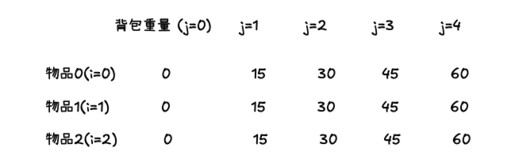
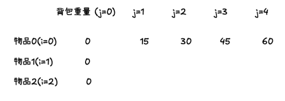

## 完全背包理论基础

完全背包问题是 01 背包问题的变种，不同之处在于**每种物品可以取无限次**。

### 完全背包动态规划解法（二维数组解法）

|        | 重量 | 价值 |
| ------ | ---- | ---- |
| 物品 0 | 1    | 15   |
| 物品 1 | 3    | 20   |
| 物品 2 | 4    | 30   |

以此题为例，手动计算结果如下：


假如求 `dp[1][4]`，有两种情况：

1. 不放物品 1

   - 背包价值就是 `dp[0][4]`，即**容量为 4 的背包，只放物品 0 的情况**

2. 放物品 1

   - 背包需要预留物品 1 的容量，背包容量为 4，物品 1 重量为 3，价值为 20，此时剩余容量为 1
   - 容量为 1 时，最大价值为 `dp[1][1] = 15`，即背包容量 1，放入物品 0 和物品 1 （**物品 1 可重复放入**）的最大价值，**01 背包只能是 `dp[0][1]`，不能重复放入**
   - 因此放物品 1 的情况 = `dp[1][1]` + 物品 1 的价值，即：`dp[1][4] = 15 + 20`

两种情况取最大值：

```js
dp[1][4] = Math.max(dp[0][4], dp[1][1] + 20)
// 推导递推公式
dp[i][j] = Math.max(dp[i - 1][j], dp[i][j - weight[i]] + value[i])
```

再看 01 背包递推公式

```js
dp[i][j] = Math.max(dp[i - 1][j], dp[i - 1][j - weight[i]] + value[i])
```

区别就是当放入物品 i 时，背包的最大价值是 `dp[i][j - weight[i]]`，而不是 `dp[i - 1][j - weight[i]]`，因为完全背包问题可以重复放入物品 i

动规五部曲：

1. 确定 dp 数组以及下标的含义

   `dp[i][j]` 表示[0... i - 1]的物品，可以去无限次，放进容量为 j 的背包的最大价值

2. 确定递推公式

   ```js
   dp[i][j] = Math.max(dp[i - 1][j], dp[i][j - weight[i]] + value[i])
   ```

3. dp 数组初始化

   - `dp[i][0] = 0`：背包容量为 0，价值为 0

   由状态转移方程可知，i 是由 i-1 推导出来，因此 i 为 0 时也需要初始化

   - `dp[0][j]`：存放物品 0 时，各个容量的背包所能存放的最大价值

     - 当 j < weight 时，`dp[0][j] = 0`
     - 当 j >= weight，`dp[0][j]`如果能放下物品 0，就可以无限装

       ```js
       for (let j = weight[0]; j <= bagWeight; j++) {
         dp[0][j] = dp[0][j - weight[0]] + value[0]
       }
       ```

   此时，初始化情况如下：
   

   其他地方都初始化为 0，因为 `dp[i][j]` 都是由**上方和作坊数值推导而出**

4. 确定遍历顺序

   先遍历物品，再遍历背包

5. 举例推导 dp 数组

   如最初的手动计算结果

#### 代码

```js
function knapsackComplete2D(weights, values, bagWeight) {
  const n = weights.length
  const dp = new Array(n).fill().map(() => new Array(bagWeight + 1).fill(0))

  for (let j = weights[0]; j <= bagSize; j++) {
    dp[0][j] = dp[0][j - weights[0]] + values[0]
  }

  for (let i = 1; i < n; i++) {
    for (j = 1; j <= bagSize; j++) {
      const weight = weights[i]
      const value = values[i]
      if (j >= weight) {
        // 可以放入背包：比较不放入和放入后的最大价值
        dp[i][j] = Math.max(
          dp[i - 1][j], // 不放入当前物品
          dp[i][j - weight] + value // 放入当前物品（注意是dp[i]，不是i-1）
        )
      } else {
        // 当前物品无法放入背包：继承前i-1个物品的结果
        dp[i][j] = dp[i - 1][j]
      }
    }
  }
  console.log(dp)
  return dp[n - 1][bagSize]
}
```

### 完全背包（一维数组）

和 01 背包推导一致，使用滚动数组

递归五部曲：

1. 确定 dp 数组及下标的含义

   `dp[j]` 表示容量为 j 的背包的最大价值

2. 确定递推公式

   ```js
   dp[i][j] = max(dp[i][j], dp[i][j - weight[i]] + value[i])
   // 压缩成一维数组，去掉i
   dp[j] = Math.max(dp[j], dp[j - weight[i]] + value[i])
   ```

3. dp 数组初始化

   只需初始化`dp[0] = 0`，背包容量为 0，价值为 0

4. 确定遍历顺序

   - 01 背包的一维数组解法需要**先遍历物品，再逆序遍历背包**，**逆序遍历确保每个物品只能使用一次**
   - 完全背包让物品可以无限次使用，所以使用**正序遍历背包**

   - 01 背包先遍历物品，再逆序遍历背包
   - 完全背包先遍历物品，后遍历背包或先遍历背包，后遍历物品

5. 举例推导 dp 数组

```js
function knapsackComplete1D(weights, values, bagWeight) {
  const n = weights.length

  const dp = new Array(bagWeight + 1).fill(0)

  for (let i = 0; i < n; i++) {
    for (j = 0; j <= bagWeight; j++) {
      const weight = weights[i]
      const value = values[i]
      if (j >= weight) {
        dp[j] = Math.max(dp[j], dp[j - weight] + value)
      }
    }
    console.log(dp)
  }

  return dp[bagWeight]
}
```

## 518.零钱兑换 II 🌟🌟

[力扣链接](https://leetcode.cn/problems/coin-change-ii/description/) 🌟🌟

### 题目描述

给定不同面额的硬币和一个总金额。写出函数来计算可以凑成总金额的硬币组合数。假设每一种面额的硬币有无限个。

示例 1:

- 输入: amount = 5, coins = [1, 2, 5]
- 输出: 4

解释: 有四种方式可以凑成总金额:

- 5=5
- 5=2+2+1
- 5=2+1+1+1
- 5=1+1+1+1+1

示例 2:

- 输入: amount = 3, coins = [2]
- 输出: 0
- 解释: 只用面额 2 的硬币不能凑成总金额 3。

示例 3:

- 输入: amount = 10, coins = [10]
- 输出: 1

注意，你可以假设：

- 0 <= amount (总金额) <= 5000
- 1 <= coin (硬币面额) <= 5000
- 硬币种类不超过 500 种
- 结果符合 32 位符号整数

### 解题思路

类似这种题目：给出一个总数，一些物品，问能否凑成这个总数。**典型的背包问题**

本题与[目标和](./dynamic-programming-code4.md/#494目标和-)十分类似。

目标和求装满背包有多少种方法，本题求装满背包有多少种组合

动规五部曲：

1. 确定 dp 数组及下标的含义

   `dp[i][j]` 表示在[0,...i-1]的硬币中，凑成金额 j 的组合数

2. 确定递推公式

   组合数等于不装硬币 i 和装硬币 i 的组合数之和

   ```js
   dp[i][j] = dp[i - 1][j] + dp[i][j - coins[i]]
   ```

3. dp 数组初始化

   第一行和第一列必须初始化，因为中间的值都是由上面和左边的值推导出来的

   - `dp[0][j]`：使用第一个硬币凑成金额 j 的组合数，即如果 j 能被 coins[0]整除，那么就为 0，否则为 1
   - `dp[i][0] = 1`：使用 i 个硬币凑成金额 0 的组合数，不装就可以，所以时 1 种

4. 确定遍历顺序

   先遍历硬币，再遍历金额

5. 举例推导 dp 数组

   以 amount 为 5，coins 为：[2,3,5] 为例：

   ```js
   dp = [
     [1, 0, 1, 0, 1, 0],
     [1, 0, 1, 1, 1, 1],
     [1, 0, 1, 1, 1, 2],
   ]
   ```

### 代码

```js
function change(amount, coins) {
  const n = coins.length

  const dp = new Array(n).fill().map(() => new Array(amount + 1).fill(0))

  for (i = 0; i < n; i++) {
    dp[i][0] = 1
  }
  for (let j = 0; j <= amount; j++) {
    dp[0][j] = j % coins[0] === 0 ? 1 : 0
  }

  for (let i = 1; i < n; i++) {
    const coin = coins[i]
    for (let j = 1; j <= amount; j++) {
      if (j >= coin) {
        dp[i][j] = dp[i - 1][j] + dp[i][j - coin]
      } else {
        dp[i][j] = dp[i - 1][j]
      }
    }
  }
  console.log(dp)

  return dp[n - 1][amount]
}
```

### 一维 dp

动规五部曲：

1. 确定 dp 数组及下标的含义

   dp[j] 表示能凑成金额 j 的硬币组合数

2. 确定递推公式

   ```js
   // 二维dp递推公式为
   dp[i][j] = dp[i - 1][j] + dp[i][j - coins[i]]
   // 压缩成一维
   dp[j] = dp[j] + dp[j - coins[i]]
   // 推导
   dp[j] += dp[j - coins[i]]
   ```

3. dp 数组初始化

   `dp[0] = 1`，凑成金额 0 的硬币组合数为 1，即不放入

4. 确定遍历顺序

   先遍历硬币，再遍历金额

5. 举例推导 dp 数组

#### 代码

```js
function change(amount, coins) {
  const n = coins.length
  const dp = new Array(amount + 1).fill(0)

  dp[0] = 1

  for (let i = 0; i < n; i++) {
    const coin = coins[i]
    for (let j = coin; j <= amount; j++) {
      dp[j] += dp[j - coin]
    }

    console.log(dp)
  }

  return dp[amount]
}
```

## 377. 组合总和 Ⅳ 🌟🌟

[力扣链接](https://leetcode.cn/problems/target-sum/description/) 🌟🌟

### 题目描述

给定一个由正整数组成且不存在重复数字的数组，找出和为给定目标正整数的组合的个数。

示例:

- nums = [1, 2, 3]
- target = 4

所有可能的组合为： (1, 1, 1, 1) (1, 1, 2) (1, 2, 1) (1, 3) (2, 1, 1) (2, 2) (3, 1)

请注意，顺序不同的序列被视作不同的组合。

因此输出为 7。

### 解题思路

本题与上题的区别是：**本题求排列数**

**求装满背包有几种方法，递归公式都是一样的，没有什么差别，但关键在于遍历顺序！**

动规五部曲：

1. 确定 dp 数组及下标的含义

   dp[j]表示和为 j 的排列数

2. 确定递推公式

   装满背包的递推公式都一致：

   ```js
   dp[j] += dp[j - nums[i]]
   ```

3. dp 数组初始化

   根据递推公式，需要初始化 `dp[0] = 1`（和为 0 的排列数为 1），这样才能推导出其他

4. 确定遍历顺序

   - **如果求组合数就是外层 for 循环遍历物品，内层 for 遍历背包**
   - **如果求排列数就是外层 for 遍历背包，内层 for 循环遍历物品**

   - 如果先遍历物品 nums，再遍历背包 target 时，如果计算 dp[4]时，只能得到(1, 3)，无法得到(3, 1),因为 nums 先遍历，dp[4]已经定为(1,3)
   - 所以需要先遍历背包 target，再遍历物品 nums，计算 dp[4]时，可以得到(3,1)和(1,3)

5. 举例推导 dp 数组

   假设 target 为 4，nums 为 [1, 2, 3]：

   ```js
   dp = [
     [1, 1, 0, 0, 0],
     [1, 1, 2, 0, 0],
     [1, 1, 2, 4, 0],
     [1, 1, 2, 4, 7],
   ]
   ```

#### 代码

```js
function combinationSum4(nums, target) {
  const dp = new Array(target + 1).fill(0)

  dp[0] = 1

  for (let j = 1; j <= target; j++) {
    for (let i = 0; i < nums.length; i++) {
      const num = nums[i]
      if (j >= num) {
        dp[j] += dp[j - num]
      }
    }
    console.log(dp)
  }
  return dp[target]
}
```

#### 二维 dp 数组解法

动规五部曲：

1. 确定 dp 数组及下标的含义

   `dp[i][j]` 使用前 i 种硬币（即 coins[0...i-1]）凑成金额 j 的组合数

2. 确定递推公式

   ```js
   dp[i][j] = dp[i - 1][j] + dp[i][j - nums[i]]
   ```

3. dp 数组初始化

   - `dp[i][0] = 1`，表示前 i 个数和为 1 时，不放入，有一种组合
   - `dp[0][j] = nums[0] === j ? 1 : 0`，表示只有第一个数时，和为 j 的组合数，只有当 nums[0] === j 时，才有一种组合

4. 确定遍历顺序

   先遍历背包，再遍历物品

5. 举例推导 dp 数组

```js
function combinationSum4(nums, target) {
  const n = nums.length
  const dp = new Array(n).fill().map(() => new Array(target + 1).fill(0))

  for (let i = 0; i < n; i++) {
    dp[i][0] = 1
  }

  for (let j = 1; j <= target; j++) {
    for (let i = 1; i < n; i++) {
      if (j >= nums[i]) {
        // 不放nums[i]
        // i = 0 时，dp[-1][j]恰好为0，所以没有特殊处理
        dp[i][j] =
          dp[i - 1][j] +
          // 放nums[i]。对于和为j的组合，只有试过全部物品，才能知道有几种组合方式。所以取最后一个物品dp[-1][j-nums[i]]
          dp[i][j - nums[i]]
      } else {
        dp[i][j] = dp[i - 1][j]
      }
    }
  }

  console.log(dp)
  return dp[n - 1][target]
}
```

## 70. 爬楼梯（进阶版） 🌟🌟

### 题目描述

假设你正在爬楼梯。需要 n 阶你才能到达楼顶。

每次你可以爬至多 m (1 <= m < n)个台阶。你有多少种不同的方法可以爬到楼顶呢？

注意：给定 n 是一个正整数。

输入描述：输入共一行，包含两个正整数，分别表示 n, m

输出描述：输出一个整数，表示爬到楼顶的方法数。

输入示例：3 2

输出示例：3

提示：

当 m = 2，n = 3 时，n = 3 这表示一共有三个台阶，m = 2 代表你每次可以爬一个台阶或者两个台阶。

此时你有三种方法可以爬到楼顶。

- 1 阶 + 1 阶 + 1 阶段
- 1 阶 + 2 阶
- 2 阶 + 1 阶

### 解题思路

最初的[爬楼梯](./dynamic-programming-code.md/#70-爬楼梯-)一层最多爬两层台阶，而这里可以爬 1-m 个台阶，因此问题就转成了完全背包问题。

动规五部曲：

1. 确定 dp 数组及下标的含义

   dp[i]表示爬到第 i 阶楼梯的方法数

2. 确定递推公式

   求装满背包的递推公式都是：`dp[i] += dp[i - nums[j]]`

   本体 j 指的是步数，及 dp[i] = dp[i-1] + dp[i-2] + ... + dp[i-j]，所以可得递推公式为：

   ```js
   dp[i] += dp[i - j]
   ```

3. 初始化 dp 数组

   `dp[0] = 1`，爬到第 0 阶楼梯的方法数为 1，dp[i]是由 dp[i-j]推导出来的，所以 dp[0]必须初始化

4. 确定遍历顺序

   - 完全背包问题：先遍历背包，再遍历物品
   - 在这里，先遍历 target，再遍历 nums

5. 举例推导 dp 数组

### 代码

```js
var climbStairs = function (n, m) {
  let dp = new Array(n + 1).fill(0)
  dp[0] = 1
  // 排列题，注意循环顺序，背包在外物品在内
  for (let j = 1; j <= n; j++) {
    //遍历背包
    for (let i = 1; i <= m; i++) {
      //遍历物品
      if (j - i >= 0) dp[j] = dp[j] + dp[j - i]
    }
    console.log(dp)
  }
  return dp[n]
}
```

## 01 背包对比完全背包

### 01 背包问题

#### 定义

- 特点：每个物品只能选择 0 次或 1 次
- 问题模型：在背包容量限制下，求最大价值或组合数
- 状态定义：`dp[j]` 表示容量为 `j` 的背包能装的最大价值（或组合数）

#### 状态转移方程

```js
dp[j] = max(dp[j], dp[j - weight[i]] + value[i]) // 求最大价值
// 或
dp[j] += dp[j - nums[i]] // 求组合数（如目标和问题）
```

#### 初始化

- 求最大价值：`dp` 数组初始化为 0
- 求组合数：`dp[0] = 1`（表示空背包有一种方式），其余初始化为 0

#### 遍历顺序

```js
for (物品 i = 0; i < n; i++) {
  for (容量 j = maxWeight; j >= weight[i]; j--) { // 倒序遍历
    dp[j] = Math.max(dp[j], dp[j - weight[i]] + value[i]);
  }
}
```

#### 典型例题

- [分割等和子集](https://leetcode.com/problems/partition-equal-subset-sum/)
- [目标和](https://leetcode.com/problems/target-sum/)

### 完全背包问题

#### 定义

- 特点：每个物品可以选无限次
- 问题模型：在背包容量限制下，求装满背包的组合数或最小物品数
- 状态定义：`dp[j]` 表示容量为 `j` 的背包的组合数或最小物品数

#### 状态转移方程

```js
dp[j] = Math.max(dp[j], dp[j - nums[i]] + value[i]) // 求最大价值
dp[j] += dp[j - nums[i]] // 求组合数（如零钱兑换 II）
dp[j] = Math.min(dp[j], dp[j - coins[i]] + 1) // 求最小物品数（如零钱兑换）
```

#### 初始化

- 求组合数：`dp[0] = 1`，其余初始化为 0
- 求最小物品数：`dp[0] = 0`，其余初始化为 `Infinity`

#### 遍历顺序

```js
for (物品 i) {
  for (容量 j = nums[i]; j <= maxWeight; j++) { // 正序遍历
    dp[j] = Math.max(dp[j], dp[j - nums[i]] + value[i]);
    dp[j] += dp[j - nums[i]]; // 组合数
    dp[j] = Math.min(dp[j], dp[j - coins[i]] + 1);// 最小物品数
  }
}
```

#### 典型例题

- [零钱兑换 II](https://leetcode.com/problems/coin-change-ii/)
- [完全平方数](https://leetcode.com/problems/perfect-squares/)

### 总结

- 01 背包：物品唯一，倒序遍历容量，解决“是否选择”的问题
- 完全背包：物品无限，正序遍历容量，解决“多次选择”的问题
- 核心技巧：根据问题特点选择遍历顺序，区分组合数或最值问题的初始化方式
