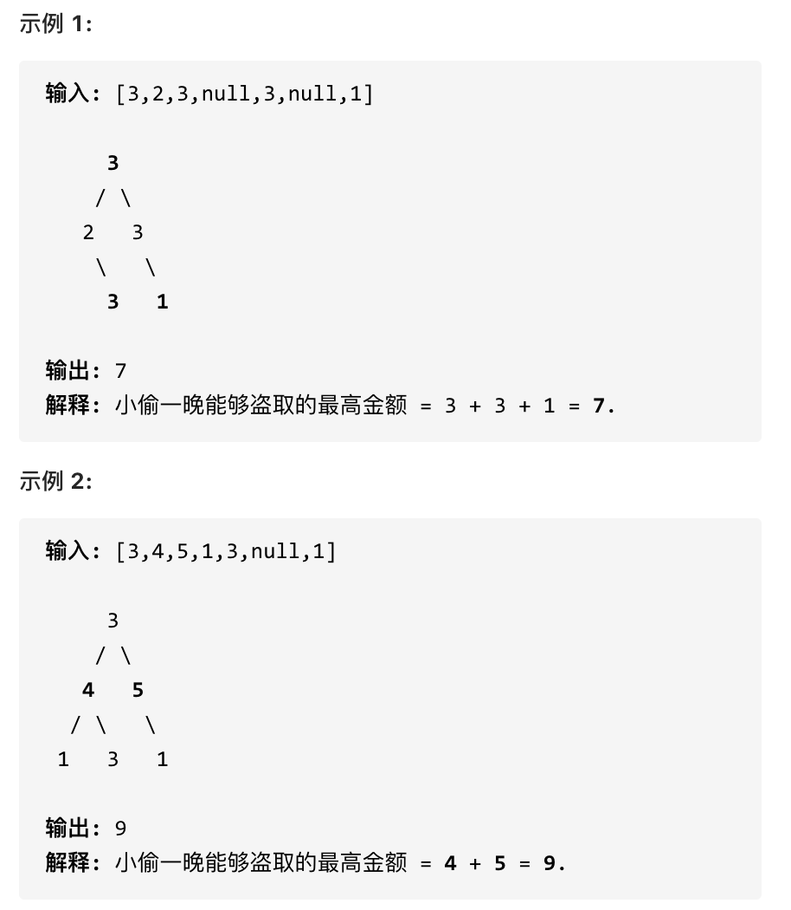

## 198.打家劫舍 🌟🌟

[力扣链接](https://leetcode.cn/problems/house-robber/description/) 🌟🌟

### 题目描述

你是一个专业的小偷，计划偷窃沿街的房屋。每间房内都藏有一定的现金，影响你偷窃的唯一制约因素就是相邻的房屋装有相互连通的防盗系统，如果两间相邻的房屋在同一晚上被小偷闯入，系统会自动报警。

给定一个代表每个房屋存放金额的非负整数数组，计算你 不触动警报装置的情况下 ，一夜之内能够偷窃到的最高金额。

- 示例 1：
- 输入：[1,2,3,1]
- 输出：4

解释：偷窃 1 号房屋 (金额 = 1) ，然后偷窃 3 号房屋 (金额 = 3)。   偷窃到的最高金额 = 1 + 3 = 4 。

- 示例 2：
- 输入：[2,7,9,3,1]
- 输出：12 解释：偷窃 1 号房屋 (金额 = 2), 偷窃 3 号房屋 (金额 = 9)，接着偷窃 5 号房屋 (金额 = 1)。   偷窃到的最高金额 = 2 + 9 + 1 = 12 。

提示：

- 0 <= nums.length <= 100
- 0 <= nums[i] <= 400

### 解题思路

递推关系：**当前房间偷与不偷，依赖前一个和前二个房间是否被偷的状态**

动规五部曲：

1. 确定 dp 数组及下标的含义

   dp[i]：表示包含下标 i 之前的房间，最多可以偷窃的金额

2. 确定递推公式

   假如当前房间为 i，有两种状态：

   1. 偷 i

      i-1 个房间不能偷，找出前 i-2（包含 i-2）之前的房间，最多可以偷窃的金额 + 第 i 个房间偷到的金额

      ```js
      dp[i] = dp[i - 2] + nums[i]
      ```

   2. 不偷 i

      前 i-1 个房间最多可以偷窃的金额

      ```js
      dp[i] = dp[i - 1]
      ```

   ```js
   // 递推公式为
   dp[j] = Math.max(dp[j - 2] + nums[j], dp[j - 1])
   ```

3. dp 数组初始化

   从递推公式得出需要考虑 dp[i-1]和 dp[i-2]，所以必须初始化 dp[0]和 dp[1]

   - `dp[0] = nums[0]`，dp[0]一定是 nums[0]，一定偷第一个房间
   - `dp[1] = Math.max(nums[0], nums[1])`, 选 1 和 2 之间的最大值

4. 确定遍历顺序

   i 从 2 开始遍历

5. 举例推导 dp 数组

   以 nums = [2,7,9,3,1] 为例，得到的 dp 数组为：

   ```js
   dp = [2, 7, 11, 11, 12]
   ```

### 代码

```js
function rob(nums) {
  const n = nums.length
  const dp = new Array(n).fill(0)

  dp[0] = nums[0]
  dp[1] = Math.max(nums[0], nums[1])

  for (let i = 2; i < n; i++) {
    dp[i] = Math.max(dp[i - 1], dp[i - 2] + nums[i])
  }
  console.log(dp)

  return dp[n - 1]
}
```

## 213.打家劫舍 II 🌟🌟

[力扣链接](https://leetcode.cn/problems/house-robber-ii/description/) 🌟🌟

### 题目描述

你是一个专业的小偷，计划偷窃沿街的房屋，每间房内都藏有一定的现金。这个地方所有的房屋都 围成一圈 ，这意味着第一个房屋和最后一个房屋是紧挨着的。同时，相邻的房屋装有相互连通的防盗系统，如果两间相邻的房屋在同一晚上被小偷闯入，系统会自动报警 。

给定一个代表每个房屋存放金额的非负整数数组，计算你 在不触动警报装置的情况下 ，能够偷窃到的最高金额。

示例  1：

- 输出：3
- 解释：你不能先偷窃 1 号房屋（金额 = 2），然后偷窃 3 号房屋（金额 = 2）, 因为他们是相邻的。
- 示例 2：
- 输出：4
- 解释：你可以先偷窃 1 号房屋（金额 = 1），然后偷窃 3 号房屋（金额 = 3）。偷窃到的最高金额 = 1 + 3 = 4 。
- 示例 3：
- 输出：0

提示：

- 1 <= nums.length <= 100

### 解题思路

**首尾连成环，意味着首位相邻，所以选择首，就不能选择尾，两者只能选其一，或都不选择**

以 nums=[1,6,1,9,1]为例：

- 情况一：不考虑首尾元素

  此时 nums=[6,1,9]

- 情况二：不考虑尾元素

  此时 nums=[1,6,1,9]

- 情况三：不考虑首元素

  此时 nums=[6,1,9,1]

**情况二和情况三已经包含情况一了**，接下来就类似于[打家劫舍思路](#198打家劫舍-)

#### 代码

```js
var rob = function (nums) {
  const robRange = (nums, start, end) => {
    if (end === start) return nums[start]
    const dp = new Array(nums.length).fill(0)
    dp[start] = nums[start]
    dp[start + 1] = Math.max(nums[start], nums[start + 1])

    for (let i = start + 2; i <= end; i++) {
      dp[i] = Math.max(dp[i - 1], dp[i - 2] + nums[i])
    }
    console.log(dp)
    return dp[end]
  }

  const n = nums.length
  const result1 = robRange(nums, 0, n - 2)
  const result2 = robRange(nums, 1, n - 1)

  return Math.max(result1, result2)
}
```

## 337.打家劫舍 III 🌟🌟

[力扣链接](https://leetcode.cn/problems/word-break/description/) 🌟🌟

### 题目描述

在上次打劫完一条街道之后和一圈房屋后，小偷又发现了一个新的可行窃的地区。这个地区只有一个入口，我们称之为“根”。 除了“根”之外，每栋房子有且只有一个“父“房子与之相连。一番侦察之后，聪明的小偷意识到“这个地方的所有房屋的排列类似于一棵二叉树”。 如果两个直接相连的房子在同一天晚上被打劫，房屋将自动报警。

计算在不触动警报的情况下，小偷一晚能够盗取的最高金额。



### 解题思路

树形结构偷钱，**树形结构状态转移**

**本题一定是要后序遍历，因为通过递归函数的返回值来做下一步计算**

每个节点只有两种状态：**偷、不偷，可以使用一个长度为 2 的数组，记录当前节点获取的最大金额**

- dp[0]记录不偷当前节点的最大金额
- dp[1]记录偷当前节点的最大金额

不用定义每个节点的 dp 数组：每层递归都有一个长度为 2 的 dp 数组，当前层的 dp 数组表示当前节点的状态

递归三部曲：

1. 确定递归函数的参数和返回值

   - 参数：当前节点
   - 返回值：长度为 2 的数组，表示当前节点偷和不偷的最大金额

2. 取定递归的终止条件

   - 如果当前节点为 null，返回[0, 0]

3. 确定单层递归的逻辑

   - 递归左子树，得到左孩子偷与不偷的最大金额
   - 递归右子树，得到右孩子偷与不偷的最大金额

   - 偷当前节点，左右孩子只能不偷 `val1 = left[0] + right[0] + root.val`
   - 不偷当前节点，左右孩子就可以偷，左右孩子偷与不偷，取决于左孩子 left[0]和 left[1]的最大值，右孩子 right[0]和 right[1]的最大值 `val2 = Math.max(left[0], left[1]) + Math.max(right[0], right[1])`

### 代码

```js
var rob = function (root) {
  const postOrder = (root) => {
    // 空节点 返回dp数组为 偷与不偷的金额[0, 0]
    if (!root) return [0, 0]

    // 遍历左右子树 得到偷与不偷的最大金额
    const left = postOrder(root.left)
    const right = postOrder(root.right)

    // dp[0]不偷 dp[1] 偷
    // 不偷当前 左右节点取偷与不偷的最大值
    const val1 = Math.max(left[0], left[1]) + Math.max(right[0], right[1])
    // 偷当前节点 那么不偷左右节点
    const val2 = left[0] + right[0] + root.val

    // [不偷, 偷]
    return [val1, val2]
  }
  const res = postOrder(root)

  return Math.max(...res)
}
```
