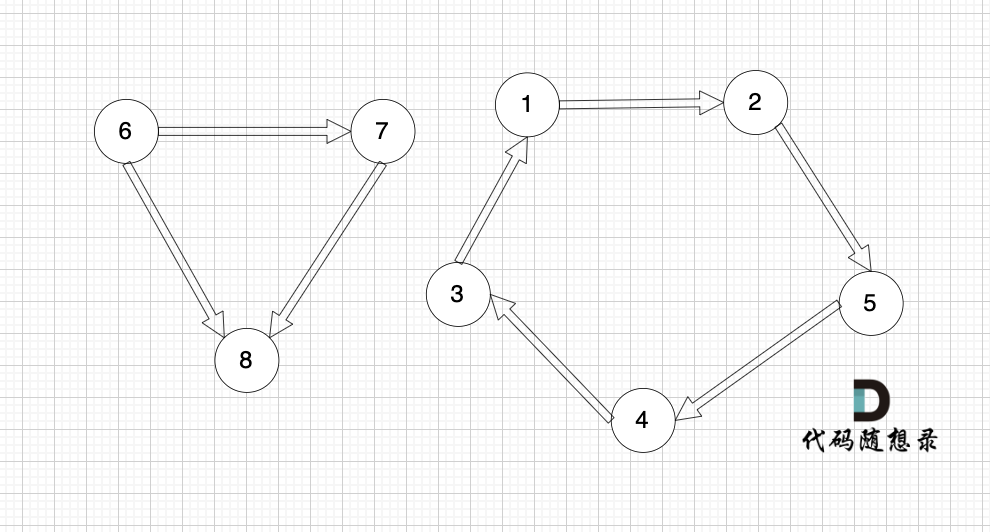

## 图

### 基本概念

二维坐标中，两点可以连成线，多个点连成的线就构成了图。

图可以是一个节点，或没有节点（空图）

### 图的种类

- 有向图

  图的边有方向

- 无向图

  图的边无方向

- 加权有向图

  有向图并且边是有权值的

- 加权无向图

### 度

- 无向图：**连接该节点**的边数就是度

  

  节点 4 的度为 5，其他节点度都是 3

- 有向图

  - 入度：**指向该节点**的边数
  - 出度：**从该节点出发**的边数

  

  节点 1 入度为 0，出度为 2

### 连通图/强连通图

- **无向图所有节点都可以到达**，称为连通图，否则为非联通图

  如 image1，所有节点都可以到达，所以是连通图

  

  如图就是非连通图

- **有向图任何两个节点是可以相互到达**，称为强连通图，否则为非强连通图

  如 image2，节点 1 能到节点 2，但节点 2 无法到达节点 1，所以是非强连通图

  

  这个才是强连通图

### 连通分量/强连通分量

- **无向图的极大连通子图**称为该图的一个连通分量

  如 image3 中

  - 节点 1、2、5 构成的子图就是该无向图的一个连通分量
  - 节点 3、4、6 构成的子图也是该无向图的另一个连通分量
  - 节点 3、4 构成的子图不是连通分量，因为必须是**极大连通子图**

- **有向图的极大强连通子图**称为该图的一个强连通分量

  

  - 节点 1、2、3、4、5 构成的子图就是该有向图的一个强连通分量，**强连通图、极大**
  - 节点 6、7、8 构成的子图不是该有向图的一个强连通分量，**不是强连通图**
  - 节点 1、3、5 构成的子图不是该有向图的一个强连通分量，**不是极大连通子图**

### 图的构造

如何使用代码表示一个图？

三种方法：邻接表、列阶矩阵、类

1. 类 “朴素存储”

   **有 n 条边就定义数组长度为 `n*2`**

   如图 5，图中有 8 条边，定义 `8*2` 的数组

   ```js
   let graphArr = [
     [6, 7],
     [6, 8],
     [7, 8],
     [1, 2],
     [2, 5],
     [5, 4],
     [4, 3],
     [3, 1],
   ]
   ```

   数组第一行 6 7，表示节点 6 指向节点 7，以此类推

   可以使用数组、map 或类表示

   - **优点：直观**，节点与节点的关系都很容易理解
   - **缺点：不方便查找节点的关系**，如节点 1 和节点 6 是否相连，需要全部遍历
     深搜和广搜都不会使用这种存储方式

2. 邻接矩阵

   **用一个二维数组表示图的边**，从**节点的角度表示图**，有多少节点就申请多大的二维数组

   如图 5，需要申请 `8*8` 的二维数组

   例如： grid[2][5] = 6，表示 节点 2 连接 节点 5 为有向图，节点 2 指向 节点 5，边的权值为 6

   - 节点 i 和节点 j 相连，`graph[i][j] = true`
   - 节点 i 和节点 j 不相连，`graph[i][j] = false`

   邻接矩阵的优点：

   - 表达方式简单，易于理解
   - 检查任意两个顶点间是否存在边的操作非常快
   - 适合稠密图，在边数接近顶点数平方的图中，邻接矩阵是一种空间效率较高的表示方法。

   缺点：

   - 遇到稀疏图，会导致申请过大的二维数组造成空间浪费 且遍历 边 的时候需要遍历整个 n \* n 矩阵，造成时间浪费

3. 邻接表

   使用数组+链表表示，**从边的角度表示图**，有多少边才会申请对应大小的链表

   

   - 节点 1 指向节点 3 和节点 5
   - 节点 2 指向节点 4、节点 3、节点 5
   - 节点 3 指向节点 4
   - 节点 4 指向节点 1

   邻接表的优点：

   - 对于稀疏图的存储，只需要存储边，空间利用率高
   - 遍历节点连接情况相对容易

   缺点：

   - 检查任意两个节点间是否存在边，效率相对低，需要 O(V)时间，V 表示某节点连接其他节点的数量。
   - 实现相对复杂，不易理解

示例：

```js
let n = 5 // 节点数
let m = 5 // 边数
let edges = [
  [1, 3],
  [3, 5],
  [1, 2],
  [2, 4],
  [4, 5],
]

// 邻接矩阵构建
let graph = new Array(n + 1).fill(0).map(() => new Array(n + 1).fill(0))
for (let i = 0; i < m; i++) {
  let [x, y] = edges[i]
  graph[x][y] = 1
}
console.log('邻接矩阵:', graph)

// 邻接表构建
let graph1 = new Array(n + 1).fill(0).map(() => [])
for (let i = 0; i < m; i++) {
  let [x, y] = edges[i]
  graph1[x].push(y)
}
console.log('邻接表:', graph1)
```

输出结果如下：

```js
// 邻接矩阵
graph = [
  [0, 0, 0, 0, 0, 0],
  [0, 0, 0, 1, 0, 0],
  [0, 0, 0, 0, 1, 0],
  [0, 0, 0, 0, 0, 1],
  [0, 0, 0, 0, 0, 1],
  [0, 0, 0, 0, 0, 0],
]
// 邻接表
graph = [[], [3, 2], [4], [5], [5], []]
```

### 图的遍历方式

- 深度优先搜索 dfs
- 广度优先搜索 bfs

如二叉树的遍历方式：

- 递归遍历，dfs
- 层序遍历，bfs

## 深度优先搜索

### dfs 和 bfs 区别

- 广度优先搜索（BFS）从根节点开始，沿着树的宽度遍历所有节点，然后向下深入
- 深度优先搜索（DFS）从根节点开始，沿着树的深度遍历尽可能深的节点，然后回溯

### dfs 搜索过程

回忆下二叉树的深度搜索过程：

以前序遍历为例：

1. 从根节点开始

   - 首先访问根节点，记录或处理该节点的值

2. 递归访问左子树

   - 如果当前节点有左子节点，则递归进入左子树
   - 在左子树中，重复步骤 1 和步骤 2，直到到达左子树的最底部（即左叶子节点）

3. 回溯并访问右子树

   - 当左子树访问完成后，回溯到当前节点
   - 如果当前节点有右子节点，则递归进入右子树
   - 在右子树中，重复步骤 1 和步骤 2

4. 重复以上步骤

   - 按照“先左后右”的顺序，递归访问每个节点的左子树和右子树
   - 直到所有节点都被访问完

那么在图中的 dfs 过程是怎样的？

如图 1 中，搜索从节点 1 到节点 6 的所有路径，深搜的过程如下：

1. 从节点 1 开始，访问节点 1，记录路径 [1]
2. 访问节点 1 的邻接节点 2，记录路径 [1, 2]
3. 访问节点 2 的邻接节点 3，记录路径 [1, 2, 3]
4. 访问节点 3 的邻接节点 4，记录路径 [1, 2, 3, 4]
5. 访问节点 4 的邻接节点 5，记录路径 [1, 2, 3, 4, 5]
6. 访问节点 5 的邻接节点 6，记录路径 [1, 2, 3, 4, 5, 6]
7. 到达节点 6，记录路径 [1, 2, 3, 4, 5, 6]，结束搜索
8. 回溯到节点 5，继续搜索节点 5 的其他邻接节点，直到搜索完所有路径
   .....

因此，dfs 的过程关键就亮点：

1. 搜索方向，认准一个方向，直到碰壁，再换方向继续搜索
2. 回溯，搜索完一个方向后，回到上一个节点，继续搜索其他方向

### 代码结构

dfs 的代码结构也就是回溯算法的代码结构：

```js
function dfs(参数) {
    if (终止条件) {
        存放结果;
        return;
    }

    for (选择：本节点所连接的其他节点) {
        处理节点;
        dfs(图，选择的节点); // 递归
        回溯，撤销处理结果
    }
}
```

### 深搜三部曲

1. 确认递归函数、参数

   ```js
   function dfs(参数) {}
   ```

   一般需要**二维数组保存所有路径，一维数组保存单一路径**，定义全局变量即可

   ```js
   let result = [] // 保存符合条件所有路径
   let path = [] // 保存单一路径
   function dfs(参数) {}
   ```

2. 确认终止条件

   ```js
   if (终止条件) {
     result.push([...path]) // 复制路径
     return
   }
   ```

3. 处理目前搜索节点出发的路径

   **for 循环遍历目前搜索节点所连接的其他节点**

   ```js
   for (选择：本节点所连接的其他节点) {
     path.push(选择的节点) // 处理节点
     dfs(图，选择的节点) // 递归
     path.pop() // 回溯，撤销处理结果
   }
   ```

## 所有可达路径

[题目链接](https://kamacoder.com/problempage.php?pid=1170)

### 题目描述

【题目描述】

给定一个有 n 个节点的有向无环图，节点编号从 1 到 n。请编写一个程序，找出并返回所有从节点 1 到节点 n 的路径。每条路径应以节点编号的列表形式表示。

【输入描述】

第一行包含两个整数 N，M，表示图中拥有 N 个节点，M 条边

后续 M 行，每行包含两个整数 s 和 t，表示图中的 s 节点与 t 节点中有一条路径

【输出描述】

输出所有的可达路径，路径中所有节点的后面跟一个空格，每条路径独占一行，存在多条路径，路径输出的顺序可任意。

如果不存在任何一条路径，则输出 -1。

注意输出的序列中，最后一个节点后面没有空格！ 例如正确的答案是 `1 3 5`,而不是 `1 3 5`， 5 后面没有空格！

【输入示例】

```text
5 5
1 3
3 5
1 2
2 4
4 5
```

【输出示例】

```text
1 3 5
1 2 4 5
```

提示信息


用例解释：

有五个节点，其中的从 1 到达 5 的路径有两个，分别是 1 -> 3 -> 5 和 1 -> 2 -> 4 -> 5。

因为拥有多条路径，所以输出结果为：

```text
1 3 5
1 2 4 5
```

或

```text
1 2 4 5
1 3 5
```

都算正确。

数据范围：

- 图中不存在自环
- 图中不存在平行边
- 1 <= N <= 100
- 1 <= M <= 500

### 解题思路

相似题目：[797.所有可能的路径](https://leetcode.cn/problems/all-paths-from-source-to-target/description/)

#### 图的存储

- 邻接矩阵存储

  二维数组 `n * n` 表示图结构

  本题节点标号从 1 开始，为了节点标号与下标对齐，定义 `n + 1 * n + 1` 表示图结构

  ```js
  let graph = new Array(n + 1).fill().map(() => new Array(n + 1).fill(0))
  ```

  输入 m 条边，构造方式如下

  ```js
  while (m--) {
    let [x, y] = readline().split(' ').map(Number)
    // 1表示节点x指向节点y
    graph[x][y] = 1
  }
  ```

- 邻接表存储

  数组 + 链表，以边的数量表示图，有多少边申请对应大小的链表

  构造数组，数组捏的元素是链表

  ```js
  let graph = new Array(N + 1).fill(0).map(() => new Array())
  ```

  数入 m 个边，构造方式如下

  ```js
  while (m--) {
    let [x, y] = readline().split(' ').map(Number)
    graph[x].add(y)
  }
  ```

#### 深度优先搜索

深搜三部曲：

1. 确定递归函数、参数

   - 参数 1：当前遍历节点 x
   - 参数 2：终点 n，当 x===n 时搜索结束

   定义全局变量 `result` 和 `path`

   ```js
   let result = []
   let path = []
   function dfs(x, n) {}
   ```

2. 确定终止条件

   当目前遍历的节点是最有一个节点 n 的时候，就找到了一条从出发点到终止点的路径

   ```js
   if (x === n) {
     result.push([...path])
     return
   }
   ```

3. 处理目前搜索节点出发的路径

   遍历目前搜索节点 x 的所有邻接节点，递归调用 dfs 函数

   ```js
   for (let i = 1; i <= n; i++) {
     // 遍历目前搜索节点 x 的所有邻接节点
     if (graph[x][i] === 1) {
       // 邻接节点存在边
       path.push(i) // 遍历到的节点加入到路径
       dfs(i, n) // 递归调用 dfs
       path.pop() // 回溯，撤销处理结果
     }
   }
   ```

### 代码

ACM 格式

[797. 所有可能的路径](https://leetcode.cn/problems/all-paths-from-source-to-target/description/) 代码如下

```js
var allPathsSourceTarget = function (graph) {
  const result = []
  const path = []
  const dfs = (node) => {
    path.push(node) // 将当前节点加入路径

    // 如果到达目标节点（最后一个节点），将路径加入结果
    if (node === graph.length - 1) {
      result.push([...path])
      return
    }

    // 遍历当前节点的所有邻接节点
    for (let i = 0; i < graph[node].length; i++) {
      dfs(graph[node][i])
      path.pop()
    }
  }

  dfs(0)

  return result
}
```
