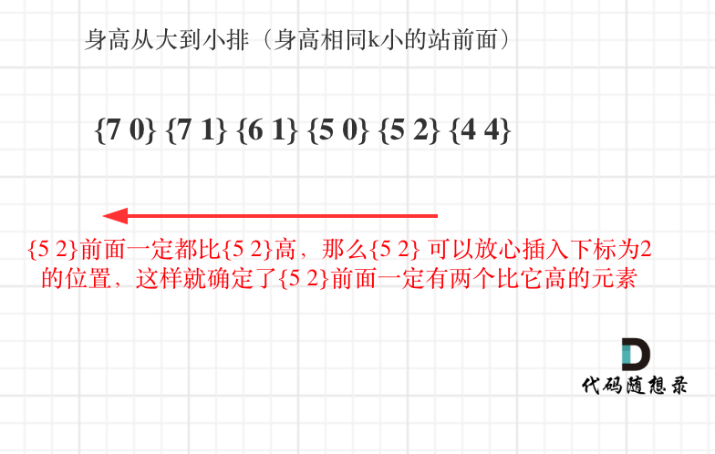

## 134. 加油站 🌟🌟

[力扣链接](https://leetcode.cn/problems/gas-station/description/) 🌟🌟

### 题目描述

在一条环路上有  N  个加油站，其中第  i  个加油站有汽油  gas[i]  升。

你有一辆油箱容量无限的的汽车，从第 i 个加油站开往第 i+1  个加油站需要消耗汽油  cost[i]  升。你从其中的一个加油站出发，开始时油箱为空。

如果你可以绕环路行驶一周，则返回出发时加油站的编号，否则返回 -1。

说明:

- 如果题目有解，该答案即为唯一答案。
- 输入数组均为非空数组，且长度相同。
- 输入数组中的元素均为非负数。

示例  1: 输入:

- gas = [1,2,3,4,5]
- cost = [3,4,5,1,2]

输出: 3 解释:

- 从 3 号加油站(索引为 3 处)出发，可获得 4 升汽油。此时油箱有 = 0 + 4 = 4 升汽油
- 开往 4 号加油站，此时油箱有 4 - 1 + 5 = 8 升汽油
- 开往 0 号加油站，此时油箱有 8 - 2 + 1 = 7 升汽油
- 开往 1 号加油站，此时油箱有 7 - 3 + 2 = 6 升汽油
- 开往 2 号加油站，此时油箱有 6 - 4 + 3 = 5 升汽油
- 开往 3 号加油站，你需要消耗 5 升汽油，正好足够你返回到 3 号加油站。
- 因此，3 可为起始索引。

示例 2: 输入:

- gas = [2,3,4]
- cost = [3,4,3]
- 输出: -1
- 解释: 你不能从 0 号或 1 号加油站出发，因为没有足够的汽油可以让你行驶到下一个加油站。我们从 2 号加油站出发，可以获得 4 升汽油。 此时油箱有 = 0 + 4 = 4 升汽油。开往 0 号加油站，此时油箱有 4 - 3 + 2 = 3 升汽油。开往 1 号加油站，此时油箱有 3 - 3 + 3 = 3 升汽油。你无法返回 2 号加油站，因为返程需要消耗 4 升汽油，但是你的油箱只有 3 升汽油。因此，无论怎样，你都不可能绕环路行驶一周。

### 解题思路

从哪站出发走一圈可以回来？

- gas：每个加油站可补充油的单位
- cost：从当前站到下一站消耗的汽油单位

#### 暴力法

- 遍历每一个加油站为起点的情况，计算剩余油量`rest`，模拟一圈
- 如果中途没有断，并且最终油量 >= 0，返回当前加油站

**for 循环适合模拟从头到尾的遍历，而 while 循环适合模拟环形遍历，要善于使用 while！**

```js
function canCompleteCircuit(gas, cost) {
  const len = gas.length
  for (let i = 0; i < len; i++) {
    const rest = gas[i] - cost[i]
    const index = (i + 1) % n
    while (rest > 0 && index !== i) {
      rest += gas[index] - cost[index]
      index = (index + 1) % n
    }
    if (rest >= 0 && index === i) return i
  }
  return -1
}
```

#### 贪心法

如果总油量 - 总消耗大于等于零则一定可以跑完一圈，说明各个站点的剩余油量 `rest[i] = gas[i] - cost[i]` 一定大于等于 0。

i 从零开始，累计 rest[i]，记录总和 curSum，如果 curSum 小于 0，说明从 0 到 i 都不行，从 i+1 开始重新计算。

**局部最优：当前累加 rest[i]的和 curSum 一旦小于 0，起始位置至少要是 i+1，因为从 i 之前开始一定不行**

**全局最优：找到可以跑一圈的起始位置**

```js
var canCompleteCircuit = function (gas, cost) {
  // 当前剩余 总剩余 好理解
  let curRest = 0
  let totalRest = 0
  let start = 0
  let len = gas.length
  for (let i = 0; i < len; i++) {
    const rest = gas[i] - cost[i]
    curRest += rest
    totalRest += rest
    if (curRest < 0) {
      start = i + 1
      curRest = 0
    }
  }
  return totalRest >= 0 ? start : -1
}
```

## 135. 分发糖果 🌟🌟

[力扣链接](https://leetcode.cn/problems/candy/) 🌟🌟

### 题目描述

老师想给孩子们分发糖果，有 N  个孩子站成了一条直线，老师会根据每个孩子的表现，预先给他们评分。

你需要按照以下要求，帮助老师给这些孩子分发糖果：

- 每个孩子至少分配到 1 个糖果。
- 相邻的孩子中，评分高的孩子必须获得更多的糖果。

那么这样下来，老师至少需要准备多少颗糖果呢？

示例  1:

- 输入: [1,0,2]
- 输出: 5
- 解释: 你可以分别给这三个孩子分发 2、1、2 颗糖果。

示例  2:

- 输入: [1,2,2]
- 输出: 4
- 解释: 你可以分别给这三个孩子分发 1、2、1 颗糖果。第三个孩子只得到 1 颗糖果，这已满足上述两个条件。

### 解题思路

两边同时比较？

**应该确定一边之后再确定另一边，如：比较每一个孩子的右边，完成后再比较每一个孩子的左边**

1. 右孩子比左孩子得分高（从前往后遍历）

   - **局部最优：只要右 > 左，则右边孩子多一个糖果**
   - **全局最优：相邻孩子，评分高的右孩子获得比左边孩子更多的糖果**

   ```js
   // 右大于左，则右边孩子多一个糖果
   for (let i = 0; i < ratings.length; i++) {
     if (ratings[i] > ratings[i - 1]) {
       candies[i] = candies[i - 1] + 1
     }
   }
   ```

   如：[1,3,4,5,2]，从左往右后得到糖果数 `[1, 2, 3, 4, 1]`

2. 左孩子比右孩子得分高（从后往前遍历）（利用之前结果）

   - **局部最优：左 > 右时，取右边糖果数 + 1 和当前糖果数比较取较大值，保证当前孩子糖果数在相邻中最大**
   - **全局最优：相邻孩子，评分高的左孩子获得更多的糖果**

   ```js
   // 左大于右时，取右边糖果数 + 1 和当前糖果数比较取较大值
   for (let i = ratings.length - 2; i >= 0; i--) {
     if (ratings[i] > ratings[i + 1]) {
       // 如果只取右侧糖果数 + 1，会出现 [1, 2, 3, 2, 1] 从左往右的结果会被修改
       candies[i] = Math.max(candies[i], candies[i + 1] + 1)
     }
   }
   ```

   从右往左得到 `[1, 2, 3, 4, 1]`

### 代码

```js
function candy(ratings) {
  const n = ratings.length
  const candies = new Array(n).fill(1)

  // 左到右：处理右边评分更高的情况
  for (let i = 1; i < n; i++) {
    if (ratings[i] > ratings[i - 1]) {
      candies[i] = candies[i - 1] + 1
    }
  }

  // 右到左：处理左边评分更高的情况，并取最大值
  for (let i = n - 2; i >= 0; i--) {
    if (ratings[i] > ratings[i + 1]) {
      candies[i] = Math.max(candies[i], candies[i + 1] + 1)
    }
  }

  return candies.reduce((sum, num) => sum + num, 0)
}
```

## 860.柠檬水找零 🌟

[力扣链接](https://leetcode.cn/problems/lemonade-change/description/) 🌟

### 题目描述

在柠檬水摊上，每一杯柠檬水的售价为  5  美元。

顾客排队购买你的产品，（按账单 bills 支付的顺序）一次购买一杯。

每位顾客只买一杯柠檬水，然后向你付 5 美元、10 美元或 20 美元。你必须给每个顾客正确找零，也就是说净交易是每位顾客向你支付 5 美元。

注意，一开始你手头没有任何零钱。

如果你能给每位顾客正确找零，返回  true ，否则返回 false 。

示例 1：

- 输入：[5,5,5,10,20]
- 输出：true
- 解释：
  - 前 3 位顾客那里，我们按顺序收取 3 张 5 美元的钞票。
  - 第 4 位顾客那里，我们收取一张 10 美元的钞票，并返还 5 美元。
  - 第 5 位顾客那里，我们找还一张 10 美元的钞票和一张 5 美元的钞票。
  - 由于所有客户都得到了正确的找零，所以我们输出 true。

示例 2：

- 输入：[5,5,10]
- 输出：true

示例 3：

- 输入：[10,10]
- 输出：false

示例 4：

- 输入：[5,5,10,10,20]
- 输出：false
- 解释：
  - 前 2 位顾客那里，我们按顺序收取 2 张 5 美元的钞票。
  - 对于接下来的 2 位顾客，我们收取一张 10 美元的钞票，然后返还 5 美元。
  - 对于最后一位顾客，我们无法退回 15 美元，因为我们现在只有两张 10 美元的钞票。
  - 由于不是每位顾客都得到了正确的找零，所以答案是 false。

提示：

- 0 <= bills.length <= 10000
- bills[i]  不是  5  就是  10  或是  20

### 解题思路

分析情况：

1. 遇到 5 元，直接收下即可
2. 遇到 10 元，消耗一个 5 元，增加一个 10
3. 遇到 20 元，优先消耗一个 10 和一个 5，如果不够，再消耗三个 5

**局部最优：遇到账单 20，优先消耗美元 10，完成本次找零**

**全局最优：完成全部账单的找零**

```js
var lemonadeChange = function (bills) {
  let fiveCount = 0
  let tenCount = 0
  for (let bill of bills) {
    if (bill === 5) {
      fiveCount++
    } else if (bill === 10) {
      if (fiveCount > 0) {
        fiveCount--
        tenCount++
      } else {
        return false
      }
    } else {
      if (tenCount > 0 && fiveCount > 0) {
        tenCount--
        fiveCount--
      } else if (fiveCount > 3) {
        fiveCount -= 3
      } else {
        return false
      }
    }
  }
  return true
}
```

## 406.根据身高重建队列 🌟🌟

[力扣链接](https://leetcode.cn/problems/queue-reconstruction-by-height/description/) 🌟🌟

### 题目描述

假设有打乱顺序的一群人站成一个队列，数组 people 表示队列中一些人的属性（不一定按顺序）。每个 people[i] = [hi, ki] 表示第 i 个人的身高为 hi ，前面 正好 有 ki 个身高大于或等于 hi 的人。

请你重新构造并返回输入数组  people 所表示的队列。返回的队列应该格式化为数组 queue ，其中 queue[j] = [hj, kj] 是队列中第 j 个人的属性（queue[0] 是排在队列前面的人）。

示例 1：

- 输入：people = [[7,0],[4,4],[7,1],[5,0],[6,1],[5,2]]
- 输出：[[5,0],[7,0],[5,2],[6,1],[4,4],[7,1]]
- 解释：
  - 编号为 0 的人身高为 5 ，没有身高更高或者相同的人排在他前面。
  - 编号为 1 的人身高为 7 ，没有身高更高或者相同的人排在他前面。
  - 编号为 2 的人身高为 5 ，有 2 个身高更高或者相同的人排在他前面，即编号为 0 和 1 的人。
  - 编号为 3 的人身高为 6 ，有 1 个身高更高或者相同的人排在他前面，即编号为 1 的人。
  - 编号为 4 的人身高为 4 ，有 4 个身高更高或者相同的人排在他前面，即编号为 0、1、2、3 的人。
  - 编号为 5 的人身高为 7 ，有 1 个身高更高或者相同的人排在他前面，即编号为 1 的人。
  - 因此 [[5,0],[7,0],[5,2],[6,1],[4,4],[7,1]] 是重新构造后的队列。

示例 2：

- 输入：people = [[6,0],[5,0],[4,0],[3,2],[2,2],[1,4]]
- 输出：[[4,0],[5,0],[2,2],[3,2],[1,4],[6,0]]

提示：

- 1 <= people.length <= 2000
- 0 <= hi <= 10^6
- 0 <= ki < people.length

题目数据确保队列可以被重建

### 解题思路

类似[135.分发糖果](#135-分发糖果-)，有两个维度 h 和 k，所以应该先确定一个维度，再按照另一个维度重新排列。

哪个维度优先呢？

1. 按照 k 来排序，排完之后，k 和 h 的排列都不符合条件，两个维度都没法确定

   ```js
   // 按照k排序完后
   // k为4时，说明4前面有4个h大于4的，然而此时有6个，那么k的排序不符合条件
   // h的排序肉眼可见不符合条件
   people = [
     [5, 0],
     [7, 0],
     [6, 1],
     [7, 1],
     [5, 2],
     [4, 4],
   ]
   ```

2. 按照 h 来排序，排完之后，h 一定是从大到小，h 的排列符合条件，再确定 k 的排序（对于每个排好序的人，他的 k 值就是他在队列中的位置，因为前面已经有 k 个比他高或相等的人，但此时已经处理的人都是比他高或者相等的，所以插入到 k 的位置就能满足条件）

   ```js
   // 按照h排序完后
   // h的排序符合条件
   // 再确定k的排序（只需要按照k为下标重新插入队列）
   people = [
     [7, 0],
     [7, 1],
     [6, 1],
     [5, 0],
     [5, 2],
     [4, 4],
   ]
   ```

   

   - **局部最优：优先按身高高的 people 的 k 来插入。插入操作过后的 people 满足队列属性**
   - **全局最优：最后都做完插入操作，整个队列满足题目队列属性**

```js
var reconstructQueue = function (people) {
  let queue = []
  people.sort((a, b) => {
    if (b[0] !== a[0]) {
      return b[0] - a[0]
    } else {
      // 如果身高相同则按k值升序排列
      return a[1] - b[1]
    }
  })

  for (let p of people) {
    queue.splice(p[1], 0, p)
  }

  return queue
}
```
