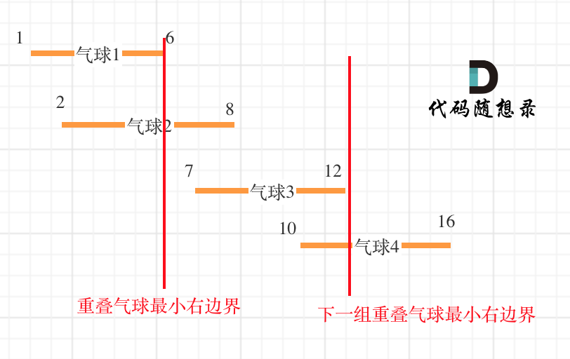

## 452. 用最少数量的箭引爆气球 🌟🌟

[力扣链接](https://leetcode.cn/problems/minimum-number-of-arrows-to-burst-balloons/description/) 🌟🌟

### 题目描述

在二维空间中有许多球形的气球。对于每个气球，提供的输入是水平方向上，气球直径的开始和结束坐标。由于它是水平的，所以纵坐标并不重要，因此只要知道开始和结束的横坐标就足够了。开始坐标总是小于结束坐标。

一支弓箭可以沿着 x 轴从不同点完全垂直地射出。在坐标 x 处射出一支箭，若有一个气球的直径的开始和结束坐标为 xstart，xend， 且满足  xstart ≤ x ≤ xend，则该气球会被引爆。可以射出的弓箭的数量没有限制。 弓箭一旦被射出之后，可以无限地前进。我们想找到使得所有气球全部被引爆，所需的弓箭的最小数量。

给你一个数组 points ，其中 points[i] = [xstart,xend] ，返回引爆所有气球所必须射出的最小弓箭数。

示例 1：

- 输入：points = [[10,16],[2,8],[1,6],[7,12]]
- 输出：2
- 解释：对于该样例，x = 6 可以射爆 [2,8],[1,6] 两个气球，以及 x = 11 射爆另外两个气球

示例 2：

- 输入：points = [[1,2],[3,4],[5,6],[7,8]]
- 输出：4

示例 3：

- 输入：points = [[1,2],[2,3],[3,4],[4,5]]
- 输出：2

示例 4：

- 输入：points = [[1,2]]
- 输出：1

示例 5：

- 输入：points = [[2,3],[2,3]]
- 输出：1

提示：

- 0 <= points.length <= 10^4
- points[i].length == 2
- -2^31 <= xstart < xend <= 2^31 - 1

### 解题思路

题意：有很多气球，每个气球占据的区间用 xstart 和 xend 表示。如果一支箭射到位置 x，那么所有 xstart ≤ x ≤ xend 的气球都会被引爆（**如一个在[1,3]，另一个在[2,4]，那么射在 2 或者 3 的位置，可以同时引爆这两个**）。问最少需要多少支箭才能把所有气球射爆。

如何使用最少的弓箭射爆所有气球？

- **局部最优：当气球重叠时，一起射穿**
- **全局最优：射穿所有气球，用的弓箭最少**

**为了让气球尽可能的重叠，需要对数组进行排序**

1. 按照起始位置从小到大排序
2. 从前向后遍历，**如果气球重叠了，重叠气球中右边边界的最小值 之间的区间一定需要一只弓箭**



题解：

1. 按起始点从小到大排序
2. 初始化弓箭数为 1（至少需要一支箭）
3. 遍历气球，如果当前气球的起始点 > 前一个气球的结束点；需要新增一支箭
4. 如果不大于时，说明两个气球重叠了，合并区间，更新当前气球的结束点为当前气球结束点和前一个气球结束点的最小值

假设输入为 [[10,16],[2,8],[1,6],[7,12]]：

1. 按起始点排序后得到 [[1,6], [2,8], [7,12], [10,16]]
2. 从第 2 个气球起开始遍历气球
3. 第 2 个气球的起始点 `2` 不大于 前一个气球的结束点 `6`，合并区间，更新当前气球的结束点为 `6`，即 `[2,6]`
4. 遍历第 3 个气球，起始点 `7` 大于 前一个气球的结束点 `6`，新增一支箭
5. 遍历第 4 个气球，起始点 `10` 不于 前一个气球的结束点 `12`，合并区间
6. 最终箭数为 2

```js
var findMinArrowShots = function (points) {
  // 按气球的起始点生序排序
  points.sort((a, b) => a[0] - b[0])

  let result = 1 // 初始化需要一只弓箭

  for (let i = 1; i <= points.length - 1; i++) {
    const point = points[i]
    const prePoint = points[i - 1]
    // 当前气球的起始点 > 前一个气球的结束点：需要新增一支箭
    if (point[0] > prePoint[1]) {
      result++
    } else {
      // 否则合并区间，更新当前气球的结束点为最小的值
      point[1] = Math.min(point[1], prePoint[1])
    }
  }
  return result
}
```

## 435. 无重叠区间 🌟🌟

[力扣链接](https://leetcode.cn/problems/non-overlapping-intervals/description/) 🌟🌟

### 题目描述

给定一个区间的集合，找到需要移除区间的最小数量，使剩余区间互不重叠。

注意: 可以认为区间的终点总是大于它的起点。 区间 [1,2] 和 [2,3] 的边界相互“接触”，但没有相互重叠。

示例 1:

- 输入: [ [1,2], [2,3], [3,4], [1,3] ]
- 输出: 1
- 解释: 移除 [1,3] 后，剩下的区间没有重叠。

示例 2:

- 输入: [ [1,2], [1,2], [1,2] ]
- 输出: 2
- 解释: 你需要移除两个 [1,2] 来使剩下的区间没有重叠。

示例 3:

- 输入: [ [1,2], [2,3] ]
- 输出: 0
- 解释: 你不需要移除任何区间，因为它们已经是无重叠的了。

### 解题思路

类似 [452. 用最少数量的箭引爆气球](#452-用最少数量的箭引爆气球-)

**将移除区间的最小数量转换为保留区间的最大数量**

解题思路：

1. 按区间的起始位置从小到大排序
2. 初始 count 为 1（至少保留第一个区间），end 记录当前区间左边界，初始化为最后一个区间的左边界
3. 从后往前遍历：从倒数第二个区间开始遍历，若当前区间的右边界 <= end，
4. 返回结果：总区间数减去保留的区间数即为需要移除的最少数量

**局部最优：倒序遍历优先选择左边界较大的区间，要求当前区间的右边界 ≤ 前一个选中区间的左边界**
**全局最优：移除区间数最小**

如：[[2,3], [4,6], [1,5], [7,8]]

1. 排序[[1,5], [2,3], [4,6], [7,8]]
2. end 记录当前区间左边界，初始为 7
3. 遍历：倒数第二个元素是[4,6]，其右边界 `6` <= end `7`，count++，end 调整为 4
4. 倒数第三元素是[2,3]，右边界 `3` <= end `4`， count++，end 调整为 2
5. 第一个元素[1,5]，右边界 `5` > end `2`，跳过
6. count=3，总长度 4-3=1。正确。

### 代码

```js
var eraseOverlapIntervals = function (intervals) {
  // 按左边界升序排序
  intervals.sort((a, b) => a[0] - b[0])
  let count = 1 // 记录最大非重叠区间数即保留区间
  let end = intervals[intervals.length - 1][0] // 初始化为最后一个区间的左边界
  // 倒序遍历
  for (let i = intervals.length - 2; i >= 0; i--) {
    if (intervals[i][1] <= end) {
      // 当前区间的右边界 ≤ 前一个区间的左边界
      count++
      end = intervals[i][0] // 更新前一个区间的左边界
    }
  }
  // 需移除的区间数 = 总区间数 - 非重叠区间数
  return intervals.length - count
}
```

## 763.划分字母区间 🌟🌟

[力扣链接](https://leetcode.cn/problems/partition-labels/description/) 🌟🌟

### 题目描述

字符串 S 由小写字母组成。我们要把这个字符串划分为尽可能多的片段，同一字母最多出现在一个片段中。返回一个表示每个字符串片段的长度的列表。

示例：

- 输入：S = "ababcbacadefegdehijhklij"
- 输出：[9,7,8] 解释： 划分结果为 "ababcbaca", "defegde", "hijhklij"。 每个字母最多出现在一个片段中。 像 "ababcbacadefegde", "hijhklij" 的划分是错误的，因为划分的片段数较少。

提示：

- S 的长度在[1, 500]之间。
- S 只包含小写字母 'a' 到 'z' 。

### 解题思路

如何将同一个字母都圈在同一个区间？

遍历字符串过程中，不断找每一个字母的边界，**如果找到之前遍历过的所有字母的最远边界，说明这个边界就是分割点。**

1. 遍历字符串，记录每个字符最后一次出现的索引位置
2. 初始化 start 和 end 为 0，表示当前子串的起始和结束位置
3. 再次遍历字符串，不断更新结束位置 end 为当前字符的最后位置和当前 end 的最大值
4. 当遍历到 end 时，表示当前子串可以分割，记录长度，重置 start

返回结果：所有子串的长度列表即为最终结果。

```js
var partitionLabels = function (S) {
  const lastPos = {} // 记录每个字符的最后出现位置
  for (let i = 0; i < S.length; i++) {
    lastPos[S[i]] = i
  }
  let start = 0,
    end = 0 // 当前子串的起始和结束位置
  const result = []
  for (let i = 0; i < S.length; i++) {
    end = Math.max(end, lastPos[S[i]]) // 更新当前子串的结束位置
    if (i === end) {
      // 当前遍历位置等于结束位置，分割子串
      result.push(end - start + 1)
      start = i + 1 // 重置起始位置为下一个字符
    }
  }
  return result
}
```
